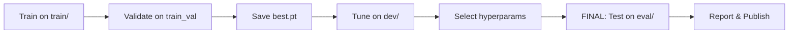

# 🔒 Training Audit Checklist - Data Integrity & Evaluation Protocol

## Critical: TUSZ Data Split Hierarchy

The TUH EEG Seizure Corpus (TUSZ) provides **pre-defined splits** that MUST be respected:

```
data_ext4/tusz/edf/
├── train/   (581 patients) - TRAINING ONLY
├── dev/     (55 patients)  - HYPERPARAMETER TUNING / VALIDATION
└── eval/    (45 patients)  - FINAL TEST - DO NOT TOUCH UNTIL END!
```

## 🔧 Config Audit Results (2025-09-19)

**Issues Found & Fixed (2025-09-19):**
- ❌ `smoke_test.yaml` was using dev/ → ✅ Fixed to use train/
- ❌ `local.yaml` was using dev/ → ✅ Fixed to use train/
- ✅ Training configs use train/ (e.g., `tusz_train_wsl2.yaml`, `tusz_train_a100.yaml`)
- ✅ Created `tusz_dev_tuning.yaml` for hyperparameter tuning
- ✅ Created `tusz_eval_final.yaml` for final one-shot evaluation

## ✅ Pre-Training Checklist

### 1. Data Split Verification
- [ ] **Training uses ONLY `train/` directory** ✓ (e.g., configs/tusz_train_wsl2.yaml)
- [ ] **Validation split from `train/` set only** ✓ (validation_split: 0.2 from train)
- [ ] **Dev set (`dev/`) reserved for hyperparameter tuning**
- [ ] **Eval set (`eval/`) COMPLETELY ISOLATED - no peeking!**
- [ ] **No cross-patient data leakage** (same patient stays in same split)

### 2. Configuration Audit
- [ ] Verify `data_dir` points to correct split:
  - Training: `data_ext4/tusz/edf/train` ✓
  - Tuning: `data_ext4/tusz/edf/dev` (separate config)
  - Final eval: `data_ext4/tusz/edf/eval` (ONLY after training complete)
- [ ] Check window overlap (stride=10s, window=60s) doesn't leak across files
- [ ] Confirm cache directories are split-specific
- [ ] Verify random seeds are fixed (seed: 42)

### 3. Model Architecture Consistency
- [ ] U-Net: 4 stages, [64, 128, 256, 512] channels
- [ ] ResCNN: 3 blocks, kernels [3, 5, 7]
- [ ] Bi-Mamba-2: 6 layers, d_model=512, d_state=16
- [ ] Total params: ~48M (verify with model summary)

### 4. Training Protocol
- [ ] **Phase 1: Train on `train/` only** (100 epochs)
- [ ] **Phase 2: Tune hyperparameters on `dev/`** (grid search)
- [ ] **Phase 3: Final evaluation on `eval/`** (report metrics)
- [ ] No re-training after seeing eval results
- [ ] Save best checkpoint based on validation loss (from train split)

### 5. Evaluation Metrics Protocol
- [ ] TAES (Time-Aligned Event Scoring) as primary metric
- [ ] FA rates: [10, 5, 2.5, 1] per 24h
- [ ] Post-processing thresholds tuned on dev, NOT eval
- [ ] Hysteresis tau_on/tau_off selected via dev set

## 🚫 Common Pitfalls to Avoid

### Data Leakage Sins
1. **DO NOT** use eval set for threshold selection
2. **DO NOT** combine train/dev/eval for "more data"
3. **DO NOT** peek at eval metrics during training
4. **DO NOT** use same patient in train and val splits
5. **DO NOT** tune hyperparameters on train set performance

### Evaluation Cheating
1. **DO NOT** adjust model after seeing eval results
2. **DO NOT** cherry-pick best eval checkpoint retrospectively
3. **DO NOT** report dev set results as final performance
4. **DO NOT** optimize post-processing on eval set

## 📊 Proper Evaluation Flow



## 🔬 Statistical Rigor

- [ ] Report confidence intervals (bootstrap if needed)
- [ ] Compare against SOTA baselines fairly
- [ ] Document all preprocessing steps
- [ ] Provide ablation studies (U-Net vs full model)
- [ ] Test on external datasets (CHB-MIT as secondary)

## 📝 Audit Log

| Date | Split Used | Purpose | Checkpoint | Notes |
|------|-----------|---------|------------|-------|
| 2025-09-19 | train/ | Initial 100-epoch training | - | In progress |
| TBD | dev/ | Hyperparameter tuning | best.pt | Pending |
| TBD | eval/ | Final evaluation | final.pt | DO NOT TOUCH YET |

## ⚠️ Final Reminders

1. **eval/ directory = FINAL BOSS** - One shot only!
2. **Document everything** - No "I think we used..."
3. **Version control configs** - Every experiment tracked
4. **Reproducibility** - Fixed seeds, deterministic ops
5. **No shortcuts** - Proper science takes time

---

**Status**: Currently training on `train/` split only. Dev and eval untouched. ✅

**Next Steps**:
1. Complete 100-epoch training on train/
2. Run hyperparameter search on dev/
3. Lock in best configuration
4. One-shot evaluation on eval/
5. Submit to epilepsybenchmarks.com

---

*"In God we trust. All others must bring data."* - W. Edwards Deming
