# EEGM AMBA : B IDIRECTIONAL S TATE S PACE M ODEL - WITH M IXTURE OF E XPERTS FOR EEG M ULTI TASK C LASSIFICATION

**Anonymous authors**
Paper under double-blind review

A BSTRACT

In recent years, with the development of deep learning, electroencephalogram
(EEG) classification networks have achieved certain progress. Transformer-based
models can perform well in capturing long-term dependencies in EEG signals.
However, their quadratic computational complexity poses a substantial computational challenge. Moreover, most EEG classification models are only suitable for
single tasks and struggle with generalization across different tasks, particularly
when faced with variations in signal length and channel count. In this paper, we
introduce EEGMamba, the first universal EEG classification network to truly implement multi-task learning for EEG applications. EEGMamba seamlessly integrates
the Spatio-Temporal-Adaptive (ST-Adaptive) module, bidirectional Mamba, and
Mixture of Experts (MoE) into a unified framework. The proposed ST-Adaptive
module performs unified feature extraction on EEG signals of different lengths and
channel counts through spatial-adaptive convolution and incorporates a class token
to achieve temporal-adaptability. Moreover, we design a bidirectional Mamba
particularly suitable for EEG signals for further feature extraction, balancing high
accuracy, fast inference speed, and efficient memory-usage in processing long EEG
signals. To enhance the processing of EEG data across multiple tasks, we introduce
task-aware MoE with a universal expert, effectively capturing both differences and
commonalities among EEG data from different tasks. We evaluate our model on
eight publicly available EEG datasets, and the experimental results demonstrate its
superior performance in four types of tasks: seizure detection, emotion recognition,
sleep stage classification, and motor imagery. The code is set to be released soon.

1 I NTRODUCTION

Electroencephalogram (EEG) is a technique of recording brain activity using electrophysiological
indicators, which captures the electrical wave changes during brain activity. EEG can be utilized to
detect various human physiological activities such as seizure detection, emotion recognition, motor
imagery, sleep stage classification, and other physiological related task (Shoeibi et al., 2021; Jafari
et al., 2023; Altaheri et al., 2023; Sri et al., 2022).

In recent years, with the development of deep learning, EEG classification models based on deep
learning have been widely used (Chen et al., 2022). Among them, models based on Convolutional
Neural Networks (CNNs) and Transformers are the most representative, each with their own strengths
and weaknesses. CNN-based EEG classification networks have the advantage of faster training
and inference speeds, and they perform well on short EEG signals. However, due to the lack of
global sequence modeling ability, their performance on long EEG signals cannot be guaranteed
(Sakhavi et al., 2018; Thuwajit et al., 2021; Schirrmeister et al., 2017). In contrast, Transformer-based
EEG classification networks have good capability of global sequence modeling, achieving excellent
performance on both short and long EEG signals. Nevertheless, as the length of the EEG signals
increases, the computational complexity of the model increases quadratically, significantly raising the
training and inference costs (Dai et al., 2023; Xie et al., 2022; Wang et al., 2022).

1

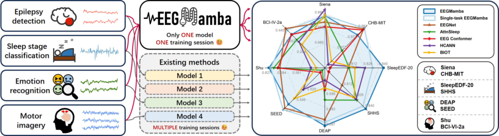

Figure 1: Our proposed EEGMamba can simultaneously process EEG signals from multiple tasks
including epilepsy detection, sleep stage classification, emotion recognition, and motor imagery. It
achieves state-of-the-art (SOTA) performance on the majority of datasets.

Recently, State Space Models (SSM) with selection mechanism and efficient hardware-aware design,
such as Mamba (Gu & Dao, 2023), have shown great potential in long sequence modeling. By
utilizing selective state space model, it effectively captures the relationships between tokens in a
sequence, addressing the limitation of CNNs in modeling long sequences. Moreover, it exhibits linear
computational complexity, which outperforms the quadratic complexity of Transformers and provides
a strong backbone network for training EEG classification models on long EEG signals.

Single-task learning (STL) is the most commonly used paradigm in current EEG classification models
(O’Shea et al., 2020; Phan et al., 2022; Algarni et al., 2022; Autthasan et al., 2021), where each task is
learned independently given a set of learning tasks. For example, EEGNet (Lawhern et al., 2018) has
been validated on four different tasks but can only address one type of task in a single training session.
In contrast, multi-task learning (MTL) trains models by simultaneously learning all tasks and sharing
representations across related ones, which enabling the model to learn more robust and universal
representations for multiple tasks compared to single-task model (Choo et al., 2023). Therefore,
designing a classification network capable of handling multi-task EEG data simultaneously might be
a promising approach.

Few previous studies have employed multi-task classification in EEG, and they all have certain
limitations (Prodhan et al., 2022; Li et al., 2022). For instance, (Li et al., 2022) achieved simultaneous
classification tasks across four emotion evaluation metrics using the same dataset, but its multi-task
classification ability is limited to handling multiple labels within a single dataset. The lack of models
capable of performing EEG classification across multiple different datasets may be due to the highly
challenging problems.

One of the significant obstacles for multi-task EEG classification is that different EEG data have
varying numbers of channels and signal lengths, which makes it difficult for networks to adapt during
a single training. For example, MaskSleepNet (Zhu et al., 2023) can classify EEG signals with
different numbers of channels by manually setting the channel parameter, but it uses a fixed-parameter
Multi-scale CNN that can only process EEG signals with limited input lengths. While EEG ConvNet
(Schirrmeister et al., 2017) is designed with a structure capable of adapting to arbitrary signal lengths,
it still requires manual setting in different trainings. Therefore, enabling the model to adapt to
different signal lengths and channel counts represents a significant challenge.

On the other hand, EEG data from different tasks show both differences and commonalities, making
it challenging for models without specialized multi-task processing module to capture these relationships, ultimately leading to interference between tasks. Mixture of Experts (MoE) is a deep
learning model with sparse gate-controlled architecture, consisting of a group of expert models and
a gating network (Jacobs et al., 1991; Shazeer et al., 2016; Xue et al., 2024). The gating network
can dynamically select experts to specifically process input data, enabling the network to accurately
distinguish and better process multi-task data, thus reducing interference between tasks. Therefore,
using MoE to achieve EEG multi-task classification might be a feasible solution.

In general, existing EEG classification models mainly face two challenges. First, these models find it
difficult to balance high accuracy, fast inference speed, and efficient memory-usage when dealing
with long EEG signals. Second, they often struggle to handle different EEG classification tasks and
demonstrate poor generality.

2

To address the aforementioned two issues, we propose EEGMamba, which utilizes bidirectional
Mamba suitable for EEG signals, as well as a Spatio-Temporal-Adaptive (ST-Adaptive) module
and task-aware MoE for targeted processing of multi-task EEG classification. Our model enhances
Mamba by employing bidirectional modeling to capture the relationships between tokens in a onedimensional temporal sequence, achieving high accuracy and fast inference speed. Additionally, we
propose an ST-Adaptive module that uses spatial-adaptive convolution to process EEG signals of
varying channel numbers and a class token to achieve temporal adaptability without any additional
processing. To efficiently capture differences and commonalities between EEG data from different
tasks, we design a task-aware gating network that accurately directs different EEG task tokens to
specific experts for processing, while also employing a universal EEG expert to exploit commonalities
among different EEG tasks. In summary, our contributions are as follows:

- **Bidirectional Mamba Design for EEG Signals.** We introduce bidirectional Mamba specifically
for EEG signals, achieving the balance between fast inference speed, efficient memory-usage and
excellent global perception ability.

- **First Implementation of Multi-task Learning in EEG application.** EEGMamba is the first
model to truly implement multi-task learning for EEG classification, enabling a more integrated
and effective analysis of complex brain signal data.

- **ST-Adaptive Module for Flexible EEG Processing.** We propose an ST-Adaptive module that can
automatically adapt to EEG signals of different lengths and channels, allowing for simultaneous
processing in single training session.

- **Task-aware MoE for EEG Data.** We design Task-aware MoE with a universal expert, achieving
the capture of both differences and commonalities between EEG data from different tasks.

2 M ETHOD

EEGMamba primarily consists of the ST-Adaptive module, BiMamba, and task-aware MoE. The
ST-Adaptive module processes EEG signals of arbitrary lengths and channel numbers through spatialadaptive convolution, tokenize layer, and temporal-adaptation based on the class token. The features
extracted by the ST-Adaptive module are then processed by multiple BiMamba blocks and task-aware
MoE modules. The BiMamba block allows the model to effectively capture long-term dependencies
in EEG signals, while the task-aware MoE enables targeted processing of EEG features for different
tasks. Finally, a task-aware classifier provides the classification results. The overall model architecture
is illustrated in Figure 2.

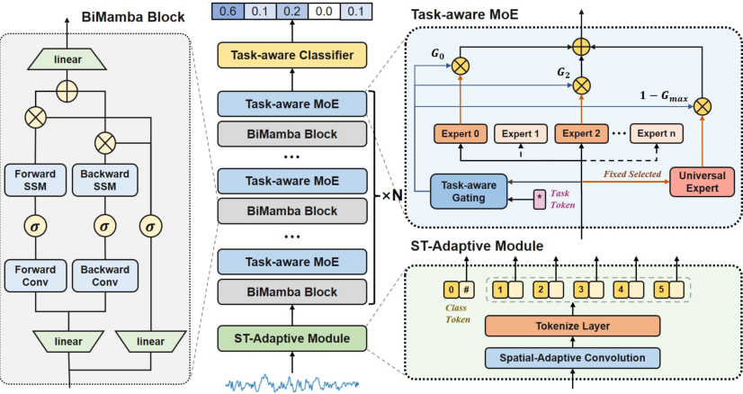

Figure 2: Overall structure of EEGMamba. The model consists of ST-Adaptive module, Bidirectional
Mamba (BiMamba) blocks and Task-aware MoE modules.

3

2.1 P RELIMINARY W ORK

Mamba is inspired by continuous state space equations. For continuous input _x_ ( _t_ ) _∈_ R in the time
domain, the corresponding output _y_ ( _t_ ) _∈_ R is determined by the current hidden state _h_ ( _t_ ) and input
_x_ ( _t_ ) at time _t_, as shown in Equation (1). Here, _A ∈_ R _[N]_ _[×][N]_ is the state matrix, _B ∈_ R _[N]_ _[×]_ [1] is related
to the system’s hidden state, and _C ∈_ R [1] _[×][N]_ is a parameter associated with the input and output.

_h_ _[′]_ ( _t_ ) = _Ax_ ( _t_ ) + _Bh_ ( _t_ ) (1)
_y_ ( _t_ ) = _Ch_ ( _t_ )

Mamba discretizes the continuous time _t_ into discrete time, transforming the continuous state space
equations into discrete state space equations. Specifically, by introducing a time-scale parameter ∆,
_A_ and _B_ are transformed into discrete time parameters _A_ [¯] and _B_ [¯] respectively. The zero-order hold
(ZOH) technique is used as the transformation rule, as shown in Equation (2).

_A_ ¯ = _exp_ (∆ _A_ ) (2)
_B_ ¯ = (∆ _A_ ) _[−]_ [1] ( _exp_ (∆ _A_ ) _−_ _I_ )∆ _B_

In practice, following the approach of (Gu & Dao, 2023), we approximate _B_ [¯] using a first-order Taylor
expansion, as show in Equation (3):

_B_ ¯ = (∆ _A_ ) _[−]_ [1] ( _exp_ (∆ _A_ ) _−_ _I_ )∆ _B ≈_ ∆ _B_ (3)

Finally, the discretized form of the continuous state space equation is shown in Equation (4).

_h_ _t_ = _Ah_ [¯] _t−_ 1 + _Bx_ [¯] _t_ (4)

_y_ _t_ = _Ch_ _t_

Based on the mentioned discrete state-space equations, Mamba further introduces data dependency
into the model parameters, enabling the model to selectively propagate or forget information based
on the sequential input tokens. In addition, it utilizes a parallel scanning algorithm to accelerate the
equation solving process.

2.2 ST-A DAPTIVE M ODULE

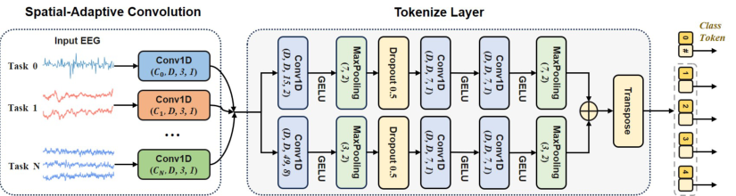

Figure 3: Overall structure of ST-Adaptive module.

EEG signals from different datasets often have different lengths and channel numbers. To address
this issue, we propose a Spatio-Temporal-Adaptive module that transforms input signals of arbitrary
lengths and channel numbers into uniform feature dimension, as shown in Figure 3.

To handle the inconsistency in the number of input channels, we introduce a spatial-adaptive convolutional module, which standardizes the data to a fixed number of channels. This module consists of a
series of 1D-CNN sub-modules, each designed with a uniform output channel count but adaptable
to varying input channels. Through this approach, EEG data with different channel numbers are
processed uniformly. Let _x ∈_ R _[B][×][C]_ _[i]_ _[×][L]_ _[i]_ represent the EEG signals, where _C_ _i_ denotes the number
of EEG channels for the _i_ -th task, and _L_ _i_ is the EEG signal length for the _i_ -th task.

_y_ _SA_ = _CNN_ _SA_ ( _x_ ) _∈_ R _[B][×][D][×][L]_ _[i]_ (5)

4

As shown in Equation (5), _y_ _SA_ is the result obtained through spatial-adaptive convolution, where
the channel dimension is changed from _C_ _i_ determined by the task _i_ to a unified _D_ . Then, _y_ _SA_ is
converted into an EEG token sequence through the tokenize layer. In order to better extract features
from EEG signals, we design a dual-path structure utilizing a small kernel convolution module
_CNN_ _S_ and a wide convolutional module _CNN_ _W_ . Obtain the small kernel feature token sequence
_z_ _s_ and the wide kernel feature token sequence _z_ _w_, respectively. Finally, we concatenate them in the
time dimension to form the EEG token sequence _T_, as shown in Equation (6).

_z_ _s_ = _T_ ( _CNN_ _s_ ( _y_ _SA_ )) _∈_ R _[B][×][N]_ _[s]_ _[×][D]_ (6)

_z_ _w_ = _T_ ( _CNN_ _w_ ( _y_ _SA_ )) _∈_ R _[B][×][N]_ _[w]_ _[×][D]_

_T_ = _Concat_ ( _z_ _s_ _, z_ _w_ _, dim_ = 1) _∈_ R _[B][×][N]_ _[×][D]_

Among them, _T_ represents the transpose operation, _N_ _s_, _N_ _w_, _N_ are the number of EEG small kernel
feature tokens, EEG wide kernel feature tokens, and overall EEG tokens, respectively.

Due to the varying lengths of EEG signals, the number of EEG tokens (i.e., the length of the token
sequence _T_ ) obtained from the tokenize layer is inconsistent. To address this issue, we introduce a
temporal-adaptive module that incorporates a special class token (Dosovitskiy et al., 2021) for final
classification. Specifically, we concatenate this class token with the previously extracted feature token
sequence _t_ [1] _s_ _[, t]_ [2] _s_ _[, ..., t]_ _s_ _[N]_ _[s]_ and _t_ [1] _w_ _[, t]_ [2] _w_ _[, ..., t]_ _w_ _[N]_ _[w]_ to obtain the token sequence _T_, as shown in Equation (7).

_T_ = [ _t_ _cls_ _, t_ [1] _s_ _[, t]_ _s_ [2] _[, ..., t]_ _s_ _[N]_ _[s]_ _[, t]_ [1] _w_ _[, t]_ _w_ [2] _[, ..., t]_ _w_ _[N]_ _[w]_ []] _[ ∈]_ [R] _[B][×]_ [(] _[N]_ [+1)] _[×][D]_ (7)

Then, the input token sequence _T_ is processed through a network (using bidirectional Mamba
blocks in this study) to integrate EEG token sequence information into the class token. This approach
prevents the network from developing biases towards certain tokens in the EEG feature token sequence
_T_ due to variations in input length, thereby achieving temporal adaptability.

2.3 B IDIRECTIONAL M AMBA B LOCK FOR EEG S IGNALS

Mamba is designed for Natural Language Processing (NLP), with its output at each moment depends
only on the current input and hidden state, without consideration for future time steps. Since
NLP is primarily a generative autoregressive task that relies on previous information for judgment,
Mamba’s single-directional modeling approach is sufficient to complete such tasks. However, EEG
classification tasks require simultaneous processing of both preceding and following information,
which cannot be learned by single-directional modeling. Therefore, for EEG signals, the original
Mamba’s single-directional modeling is insufficient.

To address this issue, we design a bidirectional Mamba for one-dimensional temporal signals, which
can model the input bidirectionally and more effectively learn the dependencies between time series
tokens. We use the features extracted by the ST-Adaptive module as the input for the first bidirectional
Mamba block.

**Algorithm 1** Bidirectional Mamba Block Process

**Input:** token sequence _T_ _k−_ 1 _∈_ R _[B][×]_ [(] _[N]_ [+1)] _[×][D]_

**Output:** token sequence _T_ _k_ _∈_ R _[B][×]_ [(] _[N]_ [+1)] _[×][D]_

1: _T_ _k_ _[norm]_ _−_ 1 _←_ _LayerNorm_ ( _T_ _k−_ 1 )
2: _X_ _k−_ 1 _←_ _Linear_ _X_ ( _T_ _k_ _[norm]_ _−_ 1 [)] _[, Z]_ _[k][−]_ [1] _[ ←]_ _[Linear]_ _[Z]_ [(] _[T]_ _[ norm]_ _k−_ 1 [)]

3: _Y_ _k_ _[f]_ _−_ 1 _[←]_ _[SSM]_ _[ f]_ [(] _[Conv]_ _[f]_ [(] _[Transpose]_ [(] _[X]_ _[k][−]_ [1] [)))]
4: _Y_ _k_ _[b]_ _−_ 1 _[←]_ _[Reverse]_ [(] _[SSM]_ _b_ [(] _[Conv]_ _[b]_ [(] _[Reverse]_ [(] _[Transpose]_ [(] _[X]_ _k−_ 1 [)))))]

5: _T_ _k_ _[′]_ _−_ 1 _[←]_ _[Linear]_ _[D]_ [(] _[Transpose]_ [(] _[Y]_ _[ f]_ _k−_ 1 [+] _[ Y]_ _k_ _[ b]_ _−_ 1 [)] _[ ⊙]_ _[SiLU]_ [(] _[Z]_ _[k][−]_ [1] [))]
6: _T_ _k_ = _T_ _k_ _[′]_ _−_ 1 [+] _[ T]_ _[k][−]_ [1]

We denote the input of the bidirectional Mamba block as a sequence _T_ _k−_ 1 and the output as a
sequence _T_ _k_ . First, _T_ _k−_ 1 is normalized to _T_ _k_ _[norm]_ _−_ 1 by layer normalization. Next, it is mapped by
_Linear_ _X_ and _Linear_ _Z_ to _X_ _k−_ 1 and _Z_ _k−_ 1, respectively. Then, _X_ _k−_ 1 enters parallel forward and

5

backward sequence modeling modules. The forward module includes forward 1D causal convolution
_Conv_ _f_ and forward SSM module _SSM_ _f_ . Similarly, the backward module includes backward 1D
causal convolution _Conv_ _b_ and backward SSM module _SSM_ _b_ . Then, the results of forward sequence
modeling _Y_ _k_ _[f]_ _−_ 1 [and backward sequence modeling] _[ Y]_ _k_ _[ b]_ _−_ 1 [are summed with] _[ Z]_ _[k][−]_ [1] [ through gating and]
then projected through a linear layer _Linear_ _D_ to obtain _T_ _k_ _[′]_ _−_ 1 [. Finally, the output sequence] _[ T]_ _[k]_ [ is]
obtained through residual connection. The detailed process is shown in Algorithm 1.

2.4 T ASK - AWARE M O E WITH U NIVERSAL E XPERT

2.4.1 S PARSELY - ACTIVATED M O E

A typical Mixture of Experts (MoE) usually consists of several experts, and each expert is typically
represented as a Multi-Layer Perceptron (MLP) whose activation is controlled by a gating network
(Shazeer et al., 2016). We define _N_ _e_ as the number of experts, _E_ _i_ as the _i_ -th expert, and _G_ as the
gating network. For each input EEG token sequence _T_, the output _T_ _[∗]_ of MoE can be expressed as
Equation (8):

_T_ _[∗]_ =

_N_ _e_
� _e_ _i_ ( _T_ ) _∗_ _E_ _i_ ( _T_ ) (8)

_i_ =1

_e_ _i_ ( _T_ ) = _SoftMax_ ( _Top_ _k_ ( _G_ ( _T_ ) _, k_ )) _i_

_v_ _i_ _,_ if _v_ _i_ is top _k_ value of _V_
Top _k_ ( _V, k_ ) _i_ =
� _−∞,_ otherwise

2.4.2 T ASK - AWARE G ATING N ETWORKS

A gating network calculates gating values based on the input tokens and selects top _k_ experts for
activation, typically implemented using a fully connected layer _Linear_ _Gate_ . However, this can
lead to the problem that only a few experts are trained. To avoid this, we adopted the method from
(Shazeer et al., 2016), adding noise to the gating value computation process using a fully connected
layer _Linear_ _Noise_, which increases randomness and helps in balancing the load among the experts.

Furthermore, we propose a task-aware gating network which helps improve the accuracy of experts
in processing different types of EEG tokens. Specifically, we encode the EEG task into task tokens
_t_ _task_ _∈_ R _[B][×][D]_, then concatenate _t_ _task_ with the EEG token sequence _T_ to obtain _T_ _cat_, which is then
sent to the gating network. The gating values calculated in this manner incorporate task information,
allowing for better assignment of different tasks to different experts. The working process of the
task-aware gating network is shown in Equation (9), where _ϵ_ represents standard Gaussian noise.

_T_ _cat_ = _Concat_ ( _T, BroadCast_ ( _t_ _task_ ) _, dim_ = _−_ 1) (9)
_G_ ( _T, t_ _task_ ) = _Linear_ _Gate_ ( _T_ _cat_ ) + _ϵ ∗_ _SoftPlus_ ( _Linear_ _Noise_ ( _T_ _cat_ ))

2.4.3 EEG UNIVERSAL EXPERT

EEG signals from different tasks exhibit both differences and commonalities. Only using different
experts to process EEG tokens might overlook the connections between tokens from different tasks.
Therefore, we design an EEG universal expert that can process EEG tokens from all different tasks
and capture their commonalities. To achieve this function, the universal expert is activated for any
inputs and not controlled by the gating network’s output values.

Overall, our MoE module includes both task experts and a universal expert. Task experts can
accurately process EEG tokens from different tasks according to gating values, while universal
experts can process all EEG tokens. The output of MoE is the weighted sum of these two types of
experts. We adopted a weight design scheme similar to (Gou et al., 2023), as shown in Equation (10).
Here, the output weight _ω_ of the universal expert is determined by the maximum gating value:

_T_ _[∗]_ =

_N_ _e_
� _e_ _i_ ( _T_ ) _∗_ _E_ _i_ ( _T_ ) + _ω ∗_ _E_ _[u]_ ( _T_ ) (10)

_i_ =1

_ω_ = 1 _−_ _Max_ ( _e_ ( _T_ ))

6

3 E XPERIMENTAL S ETUP

3.1 D ATASET

We evaluate the proposed EEGMamba by using eight datasets from four different tasks, including
Siena Scalp EEG Database (Detti et al., 2020), CHB-MIT (Shoeb, 2009), SleepEDF-20 (Kemp et al.,
2000), SHHS (Quan et al., 1997), DEAP (Koelstra et al., 2011), SEED (Duan et al., 2013), Shu (Ma
et al., 2022), and BCI-IV-2a (Brunner et al., 2008). Table 1 provides an overview of each dataset. For
different tasks, the number of classes, the number of channels and the optimal EEG segment length
tend to vary depending on the specific task performed. In the experiment, we predefine the number of
channels and classes for each EEG dataset.

Table 1: Dataset introduction. ‘# Sample’ refers to the total number of samples used for training and
testing after preprocessing steps. More details about the datasets can be found in the appendix D.

|Datasets|Tasks # Subjects # Sample # Classes # Channels Rate Duration|
|---|---|
|Siena CHB-MIT SleepEDF-20 SHHS DEAP SEED Shu BCI-IV-2a|Epilepsy detection 13 from 14 78,958 2 29 512 Hz 4 seconds Epilepsy detection 23 111,678 2 23 256 Hz 4 seconds Sleep stage classifcation 20 33,847 5 1 100 Hz 30 seconds Sleep stage classifcation 329 from 6441 259,799 5 1 125 Hz 30 seconds Emotion recognition 32 1,040 2 4 128 Hz 60 seconds Emotion recognition 15 60,912 3 62 200 Hz 20 seconds Motor imagery 25 9,579 2 32 250 Hz 4 seconds Motor imagery 9 3,948 4 22 250 Hz 3 seconds|

3.2 I MPLEMENTATION D ETAILS

**Data Preprocessing.** We only employ minimal necessary preprocessing. First, we apply a band-pass
filter to the EEG signals, retaining components between 0.1 Hz and 50 Hz to remove low-frequency
drift and high-frequency noise. Then, we standardize the sampling rate of all EEG signals to 200 Hz.
In addition, the public versions of some datasets have undergone some preprocessing. We include a
detailed introduction in the Appendix D.

**Data Division.** In all experiments, including the baseline comparison experiments and ablation
experiments, we employ five-fold cross-validation grouped by subjects, so that EEG data from the
same subject only appear in one fold. Details of the subject division scheme are provided in the
Appendix E.3.

**Environments.** The experiments are implemented by Python 3.9.18, PyTorch 2.0.1 + CUDA 12.2 on
a Linux server with 256 GB memory. All models are trained on Intel(R) Xeon(R) Gold 6342 CPU
and a Nvidia A100 GPU 80G.

Our detailed training strategy, hyperparameter settings, metrics, and baselines are provided in
Appendix E.4, E.5, E.6, and F.

4 R ESULTS AND D ISCUSSION

4.1 S INGLE - TASK EEGM AMBA P ERFORMANCE C OMPARISON

The single-task EEGMamba experiment aims to demonstrate the effectiveness of the Mamba-based
model. In this experiment, we modify the model by removing MoE modules and redundant spatialadaptive convolution branches, so the single-task EEGMamba only consists of the essential CNN
modules and BiMamba modules. We compare the performance of single-task EEGMamba with
previous classification models on eight datasets, as shown in Figure 1. Obviously, single-task
EEGMamba outperforms the other non Mamba-based models on the majority of datasets.

We also discuss the memory-usage and inference speed of single-task EEGMamba and Transformerbased models, particularly for long sequences. Figure 4a and Figure 4b show the results for singlechannel and multi-channel (here 20 channels) data, respectively. The Transformer-based models in
baselines include AttnSleep, EEG Conformer and HCANN. As signal length increases, the memoryusage of Transformer-based models grows quadratically, while single-task EEGMamba grows linearly.

7

In terms of inference speed, Transformer-based models slow down sharply with longer sequences,
while the speed of single-task EEGMamba decreases gently. HCANN performs well on singlechannel data due to structural modifications on classical Transformer, but it experiences a significant
increase in memory-usage and a notable decrease in inference speed when handling multi-channel
data. Overall, single-task EEGMamba comprehensively outperforms Transformer-based models in
memory-usage and inference speed.

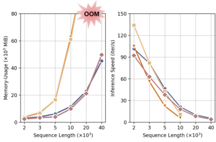

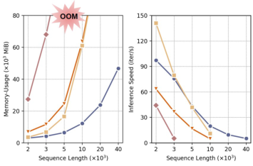

(a) Single-channel data (b) Multi-channel data

Figure 4: Memory-usage and inference speed of Single-task EEGMamba compared with Transformerbased models. OOM indicates out of memory.

To summarize, compared with the previous classification networks, single-task EEGMamba achieves
better performance, lower memory-usage and faster inference speed when dealing with long EEG
signals, which roundly demonstrates the feasibility of the Mamba-based model on EEG signals.

4.2 EEGM AMBA FOR EEG M ULTI - TASK C LASSIFICATION

Table 2, 3, 4 and 5 show the performance of EEGMamba on different datasets compared with several
state-of-the-art (SOTA) baselines. EEGMamba ranks among the top three on seven datasets and
achieves the best performance on four datasets.

It is worth noting that all classification networks, except EEGMamba, are trained on a single dataset.
Single datasets typically have consistency in data distribution, features, and labels, which allows
the model to better adapt and optimize for specific patterns of that dataset, thus improving accuracy.
Nevertheless, EEGMamba outperforms existing SOTA models across multiple datasets and showed
superior overall performance, demonstrating its strong generalization ability to integrate EEG signals
from different tasks.

Table 2: Performance of EEGMamba compared with baselines on seizure detection task.

|Methods|Multi-task|Siena|CHB-MIT|
|---|---|---|---|
|**Methods**|**Multi-task**|ACC AUROC F1|ACC AUROC F1|
|EEGNet (Lawhern et al., 2018) AttnSleep (Eldele et al., 2021) EEGConformer (Song et al., 2022) BIOT (Yang et al., 2023) LaBraM (Jiang et al., 2024) HCANN (Ji et al., 2024)||0.9886_ ±_ 0.0033 0.8828_ ±_ 0.0360 0.6905_ ±_ 0.0185 0.9895_ ±_ 0.0032 0.9066_ ±_ 0.0196 0.6918_ ±_ 0.0588 0.9878_ ±_ 0.0044 0.8744_ ±_ 0.0377 0.6366_ ±_ 0.0273 0.9897_ ±_ 0.0043 0.8986_ ±_ 0.0223 **0.7301**_ ±_** 0.0550** 0.9886_ ±_ 0.0043 0.8023_ ±_ 0.0820 0.6370_ ±_ 0.0694 **0.9906**_ ±_** 0.0026** **0.9283**_ ±_** 0.0208** 0.6714_ ±_ 0.1115|0.9814_ ±_ 0.0024 0.9064_ ±_ 0.0607 0.7690_ ±_ 0.0488 0.9723_ ±_ 0.0190 0.9048_ ±_ 0.0465 0.7549_ ±_ 0.0657 0.9810_ ±_ 0.0040 0.8917_ ±_ 0.0927 0.7507_ ±_ 0.0648 0.9678_ ±_ 0.0284 0.8996_ ±_ 0.0831 0.7278_ ±_ 0.0886 0.9742_ ±_ 0.0099 0.8624_ ±_ 0.0534 0.7176_ ±_ 0.0713 0.9664_ ±_ 0.0227 0.9110_ ±_ 0.0572 0.7680_ ±_ 0.1203|
|Single-task EEGMamba EEGMamba||0.9897_ ±_ 0.0053 0.9137_ ±_ 0.0105 0.7106_ ±_ 0.0326 0.9897_ ±_ 0.0038 0.9082_ ±_ 0.0179 0.7070_ ±_ 0.0260|**0.9817**_ ±_** 0.0036** 0.9084_ ±_ 0.0437 0.7712_ ±_ 0.0600 0.9789_ ±_ 0.0132 **0.9126**_ ±_** 0.0492** **0.7964**_ ±_** 0.0444**|

**Bold** for the best, red for the second, and underlined for the third.

Table 3: Performance of EEGMamba compared with baselines on sleep stage classification task.

|Methods|Multi-task|Col3|SleepEDF-20|SHHS|
|---|---|---|---|---|
|**Methods**|**Multi-task**|**Multi-task**|ACC AUROC F1|ACC AUROC F1|
|EEGNet (Lawhern et al., 2018) AttnSleep (Eldele et al., 2021) EEGConformer (Song et al., 2022) BIOT (Yang et al., 2023) LaBraM (Jiang et al., 2024) HCANN (Ji et al., 2024)|||0.8165_ ±_ 0.0254 0.9464_ ±_ 0.0109 0.7322_ ±_ 0.0225 0.8172_ ±_ 0.0346 0.9383_ ±_ 0.0123 0.7244_ ±_ 0.0270 0.7998_ ±_ 0.0486 0.9385_ ±_ 0.0220 0.7118_ ±_ 0.0392 0.8226_ ±_ 0.0387 0.9536_ ±_ 0.0147 0.7455_ ±_ 0.0315 0.7503_ ±_ 0.0388 0.9212_ ±_ 0.0177 0.6603_ ±_ 0.0392 0.8316_ ±_ 0.0396 0.9589_ ±_ 0.0129 0.7573_ ±_ 0.0387|0.8174_ ±_ 0.0173 0.9351_ ±_ 0.0078 0.6663_ ±_ 0.0064 0.8366_ ±_ 0.0169 0.9557_ ±_ 0.0053 0.7270_ ±_ 0.0153 0.8000_ ±_ 0.0154 0.9343_ ±_ 0.0069 0.6543_ ±_ 0.0085 0.8331_ ±_ 0.0152 0.9501_ ±_ 0.0103 0.7243_ ±_ 0.0287 0.7785_ ±_ 0.0243 0.9282_ ±_ 0.0132 0.6527_ ±_ 0.0201 0.8355_ ±_ 0.0167 0.9581_ ±_ 0.0077 0.7425_ ±_ 0.0117|
|Single-task EEGMamba EEGMamba|||0.8387_ ±_ 0.0399 0.9608_ ±_ 0.0116 0.7681_ ±_ 0.0359 **0.8486**_ ±_** 0.0276** **0.9636**_ ±_** 0.0107** **0.7738**_ ±_** 0.0293**|0.8441_ ±_ 0.0163 0.9578_ ±_ 0.0074 0.7387_ ±_ 0.0155 **0.8478**_ ±_** 0.0177** **0.9587**_ ±_** 0.0077** **0.7433**_ ±_** 0.0160**|

**Bold** for the best, red for the second, and underlined for the third.

8

Table 4: Performance of EEGMamba compared with baselines on emotion recognition task.

|Methods|Multi-task|DEAP ACC AUROC F1|SEED|
|---|---|---|---|
|**Methods**|**Multi-task**|**DEAP** ACC AUROC F1|ACC AUROC F1|
|EEGNet (Lawhern et al., 2018) AttnSleep (Eldele et al., 2021) EEGConformer (Song et al., 2022) BIOT (Yang et al., 2023) LaBraM (Jiang et al., 2024) HCANN (Ji et al., 2024)||0.5979_ ±_ 0.0341 0.5906_ ±_ 0.0325 0.5624_ ±_ 0.0214 0.5930_ ±_ 0.0173 0.5941_ ±_ 0.0346 0.5590_ ±_ 0.0112 0.5905_ ±_ 0.0351 0.5500_ ±_ 0.0275 0.5545_ ±_ 0.0222 0.5900_ ±_ 0.0165 0.5703_ ±_ 0.0283 0.5495_ ±_ 0.0310 0.5822_ ±_ 0.0321 0.5453_ ±_ 0.0301 0.5202_ ±_ 0.0304 0.5881_ ±_ 0.0226 0.5878_ ±_ 0.0350 0.5083_ ±_ 0.0484|0.5739_ ±_ 0.0544 0.7448_ ±_ 0.0565 0.5561_ ±_ 0.0486 0.4808_ ±_ 0.0232 0.6717_ ±_ 0.0318 0.4900_ ±_ 0.0295 0.4861_ ±_ 0.0172 0.6642_ ±_ 0.0302 0.4846_ ±_ 0.0302 0.5507_ ±_ 0.0591 0.7363_ ±_ 0.0666 0.5453_ ±_ 0.0700 OOM OOM OOM 0.5284_ ±_ 0.0282 0.7061_ ±_ 0.0589 0.5101_ ±_ 0.0361|
|Single-task EEGMamba EEGMamba||0.5985_ ±_ 0.0247 0.5721_ ±_ 0.0184 0.5505_ ±_ 0.0157 **0.5994**_ ±_** 0.0134** **0.5957**_ ±_** 0.0209** **0.5628**_ ±_** 0.0262**|**0.5779**_ ±_** 0.0584** **0.7636**_ ±_** 0.0514** **0.5718**_ ±_** 0.0580** 0.5646_ ±_ 0.0366 0.7538_ ±_ 0.0413 0.5583_ ±_ 0.0326|

**Bold** for the best, red for the second, and underlined for the third.

Table 5: Performance of EEGMamba compared with baselines on motor imagery task.

|Methods|Multi-task|Shu|BCI-IV-2a|
|---|---|---|---|
|**Methods**|**Multi-task**|ACC AUROC F1|ACC AUROC F1|
|EEGNet (Lawhern et al., 2018) AttnSleep (Eldele et al., 2021) EEGConformer (Song et al., 2022) BIOT (Yang et al., 2023) LaBraM (Jiang et al., 2024) HCANN (Ji et al., 2024)||0.5971_ ±_ 0.0454 0.6529_ ±_ 0.0708 0.6077_ ±_ 0.0538 0.6105_ ±_ 0.0454 0.6464_ ±_ 0.0698 0.6061_ ±_ 0.0515 0.6014_ ±_ 0.0392 0.6418_ ±_ 0.0643 0.6064_ ±_ 0.0494 0.5186_ ±_ 0.0051 0.5183_ ±_ 0.0050 0.5116_ ±_ 0.0090 0.5368_ ±_ 0.0312 0.5426_ ±_ 0.0413 0.5343_ ±_ 0.0326 0.5302_ ±_ 0.0229 0.5136_ ±_ 0.0051 0.4131_ ±_ 0.0530|**0.4721**_ ±_** 0.0570** **0.7449**_ ±_** 0.0591** **0.4888**_ ±_** 0.0683** 0.3807_ ±_ 0.0384 0.6376_ ±_ 0.0240 0.3747_ ±_ 0.0229 0.4228_ ±_ 0.0421 0.6856_ ±_ 0.0359 0.4136_ ±_ 0.0471 0.3398_ ±_ 0.0483 0.5970_ ±_ 0.0561 0.2983_ ±_ 0.0307 0.2879_ ±_ 0.0160 0.5333_ ±_ 0.0214 0.2804_ ±_ 0.0209 0.3635_ ±_ 0.0353 0.6112_ ±_ 0.0336 0.3258_ ±_ 0.0422|
|Single-task EEGMamba EEGMamba||0.6169_ ±_ 0.0467 0.6597_ ±_ 0.0653 0.6145_ ±_ 0.0437 **0.6207**_ ±_** 0.0505** **0.6645**_ ±_** 0.0681** **0.6183**_ ±_** 0.0525**|0.4596_ ±_ 0.0547 0.7180_ ±_ 0.0541 0.4556_ ±_ 0.0543 0.4231_ ±_ 0.0522 0.6873_ ±_ 0.0542 0.4156_ ±_ 0.0545|

**Bold** for the best, red for the second, and underlined for the third.

Additionally, the multi-task training of EEGMamba provides significant advantages in terms of
convenience. First, it is an end-to-end system that does not require separate pre-training and finetuning stages, yet offers stronger generalization ability than the pre-trained model. Furthermore, to
obtain the corresponding results presented in Table 2 to 5, EEGMamba only needs to be trained
once. In contrast, other classification networks require multiple training sessions, each time involving
manual adjustments to data length, channel count, and class numbers, making the process much more
cumbersome.

4.3 V ISUALIZATION OF T ASK - AWARE M O E IN M ULTI - TASK C LASSIFICATION

We explore the role of designed task-aware MoE in practical applications. Since the EEGMamba
model contains eight independent MoE modules, we focus our discussion on the last one MoE
module as an example. We calculate the activation probability of each expert for different tasks in the
task-aware MoE, as shown in Figure 5. The x-axis represents the index of experts, and the y-axis
represents their activation probabilities.

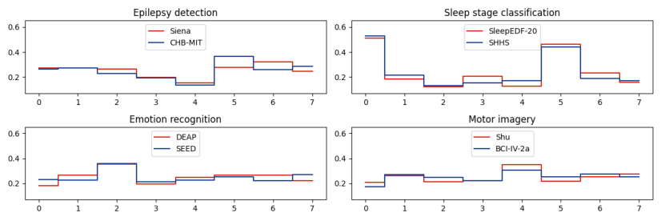

Figure 5: Activation probabilities of MoE experts in the final layer.

When using task-aware MoE, the model exhibits a clear preference for specific experts based on the
given task, with different tasks evidently favoring different experts. Specifically, different tasks tend
to activate different experts, while data from the same task show similar expert selection probabilities.
For instance, experts 5 and 6 are preferred for epilepsy detection, while experts 0 and 5 are favored
for sleep stage classification, demonstrating how task-aware MoE enhances flexibility by dynamically
adapting to different tasks. This targeted expert selection not only improves task-specific performance

9

but also maintains efficient processing by bypassing irrelevant experts, thereby reducing unnecessary
computational overhead.

4.4 A BLATION S TUDY

To evaluate the effectiveness of each component in EEGMamba, we conduct ablation experiments on
four model variants, including: (i) _Single-directional Mamba_ : EEGMamba with Single-directional
Mamba; (ii) _EEGMamba w/o MoE_ : EEGMamba without the whole MoE module; (iii) _Vanilla MoE_ :
EEGMamba with the vanilla MoE; (iv) _EEGMamba w/o Task-aware Gating_ : EEGMamba without
the Task-aware Gating in MoE; (v) _EEGMamba w/o Universal Expert_ : EEGMamba without the
Universal Expert in MoE.

Figure 6 presents a comparison of ablation experiments on eight datasets across four tasks. EEGMamba outperforms other variants on all metrics for all tasks, demonstrating the contribution of
each component in our framework. In comparison to the full EEGMamba, the performance of
_Single-directional Mamba_ shows a significant decline, emphasizing the importance of employing
bidirectional Mamba for EEG classification task modeling. Moreover, the performance decline of
_EEGMamba w/o MoE_ indicates that MoE plays a role in learning the distinctions between different
tasks in multi-task classification. In most tasks, the performance of _EEGMamba w/o Task-aware_
_Gating_ and _EEGMamba w/o Universal Expert_ is similar but slightly lower than the full EEGMamba.

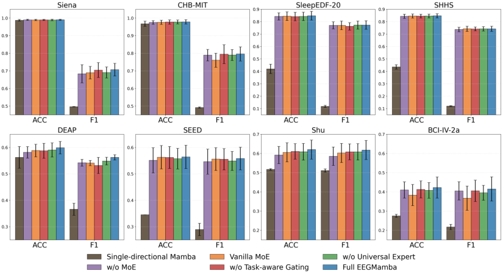

Figure 6: Results of the ablation study on different datasets.

5 C ONCLUSION

In this paper, we propose EEGMamba, the first model that truly implements multi-task learning for
EEG applications. EEGMamba integrates a Spatio-Temporal-Adaptive module to adaptively extract
features of EEG data with different lengths and channel counts. We introduce bidirectional Mamba to
achieve high accuracy and fast inference speed when processing long-term EEG datasets. Moreover,
we design a task-aware Mixture of Experts (MoE) and an EEG universal expert, allowing the model
to process multiple tasks simultaneously and better learn the commonalities among EEG signals
from different tasks. Our experiments across eight publicly available EEG datasets from four tasks
demonstrate the superior performance of our proposed model in multi-task classification scenarios.
Our work fills the gap in multi-task classification research within EEG applications, paving the way
for future development in this field.

10

R EFERENCES

Mona Algarni, Faisal Saeed, Tawfik Al-Hadhrami, Fahad Ghabban, and Mohammed Al-Sarem. Deep
learning-based approach for emotion recognition using electroencephalography (eeg) signals using
bi-directional long short-term memory (bi-lstm). _Sensors_, 22(8):2976, 2022.

Hamdi Altaheri, Ghulam Muhammad, Mansour Alsulaiman, Syed Umar Amin, Ghadir Ali Altuwaijri,
Wadood Abdul, Mohamed A Bencherif, and Mohammed Faisal. Deep learning techniques for
classification of electroencephalogram (eeg) motor imagery (mi) signals: A review. _Neural_
_Computing and Applications_, 35(20):14681–14722, 2023.

Phairot Autthasan, Rattanaphon Chaisaen, Thapanun Sudhawiyangkul, Phurin Rangpong, Suktipol
Kiatthaveephong, Nat Dilokthanakul, Gun Bhakdisongkhram, Huy Phan, Cuntai Guan, and Theerawit Wilaiprasitporn. Min2net: End-to-end multi-task learning for subject-independent motor
imagery eeg classification. _IEEE Transactions on Biomedical Engineering_, 69(6):2105–2118,
2021.

Clemens Brunner, Robert Leeb, Gernot Muller-Putz, Alois Schl ¨ ogl, and Gert Pfurtscheller. Bci ¨
competition 2008–graz data set a. _Institute for Knowledge Discovery (Laboratory of Brain-_
_Computer Interfaces), Graz University of Technology_, 16:1–6, 2008.

Xun Chen, Chang Li, Aiping Liu, Martin J McKeown, Ruobing Qian, and Z Jane Wang. Toward
open-world electroencephalogram decoding via deep learning: A comprehensive survey. _IEEE_
_Signal Processing Magazine_, 39(2):117–134, 2022.

Zhenghua Chen, Min Wu, Wei Cui, Chengyu Liu, and Xiaoli Li. An attention based cnn-lstm
approach for sleep-wake detection with heterogeneous sensors. _IEEE Journal of Biomedical and_
_Health Informatics_, 25(9):3270–3277, 2020.

Sanghyun Choo, Hoonseok Park, Sangyeon Kim, Donghyun Park, Jae-Yoon Jung, Sangwon Lee, and
Chang S Nam. Effectiveness of multi-task deep learning framework for eeg-based emotion and
context recognition. _Expert Systems with Applications_, 227:120348, 2023.

Yang Dai, Xiuli Li, Shanshan Liang, Lukang Wang, Qingtian Duan, Hui Yang, Chunqing Zhang,
Xiaowei Chen, Longhui Li, Xingyi Li, et al. Multichannelsleepnet: A transformer-based model for
automatic sleep stage classification with psg. _IEEE Journal of Biomedical and Health Informatics_,
2023.

Paolo Detti, Giampaolo Vatti, and Garazi Zabalo Manrique de Lara. Eeg synchronization analysis for
seizure prediction: A study on data of noninvasive recordings. _Processes_, 8(7):846, 2020.

Alexey Dosovitskiy, Lucas Beyer, Alexander Kolesnikov, Dirk Weissenborn, Xiaohua Zhai, Thomas
Unterthiner, Mostafa Dehghani, Matthias Minderer, Georg Heigold, Sylvain Gelly, et al. An image
is worth 16x16 words: Transformers for image recognition at scale. In _International Conference_
_on Learning Representations_, 2021.

Ruo-Nan Duan, Jia-Yi Zhu, and Bao-Liang Lu. Differential entropy feature for eeg-based emotion
classification. In _2013 6th international IEEE/EMBS conference on neural engineering (NER)_, pp.
81–84. IEEE, 2013.

Emadeldeen Eldele, Zhenghua Chen, Chengyu Liu, Min Wu, Chee-Keong Kwoh, Xiaoli Li, and
Cuntai Guan. An attention-based deep learning approach for sleep stage classification with singlechannel eeg. _IEEE Transactions on Neural Systems and Rehabilitation Engineering_, 29:809–818,
2021.

William Fedus, Barret Zoph, and Noam Shazeer. Switch transformers: Scaling to trillion parameter
models with simple and efficient sparsity. _Journal of Machine Learning Research_, 23(120):1–39,
2022.

Pedro Fonseca, Niek Den Teuling, Xi Long, and Ronald M Aarts. Cardiorespiratory sleep stage
detection using conditional random fields. _IEEE journal of biomedical and health informatics_, 21
(4):956–966, 2016.

11

Daniel Y Fu, Tri Dao, Khaled K Saab, Armin W Thomas, Atri Rudra, and Christopher Re. ´
Hungry hungry hippos: Towards language modeling with state space models. _arXiv preprint_
_arXiv:2212.14052_, 2022.

Yunhao Gou, Zhili Liu, Kai Chen, Lanqing Hong, Hang Xu, Aoxue Li, Dit-Yan Yeung, James T
Kwok, and Yu Zhang. Mixture of cluster-conditional lora experts for vision-language instruction
tuning. _arXiv preprint arXiv:2312.12379_, 2023.

Albert Gu and Tri Dao. Mamba: Linear-time sequence modeling with selective state spaces. _arXiv_
_preprint arXiv:2312.00752_, 2023.

Albert Gu, Karan Goel, and Christopher Re. Efficiently modeling long sequences with structured ´
state spaces. _arXiv preprint arXiv:2111.00396_, 2021.

Phan Huy, Fernando Andreotti, Navin Cooray, Oliver Y Chen, and Maarten De Vos. Seqsleepnet:
End-to-end hierarchical recurrent neural network for sequence-to-sequence automatic sleep staging.
_IEEE Transactions on Neural Systems and Rehabilitation Engineering_, 27(3):400–410, 2019.

Robert A Jacobs, Michael I Jordan, Steven J Nowlan, and Geoffrey E Hinton. Adaptive mixtures of
local experts. _Neural computation_, 3(1):79–87, 1991.

Mahboobeh Jafari, Afshin Shoeibi, Marjane Khodatars, Sara Bagherzadeh, Ahmad Shalbaf,
David Lopez Garc ´ ´ ıa, Juan M Gorriz, and U Rajendra Acharya. Emotion recognition in eeg
signals using deep learning methods: A review. _Computers in Biology and Medicine_, pp. 107450,
2023.

Suparerk Janjarasjitt. Epileptic seizure classifications of single-channel scalp eeg data using waveletbased features and svm. _Medical & biological engineering & computing_, 55(10):1743–1761,
2017.

Youshuo Ji, Fu Li, Boxun Fu, Yijin Zhou, Hao Wu, Yang Li, Xiaoli Li, and Guangming Shi. A novel
hybrid decoding neural network for eeg signal representation. _Pattern Recognition_, 155:110726,
2024.

Weibang Jiang, Liming Zhao, and Bao-liang Lu. Large brain model for learning generic representations with tremendous eeg data in bci. In _The Twelfth International Conference on Learning_
_Representations_, 2024.

Bob Kemp, Aeilko H Zwinderman, Bert Tuk, Hilbert AC Kamphuisen, and Josefien JL Oberye.
Analysis of a sleep-dependent neuronal feedback loop: the slow-wave microcontinuity of the eeg.
_IEEE Transactions on Biomedical Engineering_, 47(9):1185–1194, 2000.

Muhammad Khateeb, Syed Muhammad Anwar, and Majdi Alnowami. Multi-domain feature fusion
for emotion classification using deap dataset. _IEEE Access_, 9:12134–12142, 2021.

Sander Koelstra, Christian Muhl, Mohammad Soleymani, Jong-Seok Lee, Ashkan Yazdani, Touradj
Ebrahimi, Thierry Pun, Anton Nijholt, and Ioannis Patras. Deap: A database for emotion analysis;
using physiological signals. _IEEE transactions on affective computing_, 3(1):18–31, 2011.

Vernon J Lawhern, Amelia J Solon, Nicholas R Waytowich, Stephen M Gordon, Chou P Hung, and
Brent J Lance. Eegnet: a compact convolutional neural network for eeg-based brain–computer
interfaces. _Journal of neural engineering_, 15(5):056013, 2018.

Chang Li, Bin Wang, Silin Zhang, Yu Liu, Rencheng Song, Juan Cheng, and Xun Chen. Emotion
recognition from eeg based on multi-task learning with capsule network and attention mechanism.
_Computers in biology and medicine_, 143:105303, 2022.

Jun Ma, Banghua Yang, Wenzheng Qiu, Yunzhe Li, Shouwei Gao, and Xinxing Xia. A large eeg
dataset for studying cross-session variability in motor imagery brain-computer interface. _Scientific_
_Data_, 9(1):531, 2022.

Alison O’Shea, Gordon Lightbody, Geraldine Boylan, and Andriy Temko. Neonatal seizure detection
from raw multi-channel eeg using a fully convolutional architecture. _Neural Networks_, 123:12–25,
2020.

12

Huy Phan, Kaare Mikkelsen, Oliver Y Chen, Philipp Koch, Alfred Mertins, and Maarten De Vos. ´
Sleeptransformer: Automatic sleep staging with interpretability and uncertainty quantification.
_IEEE Transactions on Biomedical Engineering_, 69(8):2456–2467, 2022.

Rumman Ahmed Prodhan, Sumya Akter, Muhammad Bin Mujib, Md Akhtaruzzaman Adnan, and
Tanmoy Sarkar Pias. Emotion recognition from brain wave using multitask machine learning leveraging residual connections. In _International Conference on Machine Intelligence and Emerging_
_Technologies_, pp. 121–136. Springer, 2022.

Stuart F Quan, Barbara V Howard, Conrad Iber, James P Kiley, F Javier Nieto, George T O’Connor,
David M Rapoport, Susan Redline, John Robbins, Jonathan M Samet, et al. The sleep heart health
study: design, rationale, and methods. _Sleep_, 20(12):1077–1085, 1997.

Siavash Sakhavi, Cuntai Guan, and Shuicheng Yan. Learning temporal information for brain-computer
interface using convolutional neural networks. _IEEE transactions on neural networks and learning_
_systems_, 29(11):5619–5629, 2018.

Robin Tibor Schirrmeister, Jost Tobias Springenberg, Lukas Dominique Josef Fiederer, Martin
Glasstetter, Katharina Eggensperger, Michael Tangermann, Frank Hutter, Wolfram Burgard, and
Tonio Ball. Deep learning with convolutional neural networks for eeg decoding and visualization.
_Human brain mapping_, 38(11):5391–5420, 2017.

Noam Shazeer, Azalia Mirhoseini, Krzysztof Maziarz, Andy Davis, Quoc Le, Geoffrey Hinton, and
Jeff Dean. Outrageously large neural networks: The sparsely-gated mixture-of-experts layer. In
_International Conference on Learning Representations_, 2016.

Ali Hossam Shoeb. _Application of machine learning to epileptic seizure onset detection and treatment_ .
PhD thesis, Massachusetts Institute of Technology, 2009.

Afshin Shoeibi, Marjane Khodatars, Navid Ghassemi, Mahboobeh Jafari, Parisa Moridian, Roohallah
Alizadehsani, Maryam Panahiazar, Fahime Khozeimeh, Assef Zare, Hossein Hosseini-Nejad, et al.
Epileptic seizures detection using deep learning techniques: A review. _International journal of_
_environmental research and public health_, 18(11):5780, 2021.

Jimmy TH Smith, Andrew Warrington, and Scott W Linderman. Simplified state space layers for
sequence modeling. _arXiv preprint arXiv:2208.04933_, 2022.

Yonghao Song, Qingqing Zheng, Bingchuan Liu, and Xiaorong Gao. Eeg conformer: Convolutional
transformer for eeg decoding and visualization. _IEEE Transactions on Neural Systems and_
_Rehabilitation Engineering_, 31:710–719, 2022.

Tellakula Ramya Sri, Jahnavi Madala, Sai Lokesh Duddukuru, Rupasri Reddipalli, Phani Kumar
Polasi, et al. A systematic review on deep learning models for sleep stage classification. In _2022_
_6th International Conference on Trends in Electronics and Informatics (ICOEI)_, pp. 1505–1511.
IEEE, 2022.

Akara Supratak, Hao Dong, Chao Wu, and Yike Guo. Deepsleepnet: A model for automatic
sleep stage scoring based on raw single-channel eeg. _IEEE Transactions on Neural Systems and_
_Rehabilitation Engineering_, 25(11):1998–2008, 2017.

Punnawish Thuwajit, Phurin Rangpong, Phattarapong Sawangjai, Phairot Autthasan, Rattanaphon
Chaisaen, Nannapas Banluesombatkul, Puttaranun Boonchit, Nattasate Tatsaringkansakul, Thapanun Sudhawiyangkul, and Theerawit Wilaiprasitporn. Eegwavenet: Multiscale cnn-based
spatiotemporal feature extraction for eeg seizure detection. _IEEE transactions on industrial_
_informatics_, 18(8):5547–5557, 2021.

Zhe Wang, Yongxiong Wang, Chuanfei Hu, Zhong Yin, and Yu Song. Transformers for eeg-based
emotion recognition: A hierarchical spatial information learning model. _IEEE Sensors Journal_, 22
(5):4359–4368, 2022.

Edward A Wolpert. A manual of standardized terminology, techniques and scoring system for sleep
stages of human subjects. _Archives of General Psychiatry_, 20(2):246–247, 1969.

13

Jin Xie, Jie Zhang, Jiayao Sun, Zheng Ma, Liuni Qin, Guanglin Li, Huihui Zhou, and Yang Zhan. A
transformer-based approach combining deep learning network and spatial-temporal information
for raw eeg classification. _IEEE Transactions on Neural Systems and Rehabilitation Engineering_,
30:2126–2136, 2022.

Fuzhao Xue, Zian Zheng, Yao Fu, Jinjie Ni, Zangwei Zheng, Wangchunshu Zhou, and Yang You.
Openmoe: An early effort on open mixture-of-experts language models. In _Forty-first International_
_Conference on Machine Learning_, 2024.

Chaoqi Yang, M Westover, and Jimeng Sun. Biot: Biosignal transformer for cross-data learning
in the wild. In A. Oh, T. Naumann, A. Globerson, K. Saenko, M. Hardt, and S. Levine (eds.),
_Advances in Neural Information Processing Systems_, volume 36, pp. 78240–78260. Curran Associates, Inc., 2023. URL [https://proceedings.neurips.cc/paper_files/paper/](https://proceedings.neurips.cc/paper_files/paper/2023/file/f6b30f3e2dd9cb53bbf2024402d02295-Paper-Conference.pdf)
[2023/file/f6b30f3e2dd9cb53bbf2024402d02295-Paper-Conference.pdf.](https://proceedings.neurips.cc/paper_files/paper/2023/file/f6b30f3e2dd9cb53bbf2024402d02295-Paper-Conference.pdf)

Ke Yi, Yansen Wang, Kan Ren, and Dongsheng Li. Learning topology-agnostic eeg
representations with geometry-aware modeling. In A. Oh, T. Naumann, A. Globerson, K. Saenko, M. Hardt, and S. Levine (eds.), _Advances_ _in_ _Neural_ _Informa-_
_tion_ _Processing_ _Systems_, volume 36, pp. 53875–53891. Curran Associates, Inc.,
2023. URL [https://proceedings.neurips.cc/paper_files/paper/2023/](https://proceedings.neurips.cc/paper_files/paper/2023/file/a8c893712cb7858e49631fb03c941f8d-Paper-Conference.pdf)
[file/a8c893712cb7858e49631fb03c941f8d-Paper-Conference.pdf.](https://proceedings.neurips.cc/paper_files/paper/2023/file/a8c893712cb7858e49631fb03c941f8d-Paper-Conference.pdf)

Hangyu Zhu, Wei Zhou, Cong Fu, Yonglin Wu, Ning Shen, Feng Shu, Huan Yu, Wei Chen, and
Chen Chen. Masksleepnet: A cross-modality adaptation neural network for heterogeneous signals
processing in sleep staging. _IEEE Journal of Biomedical and Health Informatics_, 27(5):2353–2364,
2023.

Barret Zoph, Irwan Bello, Sameer Kumar, Nan Du, Yanping Huang, Jeff Dean, Noam Shazeer, and
William Fedus. St-moe: Designing stable and transferable sparse expert models. _arXiv preprint_
_arXiv:2202.08906_, 2022.

14

A R ELATED W ORKS

A.1 EEG C LASSIFICATION

The development of deep learning has greatly advanced EEG classification tasks. CNNs are a
classic type of neural network with mature applications in EEG classification. (Schirrmeister et al.,
2017) proposed a shallow convolutional network with both spatiotemporal convolutional layers to
decode task-related information from raw EEG signals. Similarly, (Lawhern et al., 2018) introduced
EEGNet, a classic EEG classification network based on depthwise separable convolution, which
has demonstrated stable and robust performance in various EEG classification tasks. Recurrent
Neural Networks (RNNs) are proposed to capture temporal dependencies in time-series EEG signals.
(Supratak et al., 2017) used the RNN architecture for sleep stage classification. (Chen et al., 2020)
used CNN and Long Short Term Memory (LSTM) networks for sleep stage classification.

EEG classification networks based on Transformers have also made significant progress. (Eldele
et al., 2021) introduced attention mechanisms into EEG classification networks for classifying sleep
stages. (Song et al., 2022) proposed EEG Conformer, a EEG classification network based on spatiotemporal convolution and Transformers. EEG Conformer effectively extracts local and global features
from EEG signals, and it performs well in tasks such as motor imagery and emotion recognition.
HCANN (Ji et al., 2024) combined the multi-head mechanism with CNN to extract complementary
representation information from multiple subspaces, making it more suitable for EEG signals. It has
achieved state-of-the-art performance on three datasets from different tasks.

In recent years, there has been notable progress in pre-trained EEG classification networks. (Yang
et al., 2023) proposed BIOT, a generic biosignal learning model that employs a tokenization module
and was evaluated on several EEG, ECG, and human sensory datasets. (Yi et al., 2023) proposed a
pre-training framework named MMM, which follows the approach of Masked Auto-Encoder (MAE)
for pre-training and employs a multi-stage pre-training strategy to enhance the robustness of the
representations.

A.2 S TATE S PACE M ODEL

A state space model is a mathematical model that represents a physical system as a set of input,
output, and state variables related by a first-order differential equation. (Gu et al., 2021) proposed
the Structured State-Space Sequence Model (S4) to model long-term dependencies. (Smith et al.,
2022) introduced a new S5 layer by incorporating Multiple Input Multiple Output (MIMO) SSM and
efficient parallel scanning within the S4 layer. (Fu et al., 2022) designed a new SSM layer, H3, which
further narrowed the performance gap between SSM and Transformers. Recently, (Gu & Dao, 2023)
proposed a data-dependent SSM structure and built a universal language model backbone network:
Mamba. Its selective mechanism and hardware-aware design allow it to maintain computational
efficiency and excellent performance while scaling to billions of parameters.

A.3 M IXTURE OF E XPERTS

The Mixture of Experts model was first introduced by (Jacobs et al., 1991), which controls a system
composed of different networks called experts through a supervisory program, with each expert
responsible for handling a specific subset of training samples. (Shazeer et al., 2016) introduced
the concept of sparsity into MoE and applied it to LSTM models for translation tasks. With the
development of large language models, (Fedus et al., 2022) extensively investigated the stability
issues of MoE models during training and fine-tuning processes, and built a MoE model with 16
trillion parameters and 2048 experts. Recently, (Xue et al., 2024) proposed OpenMOE, which further
explores the details of MoE using the power of the open-source community, thereby promoting the
development of MoE.

15

B O VERALL S TRUCTURE OF S INGLE - TASK EEGM AMBA

Figure 7 shows the structure of the single-task EEGMamba model. Compared to EEGMamba,
the single-task version removes the MoE modules and the redundant spatial-adaptive convolution
branches, retaining only one convolution to process the raw EEG signals. The tokenize layer and
BiMamba blocks are kept, with support for stacking any number of BiMamba layers. Additionally,
the task-aware classifier in the original EEGMamba is replaced with a standard classifier. Overall,
single-task EEGMamba is a lightweight Mamba-based model for EEG classification.

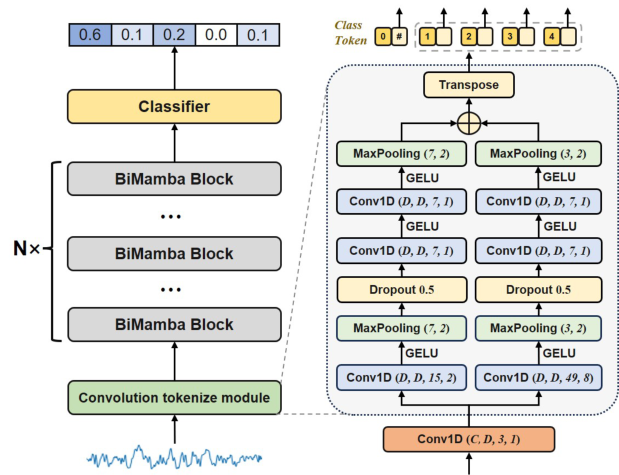

Figure 7: Overall structure of Single-task EEGMamba.

16

C N OTAION T ABLE

Table 6 shows the notations used in the main text.

Table 6: Notations used in EEGMamba.

**Symbols** **Descriptions**

_B ∈_ N [+] Batch size
_C_ _i_ _∈_ N [+] Numbers of channels in EEG signals
_D ∈_ N [+] Hidden dimension of the model
_L_ _i_ _∈_ N [+] Numbers of data points in EEG signals
_x ∈_ R _[B][×][C]_ _[i]_ _[×][L]_ _[i]_ EEG signals

_CNN_ _SA_ Spatial-adaptive convolution module
_CNN_ _S_ Small kernel convolution module
_CNN_ _W_ Wide kernel convolution module
_y_ _SA_ Features extracted by the spatial-adaptive convolutional module

_z_ _s_ _∈_ R _[B][×][N]_ _[s]_ _[×][D]_ Small kernel feature token sequence
_z_ _w_ _∈_ R _[B][×][N]_ _[w]_ _[×][D]_ Wide kernel feature token sequence
_T ∈_ R _[B][×]_ [(] _[N]_ [+1)] _[×][D]_ EEG token sequence

_t_ _[j]_ _s_ _[∈]_ [R] _[B][×][D]_ Small kernel feature token
_t_ _[j]_ _w_ _[∈]_ [R] _[B][×][D]_ Wide kernel feature token
_t_ _cls_ _∈_ R _[B][×][D]_ Class token for EEG classification

_N_ _s_ _∈_ N [+] Numbers of small kernel feature tokens
_N_ _w_ _∈_ N [+] Numbers of wide kernel feature tokens
_N ∈_ N [+] Numbers of overall EEG tokens

_Conv_ _f_ Forward causal convolution in BiMamba block
_Conv_ _b_ Backward causal convolution in BiMamba block
_SSM_ _f_ Forward SSM module in BiMamba block
_SSM_ _b_ Backward SSM module in Bimamba block

_N_ _e_ Numbers of experts in MoE
_E_ _i_ The _i_ -th expert in MoE
_E_ _[u]_ Universal expert in MoE
_G_ Gating network in MoE
_e_ _i_ Gating score of the _i_ -th expert
_ω_ Output weight of the universal expert
_t_ _task_ _∈_ R _[B][×][D]_ Task token for task-aware gating network

_L_ _b_ Balance loss for loading balance
_L_ _z_ Router z-loss for training stability
_L_ _aux_ Auxiliary loss for loading balance and training stability

17

D D ATASET

D.1 S IENA S CALP EEG D ATABASE

The Siena Scalp EEG Database consists of EEG recordings of 14 patients acquired at the Unit of
Neurology and Neurophysiology of the University of Siena. Subjects include 9 males (ages 25-71)
and 5 females (ages 20-58). Subjects were monitored with a Video-EEG with a sampling rate of 512
Hz, with electrodes arranged on the basis of the international 10-20 System. Most of the recordings
also contain 1 or 2 EKG signals. The data were acquired employing EB Neuro and Natus Quantum
LTM amplifiers, and reusable silver/gold cup electrodes. Patients were asked to stay in the bed as
much as possible, either asleep or awake. The diagnosis of epilepsy and the classification of seizures
according to the criteria of the International League Against Epilepsy were performed by an expert
clinician after a careful review of the clinical and electrophysiological data of each patient. In our
experiment, we removed non-EEG signals from each EDF record, retaining 29 EEG channels and
ensuring that the signals from different subjects maintained the same channel order: Fp1, F3, C3,
P3, O1, F7, T3, T5, Fc1, Fc5, Cp1, Cp5, F9, Fz, Cz, Pz, Fp2, F4, C4, P4, O2, F8, T4, T6, Fc2,
Fc6, Cp2, Cp6, F10. We discarded the data from Subject 10 due to the lack of some necessary EEG
channels. The data records, after channel unification, were segmented into 4-second segments to
facilitate classification.

D.2 CHB-MIT

The CHB-MIT Scalp EEG Database is collected by the Children’s Hospital Boston, which contains
24 cases of 23 patients with intractable seizures. The first 23 cases are from 22 patients (17 females,
aged 1.5-19 years; 5 males, aged 3-22 years). For the last case, there is no clear gender or age record.
the Children’s Hospital Boston evaluated the potential conditions for surgical intervention in all
epilepsy patients after discontinuing medication for a period of time, and monitored the patients
for several days. The original EEG record was obtained using 256 Hz sampling rate with 16-bit
resolution from electrodes placed according to the international 10-20 EEG electrode positions and
nomenclature (Janjarasjitt, 2017). Given that the number of available channels varies among different
patients, we select 23 common channels and discarded data from less than 23 channels. Due to the
varying duration of the original data ranging from tens of minutes to several hours, we have truncated
it into 4-second segments for easy classification.

D.3 S LEEP EDF-20

SleepEDF-20 includes Polysomnography (PSG) records from each subject for two consecutive days
and nights. The recording of subject 13 on the second night was lost due to a failing cassette or
laserdisc. Sleep experts use R&K rules (Wolpert, 1969) to visually determine signal characteristics
and label each 30 second period in the dataset as one of eight stages W, N1, N2, N3, N4, REM,
MOVEMENT, UNKNOWN. Similar to previous work (Huy et al., 2019), N3 and N4 were merged
into N3. In addition, the stages of ”MOVEMENT” and ”UNKNOWN” have also been removed.
(Eldele et al., 2021) have preprocessed the raw data, retaining the Fpz-Cz channel with a sampling
rate of 100 Hz, and make it publicly available at [https://researchdata.ntu.edu.sg/](https://researchdata.ntu.edu.sg/dataset.xhtml?persistentId=doi:10.21979/N9/MA1AVG)
[dataset.xhtml?persistentId=doi:10.21979/N9/MA1AVG. We use this version.](https://researchdata.ntu.edu.sg/dataset.xhtml?persistentId=doi:10.21979/N9/MA1AVG)

D.4 SHHS

Sleep Heart Health Study (SHHS) is a multi-center cohort study on the cardiovascular and other
consequences associated with sleep apnea. The research subjects suffer from various diseases,
including lung disease, cardiovascular disease, and coronary heart disease. (Eldele et al., 2021)
have preprocessed the raw data, including retaining the C4-A1 channel with a sampling rate of
125 Hz, and make it publicly available at [https://researchdata.ntu.edu.sg/dataset.](https://researchdata.ntu.edu.sg/dataset.xhtml?persistentId=doi:10.21979/N9/EAMYFO)
[xhtml?persistentId=doi:10.21979/N9/EAMYFO](https://researchdata.ntu.edu.sg/dataset.xhtml?persistentId=doi:10.21979/N9/EAMYFO) . Additionally, in order to reduce the
impact of these diseases, only subjects who are considered to have regular sleep patterns (such as
subjects with apnea hypopnea index (AHI) less than 5) are retained, and the evaluation criteria here
refer to the research method of (Fonseca et al., 2016). Finally, data from 329 participants out of 6441
are retained.

18

**1000**

**1001**

**1002**

**1003**

**1004**

**1005**

**1006**

**1007**

**1008**

**1009**

**1010**

**1011**

**1012**

**1013**

**1014**

**1015**

**1016**

**1017**

**1018**

**1019**

**1020**

**1021**

**1022**

**1023**

**1024**

**1025**

D.5 DEAP

In the DEAP dataset, movies are used as emotional inducers in experiments. This dataset contains
data from over 32 participants aged between 19 and 37, half of whom are females. Participants sit
one meter away from the screen. The device records EEG signals at a sampling rate of 512 Hz. 40
selected music video clips were used to trigger emotions. At the end of each video, participants were
asked to evaluate their level of arousal, valence, preference, and dominance. The self-assessment
scale ranges from 1 to 9. The scores of the subjects are divided into two categories (low or high)
based on a stable threshold of 4.5. During the preprocessing process, the EEG signal is downsampled
to 128 Hz and a bandpass filter with a cutoff frequency of 4-45 Hz is applied. In this paper, we use
the same channel selection as (Khateeb et al., 2021), which includes four electrodes: Fp1, Fp2, F3,
and C4.

D.6 SEED

The SEED dataset collects EEG data from 15 participants while watching emotional movies. It
contains a total of 45 experiments. The EEG data is collected by 62 channels based on the international
10-20 system and a sampling rate of 1000 Hz. During the preprocessing process, the data is
downsampled to 200 Hz and subjected to a bandpass filter ranging from 0 to 75 Hz. The extraction of
EEG sections was based on the duration of each movie, and we further cut these EEG into segments
of 20 seconds in length. Within each subject’s data file, there are 16 arrays, with 15 of these arrays
containing 15 preprocessed segments of EEG data from the experiment. The label array includes
corresponding emotional labels, where 1 for positive, 2 for negative, and 3 for neutral emotions.

D.7 S HU

The motor imagery dataset experiment consists of three phases. The first phase (0-2 seconds) is the
resting preparation period, during which subjects can rest, perform minor physical activities, and
blink. The second phase (2-4 seconds) is the cue phase, where an animation of left or right hand
movement appears on the monitor, indicating the upcoming task. The third phase (4-8 seconds) is the
MI (Motor Imagery) phase, during which subjects perform the hand movement MI task as prompted,
and EEG signals are recorded. We only use 4 seconds of data from the third phase (i.e. MI stage) for
classification. Each session consists of 100 trials, with five sessions conducted for each subject every
2 to 3 days, resulting in a total of 500 trials per subject.

D.8 BCI-IV-2 A

The BCI-IV-2a dataset includes EEG signals obtained from trials involving 9 subjects. This experiment includes four different motor imagery tasks: left hand, right hand, foot, and tongue. Each
participant participated in two training sessions, with six sessions per session. In each run, there were
48 trials, a total of 288 trials (12 trials per MI task, a total of 72 trials per task). A set of 25 Ag/AgCl
electrodes were used in the experiment, of which 22 were dedicated to recording EEG signals, while
the remaining three electrodes recorded eye movement signals (not used in our experiment). All
recorded signals are processed through a bandpass filter of 0.5 to 100 Hz and a 50 Hz notch filter.
The sampling frequency is set to 250 Hz. Similar to Shu, the experiment consists of three phases,
with the EEG from the third phase being used for classification. This EEG data, which is for motor
imagery, has a duration of 3 seconds and a sampling frequency of 75 Hz.

19

**1026**

**1027**

**1028**

**1029**

**1030**

**1031**

**1032**

**1033**

**1034**

**1035**

**1036**

**1037**

**1038**

**1039**

**1040**

**1041**

**1042**

**1043**

**1044**

**1045**

**1046**

**1047**

**1048**

**1049**

**1050**

**1051**

**1052**

**1053**

**1054**

**1055**

**1056**

**1057**

**1058**

**1059**

**1060**

**1061**

**1062**

**1063**

**1064**

**1065**

**1066**

**1067**

**1068**

**1069**

**1070**

**1071**

**1072**

**1073**

**1074**

**1075**

**1076**

**1077**

**1078**

**1079**

E E XPERIMENTAL R ELATED S UPPLEMENTS

E.1 L OAD B ALANCE AND M ODEL S TABILITY IN M O E

Training an MoE typically encounters two issues: (1) Load imbalance: the gating network tends to
select only a few experts. (2) Training instability: excessively large gating values for a few experts
lead to an unstable training process. To address these issues, we incorporate balance loss _L_ _b_ (Shazeer
et al., 2016) and router z-loss _L_ _z_ (Zoph et al., 2022) as auxiliary losses for the model to mitigate load
imbalance and training instability, as shown in Equation (11), where _B_ represents the batch size.

_Std_ ( _e_ ( _T_ ))
_L_ _b_ = (11)
_Mean_ ( _e_ ( _T_ ))

_L_ _aux_ = _L_ _b_ + _L_ _z_

E.2 T ASK - AWARE C LASSIFIER

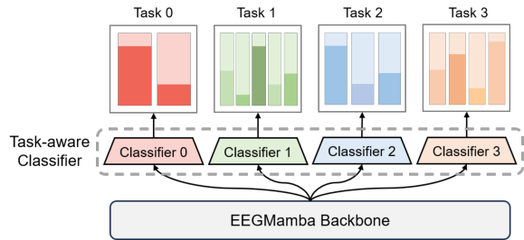

Figure 8: Overall structure of Task-aware Classifier.

To address the inconsistency in the number of classes, we introduce a task-aware classifier, consisting
of sub-modules, each with a single linear layer configured to have a different number of output
dimension corresponding to the specific number of classes, as shown in Figure 8. This approach
enables uniform processing of EEG data with varying class counts. The number of classes for each
dataset is pre-defined, and for data belonging to the same task, the task identifier is passed through
the forward pass, ensuring that data from the same task produce outputs with consistent shapes.

Let _t_ _cls_ _∈_ R _[B][×][D]_ represents the class token output from the final task-aware MoE block. As shown in
Equation 12, _logits_ _i_ is the result obtained through task-aware classifier, where the output dimension
is changed from the number of classes _K_ _i_ determined by the task _i_ .

_logits_ _i_ = _Linear_ _i_ ( _t_ _cls_ ) _∈_ R _[B][×][K]_ _[i]_ (12)

E.3 S UBJECT D IVISION IN EEGM AMBA E XPERIMENT

Table 7 presents the grouping and combination of subjects in our five-fold cross-validation experiment.
The numbers in the table represent subject IDs in the dataset. Generally, ‘1 _∼_ 5’ indicates five subjects,
including subject 1 through subject 5. For the SHHS dataset, only a subset of subjects is used (D.4),
and ‘10 - 2021’ refers to all selected subjects within the range of IDs from 10 to 2021, rather than all
subjects in that range consecutively.

20

_L_ _z_ = _B_ [1]

_B_
� ( _log_ ( _exp_ ( _T_ ))) [2]

_i_ =1

**1080**

**1081**

**1082**

**1083**

**1084**

**1085**

**1086**

**1087**

**1088**

**1089**

**1090**

**1091**

**1092**

**1093**

**1094**

**1095**

**1096**

**1097**

**1098**

**1099**

**1100**

**1101**

**1102**

**1103**

**1104**

**1105**

**1106**

**1107**

**1108**

**1109**

**1110**

**1111**

**1112**

**1113**

**1114**

**1115**

**1116**

**1117**

**1118**

**1119**

**1120**

**1121**

**1122**

**1123**

**1124**

**1125**

**1126**

**1127**

**1128**

**1129**

**1130**

**1131**

**1132**

**1133**

Table 7: Division and combination of subjects in different datasets.

Epilepsy detection Sleep stage classification Emotion recognition Motor imagery
Group

Siena CHB-MIT SleepEDF-20 SHHS DEAP SEED Shu BCI-IV-2a

1 0, 1, 3 1 _∼_ 5 0 _∼_ 3 10 - 1021 1 _∼_ 6 1 _∼_ 3 1 _∼_ 5 1, 2
2 5, 6, 7 6 _∼_ 10 4 _∼_ 7 1023 - 2956 7 _∼_ 12 4 _∼_ 6 6 _∼_ 10 3, 4
3 9, 11, 12 11 _∼_ 15 8 _∼_ 11 2983 - 4047 13 _∼_ 18 7 _∼_ 9 11 _∼_ 15 5, 6
4 13, 14, 15 16 _∼_ 19 12 _∼_ 15 4051 - 4781 19 _∼_ 25 10 _∼_ 12 16 _∼_ 20 7, 8
5 16, 17 20 _∼_ 23 16 _∼_ 19 4783 - 5789 26 _∼_ 32 13 _∼_ 15 21 _∼_ 25 9

Total 13 23 20 329 32 15 25 9

E.4 T RAINING S TRATEGY

Training the EEGMamba model across multiple EEG datasets with varying tasks presents two primary
challenges. First, the inconsistency in the number of channels and lengths across different EEG
datasets prevents direct mixed-batch training. Second, training different datasets sequentially may
lead to the model forgetting knowledge from earlier datasets.

To address these issues, we propose a dynamic sampling training strategy. Specifically, in each
training iteration, we randomly select a batch from the same dataset based on the proportion of
samples that have not yet participated in the training. This ensures that data within the same batch
have consistent channel counts and lengths. Furthermore, as the probability of sampling each dataset
is dynamically adjusted based on the amount of untrained data, larger datasets receive more attention
at the beginning of training, while smaller datasets are primarily sampled later, effectively avoiding
the model’s forgetting of smaller datasets.

E.5 P ARAMETER S ETTINGS

Table 8 shows the important hyperparameters we used in the experiment.

Table 8: Hyperparameters for EEGMamba.

**Hyperparameters** **EEGMamba** **Single-task EEGMamba**

Hidden dimension 128 128
BiMamba layers 8 2
MoE blocks 8 None
Experts 8 None
Experts activated each time 2 None

Batch size 128 128
Learning rate 2e-4 2e-4
Optimizer Adamw Adamw
Weight decay 1e-6 1e-6
Training epochs 100 100

E.6 M ETRICS

**Accuracy** is a fundamental performance metric for classification models, defined as the ratio of
correctly classified samples to the total number of samples. It applies to both binary and multi-class
tasks.

**AUROC** is a key metric for evaluating the performance of classification models, summarizing the
model’s ability to distinguish between positive and negative classes across various thresholds by
calculating the area under the ROC curve. The AUROC value ranges from 0 to 1, with a value closer
to 1 indicating better classification performance.

**F1 Score** is the harmonic mean of precision and recall, particularly useful in scenarios where a
balance between these two metrics is desired. Weighted F1 is used for both binary and multi-class
classification in this paper, representing a weighted average of the individual F1 scores for each class,
where each score is weighted according to the number of samples in that specific class.

21

**1134**

**1135**

**1136**

**1137**

**1138**

**1139**

**1140**

**1141**

**1142**

**1143**

**1144**

**1145**

**1146**

**1147**

**1148**

**1149**

**1150**

**1151**

**1152**

**1153**

**1154**

**1155**

**1156**

**1157**

**1158**

**1159**

**1160**

**1161**

**1162**

**1163**

**1164**

**1165**

**1166**

**1167**

**1168**

**1169**

**1170**

**1171**

**1172**

**1173**

**1174**

**1175**

**1176**

**1177**

**1178**

**1179**

**1180**

**1181**

**1182**

**1183**

**1184**

**1185**

**1186**

**1187**

F B ASELINES

We consider the following representative models:

(i) **EEGNet** (Lawhern et al., 2018) is a classic EEG classification network based on depthwise
separable convolution, which has a concise structure and demonstrated stable and robust performance
in various EEG classification tasks.

(ii) **AttnSleep** (Eldele et al., 2021) is a deep learning model based on the attention mechanism,
designed to automatically classify sleep stages by processing polysomnography (PSG) data including
EEG.

(iii) **EEG Conformer** (Song et al., 2022) utilizes convolution modules and self-attention modules to
capture local features and global dependencies in EEG signals respectively, enabling precise analysis
of EEG data.

(iv) **BIOT** (Yang et al., 2023) is a pre-trained model that can be applied to various biosignals include
EEG.

(v) **HCANN** (Ji et al., 2024) is a recently proposed EEG classification network featuring a multi-head
mechanism that is adaptively modified for EEG signals. It has achieved state-of-the-art (SOTA)
performance across three BCI tasks.

We conduct all baseline tests using publicly available pretrained weights and the open-source code.
Generally, we use the same training hyperparameters as in Table 7 in the baseline experiments.

22

**1188**

**1189**

**1190**

**1191**

**1192**

**1193**

**1194**

**1195**

**1196**

**1197**

**1198**

**1199**

**1200**

**1201**

**1202**

**1203**

**1204**

**1205**

**1206**

**1207**

**1208**

**1209**

**1210**

**1211**

**1212**

**1213**

**1214**

**1215**

**1216**

**1217**

**1218**

**1219**

**1220**

**1221**

**1222**

**1223**

**1224**

**1225**

**1226**

**1227**

**1228**

**1229**

**1230**

**1231**

**1232**

**1233**

**1234**

**1235**

**1236**

**1237**

**1238**

**1239**

**1240**

**1241**

G V ISUALIZATION OF F EATURES E XTRACTED BY S INGLE - TASK EEGM AMBA

Figure 9 shows t-distributed stochastic neighbor embedding (t-SNE) plots of features extracted by
single-task EEGMamba from different datasets. The plot exhibits distinct distances between features
of different classes and small distances within the same class, indicating the successful extraction
of features from different classes by single-task EEGMamba. This may indicate its comprehensive
performance superiority across different datasets.

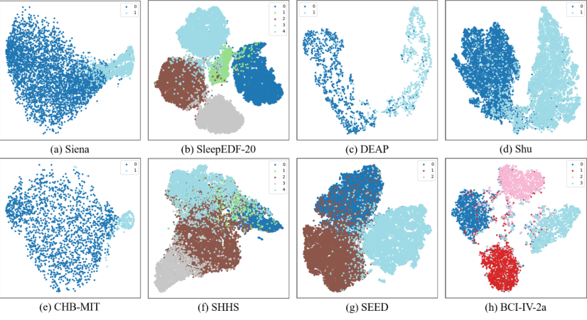

Figure 9: Visualization results of feature extracted by single-task EEGMamba on different datasets.

H V ISUALIZATION OF M O E W EIGHTS

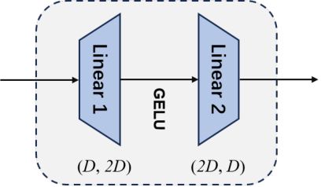

Figure 10: The specific structure of an expert.

In Figure 2, each expert is essentially a Multi-Layer Perceptron (MLP) consisting of two linear layers.
The detailed structure is shown in Figure 10, where hidden dimension _D_ = 128 . We visualize the
expert weight heatmap for the final MoE module of EEGMamba, where Figure 11 shows the weights
of the first linear layer and Figure 12 shows those of the second linear layer. Clearly, the weight
distributions vary across different experts, demonstrating that they specialize in handling different
tasks.

23

**1242**

**1243**

**1244**

**1245**

**1246**

**1247**

**1248**

**1249**

**1250**

**1251**

**1252**

**1253**

**1254**

**1255**

**1256**

**1257**

**1258**

**1259**

**1260**

**1261**

**1262**

**1263**

**1264**

**1265**

**1266**

**1267**

**1268**

**1269**

**1270**

**1271**

**1272**

**1273**

**1274**

**1275**

**1276**

**1277**

**1278**

**1279**

**1280**

**1281**

**1282**

**1283**

**1284**

**1285**

**1286**

**1287**

**1288**

**1289**

**1290**

**1291**

**1292**

**1293**

**1294**

**1295**

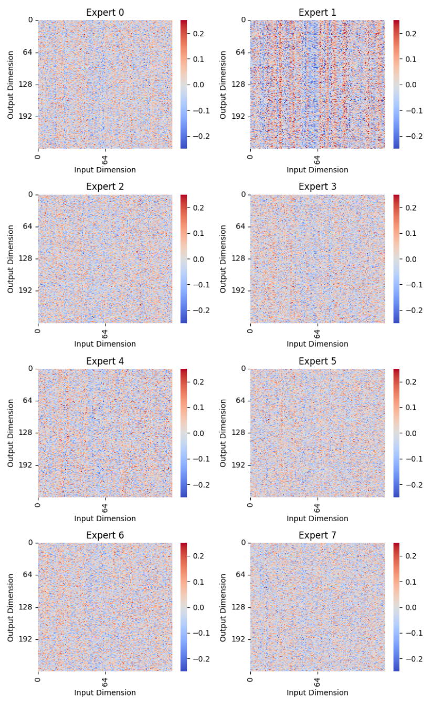

Figure 11: The first linear layer weight visualization of experts in final MoE module.

24

**1296**

**1297**

**1298**

**1299**

**1300**

**1301**

**1302**

**1303**

**1304**

**1305**

**1306**

**1307**

**1308**

**1309**

**1310**

**1311**

**1312**

**1313**

**1314**

**1315**

**1316**

**1317**

**1318**

**1319**

**1320**

**1321**

**1322**

**1323**

**1324**

**1325**

**1326**

**1327**

**1328**

**1329**

**1330**

**1331**

**1332**

**1333**

**1334**

**1335**

**1336**

**1337**

**1338**

**1339**

**1340**

**1341**

**1342**

**1343**

**1344**

**1345**

**1346**

**1347**

**1348**

**1349**

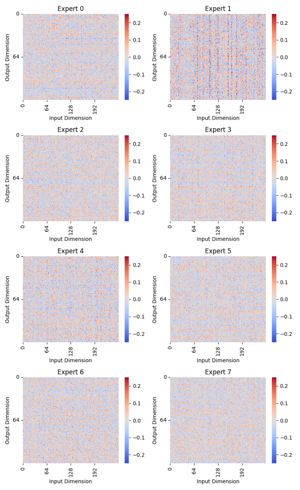

Figure 12: The second linear layer weight visualization of experts in final MoE module.

25

**1350**

**1351**

**1352**

**1353**

**1354**

**1355**

**1356**

**1357**

**1358**

**1359**

**1360**

**1361**

**1362**

**1363**

**1364**

**1365**

**1366**

**1367**

**1368**

**1369**

**1370**

**1371**

**1372**

**1373**

**1374**

**1375**

**1376**

**1377**

**1378**

**1379**

**1380**

**1381**

**1382**

**1383**

**1384**

**1385**

**1386**

**1387**

**1388**

**1389**

**1390**

**1391**

**1392**

**1393**

**1394**

**1395**

**1396**

**1397**

**1398**

**1399**

**1400**

**1401**

**1402**

**1403**

I D ETAILED R ESULTS ON M EMORY -U SAGE AND I NFERENCE S PEED

Table 9, 10 present the detailed results of memory-usage and inference speed, where OOM indicates
out of memory.

Table 9: Detailed results on Memory-Usage and Inference Speed with single-channel data.

|Sequence Length|2000 3000 5000 10000 20000 40000|
|---|---|
|Memory-Usage EEGNet Inference Speed|646 MiB 724 MiB 834 MiB 1096 MiB 1608 MiB 2648 MiB 427.20 iter/s 289.08 iter/s 174.92 iter/s 88.11 iter/s 44.08 iter/s 21.95 iter/s|
|Memory-Usage AttnSleep Inference Speed|3518 MiB 6670 MiB 16534 MiB 61012 MiB OOM OOM 133.97 iter/s 81.98 iter/s 42.65 iter/s 10.87 iter/s OOM OOM|
|Memory-Usage EEG Conformer Inference Speed|3748 MiB 6958 MiB 16384 MiB 62702 MiB OOM OOM 104.92 iter/s 56.14 iter/s 22.28 iter/s 5.89 iter/s OOM OOM|
|Memory-Usage HCANN Inference Speed|2340 MiB 3318 MiB 3936 MiB 9868 MiB 21108 MiB 49724 MiB 92.18 iter/s 62.90 iter/s 37.84 iter/s 17.83 iter/s 8.21 iter/s 3.87 iter/s|
|Memory-Usage Single-task EEGMamba Inference Speed|2864 MiB 3936 MiB 6202 MiB 11600 MiB 22938 MiB 45174 MiB 101.43 iter/s 81.78 iter/s 46.49 iter/s 21.21 iter/s 10.15 iter/s 5.30 iter/s|

Table 10: Detailed results on Memory-Usage and Inference Speed with multi-channel data.

|Sequence Length|2000 3000 5000 10000 20000 40000|
|---|---|
|Memory-Usage EEGNet Inference Speed|1630 MiB 2014 MiB 2804 MiB 4810 MiB 8938 MiB 17026 MiB 285.19 iter/s 191.88 iter/s 115.93 iter/s 58.21 iter/s 29.22 iter/s 14.65 iter/s|
|Memory-Usage AttnSleep Inference Speed|3532 MiB 6682 MiB 16554 MiB 61028 MiB OOM OOM 140.96 iter/s 79.58 iter/s 41.66 iter/s 10.81 iter/s OOM OOM|
|Memory-Usage EEG Conformer Inference Speed|6838 MiB 11590 MiB 24430 MiB 63650 MiB OOM OOM 63.44 iter/s 36.58 iter/s 16.58 iter/s 4.65 iter/s OOM OOM|
|Memory-Usage HCANN Inference Speed|27378 MiB 68034 MiB OOM OOM OOM OOM 44.07 iter/s 5.18 iter/s OOM OOM OOM OOM|
|Memory-Usage Single-task EEGMamba Inference Speed|2954 MiB 4140 MiB 6410 MiB 12208 MiB 23758 MiB 46800 MiB 97.31 iter/s 75.74 iter/s 43.16 iter/s 19.72 iter/s 9.49 iter/s 5.05 iter/s|

26

**1404**

**1405**

**1406**

**1407**

**1408**

**1409**

**1410**

**1411**

**1412**

**1413**

**1414**

**1415**

**1416**

**1417**

**1418**

**1419**

**1420**

**1421**

**1422**

**1423**

**1424**

**1425**

**1426**

**1427**

**1428**

**1429**

**1430**

**1431**

**1432**

**1433**

**1434**

**1435**

**1436**

**1437**

**1438**

**1439**

**1440**

**1441**

**1442**

**1443**

**1444**

**1445**

**1446**

**1447**

**1448**

**1449**

**1450**

**1451**

**1452**

**1453**

**1454**

**1455**

**1456**

**1457**

J L IMITATIONS

Although the current experimental results show that EEGMamba can be well applied to EEG multitask classification, it still has some limitations. On the one hand, this paper only covers four kinds
of EEG tasks to verify the performance of EEGMamba, which is only a small part of the tasks that
EEG can accomplish. On the other hand, it should be extended to other one-dimensional time signals
besides EEG to prove the universality of the model in one-dimensional time signals.

27

