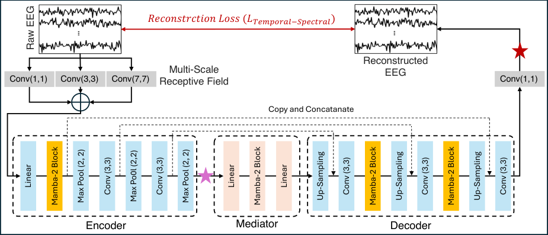
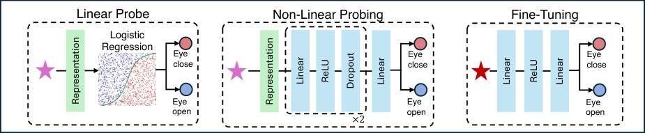
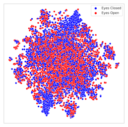
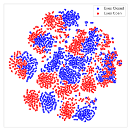
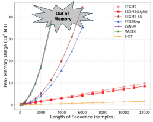
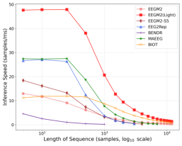
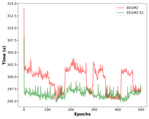
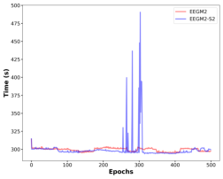
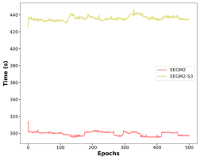
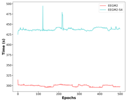

# An Efficient Self-Supervised Framework for Long-Sequence EEG Modeling

Jiazhen Hong
_Emotiv Research_

Melbourne, Australia
jiazhen@emotiv.com

Geoffrey Mackellar
_Emotiv Research_

Sydney, Australia
geoff@emotiv.com

Soheila Ghane

_Emotiv Research_

Melbourne, Australia

soheila@emotiv.com

_**Abstract**_ **—Electroencephalogram (EEG) signals generally ex-**
**hibit low signal-to-noise ratio (SNR) and high inter-subject**
**variability, making generalization across subjects and domains**
**challenging. Recent advances in deep learning, particularly self-**
**supervised learning with Transformer-based architectures, have**
**shown promise in EEG representation learning. However, their**
**quadratic computational complexity increases memory usage and**
**slows inference, making them inefficient for modeling long-range**
**dependencies. Moreover, most existing approaches emphasize**
**either explicit window segmentation of the temporal signal or**
**spectral-only input embedding while neglecting raw temporal**
**dynamics. In this paper, we propose EEGM2, a self-supervised**
**framework that overcomes these limitations. EEGM2 adopts a**
**U-shaped encoder–decoder architecture integrated with Mamba-**
**2 to achieve linear computational complexity, thereby reducing**
**memory usage and improving inference speed. Meanwhile, the**
**selective information propagation mechanism of Mamba-2 en-**
**ables the model to effectively capture and preserve long-range**
**dependencies in raw EEG signals, where traditional RNN or**
**CNN architectures often struggle. Moreover, EEGM2 employs a**
**self-supervised pre-training objective that reconstructs raw EEG**
**using a combined L1 and spectral (Fourier-based) loss, enhancing**
**generalization by jointly preserving temporal dynamics and**
**spectral characteristics. Experimental results demonstrate that**
**EEGM2 achieves state-of-the-art performance in both short- and**
**long-sequence modeling and classification. Further evaluations**
**show that EEGM2 consistently outperforms existing models,**
**demonstrating strong generalization across subjects and tasks, as**
**well as transferability across domains. Overall, EEGM2 offers**
**an efficient and scalable solution suitable for deployment on**
**resource-constrained brain-computer interface (BCI) devices.**
_**Index Terms**_ **—Brain–computer interface (BCI), Electroen-**
**cephalography (EEG), Self-supervised learning, State-space mod-**
**els, Mamba-2, Long-sequence modeling, Representation learning**

I. I NTRODUCTION

Electroencephalography (EEG)-based brain-computer interfaces (BCIs) provide new opportunities to improve the quality
of life for individuals with disabilities by enabling control
through mental activities [1]. However, scalp EEG signals
are inherently noisy and exhibit high inter-subject variability,
posing significant challenges for accurate modeling and generalization [2]. As a result, traditional EEG analysis methods
have primarily focused on subject-specific tasks, such as eventrelated potential (ERP) detection [3] and motor imagery classification [4], with limited analysis on generalization across
subjects or domains.

Deep learning models, particularly self-supervised learning
(SSL) approaches, have achieved success in modeling EEG
signals across subjects by pre-training on large-scale unlabeled
EEG datasets to learn representations, which can then be
transferred to downstream tasks [5]. Transformer-based SSL
models for EEG have shown strong performance on short
sequence modeling tasks, typically ranging from 2 to 10
seconds [5]–[8]. However, as EEG sequence length increases,
the computational complexity of Transformer-based models
grows quadratically, increasing memory usage during training
and inference time [9], making them inefficient for modeling
long sequences of 10,000 or more time steps [10].
Moreover, patch-based input embedding methods rely on
explicit segmentation using fixed window sizes, which may
capture intra-window relationships but often discard interwindow and long-range temporal dependencies [7], [8],

[11], [12]. Some approaches reduce sequence dimensionality
through multiple convolutional downsampling operations [6],

[13], further limiting their ability to preserve fine-grained
temporal dynamics in long EEG sequences. Other works
like BIOT [7] focus exclusively on features in the frequency
domain using a fast Fourier transformer, neglecting the temporal structure of the signal. In contrast, models such as
EEG2Rep and EEGPT [5], [8] emphasize the alignment of
latent representation while overlooking spectral characteristics,
thus limiting their ability to generalize across frequencydependent EEG patterns.
Considering the aforementioned limitations: (1) lack of
generalization, (2) high memory consumption, and (3) reliance
on explicit temporal segmentation, spectral-only, or temporalonly feature extraction, we propose _EEGM2_, inspired by two
promising architectures: the image reconstruction backbone UNet [14] and the recently introduced Structured State Space
Models (SSMs) [10], particularly Mamba-2 [15]. U-Net, composed of a CNN-based encoder and mirrored decoder, has been
widely adopted as the denoising backbone in diffusion models [16], owing to its ability to capture both local and global
context via skip connections. However, while effective for spatial feature learning, CNN-based architectures often struggle
with long-sequence modeling due to limited receptive fields
and gradient vanishing issues. In contrast, Mamba [17] and its
successor Mamba-2 [15] leverage selective state propagation
to maintain long-range dependencies with linear computational

complexity. Mamba-2 further introduces the Structured StateSpace Duality (SSD) mechanism, combining a parallel Mamba
layer with attention operations. This design achieves a tradeoff between modeling fidelity and efficiency, outperforming
both the original Mamba and Transformer layers [15]. Although Mamba-based models have shown strong performance
in natural language and vision tasks [18], [19], applying them
to EEG data is non-trivial.

Our proposed EEGM2 is a novel self-supervised framework
that integrates a U-shaped encoder–decoder architecture with
Mamba-2 blocks. This hybrid design enables EEGM2 to capture both fine-grained and long-range temporal dependencies
in raw EEG data, making it a compelling backbone for efficient
and scalable EEG representation learning, particularly in longsequence modeling tasks. The main contributions of EEGM2
are summarized as follows:

_•_ **Low Memory Usage & Fast Inference Speed:** EEGM2
adopts a hierarchical U-shaped encoder-decoder structure
with an integrated Mamba-2-based mediator module,
achieving linear computational complexity. This design
reduces memory usage and improves inference speed,
making it suitable for deployment in resource-constrained
environments.

_•_ **Long-sequence** **EEG** **modeling:** By incorporating
Mamba-2 structured state space models, EEGM2 effectively captures and preserves long-range dependencies
in raw EEG signals, where traditional recurrent neural
networks (RNNs) and CNNs often struggle.

_•_ **Temporal and spectral feature preservation:** EEGM2
employs a reconstruction-based pretraining objective that
combines temporal-domain L1 loss with frequencydomain spectral loss (via Fourier transform). This joint
optimization preserves both temporal and spectral characteristics of EEG signals, mitigating the risk of biased
representations caused by single-domain reliance.

_•_ **Lightweight alternative variant:** We further introduce
_EEGM2 (Light)_, a compact variant that utilizes only
the encoder and incorporates a customized representation
method for non-linear probing. Despite a reduction in
model size by 18 _×_ (from 4.5M to 0.25M parameters),
EEGM2 (Light) maintains strong performance, providing
an efficient solution for downstream BCI deployments
with minimal compromise in accuracy.

II. M ETHODOLOGY

_A. Problem Formulation_

Given a batch of multichannel EEG sequences **X** _∈_
R _[B][×][C]_ [in] _[×][T]_, where _B_ denotes the batch size, _C_ in is the number
of input EEG channels, and _T_ is the number of time points per
trial, our goal is to learn robust and generalizable representations of EEG signals through a self-supervised reconstruction
task, without relying on any labeled data.
In the pre-training stage (Fig. 1 (a)), EEGM2 aims to learn
a mapping _f_ _θ_ : **X** _→_ **X** [ˆ] that reconstructs the raw EEG input
**X** . To ensure the preservation of both temporal and spectral

characteristics, we define the total reconstruction loss as a
weighted sum of temporal and spectral terms:

_L_ reconstruction = _α · ∥_ **X** _−_ **X** [ˆ] _∥_ 1 + _β · ∥F_ ( **X** ) _−F_ ( **X** [ˆ] ) _∥_ 2 [2] _[,]_ (1)

where _F_ ( _·_ ) denotes the real-valued fast Fourier transform
(rFFT), and _α_, _β_ are hyperparameters balancing the contribution of temporal and frequency-domain reconstruction errors.
After pre-training, we evaluate the quality of the learned
representations on multiple downstream EEG classification
tasks. Each dataset provides labeled samples ( **X** _, y_ ), where
**X** denotes the EEG input and _y_ is the associated class label.
This work primarily focuses on binary classification scenarios.
We adopt three evaluation strategies (illustrated in Fig. 1(b)):

_•_ _Linear probing (EEGM2(Linear))_ : The pretrained encoder is frozen (purple star), and representations are extracted from a target layer. A logistic regression classifier
is trained on these fixed features using the One-vs-Rest

strategy.

_•_ _Non-linear probing (EEGM2(Light))_ : Similar to linear
probing, the encoder is frozen. However, a lightweight
multi-layer perceptron (MLP) with two hidden layers is
trained on top of the extracted representations to allow
for non-linear decision boundaries.

_•_ _Fine-tuning (EEGM2(Fine))_ : The entire EEGM2 model
(starting from the red star) is trained end-to-end alongside a lightweight MLP classification head. All model
parameters are updated during training, and convergence
is typically achieved within 5 epochs.

This evaluation protocol allows EEGM2 to be tested under
various practical scenarios and demonstrates its ability to transfer effectively across multiple downstream tasks, including
cross-subject, multi-task, and cross-dataset EEG classification
tasks.

_B. EEGM2 Architecture_

Fig. 1(a) illustrates the overall architecture of EEGM2.
Given an input EEG sequence **X** _∈_ R _[B][×][C]_ [in] _[×][T]_, the model
first applies a multi-scale receptive field module composed
of parallel 1D convolutions with kernel sizes 1, 3, and 7.
This allows the network to perceive temporal dependencies
at multiple scales.
The encoder comprises three stages that progressively increase feature dimensionality while reducing temporal resolution. The first stage applies a linear projection to model
inter-channel relationships, followed by a Mamba-2 block
that captures fine-grained temporal dynamics. The subsequent
stages utilize temporal convolutions and max-pooling operations, enabling deeper layers to efficiently model broader
temporal contexts.
The mediator is designed to learn a latent bottleneck representation of the input. It consists of a linear layer, a Mamba-2
block, and a subsequent linear projection. This structure refines
inter-channel relationships and encodes temporal dynamics
into a compressed latent space.
The decoder mirrors the encoder structure and performs
upsampling via parameter-free linear interpolation instead

Fig. 1: Overview of the EEGM2 framework. (a) Reconstruction-based self-supervised pretraining, where the model learns to
reconstruct raw EEG signals using a multi-scale encoder–mediator–decoder architecture supervised by a temporal–spectral loss.
No labels are required. (b) Downstream evaluation strategies: linear probing and non-linear probing extract frozen encoder
representations (purple star), followed by a logistic regression or MLP classifier, respectively; fine-tuning jointly updates the
entire model starting from the red star. The “eye open/close” example represents the binary class labels from the Crowdsourced
EEG dataset (Section III-A).

of transposed convolutions, which helps avoid checkerboard
artifacts [20] and preserves temporal continuity in the reconstructed EEG. Each upsampled feature map is further
processed by a Mamba-2 block to restore long-range dependencies. Skip connections from the encoder are concatenated
with the corresponding decoder layers to retain high-resolution
features. Finally, a 1 _×_ 1 convolutional layer is applied to
generate the output reconstruction.

_C. Mamba-2 Block_

Each Mamba-2 block in EEGM2 is equipped with LayerNorm and residual connections to enhance training stability
and performance. Mamba-2 [15] is a structured state-space
model (SSM) designed for efficient long-sequence modeling.
Compared to Transformer-based models, Mamba-2 achieves
linear time complexity while preserving the ability to capture
long-range dependencies, making it well-suited for EEG data.
Its structured state-space duality (SSD) enables both parallel
computation and selective information propagation, improving
computational efficiency and modeling scalability.
Since Mamba-2 requires input sequences of shape ( _T, C_ ),
each intermediate representation in EEGM2 is transposed from
( _B, C, T_ ) to ( _B, T, C_ ) before being passed into a Mamba-2
block, and then reverted back to ( _B, C, T_ ) afterward. This

transposition ensures compatibility while preserving spatialtemporal alignment across channels and time steps. Formally,
given an input sequence **x** _∈_ R _[T][ ×][d]_, Mamba-2 evolves a latent
state via:

**h** _t_ = _A_ _t_ **h** _t−_ 1 + _B_ _t_ **x** _t_ _,_ (2)

**y** _t_ = _C_ _t_ **h** _t_ _,_ (3)

where _t ∈{_ 1 _, . . ., T_ _}_ is the time step, and _A_ _t_, _B_ _t_, and _C_ _t_ are
parameterized matrices that are dynamically updated during
training. In contrast to traditional recurrent models, Mamba-2
employs a selective update mechanism that improves expressiveness and robustness in modeling long-range dependencies
in EEG signals.

_D. Customized Representation Extraction_

To enable efficient inference for downstream classification,
especially with long EEG sequences, we design a customized
representation extraction approach, highlighted in green in
Fig. 1(b). Features are captured from the encoder using a
forward hook, avoiding direct flattening or global pooling.
Given an input EEG sequence **X** _∈_ R _[B][×][C][×][T]_, we register
a forward hook on a target encoder module to obtain hidden
representations **F** _∈_ R _[B][×][C][×][T]_ _[ ′]_ during inference. We then summarize **F** along the temporal axis using descriptive statistics:

TABLE I: Overview of the datasets used in this study.

|Datasets|Chan.|Sub.|Samples|Seq. Length|
|---|---|---|---|---|
|**TUAB** - 10 s **TUAB** - 30 s **TUAB** - 60 s **TUAB** - 100 s|16 16 16 16|2383 2383 2383 2383|409,455 135,702 56,290 39,810|1280 3840 7680 12800|
|**Crowdsourced** **STEW** **DriverDistraction** **Alpha** **Attention**|14 14 14 14 14|13 48 17 59 27|12,296 28,512 66,197 11,866 21,894|256 256 256 256 256|

minimum, maximum, mean, standard deviation, and quantiles
(0.05–0.95). The resulting vector is defined as:

**z** = [min _,_ max _, µ, σ, Q_ 0 _._ 05 _, Q_ 0 _._ 25 _, Q_ 0 _._ 5 _, Q_ 0 _._ 75 _, Q_ 0 _._ 95 ] _,_ (4)

yielding a compact feature tensor **z** _∈_ R _[B][×][C][×]_ [9], where each of
the nine dimensions encodes a temporal statistic per channel.
For non-linear probing, this tensor is directly fed into the MLP.
For linear classification, it is flattened into a vector of shape
R _[B][×]_ [(9] _[·][C]_ [)] . A visualization of the learned representations is
provided in Section IV-A.

_E. Temporal-Spectral Loss Function_

To preserve both temporal dynamics and spectral characteristics of EEG signals during pre-training, we adopt a dualdomain reconstruction loss (Equation 1). The temporal loss is
defined as the Mean Absolute Error (L1 loss) between predicted and target waveforms. Compared to L2 (Mean Squared
Error), L1 avoids excessive penalization of large deviations,
resulting in better generalization [21]. Such deviations are
often caused by noise and artifacts in EEG signals, making L1
a more robust choice for EEG modeling. However, due to its
non-smooth gradients at zero, L1 loss may slow convergence.
To mitigate this, we apply a OneCycle learning rate schedule
(Section III-B1) to stabilize and accelerate training.
The spectral loss imposes an auxiliary constraint in the
frequency domain by enforcing similarity between the predicted and ground truth amplitude spectra. We apply a realvalued Fast Fourier Transform (rFFT) along the temporal axis
and minimize the mean squared magnitude difference between
the predicted and ground truth spectra across all frequencies. Unlike approaches that focus on predefined frequency
bands, our formulation reconstructs the entire spectral profile.
Although it does not explicitly isolate alpha, beta, or theta
bands, it encourages the retention of all frequency components
present in the input, thus complementing the time-domain loss
and promoting the reconstruction of waveform integrity and
oscillatory features critical for downstream decoding.

III. E XPERIMENTS

_A. Dataset_

Table I summarizes the datasets used in this study, including
the TUH Abnormal EEG Corpus (TUAB) [22] and five Emotiv
datasets covering diverse real-world scenarios.
**TUAB:** The TUAB dataset is a large-scale clinical EEG
corpus in which each recording is labeled as either normal

or abnormal based on neurologist reports. It is widely used
for automated abnormal EEG detection. TUAB provides 16channel EEG signals sampled at 200 Hz, which we downsample to 128 Hz to match the Emotiv datasets. Following
BIOT [7], we adopt the same training, validation, and test
set split strategy to ensure fair comparability with prior work.
Benefiting from its long-term monitoring (LTM) recordings,
TUAB contains segments spanning several hours. Previous
Transformer-based SSL methods typically divide TUAB into
2–10 second windows due to computational constraints [5],

[7], [8]. To evaluate EEGM2’s ability to model long EEG
sequences, we experiment with four sequence lengths: 10, 30,
60, and 100 seconds.
**Emotiv:** The Emotiv datasets were collected using the Emotiv
Epoc headset, which records 14-channel EEG signals at 128
Hz. All signals were bandpass filtered and segmented into 2
second windows (256 time steps). We evaluate EEGM2 on
five Emotiv datasets drawn from real-world applications: (1)
Crowdsourced Eye Open/Close Detection [23], (2) STEW,
a workload estimation dataset [24], (3) Driver Distraction
Detection, (4) Eye Open/Close Detection based on Alpha
Band Activity, and (5) Attention State Classification. Among
these, the first two are publicly available, while the remaining
three are proprietary datasets provided by Emotiv. To evaluate
cross-subject generalization, all Emotiv datasets are split in
a _subject-wise_ manner: EEG recordings from each subject
are assigned exclusively to either the training, validation,
or test set. In other words, no EEG data from the same
individual appears in more than one split. This setup introduces
significant inter-subject variability and allows us to assess
EEGM2’s generalization to entirely unseen subjects. Additionally, the datasets span multiple Emotiv headset types, each
with distinct signal-noise characteristics. This diversity further
challenges the model’s adaptability to different hardware conditions. More details on dataset statistics and preprocessing
are provided in Appendix A.

_B. Implementation Details_

_1)_ _**Pre-Training & Downstream Tasks**_ _:_ The experiment
consists of two stages. In the first stage, the model is pretrained
in a self-supervised manner for 500 epochs with a batch
size of 64, using only unlabeled data and optimizing the
reconstruction loss. We employ the AdamW optimizer with
an initial learning rate of 2 _._ 5 _×_ 10 _[−]_ [4] and a weight decay of
1 _×_ 10 _[−]_ [2] . A OneCycle learning rate schedule [25] is applied,
with a maximum learning rate of 5 _×_ 10 _[−]_ [4] and a minimum
of approximately 3 _._ 13 _×_ 10 _[−]_ [5], following a cosine annealing
strategy. The learning rate is warmed up during the first 30%
of training steps, starting at [max lr] 10 and gradually decaying to

10000max lr [by the end of training.]
In the second stage, we evaluate the pretrained encoder on
supervised downstream classification tasks using three strategies (see Fig. 1(b) and Section II-A). For all downstream tasks,
we adopt the cross-entropy loss and the AdamW optimizer.
Each classification model converges within 5 epochs. To ensure robustness, every experiment is repeated three times, and

we report the mean and standard deviation across all results
presented in this paper. In addition to classification accuracy,
we report _Balanced Accuracy (ACC)_, which computes the
average recall across all classes and serves as a more reliable
metric for imbalanced datasets. We also report the _Area Under_
_the Receiver Operating Characteristic Curve (AUROC)_, which
quantifies the model’s ability to distinguish between classes by
summarizing the ROC curve into a single scalar value.
Both pre-training and downstream training are performed
using 32-bit mixed precision on a single NVIDIA RTX 6000
Ada GPU.

_2) EEGM2 Variant Settings in Ablation Study:_ To assess
the contribution of each component, we design five ablation
variants of EEGM2, each modifying or removing a specific
module. The six configurations evaluated are as follows:

_•_ **EEGM2** : The full model incorporating all components
shown in Fig. 1, serving as the reference configuration.

_•_ **EEGM2-S1** : A variant without the multi-scale receptive
field input embedding.

_•_ **EEGM2-S2** : A variant that replaces the temporal-spectral
loss with L1 loss only.

_•_ **EEGM2-S3** : A variant in which all Mamba-2 blocks are

replaced with Mamba-1 blocks.

_•_ **EEGM2-S4** : Similar to EEGM2-S3, but additionally removes the multi-scale receptive field.

_•_ **EEGM2-S5** : A variant in which the Mamba-2 blocks are

replaced with Transformer blocks.

These variants allow us to systematically isolate the effects
of the input embedding, loss function, Mamba blocks, and
backbone architecture on overall model performance.

IV. R ESULTS

In this section, we first demonstrate the representation capability of EEGM2 through visualization in Section IV-A. We
then evaluate EEGM2’s effectiveness in modeling long EEG
sequences and present ablation studies on both pre-training and
downstream tasks in Section IV-B. Section IV-C examines the

generalization of EEGM2 through in-domain downstream classification and investigates its transferability via cross-domain
downstream classification. Finally, Section IV-D compares
EEGM2 with recent Transformer-based models in terms of

memory usage and inference speed under varying sequence
lengths using simulation experiments.

_A. t-SNE Visualization of EEGM2 Representation_

Fig. 2 presents a two-dimensional visualization using tdistributed Stochastic Neighbor Embedding (t-SNE) [26],
comparing raw EEG signal features (Fig. 2a) and EEGM2
representations after pre-training (Fig. 2b). The representations
are extracted from the encoder layer using the proposed
customized representation extraction method described in Section II-D. The evaluation is conducted on the test set of the

Crowdsourced EEG dataset. t-SNE projects high-dimensional
EEG features into two-dimensional space for visual inspection.

(a) Raw Signal (b) EEGM2 Representation

Fig. 2: Comparison of 2D t-SNE projections of (a) raw mean
EEG features and (b) EEGM2-learned representations on the
Crowdsourced EEG dataset.

As shown in Fig. 2, EEGM2 yields more compact and wellseparated class clusters compared to raw features, demonstrating its ability to extract class-discriminative and semantically
meaningful representations and confirming its effectiveness in
learning robust EEG representations.

_B. Long-Sequence EEG Modeling_

Here, we investigate the long-sequence modeling capability
of EEGM2 and conduct an ablation study using five variant
configurations to evaluate the contribution of each architectural
component. Table II summarizes the self-supervised reconstruction performance of EEGM2 and its variants on long EEG
sequences from the TUAB dataset, with each input spanning
100 seconds (12,800 time steps). All experiments are conducted under identical settings on a single NVIDIA RTX 6000
Ada GPU. To assess modeling quality and efficiency, we report
two metrics: (1) _Averaged Channel-wise Mean Squared Error_
_(ACMSE)_, computed by first calculating the MSE for each
EEG channel and then averaging across all channels, and (2)
average training speed measured in epochs per second. These
metrics provide insights into both reconstruction accuracy and
computational efficiency, allowing us to quantify the impact
of each component in EEGM2.
As shown in Table II, EEGM2 achieves the lowest ACMSE,
demonstrating strong capability in modeling long-sequence
EEG data. Notably, EEGM2-S5, where the Mamba-2 blocks
are replaced by Transformer blocks, fails to process 100second sequences due to the Transformer’s quadratic computational complexity, resulting in out-of-memory (OOM) errors.
This underscores the advantage of Mamba-2’s linear scaling,
which enables EEGM2 to handle long sequences efficiently
while maintaining superior reconstruction fidelity. Additional
analysis of memory usage is provided in Section IV-D. When
comparing EEGM2 to EEGM2-S4, we observe that although
the improvement in ACMSE is modest, the Mamba-2 blocks
lead to a notable reduction in training time compared to
the Mamba-1 variant, demonstrating enhanced computational
efficiency. Comparisons between EEGM2 and EEGM2-S1, as
well as between EEGM2-S4 and EEGM2-S5, show that the

TABLE II: Performance comparison of EEGM2 variants in pre-training for long-sequence EEG modeling.

|Models|Mamba-2 Block|Temporal-Spectral Loss|Multi-Scale|ACMSE|Averaged Training Time|
|---|---|---|---|---|---|
|EEGM2|✓|✓|✓|6.87e-13|299.43 seconds/epoch|
|EEGM2-S1|✓|✓|✗|9.24e-12|296.45 seconds/epoch|
|EEGM2-S2|✓|✗(L1 Loss)|✓|7.74e-12|300.12 seconds/epoch|
|EEGM2-S3|Mamba-1|✓|✓|6.95e-13|435.95 seconds/epoch|
|EEGM2-S4|Mamba-1|✓|✗|1.06e-11|438.05 seconds/epoch|
|EEGM2-S5|Transformer|✓|✓|Out of Memory|Out of Memory|

TABLE III: Performance Comparison of EEGM2 Variants in
Long-Sequence EEG Downstream Task.

**Models** **Balanced ACC** **AUROC**

**EEGM2** **81.08** **0.8869**

**w/o multi-scale**

EEGM2-S1 79.06 ( _↓_ 2.02) 0.8546 ( _↓_ 0.03)
**w/o temporal-spectral loss**
EEGM2-S2 77.01 ( _↓_ 4.07) 0.8247 ( _↓_ 0.06)
**w/o mamba-2 block**

EEGM2-S3 76.08 ( _↓_ 5.00) 0.8176 ( _↓_ 0.07)
EEGM2-S4 75.38 ( _↓_ 5.70) 0.8339 ( _↓_ 0.05)
EEGM2-S5 out of memory out of memory

multi-scale receptive field introduces only a slight increase
in training time while significantly improving reconstruction
accuracy, demonstrating its effectiveness. Moreover, EEGM2S2, which omits the temporal-spectral loss, exhibits comparable training speed but suffers from unstable training behavior.
Additional visualization and insights into training time are
provided in Appendix B.
Table III presents an ablation study evaluating the performance of EEGM2 and its variants on the long-sequence
EEG downstream task, using representations learned from the
corresponding pretrained models analyzed in Table II. Removing the multi-scale receptive field input embedding results
in the smallest performance drop, with a 2.02% decrease in
balanced accuracy, indicating its beneficial role in capturing
raw EEG features across multiple temporal scales. Excluding
the temporal-spectral loss leads to a larger 4.07% decline,
underscoring its importance in preserving spectral information
and mitigating noise. Replacing the Mamba-2 block with
Mamba-1 causes a notable 5.00% reduction, highlighting
the superior capability of Mamba-2 in modeling long-range
temporal dependencies. The greatest performance degradation
is observed in EEGM2-S4, where both the multi-scale input
embedding is removed and the Mamba-2 block is replaced
with Mamba-1, resulting in a 5.70% decrease in balanced
accuracy. These results demonstrate the complementary and
critical contributions of these components to EEGM2’s overall
performance.

_C. Generalization & Transferability Analysis_

In this section, we evaluate the generalization ability of
EEGM2 through a series of in-domain and cross-domain
experiments. For in-domain analysis, we assess EEGM2 using
various sequence lengths on the TUAB dataset and across
multiple tasks on the Emotiv datasets, employing a subjectwise split strategy to evaluate cross-subject generalization.

TABLE IV: Performance comparison between EEGM2 and
state-of-the-art models on the TUAB dataset across varying
sequence lengths.

|Models 10 Seconds:|Balanced ACC|AUROC|
|---|---|---|
|CNN-LSTM [8], [27] CNNTransformer [8], [28] BIOT [7] EEGPT [8] MAEEG [5], [13] BENDR [5], [6] EEG2Rep [5]|78.48_±_0.38 77.77_±_0.22 79.59_±_0.57 79.83_±_0.30 77.56_±_3.56 76.96_±_3.98 80.52_±_2.22|0.8569_±_0.0051 0.8461_±_0.0013 0.8815_±_0.0043 0.8718_±_0.0050 0.8656_±_0.0333 0.8397_±_0.0344 0.8843_±_0.0309|
|EEGM2 (Light) EEGM2 (Fine)|79.14_±_0.21 **80.87**_±_0.54|0.8559_±_0.00 **0.8864**_±_0.00|

**30 Seconds:**

EEGM2 (Light) 78.97 _±_ 0.25 0.8575 _±_ 0.00
EEGM2 (Fine) **81.71** _±_ 0.12 **0.8932** _±_ 0.00
**60 Seconds:**

EEGM2 (Light) 76.94 _±_ 0.33 0.8257 _±_ 0.00
EEGM2 (Fine) **80.68** _±_ 0.45 **0.8803** _±_ 0.00
**100 Seconds:**

EEGM2 (Light) 74.57 _±_ 0.27 0.7986 _±_ 0.00
EEGM2 (Fine) **81.08** _±_ 0.28 **0.8869** _±_ 0.00

For cross-domain analysis, we examine the transferability
of EEGM2 by pre-training the model on one dataset and
evaluating downstream tasks on a different dataset, thereby
demonstrating the robustness and adaptability of the learned
representations.
_1)_ _**In-domain (TUAB)**_ _:_ Most prior works on the TUAB
dataset focus on short-sequence settings (e.g., 10 seconds) due
to memory constraints. Studies such as BIOT [7], EEGPT [8],
and EEG2Rep [5] have demonstrated the effectiveness of selfsupervised learning for EEG representation learning, achieving high AUROC scores using CNN-LSTM or Transformerbased architectures. However, these methods often struggle
with modeling long-range dependencies due to the quadratic
complexity of self-attention or gradient vanishing issues. Benefiting from the integration of the Mamba-2 block, EEGM2
overcomes these limitations. To assess its capacity for modeling long EEG sequences, we conduct experiments on the
TUAB dataset using durations ranging from 10 to 100 seconds,
corresponding to sequence lengths from 1,280 to 12,800
samples.
Table IV reports the balanced accuracy and AUROC of
EEGM2 and state-of-the-art models across four durations:

10, 30, 60, and 100 seconds. For each duration, the best
performance is highlighted in bold. We evaluate two configurations of EEGM2: EEGM2 (Light), a lightweight variant with

only 0.25M parameters, and EEGM2 (Fine), the full model
with 4.5M parameters. For fair comparison, we include the
best results reported by each baseline. Note that BENDR,
MAEEG, and EEG2Rep report accuracy instead of balanced
accuracy, which may overestimate performance on this imbalanced dataset. EEGM2 (Fine) consistently achieves state-ofthe-art results across all durations. At 10 seconds, it achieves
a balanced accuracy of 80.87% and an AUROC of 0.8864,
outperforming all baselines. Remarkably, its performance improves as the sequence length increases, peaking at 30 seconds
with a balanced accuracy of 81.71% and AUROC of 0.8932.
Even at 100 seconds, it maintains strong performance (81.08%,
0.8869), highlighting its robustness in modeling long-range
temporal dependencies. In contrast, EEGM2 (Light) delivers
competitive performance at shorter durations (e.g., 79.14%
balanced accuracy and 0.8559 AUROC at 10 seconds), but
its performance degrades as the sequence length increases.
This decline is likely due to two factors: (1) the customized
representation extraction method (Section II-D), which may
lose information over long sequences; and (2) the absence of
the mediator and decoder modules, which limits its capacity
to model high-level temporal features. In comparison, EEGM2
(Fine), with three Mamba-2 blocks across the mediator and
decoder, better captures long-range dependencies and delivers
consistently superior downstream performance.
_2)_ _**In-domain (Emotiv)**_ _:_ Table V presents the performance
of EEGM2 and state-of-the-art baselines on downstream

tasks using the Emotiv datasets, evaluating both model stability and cross-subject generalization. Classification accuracy (ACC) and AUROC are reported, with the best results
for each dataset highlighted in bold. To better assess the
representation learning capability of EEGM2, in addition
to EEGM2(Linear), EEGM2(Light), and EEGM2(Fine), we
include EEGM2(Scratch) as a baseline trained from random initialization without pretaining. Additionally, we reproduce several recent Transformer-based models, including
MAEEG [13], BENDR [6], EEG2Rep [5], and BIOT [7],
under identical experimental settings for fair comparison.
As shown in Table V, EEGM2(Fine) and EEGM2(Light)
consistently achieve top performance across all datasets, surpassing both EEGM2(Scratch) and the state-of-the-art models.
Notably, EEGM2(Light), despite using 18 _×_ fewer parameters
than both EEGM2(Scratch) and (Fine), EEGM2(Light) still
outperforms them on the DriverDistraction and Attention
datasets in accuracy. This demonstrates the effectiveness of
the pretrained encoder in learning robust representations and
highlights EEGM2(Light) as an efficient alternative for shortduration (e.g., 2-second) EEG classification. Class imbalance
remains a significant challenge in EEG classification. For
instance, in the severely imbalanced DriverDistraction dataset,
EEGM2(Fine) achieves the highest AUROC (0.7097), despite
a lower accuracy of 76.54%. This underscores the importance of AUROC as a more reliable evaluation metric under

imbalance and further highlights EEGM2’s ability to extract
robust, class-discriminative EEG features rather than relying
on majority-class predictions. Overall, these results confirm

EEGM2’s strong generalization and transfer capabilities across
diverse subject-wise tasks, outperforming the state-of-the-art
models.

_3)_ _**Cross-Domain**_ _:_ To evaluate the transferability of
EEGM2’s learned representations, we conducted cross-domain
experiments. Since the DriverDistraction dataset contains the
largest number of samples, we adopted a transfer learning
strategy in which EEGM2 is first pre-trained on DriverDistraction and then fine-tuned on the remaining Emotiv datasets.
For comparison, we also include results from in-domain pretraining, where EEGM2 is trained directly on each target
dataset.

As shown in Table VI, EEGM2 significantly outperforms
random initialization in both in-domain and cross-domain set
tings. When pre-trained on DriverDistraction, EEGM2 retains
transferable knowledge that leads to consistent performance
gains across diverse downstream tasks, including eye state
classification (Crowdsourced), mental workload estimation
(STEW), alpha wave detection (Alpha), and attention classification. Notably, cross-domain pre-training yields an average
improvement of 2.75% in accuracy and 0.027 in AUROC,
demonstrating EEGM2’s strong generalization ability across
EEG-based tasks. In-domain pre-training still achieves the best
overall performance, highlighting the importance of distributional alignment between the pre-training and downstream
datasets. Specifically, in-domain pre-training results in a 5.61%
accuracy gain and a 0.0453 AUROC improvement over training from scratch. These results confirm that EEGM2 functions
as an effective EEG representation learner, capable of transferring knowledge across varied cognitive and neurological tasks.

_D. Memory Usage & Inference Speed_

In this section, we analyze the memory usage and inference speed of recent Transformer-based self-supervised EEG
models, alongside the proposed EEGM2, through a simulation
experiment.
**Related Work:** Table VII summarizes the number of trainable

parameters for each model under the column “Model Size.”
For comparison, we include EEGM2-S5, a variant of EEGM2
in which the Mamba-2 blocks are replaced with standard
Transformer blocks (see Section III-B2). We also include
EEGM2 (Light), a lightweight version of EEGM2, designed
for efficient deployment under constrained computational resources. BIOT [7] employs a linear Transformer architecture,
enabling efficient modeling of complex token interactions
while maintaining linear time complexity. MAEEG [13] and
BENDR [6] share a Transformer-based backbone with masking mechanisms but differ in their learning objectives: BENDR
combines contrastive and predictive losses to enrich EEG
feature learning, while MAEEG adopts a masked autoencoder
(MAE) approach, reconstructing masked portions of the EEG
signal. EEG2Rep [5] uses predictive self-supervised learning
with temporal masking to enhance representation quality. This
comparison provides insight into the computational efficiency
and scalability of EEGM2 relative to other state-of-the-art
Transformer-based approaches.

TABLE V: Performance comparison of EEGM2 and state-of-the-art models on downstream classification tasks using the Emotiv
datasets.

**Models** **Crowdsourced** **DriverDistraction** **STEW** **Alpha** **Attention**
**ACC** **AUROC** **ACC** **AUROC** **ACC** **AUROC** **ACC** **AUROC** **ACC** **AUROC**

MAEEG [13] 86.75 _±_ 3.50 0.8621 _±_ 0.03 74.58 _±_ 2.16 0.6079 _±_ 0.03 72.46 _±_ 3.67 0.7250 _±_ 0.03 69.18 _±_ 1.54 0.7949 _±_ 0.02 82.61 _±_ 0.01 0.5282 _±_ 0.03
BENDR [6] 83.78 _±_ 2.35 0.8380 _±_ 0.03 74.31 _±_ 2.38 0.5986 _±_ 0.03 69.74 _±_ 2.11 0.6977 _±_ 0.02 65.75 _±_ 2.50 0.6764 _±_ 0.02 76.93 _±_ 4.04 0.5464 _±_ 0.04
EEG2Rep [5] 94.13 _±_ 2.11 0.9413 _±_ 0.02 80.07 _±_ 2.63 0.6614 _±_ 0.02 73.60 _±_ 1.47 0.7440 _±_ 0.02 73.10 _±_ 2.76 0.8118 _±_ 0.07 75.41 _±_ 3.20 0.6635 _±_ 0.03
BIOT [7] 87.95 _±_ 3.52 0.8778 _±_ 0.03 74.34 _±_ 3.57 0.6121 _±_ 0.04 69.88 _±_ 2.15 0.7011 _±_ 0.03 70.72 _±_ 1.32 0.7698 _±_ 0.03 73.59 _±_ 7.24 0.6326 _±_ 0.13
EEGM2(Linear) 84.84 _±_ 0.05 0.9185 _±_ 0.00 73.99 _±_ 0.06 0.7046 _±_ 0.00 68.59 _±_ 0.00 0.7341 _±_ 0.00 66.75 _±_ 0.13 0.7971 _±_ 0.00 76.05 _±_ 0.02 0.6479 _±_ 0.00
EEGM2(Light) 86.13 _±_ 0.21 0.9245 _±_ 0.01 **81.11** _±_ **0.13** 0.6825 _±_ 0.01 70.24 _±_ 0.69 0.7523 _±_ 0.01 75.69 _±_ 1.20 0.8563 _±_ 0.02 **82.81** _±_ **0.35** 0.6708 _±_ 0.01
EEGM2(Scratch) 84.19 _±_ 3.83 0.9302 _±_ 0.02 73.44 _±_ 2.93 0.6445 _±_ 0.01 72.39 _±_ 2.39 0.7891 _±_ 0.00 68.12 _±_ 3.70 0.8137 _±_ 0.06 76.58 _±_ 1.05 0.6262 _±_ 0.06
EEGM2(Fine) **94.51** _±_ **1.31** **0.9881** _±_ **0.00** 76.54 _±_ 1.21 **0.7097** _±_ **0.01** **74.26** _±_ **1.48** **0.7901** _±_ **0.02** **77.49** _±_ **4.27** **0.8856** _±_ **0.02** 79.14 _±_ 3.15 **0.6885** _±_ **0.01**

TABLE VI: EEGM2 performance on in-domain and cross-domain transfer settings, pre-trained on the DriverDistraction dataset.

**Initilization** **Crowdsourced** **STEW** **Alpha** **Attention** **Average**
**Acc** **AUROC** **Acc** **AUROC** **Acc** **AUROC** **ACC** **AUROC** **ACC** **AUROC**

Random 84.19 0.9302 72.96 0.7842 68.12 0.8137 76.58 0.6262 75.46 0.7886
Cross-domain ( _↑_ 8.33) ( _↑_ 0.0506) ( _↑_ 0.98) ( _↑_ 0.0129) ( _↑_ 1.61) ( _↑_ 0.0597) ( _↑_ 0.07) ( _↓_ 0.0153) ( _↑_ 2.75) ( _↑_ 0.0270)
In-domain ( _↑_ 10.32) ( _↑_ 0.0579) ( _↑_ 1.86) ( _↑_ 0.0227) ( _↑_ 9.38) ( _↑_ 0.0720) ( _↑_ 0.89) ( _↑_ 0.0288) ( _↑_ 5.61) ( _↑_ 0.0453)

TABLE VII: State-of-the-art EEG models and their size.

**Reference** **Model** **Model Size**

[7] BIOT 3.2M

[13] MAEEG 2.5M

[6] BENDR 33M

[5] EEG2Rep 0.1M
This paper EEGM2 (Light) 0.25M
This paper EEGM2-S5 4.5M
This paper EEGM2 4.5M

**Simulation Setup:** The simulation experiment evaluates the
performance of various EEG SSL models, including the proposed EEGM2, on a simulated 16-channel EEG input with
sequence lengths ranging from 50 to 12,000 time steps. For
fair comparison, models that perform downsampling before
input are modified to accept full-resolution sequences. Each
model undergoes a warm-up phase consisting of 15 inference
runs to stabilize GPU performance prior to measurement. All
experiments are conducted on a single NVIDIA RTX 6000
Ada GPU with a maximum memory capacity of 51,546 MB.
For each sequence length, two metrics are recorded: **(1)**
_Memory usage_ (in MB), defined as the peak GPU memory
consumption during model inference, and **(2)** _Inference speed_
(in samples/ms), computed as the reciprocal of the average
per-sample inference time. The inference time is averaged
over 10 independent runs to reduce variance. We compare
Transformer-based models, Mamba-based models, and hybrid
architectures under identical simulation conditions to assess

their scalability and efficiency. The results are visualized as
memory usage and inference speed curves plotted against input
sequence length.
**Memory Usage:** As shown in Fig. 3(a), parameter count is not
the dominant factor influencing memory usage. For instance,
EEG2Rep has only 0.1M parameters but runs out of memory
when the sequence length exceeds 6000. In contrast, EEGM2,
powered by the Mamba-2 block, exhibits a linear growth
in memory usage with increasing sequence length. Although
EEGM2 (Light) reduces parameter size to 0.25M, its memory
usage decreases only marginally, indicating that memory con

(a) Memory Usage. (b) Inference Speed.

Fig. 3: Memory usage and inference speed across varying
sequence lengths.

sumption is primarily determined by computational complexity
rather than model size. MAEEG and BENDR, both based
on Transformer architectures, show similar memory profiles,
with memory usage scaling quadratically due to the _O_ ( _N_ [2] )
complexity of standard self-attention. As a result, they exceed
memory limits beyond sequence lengths of approximately
3000. BIOT achieves the lowest memory usage owing to its
linear Transformer mechanism and simplified block design.
Instead of standard attention, BIOT uses a linear Transformer
layer combined with a lightweight feedforward network and
residual connections, thereby avoiding the quadratic cost and
significantly reducing memory overhead. However, BIOT’s
most time-consuming component is its Fourier transformerbased preprocessing, which impacts memory usage but results
in slower inference speed, as shown in Fig. 3(b). EEGM2-S5,
a variant of EEGM2 in which the Mamba-2 block is replaced
by a standard Transformer block, also fails beyond 6000 time
steps, further highlighting the memory efficiency advantage of
the Mamba-2 block.

**Inference Speed:** As shown in Fig. 3(b), we evaluate model
efficiency in terms of inference speed measured by samples
per millisecond (samples/ms), which reflects their suitability
for deployment on resource-constrained edge BCI devices.
A base-10 logarithmic scale is used for plotting inference

speed to improve visual clarity across different sequence
lengths, allowing for consistent comparison of model performance trends. Unlike memory usage, inference speed is
more sensitive to parameter size and preprocessing overhead.
Transformer-based models, including MAEEG, EEG2Rep, and
EEGM2-S5, suffer from rapidly declining inference speeds as
sequence length increases due to their quadratic complexity.
BENDR, with its large parameter size (33M), exhibits the
slowest inference among all models. Although BIOT employs
a linear Transformer mechanism, its inference speed remains
limited, largely due to its Fourier-based preprocessing and a
relatively large parameter count (3.2M). In contrast, EEGM2
(Light) achieves the highest inference speed across all sequence lengths. This efficiency stems from its lightweight
architecture (0.25M parameters) and use of the Mamba-2
block, which enables faster processing without sacrificing
performance. These results demonstrate EEGM2 (Light)’s
potential as a practical and scalable solution for real-time BCI
applications, offering both speed and accuracy for downstream
EEG tasks.

V. C ONCLUSION

We propose EEGM2, a Mamba-2-based self-supervised
framework for efficient modeling of EEG sequences across
both short and long durations. By integrating structured statespace modeling, a temporal-spectral loss, and multi-scale
receptive field embeddings, EEGM2 captures long-range dependencies with high computational efficiency. Experiments
on multiple EEG datasets show that EEGM2 outperforms
Transformer-based baselines, demonstrating strong generalization and transferability in downstream tasks. Simulation
results further confirm its advantages in memory usage and
inference speed. Additionally, EEGM2 (Light), a lightweight
variant with 18 _×_ fewer parameters, maintains competitive
performance, offering a practical alternative for resourceconstrained scenarios. Overall, EEGM2 provides a scalable
and efficient solution for EEG representation learning.

R EFERENCES

[1] J. Hong, W. Wang, and L. Najafizadeh, “ChatBCI: A P300 speller bci
leveraging large language models for improved sentence composition in
realistic scenarios,” _arXiv preprint arXiv:2411.15395_, 2024.

[2] U. R. Acharya, S. V. Sree, G. Swapna, R. J. Martis, and J. S. Suri,
“Automated EEG analysis of epilepsy: a review,” _Knowledge-Based_
_Systems_, vol. 45, pp. 147–165, 2013.

[3] Z. Wang, C. Chen, J. Li, F. Wan, Y. Sun, and H. Wang, “ST-CapsNet:
linking spatial and temporal attention with capsule network for P300
detection improvement,” _IEEE Transactions on Neural Systems and_
_Rehabilitation Engineering_, vol. 31, pp. 991–1000, 2023.

[4] J. Hong, F. Shamsi, and L. Najafizadeh, “A deep learning framework
based on dynamic channel selection for early classification of left and
right hand motor imagery tasks,” in _2022 44th Annual International_
_Conference of the IEEE Engineering in Medicine & Biology Society_
_(EMBC)_ . IEEE, 2022, pp. 3550–3553.

[5] N. Mohammadi Foumani, G. Mackellar, S. Ghane, S. Irtza, N. Nguyen,
and M. Salehi, “EEG2Rep: enhancing self-supervised EEG representation through informative masked inputs,” in _Proceedings of the 30th_
_ACM SIGKDD Conference on Knowledge Discovery and Data Mining_,
2024, pp. 5544–5555.

[6] D. Kostas, S. Aroca-Ouellette, and F. Rudzicz, “BENDR: Using transformers and a contrastive self-supervised learning task to learn from
massive amounts of EEG data,” _Frontiers in Human Neuroscience_,
vol. 15, p. 653659, 2021.

[7] C. Yang, M. Westover, and J. Sun, “BIOT: Biosignal transformer
for cross-data learning in the wild,” _Advances in Neural Information_
_Processing Systems_, vol. 36, 2024.

[8] G. Wang, W. Liu, Y. He, C. Xu, L. Ma, and H. Li, “EEGPT: Pretrained transformer for universal and reliable representation of EEG
signals,” _Advances in Neural Information Processing Systems_, vol. 37,
pp. 39 249–39 280, 2024.

[9] Y. Dai, X. Li, S. Liang, L. Wang, Q. Duan, H. Yang, C. Zhang, X. Chen,
L. Li, X. Li _et al._, “Multichannelsleepnet: A transformer-based model
for automatic sleep stage classification with PSG,” _IEEE Journal of_
_Biomedical and Health Informatics_, vol. 27, no. 9, pp. 4204–4215, 2023.

[10] A. Gu, K. Goel, and C. R´e, “Efficiently modeling long sequences with
structured state spaces,” _arXiv preprint arXiv:2111.00396_, 2021.

[11] Y. Chen, K. Ren, K. Song, Y. Wang, Y. Wang, D. Li, and L. Qiu,
“EEGFormer: Towards transferable and interpretable large-scale EEG
foundation model,” _arXiv preprint arXiv:2401.10278_, 2024.

[12] W.-B. Jiang, L.-M. Zhao, and B.-L. Lu, “Large brain model for learning
generic representations with tremendous EEG data in BCI,” _arXiv_
_preprint arXiv:2405.18765_, 2024.

[13] H.-Y. S. Chien, H. Goh, C. M. Sandino, and J. Y. Cheng, “MAEEG:
Masked auto-encoder for EEG representation learning,” _arXiv preprint_
_arXiv:2211.02625_, 2022.

[14] O. Ronneberger, P. Fischer, and T. Brox, “U-Net: Convolutional networks for biomedical image segmentation,” in _Medical image computing_
_and computer-assisted intervention–MICCAI 2015: 18th international_
_conference, Munich, Germany, October 5-9, 2015, proceedings, part III_
_18_ . Springer, 2015, pp. 234–241.

[15] T. Dao and A. Gu, “Transformers are SSMs: Generalized models
and efficient algorithms through structured state space duality,” _arXiv_
_preprint arXiv:2405.21060_, 2024.

[16] F.-A. Croitoru, V. Hondru, R. T. Ionescu, and M. Shah, “Diffusion
models in vision: A survey,” _IEEE Transactions on Pattern Analysis_
_and Machine Intelligence_, vol. 45, no. 9, pp. 10 850–10 869, 2023.

[17] A. Gu and T. Dao, “Mamba: Linear-time sequence modeling with
selective state spaces,” _arXiv preprint arXiv:2312.00752_, 2023.

[18] B. Lenz, O. Lieber, A. Arazi, A. Bergman, A. Manevich, B. Peleg,
B. Aviram, C. Almagor, C. Fridman, D. Padnos _et al._, “Jamba: Hybrid
transformer-mamba language models,” in _The Thirteenth International_
_Conference on Learning Representations_, 2025.

[19] P. Glorioso, Q. Anthony, Y. Tokpanov, J. Whittington, J. Pilault,
A. Ibrahim, and B. Millidge, “Zamba: A compact 7B SSM hybrid
model,” _arXiv preprint arXiv:2405.16712_, 2024.

[20] Y. Sugawara, S. Shiota, and H. Kiya, “Checkerboard artifacts free
convolutional neural networks,” _APSIPA Transactions on Signal and_
_Information Processing_, vol. 8, p. e9, 2019.

[21] S. Mazilu and J. Iria, “L1 vs. L2 regularization in text classification when
learning from labeled features,” in _2011 10th international conference_
_on machine learning and applications and workshops_, vol. 1. IEEE,
2011, pp. 166–171.

[22] S. Lopez, G. Suarez, D. Jungreis, I. Obeid, and J. Picone, “Automated
identification of abnormal adult EEGs,” in _2015 IEEE signal processing_
_in medicine and biology symposium (SPMB)_ . IEEE, 2015, pp. 1–5.

[23] N. S. Williams, W. King, G. Mackellar, R. Randeniya, A. McCormick,
and N. A. Badcock, “Crowdsourced EEG experiments: A proof of
concept for remote EEG acquisition using EmotivPRO builder and
EmotivLABS,” _Heliyon_, vol. 9, no. 8, 2023.

[24] W. L. Lim, O. Sourina, and L. P. Wang, “STEW: Simultaneous task
EEG workload data set,” _IEEE Transactions on Neural Systems and_
_Rehabilitation Engineering_, vol. 26, no. 11, pp. 2106–2114, 2018.

[25] L. N. Smith and N. Topin, “Super-convergence: Very fast training of
neural networks using large learning rates,” in _Artificial intelligence and_
_machine learning for multi-domain operations applications_, vol. 11006.
SPIE, 2019, pp. 369–386.

[26] L. Van der Maaten and G. Hinton, “Visualizing data using t-SNE,”
_Journal of machine learning research_, vol. 9, no. 11, 2008.

[27] H. Li, M. Ding, R. Zhang, and C. Xiu, “Motor imagery EEG classification algorithm based on CNN-LSTM feature fusion network,”
_Biomedical signal processing and control_, vol. 72, p. 103342, 2022.

[28] W. Y. Peh, Y. Yao, and J. Dauwels, “Transformer convolutional neural
networks for automated artifact detection in scalp EEG,” in _2022 44th_

_Annual International Conference of the IEEE Engineering in Medicine_
_& Biology Society (EMBC)_ . IEEE, 2022, pp. 3599–3602.

A PPENDIX

_A. Emotiv Dataset_

**Attention** dataset was collected through an experiment where
subjects completed four tasks—two visual and two auditory—designed to assess attention in classifying repeated
stimuli. In visual tasks, participants viewed four-digit numbers
and clicked when the same number appeared consecutively,
with a total duration of 640 seconds. In auditory tasks, they
listened to three words and clicked when a word was repeated
in sequence, lasting 540 seconds. Each subject completed a
total stimulus time of 19 minutes and 40 seconds. Data were

recorded using a 14-channel Emotiv Epoc headset, generating
multivariate time-series data. After preprocessing and manual
labeling, data from 31 subjects were collected, with 4 excluded
due to poor quality.
**Crowdsourced** is a publicly available dataset [23] collected
while participants performed a resting-state task, alternating
between two-minute intervals with eyes open and eyes closed.
Among the 60 participants, only 13 successfully completed
both conditions using 14-channel EPOC+, EPOC X, and
EPOC devices. The data was originally recorded at 2048 Hz
and later downsampled to 128 Hz. The raw EEG recordings
from these 13 participants, along with pre-processing, analysis,
and visualization scripts, are publicly accessible on the Open
Science Framework (OSF).
**DriverDistraction** dataset was obtained by recording EEG
brain activity from 17 participants while they engaged in a
driving simulation for around 40 minutes. During the simulation, participants carried out various distraction tasks, which
can be categorized into three main types: (1) conversing with
a passenger, (2) interacting with a mobile phone (including
texting and calling), and (3) engaging in problem-solving
activities. EEG signals were captured at a sampling rate of 128
Hz using the Emotiv Epoc EEG headset, which records data
from 14 channels. The resulting dataset is a multivariate time
series with 14 input variables and approximately 5.5 million
records. Each time point in the dataset was manually labeled
according to the specific activity being performed.
**STEW** dataset is a publicly available dataset [24] that consists
of raw EEG recordings collected from 48 participants who
took part in a multitasking workload experiment using the
SIMKAP multitasking test. Prior to the test, baseline brain
activity at rest was also recorded. EEG signals were captured
using a 14-channel Emotiv EPOC headset at a sampling rate
of 128 Hz, resulting in 2.5 minutes of recorded data per
participant. After each stage of the experiment, participants
assessed their perceived mental workload on a scale from 1 to
9, with these ratings stored in a separate file. Additionally, the
dataset includes binary class labels, where workload ratings
greater than 4 are categorized as high, while ratings of 4
or below are classified as low. These labels are utilized for
specific analytical purposes. The STEW dataset is available
upon request via IEEE DataPort.

(a) EEGM2 and EEGM2-S1. (b) EEGM2 and EEGM2-S2.

(c) EEGM2 and EEGM2-S3. (d) EEGM2 and EEGM2-S4.

Fig. 4: Training time of EEGM2 and its variants across four
different settings.

_B. Ablation Study - Long-Sequence Modeling_

Fig.4 provides additional insights into the training time
across 500 epochs for EEGM2 and its ablation variants. In
Fig.4(a), we observe that the inclusion of the multi-scale
receptive field (EEGM2 vs. EEGM2-S1) incurs only minimal
computational overhead, as evidenced by the small difference
in training time. Similarly, Fig. 4(b) shows that EEGM2
and EEGM2-S2 (which replaces the temporal-spectral loss
with L1 loss) exhibit comparable training durations. The
occasional spikes in EEGM2-S2 may result from transient
GPU scheduling variance or momentary hardware resource
contention, rather than differences in the loss function itself.
In contrast, Figs. 4(c) and 4(d) reveal that replacing Mamba2 with Mamba-1 (EEGM2-S3 and EEGM2-S4) leads to a
notable increase in training time, indicating a higher computational cost. These findings highlight the efficiency advantage
of the Mamba-2 block, which enables faster training while
preserving model capacity.

