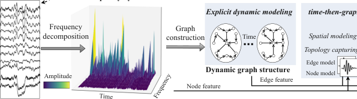
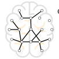
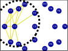

## **EvoBrain: Dynamic Multi-channel EEG Graph** **Modeling for Time-evolving Brain Network**

**Rikuto Kotoge** **[1]** **Zheng Chen** **[1]** _[∗]_ **Tasuku Kimura** **[1]** **Yasuko Matsubara** **[1]**

**Takufumi Yanagisawa** **[2,3]** **Haruhiko Kishima** **[2]** **Yasushi Sakurai** **[1]**

1 SANKEN, The Univerity of Osaka, Japan
2 Department of Neurosurgery, Graduate School of Medicine, The University of Osaka, Japan
3 Institute for Advanced Co-Creation Studies, The University of Osaka, Japan

```
          {rikuto88, chenz}@sanken.osaka-u.ac.jp

```

**Abstract**

Dynamic GNNs, which integrate temporal and spatial features in Electroencephalography (EEG) data, have shown great potential in automating seizure
detection. However, fully capturing the underlying dynamics necessary to represent brain states, such as seizure and non-seizure, remains a non-trivial task and
presents two fundamental challenges. First, most existing dynamic GNN methods
are built on temporally fixed static graphs, which fail to reflect the evolving nature
of brain connectivity during seizure progression. Second, current efforts to jointly
model temporal signals and graph structures and, more importantly, their interactions remain nascent, often resulting in inconsistent performance. To address
these challenges, we present the first theoretical analysis of these two problems,
demonstrating the effectiveness and necessity of explicit dynamic modeling and
time-then-graph dynamic GNN method. Building on these insights, we propose
`EvoBrain`, a novel seizure detection model that integrates a two-stream Mamba
architecture with a GCN enhanced by Laplacian Positional Encoding, following
neurological insights. Moreover, `EvoBrain` incorporates explicitly dynamic graph
structures, allowing both nodes and edges to evolve over time. Our contributions
include (a) a theoretical analysis proving the expressivity advantage of explicit
dynamic modeling and _time-then-graph_ over other approaches, (b) a novel and
efficient model that significantly improves AUROC by 23% and F1 score by 30%,
compared with the dynamic GNN baseline, and (c) broad evaluations of our method
on the challenging early seizure prediction tasks.

**1** **Introduction**

Epileptic seizures are typically considered a network disorder (Burns et al ., 2014a). The abnormal
connections across brain regions often serve as markers of seizure events (Li et al ., 2021b). As such,
recent studies have leveraged graph neural networks (GNNs) to model these networks for automating
seizure detection (Cai et al ., 2023; Ho and Armanfard, 2023). Considering the unfolding time-course
of brain dynamics, a recent trend models EEGs as a sequence of time-varying graphs. Temporal
models, such as recurrent neural networks (RNNs), integrated with GNNs, known as dynamic GNNs,
have recently proposed to learn spatiotemporal features in EEGs (Tang et al ., 2023). By modeling
graphs at fine-grained time steps and their sequential representations, these methods can capture how
graphs or brain states evolve over time, further enhancing seizure detection accuracy.

_∗_ indicates corresponding author.

39th Conference on Neural Information Processing Systems (NeurIPS 2025).







Figure 1: The brain network evolves over time, and changes occurring during seizures and immediately before them in the pre-seizure phase, especially within specific zones, are clinically
important. These changes are captured using dynamic graphs derived from multi-channel EEG
signals. `EvoBrain` incorporates a explicit dynamic graph modeling and time-then-graph architecture.

However, effectively representing brain dynamics by integrating graph and temporal models remains
non-trivial. In this paper, we study this critical problem in accurate seizure detection and prediction
by learning dynamic representations from EEGs. In essence, we mainly face two challenges:
( 1 ) _Representing EEG dynamics_ (Problem 1). We observe that although many existing methods are
labeled as “dynamic,” they often employ static graph structures (Ho and Armanfard, 2023; Tang et al .,
2022). Typically, these methods construct a predefined graph based on EEG channel correlations
from the initial snapshot, which is then fixed and shared across all subsequent EEG snapshots. This
implicitly assumes that the spatial structure of brain activity remains constant over time. In contrast,
seizures induce evolving patterns of neuronal synchrony and desynchrony across different brain
regions (Burns et al., 2014a; Rolls et al., 2021; Li et al., 2021b), as shown in Figure 1.
( 2 ) _Effective Spatio-temporal Modeling (Problem 2)._ Dynamic GNNs can generally be categorized
into _time-then-graph_, _graph-then-time_, and _time-and-graph_ architectures, following the taxonomy
of Gao and Ribeiro (2022) (A concise illustration is provided in Appendix Figure 6). The
_time-then-graph_ first model the temporal dynamics and then employ GNNs to learn spatial
representations. The _graph-then-time_ first applies GNNs to each EEG snapshot independently, and
then learns temporal dynamics from the resulting graph features. The _time-and-graph_ is a recurrent
GNN to capture temporal interactions between EEG snapshots before performing graph learning at
each time step. However, the independent GNNs in _graph-then-time_ represent information at single
time steps without accounting for dynamic interactions between time steps. While recurrent GNNs in
_time-and-graph_ capture graph interactions, they also rely heavily on the independent initial GNNs.
Overall, an effective dynamic GNNs for integrating temporal and graph-based representations to
model brain dynamics remains poorly understood.

**Novelty and Contributions** : We first analyze a theoretical foundation for designing dynamic graph
structures and models that effectively represent brain dynamics. Building upon this foundation, we
propose `EvoBrain`, which effectively learns **Evo** lving, dynamic characteristics in **Brain** networks
for accurate seizure detection and prediction. Overall, we summarize our contributions as:

- **Theoretical Analysis.** To tackle the first challenge, we propose and analyze dynamic graph
structure that explicitly incorporate temporal EEG graph modeling (Theorem 1). To tackle the
second challenge, we first theoretically analyze different dynamic GNNs approaches from EEG
graph perspective (Theorem 2). We discuss the necessarily of dynamic GNNs at node-level, since
the node similarity measures are key factors in determining EEG graph construction.

2

- **Novel Model Design.** We hence propose a novel _time-then-graph_ model, `EvoBrain`, which
integrates a two-stream Mamba architecture (Gu and Dao, 2024) with a GCN enhanced by Laplacian
Positional Encoding (Wang et al ., 2022), following neurological insights. `EvoBrain` achieves up to
23% and 30% improvements in AUROC and F1 scores, respectively, compared with the dynamic
GNN baseline. Also, `EvoBrain` is 17 _×_ faster than the SOTA _time-and-graph_ dynamic GNN.

- **Broad Evaluation.** Unlike most seizure detection studies (Eldele et al ., 2021; Cai et al ., 2023; Ho
and Armanfard, 2023), we evaluate the more challenging task of seizure prediction, which aims to
identify the preictal state before seizures. This is critical for early intervention in clinical settings,
and `EvoBrain` maintains performance, with a 13.8% improvement in AUROC.

**2** **Problem Setting**

**2.1** **Notations**

We define an EEG _**x**_ with _N_ channels and _T_ snapshots as a graph _G_ = ( _A, X_ ), where _A_ = ( _V, E_ )
and _A ∈_ R _[N]_ _[×][N]_ _[×][T]_ are the adjacency matrices. _V_ and _E_ represent the channels (i.e., nodes) and
edges. Notably, most existing work constructs a weighted adjacency matrix **A** _∈_ R _[N]_ _[×][N]_ as fixed
across _T_ meaning that all EEG snapshots share the same graph structure and only the node features
_H_ are computed iteratively at each snapshot. In this paper, each edge _e_ _i,j,t_ _∈E_ represents pairwise
connectivity between channels _v_ _i_ and _v_ _j_, where _i, j ∈_ _N_ . The feature vector _x_ _i,t_ _∈_ R _[d]_ captures
the electrical activity of _i_ -th channel during the EEG snapshot at time step _t_ . If _e_ _i,j,t_ exists, _**a**_ _i,j,t_
is a non-zero value. _**a**_ _i,j,t_ _∈_ R quantifies the connectivity strength between two channels for each
snapshot. To represent temporal EEG graphs, we define the embedding of node _v_ _i_ at time step _t_ as
_h_ _[node]_ _i,t_ _∈_ R _[k]_, which captures both the spatial connectivity information from the edges and the temporal
dynamics from previous node embeddings. The embedding of edge _e_ _i,j,t_, denoted as _h_ _[edge]_ _i,j,t_ _[∈]_ [R] _[l]_ [,]
captures the temporal evolution of channel connectivity, reflecting changes in brain networks.

**2.2** **Problem - Dynamic GNN Expressivity in EEG Modeling**

Brain networks in different states could manifest as distinct graph structures, as shown in Figure
1. We treat _expressivity analysis_ as a graph isomorphism problem (Xu et al ., 2019), where nonisomorphic EEG graphs represent different brain states, enabling the model to effectively distinguish
between seizure and non-seizure graphs. We formulate the challenge of representing EEG dynamics
as the distinction between implicit and explicit dynamic graph modeling in Problem 1. We further
define the challenge of effective spatio-temporal modeling as the investigation of the expressivity of
_graph-then-time_, _time-and-graph_, and _time-then-graph_ (Gao and Ribeiro, 2022) in dynamic EEG
graph analysis in Problem 2.

**Definition 1** (Implicit Dynamic Graph Modeling - Static Structure) **.** _This approach fixes a single_
_adjacency matrix_ **A** _∈_ R _[N]_ _[×][N]_ _across all time steps, although each node’s feature vector_ _**x**_ : _,t_ _evolves_
_across_ _t_ _. Formally,_ **A** : _,_ : _,t_ = **A** [�] _,_ _for each_ _t ∈{_ 1 _, . . ., T_ _},_ _where_ **A** [�] _is constant for all_ _t_ _. Hence, the_
_spatial connectivity among EEG channels remains unchanged, and only node features capture the_
_dynamic aspects._

**Definition 2** (Explicit Dynamic Graph Modeling - Dynamic Structure) **.** _In contrast to the implicit_
_setting, here both node features_ _**x**_ : _,t_ _and the adjacency matrices_ _{_ **A** : _,_ : _,t_ _}_ _[T]_ _t_ =1 _[can vary with time.]_
_Specifically,_ **A** : _,_ : _,t_ _∈_ R _[N]_ _[×][N]_ _at each snapshot_ _t_ _may be computed by a function_ _f_ _:_ **A** : _,_ : _,t_ =
_f_ � _**x**_ : _,t_ � _,_ _∀t ∈{_ 1 _, . . ., T_ _},_ _thereby capturing the dynamic evolution of channel connectivity in_
_addition to time-varying nodes._

**Problem 1** (Implicit vs. Explicit Dynamic Graph Modeling) **.** _We consider two approaches for_
_capturing spatial relationships. In the implicit (static) approach, a single adjacency matrix_ **A**
_remains fixed across all time steps, so only the node features evolve. In the explicit (dynamic)_
_approach, both node features and adjacency matrices_ _{_ **A** : _,_ : _,t_ _}_ _[T]_ _t_ =1 _[can change with]_ _[ t]_ _[, allowing for]_
_time-varying connectivities derived from the EEG data. Our goal is to compare the expressiveness of_
_these two approaches in capturing spatiotemporal dependencies for dynamic EEG graph analysis._

**Definition 3** (Graph-then-time) **.** _This architecture first apply GNNs to learn spatial, graph information_
_at each_ _t_ _independently, followed by the temporal processing (e.g., by RNNs) of the resulting node_
_embeddings. The formal definition is given as:_

3

_**h**_ _[node]_ _i,t_ = _Cell_ _GNN_ _[L]_ _in_ � **X** : _,t_ _,_ **A** : _,_ : _,t_ � [�]
��

_i,t−_ 1
_i_ _[,]_ _**[ h]**_ _[node]_

_._ **Z** = _**H**_ _[node]_ : _,T_ _[,]_ _∀i ∈V,_ (1)
�

_where_ _**h**_ _[node]_ _i,t_ (1 _≤_ _t ≤_ _T_ ) _denotes the embedding of node_ _i ∈V_ _,_ _GNN_ _[L]_ _in_ [(] **[X]** [:] _[,t]_ _[,]_ _**[ a]**_ [:] _[,]_ [:] _[,t]_ [)] _[ denotes graph]_
_learning on the current snapshot through_ _L_ _layer GNNs. The learned embeddings,_ _**h**_ _[node]_ _i,t−_ 1 _[, are]_
_then passed into the RNN cell to capture the temporal dependencies. The last step output_ _**h**_ : _,T_ _is_
_considered the final representation_ **Z** _._

**Definition 4** (Time-and-graph) **.** _This architecture alternately processes time and graph components,_
_applying GNNs to each EEG snapshot, as formally defined by:_

_**h**_ _[node]_ _i,t_ = _Cell_ _GNN_ _[L]_ _in_ � _**X**_ : _,t_ _,_ **A** : _,_ : _,t_ � [�]
��

_i_ _[,]_ � _GNN_ _[L]_ _rc_ � _**H**_ : _,t−_ 1 _,_ **A** : _,_ : _,t_ � [�] _i_

_,_ **Z** = _**H**_ _[node]_ : _,T_ _[,]_ _∀i ∈V,_ (2)
�

_where we initialize_ _H_ _i,_ 0 = 0 _._ _GNN_ _[L]_ _in_ _[encodes each]_ _**[ x]**_ [:] _[,t]_ _[while]_ _[ GNN]_ _[L]_ _rc_ _[encodes representations from]_
_historical snapshots_ _**H**_ : _,t−_ 1 _, and RNN cell embeds evolution of those graph representations._

**Definition 5** (Time-then-graph) **.** _This architecture first models the evolution of node and edge_
_attributes over time and then applies a GNN to the resulting static graph for final representation:_

**h** _[node]_ **i** = _RNN_ _[node]_ [�] _**X**_ _i,≤T_ � _,_ _∀i ∈V,_ **h** _[edge]_ **i** _,_ **j** = _RNN_ _[edge]_ [�] _**a**_ _i,j,≤T_ � _,_ _∀_ ( _i, j_ ) _∈E,_

(3)
**Z** = _GNN_ _[L]_ [�] **H** _[node]_ _,_ **H** _[edge]_ [�] _._

_time-then-graph represents the evolution of_ _**h**_ _[node]_ _and_ _**h**_ _[edge]_ _using two sequential models_ _RNN_ _[node]_

_and RNN_ _[edge]_ _, resulting in a new (static) graph, which is then encoded by a GNN_ _[L]_ _._

**Problem 2** (Expressive Dynamic EEG Graph Architecture) **.** _Determine which of these three architec-_
_tures exhibits the highest expressiveness for dynamic EEG graph modeling, and characterize their_
_relative representational power._

**3** **Theoretical Analysis for Dynamic EEG Graphs**

In this section, we aim to provide a theoretical analysis of the two problems. To this end, we employ
1-Weisfeiler-Lehman (1-WL) GNNs, a standard tool for analyzing graph isomorphism, as detailed
in Appendix B. In the context of dynamic EEG analysis, an expressive model should be able to
distinguish between different brain states by identifying non-isomorphic graphs.
**Remark.** For Theorem 2, we follow the general GNN taxonomy proposed by Gao and Ribeiro (2022),
but extend the analysis to EEGs, specifically focusing on node-level expressivity in dynamic EEG
graphs. Their analysis partially targets edge- or structure-level representations using unattributed
graphs, but it does not explicitly consider node features. In contrast, node features are essential in
EEG analysis, as EEG graph construction typically relies on pairwise similarity between channels
(Ho and Armanfard, 2023; Tang et al ., 2022). To this end, we provide formal theorems and proofs
that consistently incorporate node features throughout the expressivity analysis. We also discuss the
necessity of jointly modeling both node and edge representations from the perspective of EEG graphs
in Appendix C.1.

**Theorem 1.** _[Implicit_ ⪵ _Explicit Dynamic Graph Modeling.] Explicit dynamic modeling (dynamic ad-_
_jacency matrices) is strictly more expressive than implicit dynamic modeling (static graph structures)_
_in capturing spatiotemporal dependencies in EEG signals._

_Proof._ Let _F_ implicit and _F_ explicit denote the function classes expressible by implicit and explicit
dynamic models, respectively. Since an explicit model can replicate any implicit model by ignoring
time variations in adjacency, it follows that _F_ implicit _⊆F_ explicit . To show strict separation, we
construct two temporal EEG graphs that share identical node features but differ in adjacency at a
single time step. An implicit model compresses adjacency into a static representation, potentially
making these graphs indistinguishable, while an explicit model processes time-varying adjacency
and can distinguish them. Thus, _F_ implicit _̸_ = _F_ explicit, proving _F_ implicit _⊂F_ explicit . The full proof is
provided in Appendix C.2.

4

**Lemma 1.** _[graph-then-time_ ⪵ _time-and-graph ] time-and-graph is strictly more expressive than_
_graph-then-time representation family on T_ _n,T,Heta_ _as long as we use 1-WL GNNs._

_Proof._ By Definition 3, _**h**_ _i,t−_ 1 is passed without this additional GNN (i.e., GNN _[L]_ rc [(] _[·]_ [)] [) to learn]
interactions between EEG snapshots. This results in a simpler form of temporal representation
compared to _time-and-graph_ : _**h**_ _i,t−_ 1 _⊆_ �GNN _[L]_ rc � **H** : _,t−_ 1 _,_ **A** : _,_ : _,t_ �� _i_ _[.]_ _[ graph-then-time]_ [ is a strict subset]

of _time-and-graph_ in terms of expressiveness.

**Lemma 2.** _[time-and-graph_ ⪵ _time-then-graph ] time-then-graph is strictly more expressive than_
_time-and-graph representation family on_ T _n,T,θ_ _, as time-then-graph outputs different representations,_
_while time-and-graph does not._

In Appendix C.3, we prove Lemma 2 using both node and edge representation perspectives (based on
Lemma 4 in Appendix C.1) to hold Theorem 2. Notably, we provide a synthetic EEG task where any
_time-and-graph_ representation fails, while a _time-then-graph_ approach succeeds. _time-then-graph_
learns node and edge features across time steps to capture temporal dependencies. This is done by
encoding the temporal adjacency matrices **A** : _,_ : _,≤t_ and node features **X** : _,≤t_ together, enabling the
model to distinguish between graphs with distinct temporal structures. However, _time-and-graph_
handles each time step independently, leading to identical representations across time.

**Theorem 2.** _[Temporal EEG Graph Expressivity] Based on Lemmas 1 and 2, we conclude that_
_graph-then-time is strictly less expressive than time-and-graph, and time-and-graph is strictly less_
_expressive than time-then-graph on_ T _n,T,θ_ _, when the graph representation is a 1-WL GNN:_

_graph-then-time_ ⪵ T _n,T,θ_ _time-and-graph_ ⪵ T _n,T,θ_ _time-then-graph._ (4)

We confirm this conclusion in our experiments of both seizure detection and early prediction tasks.

**4** **Proposed Method - EvoBrain**

Based on the above analysis, this section presents our `EvoBrain`, which is built on top of explicit
dynamic modeling and _time-then-graph_ architecture to represent temporal EEG structures.

**4.1** **Explicit Dynamic Brain Graph Structure**

Based on Theorem 1, we propose to construct EEG graphs for each snapshot instead of constructing
a single static graph from the entire EEG recording. We first segment an EEG epoch into short
time durations (i.e., snapshots) at regular intervals and compute channel correlations to construct a
sequence of graph structures. Specifically, for the _t_ -th snapshot, we define the edge weight _a_ _i,j,t_ as
the weighted adjacency matrix _A_, computed as the absolute value of the normalized cross-correlation
between nodes _v_ _i_ and _v_ _j_ . To prevent information redundancy and create sparse graphs, we rank the
correlations among neighboring nodes and retain only the edges with the top- _τ_ highest correlations.

_a_ _i,j,t_ = _|x_ _i,t_ _∗_ _x_ _j,t_ _|,_ if _v_ _j_ _∈N_ ( _v_ _i_ ) _,_ else 0 _,_

where _x_ _i,_ : _,t_ and _x_ _j,_ : _,t_ represent _v_ _i_ and _v_ _j_ channels of _t_ -th EEG snapshot. _∗_ denotes the normalized
cross-correlation operation. _N_ ( _v_ _i_ ) denotes the set of top- _τ_ neighbors of _v_ _i_ with higher correlations.
After computing this for _T_ snapshots, we obtain a sequence of directed, weighted EEG graph **G** to
represent brain networks at different time points. In other words, the dynamic nature of the EEG is
captured by the evolving structure of these graphs over time.

**4.2** **Dynamic GNN in Time-Then-Graph Model**

Based on Theorem 2, we propose a novel _time-then-graph_ model, where two-stream Mamba Gu
and Dao (2024) learn the temporal evolution of node and edge attributes independently, followed
by Graph Convolutional Networks (GCN) to capture spatial dependencies across electrodes in a
static graph. This method effectively captures the temporal and spatial dynamics inherent in EEG
data for seizure detection and prediction. Notably, the model input is not the raw EEG signals but
their **frequency** representation. Here, clinical seizure analysis aims to identify specific frequency
oscillations and waveforms, such as spikes (Khan et al ., 2018). To effectively capture such features,

5

we apply a short-term Fourier transform (STFT) to the EEG signal, retaining the log amplitudes of
the non-negative frequency components, following prior studies (Covert et al ., 2019; Asif et al ., 2020;
Tang et al ., 2022). The EEG frequency snapshots are then normalized using z-normalization across
the training set. Consequently, an EEG frequency representation with a sequence of snapshots is
formulated as _X ∈_ R _[N]_ _[×][T][ ×][d]_, serving _N_ node initialization and dynamic graph construction.

**4.2.1** **Temporal Modeling with Mamba**

We introduce a two-stream Mamba framework, with separate processes for node and edge attributes
to capture their temporal dynamics. Given a dynamic EEG graph _G_, Mamba can be interpreted as a
linear RNN with selective state updates, making it suitable for modeling brain dynamics that involve
both short-term and long-term memory processes. In the brain, short-term memory maintains transient
information over brief intervals, while long-term memory spans extended timescales, enabling the
integration of past experiences into current processing.

For a traditional RNN processing sequence _{_ **x** _t_ _}_ _[T]_ _t_ =1 [, the hidden state update is:] **[ h]** _[t]_ [=] _[ σ]_ [(] **[Wh]** _[t][−]_ [1] [+]
**Ux** _t_ ) _,_ where the weight matrices **W** and **U** representing synaptic connectivity between neurons are
fixed across time _t_ . However, the synaptic weights are constantly changing, controlled in part by
chemicals such as neuromodulators (Citri and Malenka, 2008). This limits the model’s ability to
evolve information over long sequences (Costacurta et al ., 2024). In contrast, Mamba can be viewed
as a linear RNN with input-dependent parameters for each element **x** **[e]** (node feature **x** **i** _,_ **t** or weighted
adjacency matrix **a** **i** _,_ **j** _,_ **t** ):

∆ _[e]_ _t_ [=] _[ τ]_ [∆] [(] _[f]_ ∆ _[ e]_ [(] **[x]** _[e]_ _t_ [))] _[,]_ **B** _[e]_ _t_ [=] _[ f]_ _B_ _[ e]_ [(] **[x]** _[e]_ _t_ [)] _[,]_ **C** _[e]_ _t_ [=] _[ f]_ _C_ _[ e]_ [(] **[x]** _t_ _[e]_ [)] _[,]_
**h** _[e]_ _t_ [= (1] _[ −]_ [∆] _[e]_ _t_ _[·]_ **[ D]** [)] **h** _t−_ 1 + ∆ _[e]_ _t_ _[·]_ **[ B]** _[e]_ _t_ **x** _[e]_ _t_ _[,]_ **y** _t_ _[e]_ [=] **[ C]**
~~�~~ ~~��~~ ~~�~~ ~~�~~ � ~~��~~
selective forgetting selective update

**h** _t−_ 1 + ∆ _[e]_ _t_ _[·]_ **[ B]** _[e]_ _t_
~~�~~ � ~~��~~
selective update

**x** _[e]_ _t_ _[,]_ **y** _t_ _[e]_ [=] **[ C]** _[e]_ _t_ **[h]** _t_ _[e]_ _[,]_ (5)

where _f_ _∗_ are learnable projections for important frequency bands or edge connectivity. The hidden
state **h** _[e]_ _t_ [encodes the evolving neural activity, serving as a substrate for both transient (working)]
memory and more persistent (long-term) memory traces. The softplus activation _τ_ ∆ guarantees that
the gating variable ∆ _[e]_ _t_ [remains positive, thereby modulating the trade-off between retaining previous]
neural states and incorporating new inputs. Specifically, the forgetting term (1 _−_ ∆ _[e]_ _t_ _[·]_ **[ D]** [)] [ implements]
a selective mechanism analogous to **synaptic decay or inhibitory processes** that diminish outdated
or irrelevant information. Conversely, the update term ∆ _[e]_ _t_ _[·]_ **[ B]** _[e]_ _t_ [mirrors] **[ neuromodulatory gating]**
(e,g, via dopamine signaling) that selectively reinforces and integrates salient new information. The
projection **C** _[e]_ _t_ [translates the internal neural state into observable outputs. The final hidden states]
**h** [node] _i_ = **y** _i,T_ [node] [and] **[ h]** [edge] _ij_ = **y** _ij,T_ [edge] [capture the temporal evolution of nodes and edges.]

**4.2.2** **Spatial Modeling with GCN and LapPE**

We adapt Graph Convolutional Network (GCN) and Laplacian Positional Encoding (LapPE) (Wang
et al., 2022) for efficiently modeling spatial dependencies in EEG signals.

**Capturing Brain Network Topology.** Recent studies of neuroscience reveal that particular functions
are closely associated with specific brain regions (e.g., Neocortex or Broca’s area) (Hawkins and
Ahmad, 2016; Rubinov and Sporns, 2010). However, due to the fundamental computation of GNNs,
nodes that are structurally equivalent under graph automorphism receive identical representations,
effectively losing their individual identities (Wang et al ., 2022). In order to reflect the spatial
specificity of the brain within spatial modeling, we introduce Laplacian Positional Encoding (LapPE).
Given edge feature **H** _[edge]_ the normalized Laplacian **L** is defined as: **L** = **I** _−_ ( **D** _[−]_ [1] _[/]_ [2] **A** _[′]_ **D** _[−]_ [1] _[/]_ [2] ) =
**UΛU** _[⊤]_ _,_ **A** _[′]_ = _τ_ edge ( _f_ _edge_ ( **H** _[edge]_ )) _,_ where _τ_ edge is the softplus function, _f_ _edge_ is the learnable
projection, **A** _[′]_ is a weighted adjacency matrix **A** _[′]_, and **D** is a degree matrix, diagonal with **D** =
_{_ [�] _j_ **[a]** _[′][i,j]_ _[}]_ _i_ _[N]_ =1 [.] **[ I]** _[ ∈]_ [R] _[N]_ _[×][N]_ [ is the identity matrix, and] **[ D]** _[−]_ [1] _[/]_ [2] [ is the element-wise inverse square root]

of the degree matrix **D** . Performing an eigendecomposition on **L** yields. The columns of **U** _∈_ R _[N]_ _[×][N]_
are the eigenvectors of **L**, and **Λ** is a diagonal matrix containing the corresponding eigenvalues.

To capture the global geometry of the network, we select the first _K_ eigenvectors corresponding to
the smallest eigenvalues. For node _i_, its Laplacian-based positional encoding **p** _i_ _∈_ R _[K]_ is given by
**p** _i_ = [ **u** 1 [ _i_ ] _,_ **u** 2 [ _i_ ] _, . . .,_ **u** _K_ [ _i_ ]] _[⊤]_ _,_ **x** _[node]_ _i_ = [ **h** [node] _i_ ; **p** _i_ ] _,_ where **u** _k_ [ _i_ ] denotes the _i_ -th component of
the _k_ -th eigenvector and [; ] indicates vector concatenation.

6

**Modeling EEG Spatial Dynamics.** We then adapt a GCN to learn spatial dependencies. These graph
embeddings capture the temporal evolution of EEG snapshots, with each snapshot reflecting the brain
state at that particular time. Each layer of the GCN updates the node embeddings by aggregating
information from neighboring nodes and edges. The node embeddings are updated as follows:

**h** [(] _i_ _[l]_ [+1)] = _σ_ �( **D** _[−]_ [1] _[/]_ [2] **A** _[′]_ **D** _[−]_ [1] _[/]_ [2] ) **h** [(] _j_ _[l]_ [)] **[Θ]** [(] _[l]_ [)] [�] _,_ where **h** [(] _i_ _[l]_ [)] is the embedding of node _i_ at layer _l_ and

**h** [(0)] _i_ = **x** _[node]_ _i_ _._ **Θ** [(] _[l]_ [)] is the learnable weight matrix at layer _l_, and _σ_ is an activation function (e.g.,
ReLU). Afterward, we apply max pooling over the node embeddings, i.e., **Z** = **h** [(] _i_ _[L]_ [)], followed by a
fully connected layer and softmax activation for seizure detection and prediction tasks.

**5** **Experiments and Results**

**5.1** **Experimental setup**

**Tasks.** In this study, we focus on two tasks: seizure detection and seizure early prediction.

- **Seizure detection** is framed as a binary classification problem, where the goal is to distinguish
between seizure and non-seizure EEG segments, termed epochs. This task serves as the foundation
for automated seizure monitoring systems.

- **Seizure early prediction** is the more challenging and clinically urgent task. It aims to predict the
onset of an epileptic seizure before it occurs. Researchers typically frame this task as a classification
problem (Burrello et al ., 2020; Batista et al ., 2024), where the goal is to distinguish between preictal EEG epochs and the normal state. Accurate classification enables timely patient warnings or
preemptive interventions, such as electrical stimulation, to prevent or mitigate seizures. Details can
be found in Appendix F.

**Datasets.** We used the Temple University Hospital EEG Seizure dataset v1.5.2 ( **TUSZ** ) (Shah et al .,
2018) to evaluate `EvoBrain` . Data description can be found in Appendix G. TUSZ is the largest
public EEG seizure database, containing 5,612 EEG recordings with 3,050 annotated seizures. Each
recording consists of 19 EEG channels. Additionally, we used the smaller CHB-MIT dataset, which
consists of 844 hours of 22-channel scalp EEG data from 22 patients, including 163 recorded seizure
episodes. For the TUSZ dataset, we followed the official data split, in which a subset of patients
is designated for testing. Similarly, for the CHB-MIT dataset, we used randomly selected 15% of
the patient’s data for testing. Hyperparameters and augmentation strategies were set following prior
studies and can be found in Appendix D. _Preprocessing:_ For the early prediction task, we defined the
_one-minute period_ before a seizure as the preictal phase, implying the ability to predict seizures up to
one minute in advance.

**Baselines.** We selected four dynamic GNNs studies as baselines: EvolveGCN-O (Pareja et al ., 2020),
which follows the _graph-then-time_ architecture, and a _time-and-graph_ work, DCRNN (Tang et al .,
2022). _time-then-graph_ approach, GRAPHS4MER (Tang et al ., 2023) and GRU-GCN Gao and
Ribeiro (2022) are _time-then-graph_ architecture. We included a benchmark Transformer baseline,
BIOT (Yang et al ., 2023a) and LaBraM (Jiang et al ., 2024), which was fine-tuned from the publicly
available base model checkpoint. We also evaluated LSTM (Hochreiter and Schmidhuber, 1997) and
CNN-LSTM (Ahmedt-Aristizabal et al., 2020), as referenced in (Tang et al., 2022).

**Metrics.** We used the Area Under the Receiver Operating Characteristic Curve (AUROC) and F1
score as evaluation metrics. AUROC considers various threshold scenarios, providing an overall
measure of the model’s ability to distinguish between classes. The F1 score focuses on selecting the
best threshold by balancing precision and recall. All results are averaged over five runs with different
random seeds. Experimental details are provided in Appendix E.

**5.2** **Results**

**Main results.** Table 1 presents a performance comparison of seizure detection and prediction
for the TUSZ dataset using various models over 12-second and 60-second windows. `EvoBrain`
consistently outperforms dynamic GNN baselines and achieves competitive performance to the
large-scale Transformer model, LaBraM, while using **30 times fewer parameters** . For the seizure
detection in a 12-second window data, `EvoBrain` shows a 14% increase in AUROC and 12% increase

7

Table 1: Performance comparison of TUSZ dataset on seizure detection and prediction for 12s and

|60s. The best and second best results are highlighted.|Col2|Col3|
|---|---|---|
|Detection<br>Prediction<br>12s<br>60s<br>12s<br>60s<br>Method<br>AUROC<br>F1<br>AUROC<br>F1<br>AUROC<br>F1<br>AUROC<br>F1|Detection<br>Prediction<br>12s<br>60s<br>12s<br>60s<br>Method<br>AUROC<br>F1<br>AUROC<br>F1<br>AUROC<br>F1<br>AUROC<br>F1|Detection<br>Prediction<br>12s<br>60s<br>12s<br>60s<br>Method<br>AUROC<br>F1<br>AUROC<br>F1<br>AUROC<br>F1<br>AUROC<br>F1|
|LSTM<br>CNN-LSTM<br>BIOT<br>LaBraM<br>EvolveGCN<br>DCRNN<br>GRAPHS4MER<br>GRU-GCN<br>`EvoBrain`** (Ours)**|0.794 ±0.006<br>0.381 ±0.019<br>0.720±0.014<br>0.392±0.012<br>0.754 ±0.009<br>0.356 ±0.008<br>0.680±0.007<br>0.331±0.016<br>0.726 ±0.016<br>0.320 ±0.018<br>0.651±0.024<br>0.280 ±0.013<br>0.825 ±0.003<br>0.472 ±0.013<br>0.793±0.002<br>0.469 ±0.010<br>0.757 ±0.004<br>0.343 ±0.012<br>0.670±0.017<br>0.340±0.015<br>0.817 ±0.008<br>0.415 ±0.039<br>0.808±0.014<br>0.435±0.019<br>0.833 ±0.005<br>0.413 ±0.017<br>0.778±0.021<br>0.439±0.012<br>0.856 ±0.009<br>0.505 ±0.009<br>0.822±0.013<br>0.438 ±0.014<br>**0.877 ±0.005**<br>**0.539 ±0.009**<br>**0.865±0.009**<br>**0.483±0.006**|0.572±0.024<br>0.353±0.011<br>0.559±0.026<br>0.393±0.025<br>0.621±0.018<br>0.389±0.010<br>0.528±0.020<br>0.316±0.028<br>0.576 ±0.019<br>0.425 ±0.016<br>0.574±0.006<br>0.388±0.008<br>0.661 ±0.003<br>**0.482 ±0.010**<br>**0.669±0.014**<br>**0.413±0.020**<br>0.622±0.006<br>0.437±0.010<br>0.531±0.020<br>0.344±0.019<br>0.634±0.021<br>0.401±0.024<br>0.601±0.031<br>0.397±0.29<br>0.632±0.021<br>0.438±0.022<br>0.638±0.025<br>0.355±0.031<br>0.659±0.020<br>0.453±0.012<br>0.601±0.028<br>0.392±0.017<br>**0.675±0.015**<br>0.470±0.003<br>0.651±0.023<br>0.401±0.023|

in F1 score compared with LaBraM. For the 60-second window data, `EvoBrain` shows a 23%
increase in AUROC and 30% ( 0 _._ 670 _→_ 0 _._ 865 ) increase in F1 score ( 0 _._ 340 _→_ 0 _._ 483 ) compared with
EvolveGCN. All _time-then-graph_ models (Evobrain, GRAPHS4MER, and GRU-GCN) demonstrate
relatively high performance, supporting our theoretical analysis and conclusion of Theorem 2 in
Section 3. Ablation study can be found in Appendix H.

Figure 2 shows the ROC curves results comparing `EvoBrain` with other dynamic GNN models
on seizure detection task. In subfigure (a), for the
TUSZ dataset, `EvoBrain` achieves an AUC of 0.88,
outperforming DCRNN (0.81) and EvolveGCN
(0.76). Our ROC curve is positioned higher, indicating a stronger ability to differentiate between
seizure and non-seizure events. In subfigures (b) for
the CHB-MIT dataset, `EvoBrain` achieves an AUC
of 0.94, significantly higher than the 0.81 and 0.59
of _time-and-graph_ and _graph-then-time_ approaches,
respectively. The results show the effectiveness and
of _time-then-graph_ for identifying seizures.


**(a) TUSZ dataset** **(b) CHB-MIT dataset**

Figure 2: ROC curve results for the 12-second
seizure detection task on two datasets.


**Dynamic graph structure evaluation.** Figure 3 (Explicit dynamic modeling) (Implicit dynamic modeling)
shows the effectiveness of our proposed dynamic
graph structure (i.e,. explicit dynamic modeling)
compared to the static graph structure (i.e., implicit dynamic modeling) commonly used in existing work (Ho and Armanfard, 2023; Tang et al .,
2022). The purple bar shows the performance of
the static graph structure, while the orange bar represents the results when the static graph is replaced
with our dynamic graph structures. As seen, the im
|Dynamic graph structure<br>(Explicit dynamic modeling)|Col2|
|---|---|
|||


provements are **not limited** to our _time-then-graph_ **(a) TUSZ 12s** **(b) TUSZ 60s**
method but also enhance the performance of all dynamic GNNs approaches. The figure highlights the Figure 3: Comparison of the proposed dynamic
effectiveness and necessity of dynamic graphs in graph structure and the static structure.
capturing brain dynamics. The results imply that
modeling temporal dynamics in EEGs should incorporate various channel connectivity or structural
information, supporting our theoretical analysis and conclusion of Theorem 1 in Section 3.

**Computational efficiency.** To assess the computational efficiency of our method, we measured the
training time and inference time. Dynamic GNNs require computation time that scales with the
length of the input data (details are provided in Appendix D). Figure 4 (a) illustrates the average
training time per step for dynamic GNNs with a batch size of 1 across various input lengths. In
practice, while the RNN component operates very quickly, the GNN processing accounts for most of
the computation time. Since our method performs GNN processing only once for each data sample,
it is up to 17 _×_ faster training time and more than 14 _×_ faster inference time than DCRNN. Thus, our
approach is not only superior in performance but also fast in computational efficiency.

**(a) TUSZ 12s** **(b) TUSZ 60s**

Figure 3: Comparison of the proposed dynamic
graph structure and the static structure.

8

CHB-MIT dataset TUSZ dataset CHB-MIT dataset TUSZ dataset


**(a) Inference time** **(b) Training time**

Figure 4: (a) Inference and (b) training time vs. input data length on CHB-MIT and TUSZ datasets.
Our model achieves up to **17x faster** training times and **14x faster** inference times than its competitors,
demonstrating scalability.

Strong


**(a) Normal** **(b) Pre-seizure**

Weak





**(c) Focal-seizure** **(d) Generalized-seizure**


Figure 5: Learned graph structure visualizations. The yellow color of the edges indicates the strength
of the connections. In (a) Normal state, the dark shows weak connections. In (b) Pre-seizure state,
the connections in specific regions strengthen over time. In (c) Focal seizure, which occurs only in a
specific area of the brain, strong connections are consistently present in a particular region. In (d)
Generalized seizure, strong connections are observed across the entire brain.

**5.3** **Clinical Analysis.**

We show an analysis of our constructed dynamic graphs from a neuroscience perspective. Figure
5 shows the top-10 edges with the strongest connections in the learned dynamic graph, where the
yellow color represents the strength of the connections. These edges are selected based on the highest
values, indicating the most significant relationships captured by the model. In Figure 5 (a), a sample
unrelated to a seizure shows weak, sparse connections spread across various regions over an extended
period. Figure 5 (b) shows a pre-seizure sample, where some connections gradually strengthen.
Figure 5 (c) shows the result of a focal seizure, a type of seizure that originates in a specific area,
with sustained strong connections only in a specific region. In Figure 5 (d), a generalized seizure is
illustrated, characterized by strong connections across the entire brain.
Successful surgical and neuromodulatory treatments critically depend on accurate localization of the
seizure onset zone (SOZ) (Li et al ., 2021a). Even the most experienced clinicians are challenged
because there is no clinically validated biomarker of SOZ. Prior studies have shown that abnormal
connections across several channels may constitute a more effective marker of the SOZ (Scharfman,
2007; Burns et al ., 2014b; Li et al ., 2018). Our dynamic graph structures align with neuroscientific
observations, successfully visualizing these abnormal connections and their changes. This offers
promising potential for application in surgical planning and treatment strategies.

9

**6** **Conclusion**

In this work, we introduced a novel dynamic multi-channel EEG modeling approach, `EvoBrain`,
designed to address key limitations in existing seizure detection and prediction methods. Adopting a
_time-then-graph_ and explicit dynamic modeling, `EvoBrain` effectively captures the evolving nature
of brain networks during seizures, providing significant improvements in both AUROC and F1 scores,
supported by our theoretical analysis. Looking ahead, there are several promising directions for future
work. We aim to investigate explainability for both clinical applications and model transparency.

**References**

David Ahmedt-Aristizabal, Tharindu Fernando, Simon Denman, Lars Petersson, Matthew J. Aburn,
and Clinton Fookes. 2020. Neural Memory Networks for Seizure Type Classification. In _2020_
_42nd Annual International Conference of the IEEE Engineering in Medicine & Biology Society_
_(EMBC)_ . 569–575.

Shiva Asadzadeh, Tohid Yousefi Rezaii, Soosan Beheshti, and Saeed Meshgini. 2022. Accurate
emotion recognition using Bayesian model based EEG sources as dynamic graph convolutional
neural network nodes. _Scientific Reports_ 12, 1 (2022), 10282.

Umar Asif, Subhrajit Roy, Jianbin Tang, and Stefan Harrer. 2020. SeizureNet: Multi-Spectral Deep
Feature Learning for Seizure Type Classification. In _Machine Learning in Clinical Neuroimaging_
_and Radiogenomics in Neuro-oncology_ . 77–87.

Joana Batista, Mauro Pinto, Mariana Tavares, Fábio Lopes, Ana Oliveira, and César Teixeira. 2024.
EEG epilepsy seizure prediction: the post-processing stage as a chronology. _Scientific Reports_
(2024).

Karla Burelo, Georgia Ramantani, Giacomo Indiveri, and Johannes Sarnthein. 2022. A neuromorphic
spiking neural network detects epileptic high frequency oscillations in the scalp EEG. _Scientific_
_Reports_ (2022), 1798.

Samuel P. Burns, Sabato Santaniello, Robert B. Yaffe, Christophe C. Jouny, Nathan E. Crone,
Gregory K. Bergey, William S. Anderson, and Sridevi V. Sarma. 2014a. Network dynamics of the
brain and influence of the epileptic seizure onset zone. _Proceedings of the National Academy of_
_Sciences_ (2014), E5321–E5330.

Samuel P. Burns, Sabato Santaniello, Robert B. Yaffe, Christophe C. Jouny, Nathan E. Crone,
Gregory K. Bergey, William S. Anderson, and Sridevi V. Sarma. 2014b. Network dynamics of the
brain and influence of the epileptic seizure onset zone. _Proceedings of the National Academy of_
_Sciences_ 49 (2014), E5321–E5330.

Alessio Burrello, Kaspar Schindler, Luca Benini, and Abbas Rahimi. 2020. Hyperdimensional
Computing With Local Binary Patterns: One-Shot Learning of Seizure Onset and Identification of
Ictogenic Brain Regions Using Short-Time iEEG Recordings. _IEEE Transactions on Biomedical_
_Engineering_ (2020), 601–613.

Donghong Cai, Junru Chen, Yang Yang, Teng Liu, and Yafeng Li. 2023. MBrain: A Multi-Channel
Self-Supervised Learning Framework for Brain Signals. In _Proceedings of the 29th ACM SIGKDD_
_Conference on Knowledge Discovery and Data Mining_ . 130–141.

Junru Chen, Yang Yang, Tao Yu, Yingying Fan, Xiaolong Mo, and Carl Yang. 2022. BrainNet:
Epileptic Wave Detection from SEEG with Hierarchical Graph Diffusion Learning. In _Proceedings_
_of the 28th ACM SIGKDD Conference on Knowledge Discovery and Data Mining (KDD ’22)_ .
2741–2751.

Zheng Chen, Lingwei Zhu, Haohui Jia, and Takashi Matsubara. 2023. A Two-View EEG Representation for Brain Cognition by Composite Temporal-Spatial Contrastive Learning. In _SDM_ .
334–342.

Ami Citri and Robert C Malenka. 2008. Synaptic plasticity: multiple forms, functions, and mechanisms. _Neuropsychopharmacology_ (2008), 18–41.

10

Mark J Cook, Terence J O’Brien, Samuel F Berkovic, Michael Murphy, Andrew Morokoff, Gavin
Fabinyi, Wendyl D’Souza, Raju Yerra, John Archer, Lucas Litewka, et al . 2013. Prediction of
seizure likelihood with a long-term, implanted seizure advisory system in patients with drugresistant epilepsy: a first-in-man study. _The Lancet Neurology_ 12, 6 (2013), 563–571.

Filippo Costa, Eline Schaft, Geertjan Huiskamp, Erik Aarnoutse, Maryse Klooster, Niklaus Krayenbühl, Georgia Ramantani, Maeike Zijlmans, Giacomo Indiveri, and Johannes Sarnthein. 2024.
Robust compression and detection of epileptiform patterns in ECoG using a real-time spiking
neural network hardware framework. _Nature Communications_ (2024).

Julia Costacurta, Shaunak Bhandarkar, David Zoltowski, and Scott Linderman. 2024. Structured
flexibility in recurrent neural networks via neuromodulation. In _Advances in Neural Information_
_Processing Systems_ . 1954–1972.

Ian C. Covert, Balu Krishnan, Imad Najm, Jiening Zhan, Matthew Shore, John Hixson, and Ming Jack
Po. 2019. Temporal Graph Convolutional Networks for Automatic Seizure Detection. In _Proceed-_
_ings of the 4th Machine Learning for Healthcare Conference_ . 160–180.

Andac Demir, Toshiaki Koike-Akino, Ye Wang, and Deniz Erdo˘gmu¸s. 2022. EEG-GAT: Graph
Attention Networks for Classification of Electroencephalogram (EEG) Signals. In _2022 44th_
_Annual International Conference of the IEEE Engineering in Medicine & Biology Society (EMBC)_ .
30–35.

Andac Demir, Toshiaki Koike-Akino, Ye Wang, Masaki Haruna, and Deniz Erdogmus. 2021. EEGGNN: Graph neural networks for classification of electroencephalogram (EEG) signals. In _2021_
_43rd Annual International Conference of the IEEE Engineering in Medicine & Biology Society_
_(EMBC)_ . 1061–1067.

Emadeldeen Eldele, Mohamed Ragab, Zhenghua Chen, Min Wu, Chee Keong Kwoh, Xiaoli Li, and
Cuntai Guan. 2021. Time-Series Representation Learning via Temporal and Contextual Contrasting.
In _Proceedings of the Thirtieth International Joint Conference on Artificial Intelligence, IJCAI-21_ .
2352–2359.

Kosuke Fukumori, Noboru Yoshida, Hidenori Sugano, Madoka Nakajima, and Toshihisa Tanaka.
2022a. Epileptic Spike Detection by Recurrent Neural Networks with Self-Attention Mechanism.
In _ICASSP 2022 - 2022 IEEE International Conference on Acoustics, Speech and Signal Processing_
_(ICASSP)_ . 1406–1410.

Kosuke Fukumori, Noboru Yoshida, Hidenori Sugano, Madoka Nakajima, and Toshihisa Tanaka.
2022b. Epileptic Spike Detection Using Neural Networks With Linear-Phase Convolutions. _IEEE_
_Journal of Biomedical and Health Informatics_ (2022), 1045–1056.

Jianfei Gao and Bruno Ribeiro. 2022. On the Equivalence Between Temporal and Static Equivariant
Graph Representations. In _Proceedings of the 39th International Conference on Machine Learning_ .
7052–7076.

Albert Gu and Tri Dao. 2024. Mamba: Linear-Time Sequence Modeling with Selective State Spaces.
_arXiv preprint arXiv:2312.00752_ (2024). arXiv:2312.00752

Jeff Hawkins and Subutai Ahmad. 2016. Why neurons have thousands of synapses, a theory of
sequence memory in neocortex. _Frontiers in neural circuits_ (2016), 174222.

Thi Kieu Khanh Ho and Narges Armanfard. 2023. Self-Supervised Learning for Anomalous Channel
Detection in EEG Graphs: Application to Seizure Analysis. In _Proceedings of the AAAI Conference_
_on Artificial Intelligence_ . 7866–7874.

Sepp Hochreiter and Jürgen Schmidhuber. 1997. Long short-term memory. _Neural computation_ 8
(1997), 1735–1780.

Yimin Hou, Shuyue Jia, Xiangmin Lun, Shu Zhang, Tao Chen, Fang Wang, and Jinglei Lv. 2022.
Deep feature mining via the attention-based bidirectional long short term memory graph convolutional neural network for human motor imagery recognition. _Frontiers in Bioengineering and_
_Biotechnology_ 9 (2022), 706229.

11

Weibang Jiang, Liming Zhao, and Bao liang Lu. 2024. Large Brain Model for Learning Generic
Representations with Tremendous EEG Data in BCI. In _The Twelfth International Conference on_
_Learning Representations_ .

Haidar Khan, Lara Marcuse, Madeline Fields, Kalina Swann, and Bülent Yener. 2018. Focal Onset
Seizure Prediction Using Convolutional Networks. _IEEE Transactions on Biomedical Engineering_
(2018), 2109–2118.

Diederik Kingma and Jimmy Ba. 2014. Adam: A Method for Stochastic Optimization. _International_
_Conference on Learning Representations_ (2014).

Dominik Klepl, Fei He, Min Wu, Daniel J. Blackburn, and Ptolemaios Sarrigiannis. 2022. EEGBased Graph Neural Network Classification of Alzheimer’s Disease: An Empirical Evaluation
of Functional Connectivity Methods. _IEEE Transactions on Neural Systems and Rehabilitation_
_Engineering_ (2022), 2651–2660.

Adam Li, Bhaskar Chennuri, Sandya Subramanian, Robert Yaffe, Steve Gliske, William Stacey,
Robert Norton, Austin Jordan, Kareem A Zaghloul, Sara K Inati, et al . 2018. Using network
analysis to localize the epileptogenic zone from invasive EEG recordings in intractable focal
epilepsy. _Network Neuroscience_ (2018), 218–240.

Adam Li, Chester Huynh, Zachary Fitzgerald, Iahn Cajigas, Damian Brusko, Jonathan Jagid, Angel
Claudio, Andres Kanner, Jennifer Hopp, Stephanie Chen, Jennifer Haagensen, Emily Johnson,
William Anderson, Nathan Crone, Sara Inati, Kareem Zaghloul, Juan Bulacio, Jorge GonzalezMartinez, and Sridevi Sarma. 2021b. Neural fragility as an EEG marker of the seizure onset zone.
_Nature Neuroscience_ (2021), 1–10.

Adam Li, Chester Huynh, Zachary Fitzgerald, Iahn Cajigas, Damian Brusko, Jonathan Jagid, Angel O
Claudio, Andres M Kanner, Jennifer Hopp, Stephanie Chen, et al . 2021a. Neural fragility as an
EEG marker of the seizure onset zone. _Nature neuroscience_ (2021), 1465–1474.

Yang Li, Yu Liu, Yu-Zhu Guo, Xiao-Feng Liao, Bin Hu, and Tao Yu. 2022b. Spatio-TemporalSpectral Hierarchical Graph Convolutional Network With Semisupervised Active Learning for
Patient-Specific Seizure Prediction. _IEEE Transactions on Cybernetics_ (2022), 12189–12204.

Zhengdao Li, Kai Hwang, Keqin Li, Jie Wu, and Tongkai Ji. 2022a. Graph-generative neural network
for EEG-based epileptic seizure detection via discovery of dynamic brain functional connectivity.
_Scientific reports_ 12, 1 (2022), 18998.

Meng Liu, Yue Liu, KE LIANG, Wenxuan Tu, Siwei Wang, sihang zhou, and Xinwang Liu. 2024.
Deep Temporal Graph Clustering. In _The Twelfth International Conference on Learning Represen-_
_tations_ .

Fábio Lopes, Adriana Leal, Mauro F Pinto, António Dourado, Andreas Schulze-Bonhage, Matthias
Dümpelmann, and César Teixeira. 2023. Removing artefacts and periodically retraining improve
performance of neural network-based seizure prediction models. _Scientific Reports_ 13, 1 (2023),
5918.

Navid Mohammadi Foumani, Geoffrey Mackellar, Soheila Ghane, Saad Irtza, Nam Nguyen, and
Mahsa Salehi. 2024. EEG2Rep: Enhancing Self-supervised EEG Representation Through Informative Masked Inputs. In _Proceedings of the 30th ACM SIGKDD Conference on Knowledge_
_Discovery and Data Mining_ . 5544–5555.

Aldo Pareja, Giacomo Domeniconi, Jie Chen, Tengfei Ma, Toyotaro Suzumura, Hiroki Kanezashi,
Tim Kaler, Tao Schardl, and Charles Leiserson. 2020. EvolveGCN: Evolving Graph Convolutional
Networks for Dynamic Graphs. _Proceedings of the AAAI Conference on Artificial Intelligence_
(2020), 5363–5370.

Khansa Rasheed, Junaid Qadir, Terence J. O’Brien, Levin Kuhlmann, and Adeel Razi. 2021. A
Generative Model to Synthesize EEG Data for Epileptic Seizure Prediction. _IEEE TNSRE_ (2021),
2322–2332.

12

Scott Rich, Axel Hutt, Frances Skinner, Taufik Valiante, and Jérémie Lefebvre. 2020. Neurostimulation stabilizes spiking neural networks by disrupting seizure-like oscillatory transitions. _Scientific_
_reports_ (09 2020).

Edmund T. Rolls, Wei Cheng, and Jianfeng Feng. 2021. Brain dynamics: Synchronous peaks,
functional connectivity, and its temporal variability. _Human Brain Mapping_ (2021), 2790–2801.

Mikail Rubinov and Olaf Sporns. 2010. Complex network measures of brain connectivity: uses and
interpretations. _Neuroimage_ (2010), 1059–1069.

Khaled Saab, Jared Dunnmon, Christopher Ré, Daniel Rubin, and Christopher Lee-Messer. 2020.
Weak supervision as an efficient approach for automated seizure detection in electroencephalography. _npj Digital Medicine_ 3, 1 (2020), 1–12.

Helen E Scharfman. 2007. The neurobiology of epilepsy. _Current neurology and neuroscience_
_reports_ (2007), 348–354.

Vinit Shah, Eva Von Weltin, Silvia Lopez, James Riley McHugh, Lillian Veloso, Meysam Golmohammadi, Iyad Obeid, and Joseph Picone. 2018. The temple university hospital seizure detection
corpus. _Frontiers in neuroinformatics_ 12 (2018), 83.

Biao Sun, Han Zhang, Zexu Wu, Yunyan Zhang, and Ting Li. 2021. Adaptive Spatiotemporal Graph
Convolutional Networks for Motor Imagery Classification. _IEEE Signal Processing Letters_ (2021),
219–223.

Siyi Tang, Jared Dunnmon, Khaled Kamal Saab, Xuan Zhang, Qianying Huang, Florian Dubost,
Daniel Rubin, and Christopher Lee-Messer. 2022. Self-Supervised Graph Neural Networks for
Improved Electroencephalographic Seizure Analysis. In _International Conference on Learning_
_Representations_ .

Siyi Tang, Jared A Dunnmon, Qu Liangqiong, Khaled K Saab, Tina Baykaner, Christopher LeeMesser, and Daniel L Rubin. 2023. Modeling Multivariate Biosignals With Graph Neural Networks
and Structured State Space Models. In _Proceedings of the Conference on Health, Inference, and_
_Learning_ . 50–71.

Yuxing Tian, Yiyan Qi, and Fan Guo. 2024. FreeDyG: Frequency Enhanced Continuous-Time
Dynamic Graph Model for Link Prediction. In _The Twelfth International Conference on Learning_
_Representations_ .

Haorui Wang, Haoteng Yin, Muhan Zhang, and Pan Li. 2022. Equivariant and Stable Positional
Encoding for More Powerful Graph Neural Networks. In _International Conference on Learning_
_Representations_ .

Keyulu Xu, Weihua Hu, Jure Leskovec, and Stefanie Jegelka. 2019. How Powerful are Graph Neural
Networks?. In _International Conference on Learning Representations_ .

Chaoqi Yang, M Westover, and Jimeng Sun. 2023a. BIOT: Biosignal Transformer for Cross-data
Learning in the Wild. In _Advances in Neural Information Processing Systems_, A. Oh, T. Neumann,
A. Globerson, K. Saenko, M. Hardt, and S. Levine (Eds.). 78240–78260.

Chaoqi Yang, M Westover, and Jimeng Sun. 2023b. BIOT: Biosignal Transformer for Cross-data
Learning in the Wild. In _Advances in Neural Information Processing Systems_ . 78240–78260.

Ke Yi, Yansen Wang, Kan Ren, and Dongsheng Li. 2023. Learning Topology-Agnostic EEG
Representations with Geometry-Aware Modeling. In _Advances in Neural Information Processing_
_Systems_ . 53875–53891.

Daoze Zhang, Zhizhang Yuan, YANG YANG, Junru Chen, Jingjing Wang, and Yafeng Li. 2023.
Brant: Foundation Model for Intracranial Neural Signal. In _Advances in Neural Information_
_Processing Systems_ . 26304–26321.

Siwei Zhang, Xi Chen, Yun Xiong, Xixi Wu, Yao Zhang, Yongrui Fu, Yinglong Zhao, and Jiawei
Zhang. 2024a. Towards Adaptive Neighborhood for Advancing Temporal Interaction Graph
Modeling _(KDD ’24)_ . 4290–4301.

13

Zuozhen Zhang, Junzhong Ji, and Jinduo Liu. 2024b. MetaRLEC: Meta-Reinforcement Learning
for Discovery of Brain Effective Connectivity. _Proceedings of the AAAI Conference on Artificial_
_Intelligence_ (2024), 10261–10269.

Kaizhong Zheng, Shujian Yu, and Badong Chen. 2024. CI-GNN: A Granger causality-inspired graph
neural network for interpretable brain network-based psychiatric diagnosis. _Neural Networks_
(2024), 106147.

**Appendix**

**Theorem 1.**

_**Explicit dynamic modeling**_ _**Implicit dynamic modeling**_

**Theorem 2.**


|-graph model|Col2|
|---|---|
|||
|||

|time-and-graph|Col2|Col3|
|---|---|---|
|**_time-and-graph_**|||
|**_time-and-graph_**|||

**Dynamic graph structure**

**Static graph structure**

Graph model (GNN) Temporal model (RNN) Representation

**(a) Two graph structures** **(b) Three dynamic graph architectures**

Figure 6: We compare (a) explicit dynamic modeling with implicit dynamic modeling and (b)
time-then-graph with graph-then-time and graph-and-time architectures.

**A** **Related Work**

**Automated Seizure Analysis.** The automated detecting or prediction of seizures has been a longstanding challenge (Zhang et al ., 2024b; Zheng et al ., 2024). Deep learning has shown great
achievements in automating EEG feature extraction and detection, using convolutional neural networks (CNNs) (Fukumori et al ., 2022b; Ahmedt-Aristizabal et al ., 2020; Asif et al ., 2020; Saab et al .,
2020), RNN-based models (Fukumori et al., 2022a; Ahmedt-Aristizabal et al., 2020; Rasheed et al.,
2021), Transformers (Eldele et al ., 2021; Yang et al ., 2023b; Jiang et al ., 2024; Yi et al ., 2023), and
brain-inspired models (Rich et al., 2020; Burelo et al., 2022; Chen et al., 2023; Costa et al., 2024).

**Spatial Relationships in EEG Networks.** A seizure is fundamentally a network disease, and
detection typically relies on the ability to determine abnormalities in EEG channels (Burns et al .,
2014a; Li et al ., 2021b; Rolls et al ., 2021). Many multi-channel methods have been proposed for
capturing spatial information in channels (Jiang et al ., 2024; Yi et al ., 2023; Zhang et al ., 2023;
Mohammadi Foumani et al ., 2024). Among them, recent studies have proposed GNNs to capture
further the non-Euclidean structure of EEG electrodes and the connectivity in brain networks (Covert
et al ., 2019; Sun et al ., 2021; Li et al ., 2022b; Chen et al ., 2022; Klepl et al ., 2022; Demir et al .,
2022). These methods form EEGs as graphs, embedding each channel into the nodes and learning
spatial graph representations (Demir et al ., 2021; Ho and Armanfard, 2023). However, they do not
explicitly model temporal relationships, relying instead on convolutional filters or conventional linear
projections for node embeddings.

**Dynamic GNNs for EEG Modeling.** Dynamic GNN is effective in learning temporal graph dynamics,
achieving promising results in tasks such as dynamic link prediction (Tian et al ., 2024), node
classification (Zhang et al ., 2024a), and graph clustering (Liu et al ., 2024). Recently, some studies
have focused on dynamic GNNs desired to enhance temporal dynamic and graph representations
for EEG-based seizure modeling. Tang et al . (2022) proposes a _time-and-graph_ model, which uses
frequency features from FFT as node features and applies GNN and RNN processing simultaneously
for each sliding window. Cai et al . (2023) adopts a _graph-then-time_ model that combines GCN and
RNN for seizure detection. However, these studies construct static graphs with fixed structures across
temporal learning. Hou et al . (2022) propose _time-then-graph_ model, BiLSTM-GCNNet, which
uses RNNs to construct static graph from node feature. GRAPHS4MER (Tang et al ., 2023) is also
proposed as a _time-then-graph_ method. This work learns dynamic graphs using an internal graph
structure learning model. Similarly, both Asadzadeh et al . (2022) and Li et al . (2022a) internally learn
dynamic graph structures. However, its input for graph structure learning is still based on the static
Euclid distance or similarity of the entire data sample (e.g., 12 or 60 seconds) rather than individual

14

snapshots. Our work differs by defining dynamic graph structures that more effectively capture the
temporal evolution of brain connectivity in EEGs.

**B** **Graph Isomorphism and 1-WL Test**

**Graph isomorphism** refers to the problem of determining whether two graphs are structurally
identical, meaning there exists a one-to-one correspondence between their nodes and edges. This is a
crucial challenge in graph classification tasks, where the goal is to assign labels to entire graphs based
on their structures. A model that can effectively differentiate non-isomorphic graphs is said to have
high expressiveness, which is essential for accurate classification. In many cases, graph classification
models like GNNs rely on graph isomorphism tests to ensure that structurally distinct graphs receive
different embeddings, which improves the model’s ability to classify graphs correctly.

**1-Weisfeiler-Lehman (1-WL) test** is a widely used graph isomorphism test that forms the foundation
of many GNNs. In the 1-WL framework, each node’s representation is iteratively updated by
aggregating information from its neighboring nodes, followed by a hashing process to capture
the structural patterns of the graph. GNNs leveraging this concept, such as Graph Convolutional
Networks (GCNs) and Graph Attention Networks (GATs), essentially perform a similar neighborhood
aggregation, making them as expressive as the 1-WL test in distinguishing non-isomorphic graphs
(Xu et al ., 2019). Modern GNN architectures adhere to this paradigm, making the 1-WL a standard
baseline for GNN expressivity. In our work, we also use 1-WL-based GNNs, leveraging their proven
expressiveness for dynamic brain graph modeling.

**C** **Proofs of Expressivity Analysis**

**C.1** **Expressiveness with Node and Edge Representations**

**Lemma 3.** _[Necessity of Node Representations]_ _**Edges alone**_ _(Gao and Ribeiro, 2022)_ _**are insufficient**_
_to uniquely distinguish certain temporal EEG graphs. Specifically, there exist pairs of temporal_
_EEG graphs that have identical edge features across all time steps but different node features,_
_making them indistinguishable based solely on edge representations. Therefore,_ _**incorporating node**_
_**representations is necessary**_ _to achieve full expressiveness in EEG graph classification tasks._

_Proof._ Given _G_ [(1)] and _G_ [(2)], with the same sets of _V_ and _E_, for _∀_ _t_, the edge features satisfy:
_a_ [(1)] _i,j,t_ [=] _[ a]_ [(2)] _i,j,t_ _∀_ ( _v_ _i_ _, v_ _j_ ) _∈E, ∀t ∈{_ 1 _,_ 2 _, . . ., T_ _}._ However, suppose there exists at least one node

_v_ _k_ _∈V_ and one time step _t_ _[′]_ such that: _**x**_ [(1)] _k,t_ _[′]_ _[ ̸]_ [=] _**[ x]**_ [(2)] _k,t_ _[′]_ _[.]_ [ Since] _[ a]_ _i,j,t_ [(1)] [=] _[ a]_ [(2)] _i,j,t_ [, any GNN architecture that]
relies solely on edge features will produce identical embeddings for _G_ [(1)] and _G_ [(2)], _∀t_ .

**Lemma 4.** _[Expressiveness with Node and Edge Representations] When both node and edge rep-_
_resentations are incorporated, a GNN can uniquely distinguish any pair of temporal EEG graphs_
_that differ in either node features or edge features at any time step, provided the GNN is sufficiently_
_expressive (e.g., 1-WL GNN)._

_Proof._ Given _G_ [(1)] = ( _A_ [(1)] _, X_ [(1)] ) and _G_ [(2)] = ( _A_ [(2)] _, X_ [(2)] ), suppose they differ in at least one node
feature or edge feature at some time step _t_ . An expressive GNN can produce different embeddings
for these graphs by capturing the differences in node and/or edge features. Specifically:

1. If **X** [(1)] : _,t_ _[̸]_ [=] **[ X]** [(2)] : _,t_ [for some] _[ t]_ [, then the node embeddings] _[ h]_ [(1)] _i,t_ [and] _[ h]_ [(2)] _i,t_ [will differ for at least]
one node _v_ _i_ .

2. If **a** [(] **i** _,_ **[1]** **j** [)] _,_ **t** _[̸]_ [=] **[ a]** [(] **i** _,_ **[2]** **j** [)] _,_ **t** [for some edge] [ (] _[v]_ _[i]_ _[, v]_ _[j]_ [)] [ and some] _[ t]_ [, then the edge embeddings] _[ h]_ [(1)] _ij,t_ [and] _[ h]_ [(2)] _ij,t_
will differ for that edge.

Since the GNN aggregates information from both node and edge embeddings, any difference in either
will propagate through the network, resulting in distinct final representations **Z** [(1)] and **Z** [(2)] . Thus,
the GNN can uniquely distinguish between _G_ [(1)] and _G_ [(2)] .

15

**C.2** **Implicit and Explicit Dynamic Modeling**

**Theorem 1.** _[Implicit_ ⪵ _Explicit Dynamic Graph Modeling.] Explicit dynamic modeling (dynamic ad-_
_jacency matrices) is strictly more expressive than implicit dynamic modeling (static graph structures)_
_in capturing spatiotemporal dependencies in EEG signals._

_Proof._ Let _F_ implicit be the family of functions (e.g., representations or classifiers) expressible by
an _implicit_ dynamic graph model that compresses all adjacency snapshots _{_ **A** : _,_ : _,t_ _}_ _[T]_ _t_ =1 [into a single]
adjacency matrix **A** [�], and let _F_ explicit be the family of functions expressible by an _explicit_ dynamic
graph model that uses the full time-varying adjacency _{_ **A** : _,_ : _,t_ _}_ _[T]_ _t_ =1 [. We prove]

_F_ implicit _⊆F_ explicit and _F_ implicit _̸_ = _F_ explicit _,_

i.e.,
_F_ implicit _⊂_ ; _F_ explicit _._

**(1) Subset Relationship.** It can be interpreted as any implicit dynamic model aggregates the set
of adjacency matrices _{_ **A** : _,_ : _,t_ _}_ _[T]_ _t_ =1 [into a single, static] [ �] **[A]** [ by some function] _[ f]_ [(] _[·]_ [)] [ (e.g., averaging,]
summation, thresholding):

�
**A** = _f_ � _{_ **A** : _,_ : _,t_ _}_ _[T]_ _t_ =1 � _._

Such a model uses **A** [�] for all time steps, disregarding changes in edges across _t_ . In contrast, an explicit
dynamic model directly processes the full sequence _{_ **A** : _,_ : _,t_ _}_ _[T]_ _t_ =1 [. To see that] _[ F]_ [implicit] [is contained]
in _F_ explicit, observe that any function _f_ imp _∈F_ implicit can be mimicked by an explicit model that
simply _ignores_ the time-specific variability in adjacency and substitutes _f_ ( _{_ **A** : _,_ : _,t_ _}_ ) = **A** [�] as if it were
the adjacency for every _t_ . Hence,

_∀_ _f_ imp _∈F_ implicit _,_ _f_ imp _∈F_ explicit _,_

implying
_F_ implicit _⊆F_ explicit _._

**(2) Strict Separation by Counterexample.** To show that _F_ implicit _̸_ = _F_ explicit, we construct two
temporal EEG graphs, _G_ [(1)] = _{_ **X** : _,t_ _,_ **A** [(1)] : _,_ : _,t_ _[}]_ _t_ _[T]_ =1 [and] _[ G]_ [(2)] [ =] _[ {]_ **[X]** [:] _[,t]_ _[,]_ **[ A]** : [(2)] _,_ : _,t_ _[}]_ _t_ _[T]_ =1 [, such that]

1. Their node features match at every time step:

**X** [(1)] : _,t_ = **X** [(2)] : _,t_ _∀_ _t ∈{_ 1 _, . . ., T_ _}._

2. Their adjacency differs _only_ at one time step _t_ _[′]_ :

**A** [(1)] : _,_ : _,t_ _[′]_ _[ ̸]_ [=] **[ A]** : [(2)] _,_ : _,t_ _[′]_ _[,]_ and **A** [(1)] : _,_ : _,t_ [=] **[ A]** [(2)] : _,_ : _,t_ _∀_ _t ̸_ = _t_ _[′]_ _._

Under _implicit_ dynamic modeling, the function _f_ ( _{_ **A** : _,_ : _,t_ _}_ _[T]_ _t_ =1 [)] [ may yield the same compressed]
adjacency **A** [�] for both _G_ [(1)] and _G_ [(2)] . Hence, any implicit model would treat the two graphs _identically_,
failing to separate them because the single **A** [�] cannot preserve the difference at _t_ _[′]_ .

In contrast, the _explicit_ dynamic model processes _{_ **A** [(] : _,_ _[k]_ : _,t_ [)] _[}]_ _t_ _[T]_ =1 [without discarding the time-step-]

specific variations. Consequently, it _does_ see **A** [(1)] : _,_ : _,t_ _[′]_ _[ ̸]_ [=] **[ A]** : [(2)] _,_ : _,t_ _[′]_ [, and can therefore distinguish] _[ G]_ [(1)] [ from]
_G_ [(2)] . Thus, there exist inputs in the domain of temporal EEG graphs that are _indistinguishable_ by
any implicit dynamic model but _distinguishable_ by an explicit dynamic model. This proves

_F_ implicit _̸_ = _F_ explicit _,_

and in view of the subset argument, we conclude

_F_ implicit _⊂F_ explicit _,_

explicit dynamic modeling is strictly more expressive than implicit dynamic modeling.

16

**Time**


**1** **2**


**Dynamic EEG graph**


**Edge feature**

[1, 1]

[0, 1]

[1, 0]

Figure 7: **A synthetic EEG task where only** _**time-then-graph**_ **is expressive.** The top and bottom
2-time temporal graphs on the left side have snapshots of different structure at time _t_ 2 (denote by _C_ 8 _,_ 2
and _C_ 8 _,_ 1 ). The top and bottom temporal graphs on the left show different dynamic-graph structures.
The right side shows their aggregated versions, where edge attributes indicate whether they existed
(1) or not (0) over time, using different colors. The goal is to distinguish the structural differences
between the top and bottom graphs. _time-and-graph_ has the same node representation neighbors in
both snapshots, indistinguishable. _time-then-graph_ aggregates the dynamic graphs into different node
representations and succeeds in distinguishing them.

**C.3** _**time-and-graph**_ **and** _**time-then-graph**_

**Lemma 2.** _[time-and-graph_ ⪵ _time-then-graph ] time-then-graph is strictly more expressive than_
_time-and-graph representation family on_ T _n,T,θ_ _, as time-then-graph outputs different representations,_
_while time-and-graph does not._

Gao and Ribeiro (2022) prove that a _time-then-graph_ representation that outputs the same embeddings
as an arbitrary _time-and-graph_ representation. Thus, _time-then-graph_ is as expressive as _time-and-_
_graph_ . To prove Lemma 2 we also provide a EEG graph classification task where any _time-and-graph_
representation will fail while a _time-then-graph_ would work, which then, added to the previous result,
proves that _time-then-graph_ is strictly more expressive than _time-and-graph_ .

_Proof._ We now propose a synthetic EEG task, whose temporal graph is illustrated in Figure 7. The
goal is to differentiate the topologies between two 2-step temporal graphs. Each snapshot is a static
EEG graph with 8 attributed nodes, denoted as _C_ 8 _,_ 1 and _C_ 8 _,_ 2 .

Two temporal graphs differ in their second time step _t_ 2 . If the graphs have the same features, any
1-WL GNN will output the same representations for both _C_ 8 _,_ 1 and _C_ 8 _,_ 2 . We use **a** [(][top][)] to represent the
adjacency matrix of dynamics in the top left of Figure 7, and **a** [(][btm][)] for dynamics in the bottom left of
Figure 7. Note that **X** [(][top][)] = **X** [(][btm][)] since the temporal graph has the same features.

Hence, for a _time-and-graph_ representation:

GNN _[L]_ in � **X** [(] : _,_ [top] 1 [)] _[,]_ **[ A]** [(] : _,_ [top] : _,_ 1 [)] � = GNN _[L]_ in � **X** [(] : _,_ [top] 2 [)] _[,]_ **[ A]** [(] : _,_ [top] : _,_ 2 [)] �

= GNN _[L]_ in � **X** [(] : _,_ [btm] 1 [)] _,_ **A** [(] : _,_ [btm] : _,_ 1 [)] � = GNN _[L]_ in � **X** [(] : _,_ [btm] 2 [)] _,_ **A** [(] : _,_ [btm] : _,_ 2 [)] � _,_

GNN _[L]_ rc � **H** [(] : _,_ [top] 0 [)] _[,]_ **[ A]** [(] : _,_ [top] : _,_ 1 [)] � = GNN _[L]_ rc � **H** [(] : _,_ [btm] 0 [)] _,_ **A** [(] : _,_ [btm] : _,_ 1 [)] � _,_

GNN _[L]_ rc � **H** [(] : _,_ [top] 1 [)] _[,]_ **[ A]** [(] : _,_ [top] : _,_ 2 [)] � = GNN _[L]_ rc � **H** [(] : _,_ [btm] 1 [)] _,_ **A** [(] : _,_ [btm] : _,_ 2 [)] � _._

17

Then, when we apply Equation (2) at the first time step, for the top graph:

_[̸]_

_[̸]_

_̸_

_̸_

_̸_

_̸_

**h** [(] **i** _,_ [top] **1** [)] = Cell GNN _[L]_ in � **X** [(] : _,_ [top] 1 [)] _[,]_ **[ A]** [(] : _,_ [top] : _,_ 1 [)] � [�]
��

for the bottom graph:

_[̸]_

_[̸]_

_̸_

_̸_

_̸_

_̸_

_,_

**i** �

_[̸]_

_[̸]_

_̸_

_̸_

_̸_

_̸_

_i_ _[,]_ �GNN _[L]_ rc � **h** [(] : _,_ [top] **0** [)] _[,]_ **[ A]** [(] : _,_ [top] : _,_ **1** [)] � [�] **i**

_[̸]_

_[̸]_

_̸_

_̸_

_̸_

_̸_

**i**

_[̸]_

_[̸]_

_̸_

_̸_

_̸_

_̸_

**h** [(] **i** _,_ [btm] **1** [)] = Cell GNN _[L]_ in � **X** [(] : _,_ [btm] 1 [)] _,_ **A** [(] : _,_ [btm] : _,_ 1 [)] � [�]
��

_[̸]_

_[̸]_

_̸_

_̸_

_̸_

_̸_

_i_ _[,]_ �GNN _[L]_ rc � **h** [(] : _,_ [btm] **0** [)] _,_ **A** [(] : _,_ [btm] : _,_ **1** [)] � [�] **i**

_[̸]_

_[̸]_

_̸_

_̸_

_̸_

_̸_

_._
�

_[̸]_

_[̸]_

_̸_

_̸_

_̸_

_̸_

**i**

_[̸]_

_[̸]_

_̸_

_̸_

_̸_

_̸_

Since **X** [(][top][)] = **X** [(][btm][)], **A** [(] : _,_ [top] : _,_ 1 [)] [=] **[ A]** [(] : _,_ [btm] : _,_ 1 [)] [, and] **[ h]** [(] : _,_ [top] **0** [)] = **h** [(] : _,_ [btm] **0** [)],

we have: **h** [(] **i** _,_ [top] **1** [)] = **h** [(] **i** _,_ [btm] **1** [)] _._

For the second time step:

_[̸]_

_[̸]_

_̸_

_̸_

_̸_

_̸_

**h** [(] **i** _,_ [top] **2** [)] = Cell GNN _[L]_ in � **X** [(] : _,_ [top] 2 [)] _[,]_ **[ A]** [(] : _,_ [top] : _,_ 2 [)] � [�]
��

_[̸]_

_[̸]_

_̸_

_̸_

_̸_

_̸_

_i_ _[,]_ �GNN _[L]_ rc � **h** [(] : _,_ [top] **1** [)] _[,]_ **[ A]** [(] : _,_ [top] : _,_ **2** [)] � [�] **i**

_[̸]_

_[̸]_

_̸_

_̸_

_̸_

_̸_

_,_
�

_[̸]_

_[̸]_

_̸_

_̸_

_̸_

_̸_

**i**

_[̸]_

_[̸]_

_̸_

_̸_

_̸_

_̸_

**h** [(] **i** _,_ [btm] **2** [)] = Cell GNN _[L]_ in � **X** [(] : _,_ [btm] 2 [)] _,_ **A** [(] : _,_ [btm] : _,_ 2 [)] � [�]
��

_[̸]_

_[̸]_

_̸_

_̸_

_̸_

_̸_

_i_ _[,]_ �GNN _[L]_ rc � **h** [(] : _,_ [btm] **1** [)] _,_ **A** [(] : _,_ [btm] : _,_ **2** [)] � [�] **i**

_[̸]_

_[̸]_

_̸_

_̸_

_̸_

_̸_

_._
�

_[̸]_

_[̸]_

_̸_

_̸_

_̸_

_̸_

**i**

_[̸]_

_[̸]_

_̸_

_̸_

_̸_

_̸_

Despite **A** [(] : _,_ [top] : _,_ 2 [)] _[̸]_ [=] **[ A]** [(] : _,_ [btm] : _,_ 2 [)] [, the 1-WL GNN will output the same representations] **[ h]** [(] **i** _,_ [top] **2** [)] = **h** [(] **i** _,_ [btm] **2** [)] for
both _C_ 8 _,_ 1 and _C_ 8 _,_ 2 .

Therefore:

**Z** [(][top][)] = **h** [(] **i** _,_ [top] **2** [)] = **h** [(] **i** _,_ [btm] **2** [)] = **Z** [(][btm][)] _._

**Thus, time-and-graph will output the same final representation** **Z** [(] **[top]** [)] = **Z** [(] **[btm]** [)] **for two different**
**temporal graphs in Figure 7.**

For the time-then-graph representation, we apply Equation (3). First, for the node representations:

**h** [node(top)] **i** = RNN [node] [�] **X** [(] _i,_ [top] _≤_ 2 [)] � = RNN [node] [�] [ **x** [(] **i** _,_ [top] **1** [)] _[,]_ **[ x]** [(] **i** _,_ [top] **2** [)] []] � _,_

**h** [node(btm)] **i** = RNN [node] [�] **X** [(] _i,_ [btm] _≤_ 2 [)] � = RNN [node] [�] [ **x** [(] **i** _,_ [btm] **1** [)] _,_ **x** [(] **i** _,_ [btm] **2** [)] ]� _._

Since **X** [(][top][)] = **X** [(][btm][)], we have **h** [node(top)] **i** = **h** [node(btm)] **i** for all nodes _i_ .

Now, for the edge representations:

**h** [edge(top)] **i** _,_ **j** = RNN [edge] [�] **A** [(] _i,j,_ [top] _≤_ [)] 2 � = RNN [edge] [�] [ **a** [(] **i** _,_ [top] **j** _,_ **1** [)] _[,]_ **[ a]** [(] **i** _,_ [top] **j** _,_ **2** [)] []] � _,_

**h** [edge(btm)] **i** _,_ **j** = RNN [edge] [�] **A** [(] _i,j,_ [btm] _≤_ [)] 2 � = RNN [edge] [�] [ **a** [(] **i** _,_ [btm] **j** _,_ **1** [)] _[,]_ **[ a]** [(] **i** _,_ [btm] **j** _,_ **2** [)] []] � _._

Here, **a** [(] **i** _,_ [top] **j** _,≤_ [)] **2** _[̸]_ [=] **[ a]** [(] **i** _,_ [btm] **j** _,≤_ [)] **2** [for some] [ (] _[i, j]_ [)] [ pairs, because the graph structures differ at] _[ t]_ [2] [. Therefore,]

**h** [edge(top)] **i** _,_ **j** = _̸_ **h** [edge(btm)] **i** _,_ **j** for these pairs. Finally, we apply the GNN:

**Z** [(][top][)] = GNN _[L]_ [�] **H** [node(top)] _,_ **H** [edge(top)] [�] _,_

**Z** [(][btm][)] = GNN _[L]_ [�] **H** [node(btm)] _,_ **H** [edge(btm)] [�] _._

Since **h** [edge(top)] = _̸_ **h** [edge(btm)], and 1-WL GNNs can distinguish graphs with different edge attributes,
we have:

**Z** [(][top][)] = _̸_ **Z** [(][btm][)] _._ (6)
**Thus, time-then-graph outputs different final representations** **Z** [(] **[top]** [)] = _̸_ **Z** [(] **[btm]** [)] **for the two**
**temporal graphs in Figure 7, successfully distinguishing them.**

Finally, we conclude:

18

1. The _time-then-graph_ is at least as expressive as the _time-and-graph_ ;

2. The _time-then-graph_ can distinguish temporal graphs not distinguishable by _time-and-graph_ .

Thus, _time-then-graph_ is strictly more expressive than _time-and-graph_ . More precisely,

_time-and-graph_ ⪵ T _n,T,θ_ _time-then-graph,_

concluding our proof.

**D** **Computational Complexity**

In this section, we provide the computational complexities of the three architectures: _graph-then-time_,
_time-and-graph_, and _time-then-graph_ . We demonstrate that the _time-then-graph_ architecture has the
lowest computational complexity among them.

Let _T_ be the number of time steps, _V_ be the number of nodes, _E_ _t_ be the number of edges at time
_t_, [�] _t_ _[E]_ _[t]_ [ be the total number of edges across all time steps,] _[ E]_ [agg] [ be the number of edges in the]

aggregated graph (i.e., the union of all edges across time steps), and _d_ be the dimension of the node
and edge representations.

**D.1** _**graph-then-time**_ **Architecture**

In the _graph-then-time_ architecture, at each time step _t_, a GNN is applied to the snapshot graph
( **X** : _,t_ _,_ **a** : _,_ : _,_ **t** ) to capture spatial relationships. Subsequently, an RNN processes the node embeddings
over time to capture temporal dependencies.

The computational complexity per time step _t_ is dominated by:

_O_ � _V d_ [2] + _E_ _t_ _d_ � _,_

where _V d_ [2] accounts for node-wise transformations (e.g., linear layers), and _E_ _t_ _d_ accounts for message
passing over edges.

Over all time steps, the total complexity for the GNN computations is:

�

_O_

_TV d_ [2] +

�

_T_
�

� _E_ _t_ _d_

_t_ =1

_._

The RNN processes the node embeddings over time with complexity:

_O_ � _V Td_ [2] [�] _._

Therefore, the overall computational complexity of the _graph-then-time_ architecture is:

�

_O_

_V Td_ [2] +

�

_T_
�

� _E_ _t_ _d_

_t_ =1

_._ (7)

**D.2** _**time-and-graph**_ **Architecture**

In the _time-and-graph_ architecture, temporal dependencies are integrated into the GNN computations.
At each time step _t_, two GNNs are applied:

   - GNN _[L]_ in [processes the current snapshot inputs][ (] **[X]** [:] _[,t]_ _[,]_ **[ a]** [:] _[,]_ [:] _[,]_ **[t]** [)][.]

   - GNN _[L]_ rc [processes the representations from the previous time step][ (] **[h]** [:] _[,]_ **[t]** _[−]_ **[1]** _[,]_ **[ a]** [:] _[,]_ [:] _[,]_ **[t]** [)][.]

19

The computational complexity per time step _t_ is:

_O_ � _V d_ [2] + _E_ _t_ _d_ [2] [�] _,_

due to the node-wise transformations and edge-wise message passing with updated representations.

Over all time steps, the total complexity for the GNN computations is:

_T_
� _E_ _t_ _d_ [2]

_t_ =1 �

_O_

_TV d_ [2] +

�

_._

The RNN (or any recurrent unit) further processes the node embeddings with complexity:

_O_ � _V Td_ [2] [�] _._

Therefore, the overall computational complexity of the _time-and-graph_ architecture is:

_T_
� _E_ _t_ _d_ [2]

_t_ =1 �

_O_

**D.3** _**time-then-graph**_ **Architecture**

_V Td_ [2] +

�

_._ (8)

In the _time-then-graph_ architecture, temporal evolutions of node and edge attributes are modeled
first using sequence models (e.g., RNNs). A GNN is then applied to the resulting static graph with
aggregated temporal information.

The computational complexities are as follows:

**Node Sequence Modeling.** For each node _i ∈V_, an RNN processes its temporal features **X** _i,≤T_ :

_O_ � _V Td_ [2] [�] _._

**Edge Sequence Modeling.** For each edge ( _i, j_ ) _∈E_ agg, an RNN processes its temporal adjacency
features **a** **i** _,_ **j** _,≤_ **T** :
_O_ � _E_ agg _Td_ [2] [�] _._

**GNN over Aggregated Graph.** A GNN is applied once to the static graph with updated node and
edge representations:
_O_ � _V d_ [2] + _E_ agg _d_ [2] [�] _._

Therefore, the overall computational complexity of the _time-then-graph_ architecture is:

_O_ �( _V_ + _E_ agg ) _Td_ [2] [�] _._ (9)

**D.4** **Comparison of Complexities**

To compare the computational complexities, we consider the dominant terms in Equations (7), (8),
and (9).

    - **graph-then-time** :

_V Td_ [2] +

�

�

_O_

_T_
�

� _E_ _t_ _d_

_t_ =1

_._

- **time-and-graph** :

_V Td_ [2] +

�

�

_T_
� _E_ _t_ _d_ [2]

_t_ =1 �

_T_
� _E_ _t_ _d_ [2]

_t_ =1 �

_O_

_._

20

    - **time-then-graph** :

_O_ �( _V_ + _E_ agg ) _Td_ [2] [�] _._

By comparing these computational complexities, the **time-then-graph** method is superior under
the aggregated number of edges _E_ agg is smaller than the total sum of edges over all time steps, i.e.,
_E_ agg _≪_ [�] _[T]_ _t_ =1 _[E]_ _[t]_ [.]

**E** **Experimental details and implementation**

**Model training.** Training for all models was accomplished using the Adam optimizer (Kingma and
Ba, 2014) in PyTorch on NVIDIA A6000 GPU and Xeon Gold 6258R CPU.

**Data augmentation.** During the training process, we applied the following data augmentation
techniques, following prior studies (Tang et al ., 2022; Eldele et al ., 2021): randomly scaling the
amplitude of the raw EEG signals by a factor between 0.8 and 1.2.

**Implementation details.** We used binary cross-entropy as the loss function to train all models. The
models were trained for 100 epochs with an initial learning rate of 1e-4. To enhance efficiency
and sparsity, we set _τ_ = 3 and the top-3 neighbors’ edges were kept for each node. The dropout
probability was 0 (i.e., no dropout). `EvoBrain` has two Mamba consisting of two stacked layers
and a two-layer GCN with 64 hidden units, resulting in 114,794 trainable parameters. We set
Our anonymous GitHub repository ( `[https://anonymous.4open.science/r/EvoBrain-FBC5](https://anonymous.4open.science/r/EvoBrain-FBC5)` )
includes the source code of our `EvoBrain` and baselines.

**Implementation of baselines.** For baselines, DCRNN (Tang et al ., 2022), EvolveGCN (Pareja et al .,
2020), and LSTM (Hochreiter and Schmidhuber, 1997), we used the number of RNN and GNN
layers and hidden units in our `EvoBrain` . For BIOT, we use the same model architecture described
in Yang et al . (2023a), i.e., four Transformer layers with eight attention heads and 256-dimensional
embedding. For LaBraM, we used the official checkpoint provided by Jiang et al . (2024). For CNNLSTM, we use the same model architecture described in Ahmedt-Aristizabal et al . (2020), i.e., two
stacked convolutional layers (32 3 _×_ 3 kernels), one max-pooling layer ( 2 _×_ 2 ), one fully-connected
layer (output neuron = 512), two stacked LSTM layers (hidden size = 128), and one fully connected
layer. Table 2 shows a comparison of trainable parameters, with our `EvoBrain` achieving the best
performance using the few parameters.

Table 2: Comparison of trainable parameters.

|Col1|EvoBrain|GRU-GCN|DCRNN|EvolveGCN|LaBraM|BIOT|CNN-LSTM|LSTM|
|---|---|---|---|---|---|---|---|---|
|Trainable<br>Parameters|183,834|114,794|280,769|200,301|5,803,137|3,187,201|5,976,033|536,641|

**F** **Seizure prediction task**

The seizure prediction task is defined as a classification problem between inter-ictal (normal) and
pre-ictal states (Burrello et al ., 2020). However, there is no clear clinical definition regarding its
onset or duration of preictal state (Lopes et al ., 2023). So it is definedd as a fixed duration before the
seizure occurrence (Batista et al ., 2024). This duration is chosen to account for the time required for
stimulation by implanted devices (Cook et al ., 2013) and to allow for seizure preparation. In this study,
we define the pre-ictal state as one minute, providing adequate time for effective electrical stimulation
to mitigate seizures or minimal preparation. A five-minute buffer zone around the boundary between
normal and seizure data was excluded from the analysis. Data labeled as seizures were discarded, and
a five-minute buffer zone around the boundary data was excluded from the analysis. The remaining
data were used as the normal state.

**G** **Data description**

Tabel 3 shows the details of TUSZ dataset.

21

Table 3: Number of EEG data samples and patients in the train, validation, and test sets on TUSZ
dataset. Train, validation, and test sets consist of distinct patients.

|Task|EEG Input<br>Length<br>(Secs)|Train Set|Col4|Validation Set|Col6|Test Set|Col8|
|---|---|---|---|---|---|---|---|
|Task|EEG Input<br>Length<br>(Secs)|~~EEG samples~~<br>% (Pre-) Seizure|Patients|~~EEG samples~~<br>% (Pre-) Seizure|Patients|~~EEG samples~~<br>% (Pre-) Seizure|Patients|
|Seizure<br>Detection|60-s<br>12-s|38,613 (9.3%)<br>196,646 (6.9%)|530<br>531|5,503 (11.4%)<br>28,057 (8.7%)|61<br>61|8,848 (14.7%)<br>44,959 (10.9%)|45<br>45|
|Seizure<br>Prediction|60-s<br>12-s|7,550 (9.9%)<br>40,716 (12.8%)|530<br>531|999 (12.0%)<br>5,439 (16.0%)|61<br>61|1,277 (24.4%)<br>6,956 (27.6%)|45<br>45|


**(a) RNN Layer** **(b) Architecture evaluation** **(c) Node feature** **(d) Pooling**

Figure 8: (a) RNN layer evaluation. (b) Architecture evaluation using same layers. (c) Results
using raw EEG instead of frequency-domain features. (d) Results after modifying the node pooling
mechanism.

**H** **Ablation study.**

Figure 8 (a) shows results of replacing Mamba with GRU layers on the seizure detection task using
the 60-second TUSZ dataset. The results demonstrate that Mamba provides performance benefits,
especially for longer input sequences. Figure 8 (b) shows the results of different architectures applied
to the same normal GRU and GCN layers. Consistent with the conclusion of Theorem 1, the time-thengraph architecture achieved the best performance on the seizure detection task using the 12-second
TUSZ dataset. Figure 8 (c) shows the results when the FFT processing or LapPE was removed. Figure
8 (d) presents the results when changing the pooling methods for graph classification. While we use
max pooling by default, we also tested average pooling, summation pooling, and concatenation of all
node features. Max pooling yielded the best performance. This suggests that seizures may occur in
specific regions of the brain, allowing the model to effectively leverage the influence of particular
nodes.

22

