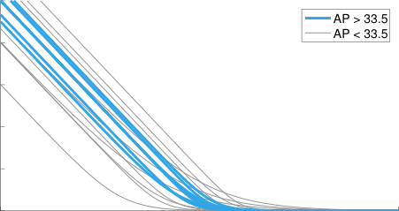

5

4

3

2

## **Focal Loss for Dense Object Detection**

Tsung-Yi Lin Priya Goyal Ross Girshick Kaiming He Piotr Doll´ar

Facebook AI Research (FAIR)

38

1

0

0 0.2 0.4 0.6 0.8 1

probability of ground truth class

Figure 1. We propose a novel loss we term the _Focal Loss_ that
adds a factor (1 _−_ _p_ t ) _[γ]_ to the standard cross entropy criterion.
Setting _γ >_ 0 reduces the relative loss for well-classified examples
( _p_ t _> ._ 5), putting more focus on hard, misclassified examples. As
our experiments will demonstrate, the proposed focal loss enables
training highly accurate dense object detectors in the presence of
vast numbers of easy background examples.

**Abstract**

_The highest accuracy object detectors to date are based_
_on a two-stage approach popularized by R-CNN, where a_
_classifier is applied to a_ sparse _set of candidate object lo-_
_cations. In contrast, one-stage detectors that are applied_
_over a regular,_ dense _sampling of possible object locations_
_have the potential to be faster and simpler, but have trailed_
_the accuracy of two-stage detectors thus far. In this paper,_
_we investigate why this is the case. We discover that the ex-_
_treme foreground-background class imbalance encountered_
_during training of dense detectors is the central cause. We_
_propose to address this class imbalance by reshaping the_
_standard cross entropy loss such that it down-weights the_
_loss assigned to well-classified examples. Our novel_ Focal
Loss _focuses training on a sparse set of hard examples and_
_prevents the vast number of easy negatives from overwhelm-_
_ing the detector during training. To evaluate the effective-_
_ness of our loss, we design and train a simple dense detector_
_we call RetinaNet. Our results show that when trained with_

_the focal loss, RetinaNet is able to match the speed of pre-_
_vious one-stage detectors while surpassing the accuracy of_
_all existing state-of-the-art two-stage detectors. Code is at:_

_[https://github.com/facebookresearch/Detectron](https://github.com/facebookresearch/Detectron)_ _._

36

34

32

30

28

50 100 150 200 250

inference time (ms)

Figure 2. Speed (ms) versus accuracy (AP) on COCO test-dev.
Enabled by the focal loss, our simple one-stage _RetinaNet_ detector outperforms all previous one-stage and two-stage detectors, including the best reported Faster R-CNN [28] system from [20].
We show variants of RetinaNet with ResNet-50-FPN (blue circles)
and ResNet-101-FPN (orange diamonds) at five scales (400-800
pixels). Ignoring the low-accuracy regime (AP _<_ 25), RetinaNet
forms an upper envelope of all current detectors, and an improved
variant (not shown) achieves 40.8 AP. Details are given in _§_ 5.

**1. Introduction**

Current state-of-the-art object detectors are based on
a two-stage, proposal-driven mechanism. As popularized
in the R-CNN framework [11], the first stage generates a
_sparse_ set of candidate object locations and the second stage
classifies each candidate location as one of the foreground
classes or as background using a convolutional neural network. Through a sequence of advances [10, 28, 20, 14], this
two-stage framework consistently achieves top accuracy on
the challenging COCO benchmark [21].
Despite the success of two-stage detectors, a natural
question to ask is: could a simple one-stage detector achieve
similar accuracy? One stage detectors are applied over a
regular, _dense_ sampling of object locations, scales, and aspect ratios. Recent work on one-stage detectors, such as
YOLO [26, 27] and SSD [22, 9], demonstrates promising
results, yielding faster detectors with accuracy within 1040% relative to state-of-the-art two-stage methods.
This paper pushes the envelop further: we present a onestage object detector that, for the first time, matches the
state-of-the-art COCO AP of more complex two-stage de

1

tectors, such as the Feature Pyramid Network (FPN) [20]
or Mask R-CNN [14] variants of Faster R-CNN [28]. To
achieve this result, we identify class imbalance during training as the main obstacle impeding one-stage detector from
achieving state-of-the-art accuracy and propose a new loss
function that eliminates this barrier.

Class imbalance is addressed in R-CNN-like detectors

by a two-stage cascade and sampling heuristics. The proposal stage ( _e.g_ ., Selective Search [35], EdgeBoxes [39],
DeepMask [24, 25], RPN [28]) rapidly narrows down the
number of candidate object locations to a small number
( _e.g_ ., 1-2k), filtering out most background samples. In the
second classification stage, sampling heuristics, such as a
fixed foreground-to-background ratio (1:3), or online hard
example mining (OHEM) [31], are performed to maintain a
manageable balance between foreground and background.

In contrast, a one-stage detector must process a much
larger set of candidate object locations regularly sampled
across an image. In practice this often amounts to enumerating _[∼]_ 100k locations that densely cover spatial positions,
scales, and aspect ratios. While similar sampling heuristics may also be applied, they are inefficient as the training
procedure is still dominated by easily classified background
examples. This inefficiency is a classic problem in object
detection that is typically addressed via techniques such as
bootstrapping [33, 29] or hard example mining [37, 8, 31].

In this paper, we propose a new loss function that acts
as a more effective alternative to previous approaches for
dealing with class imbalance. The loss function is a dynamically scaled cross entropy loss, where the scaling factor
decays to zero as confidence in the correct class increases,
see Figure 1. Intuitively, this scaling factor can automatically down-weight the contribution of easy examples during
training and rapidly focus the model on hard examples. Experiments show that our proposed _Focal Loss_ enables us to
train a high-accuracy, one-stage detector that significantly
outperforms the alternatives of training with the sampling
heuristics or hard example mining, the previous state-ofthe-art techniques for training one-stage detectors. Finally,
we note that the exact form of the focal loss is not crucial,

and we show other instantiations can achieve similar results.

To demonstrate the effectiveness of the proposed focal
loss, we design a simple one-stage object detector called
_RetinaNet_, named for its dense sampling of object locations
in an input image. Its design features an efficient in-network
feature pyramid and use of anchor boxes. It draws on a variety of recent ideas from [22, 6, 28, 20]. RetinaNet is efficient and accurate; our best model, based on a ResNet-101FPN backbone, achieves a COCO test-dev AP of 39.1
while running at 5 fps, surpassing the previously best published single-model results from both one and two-stage detectors, see Figure 2.

**2. Related Work**

**Classic Object Detectors:** The sliding-window paradigm,
in which a classifier is applied on a dense image grid, has
a long and rich history. One of the earliest successes is the
classic work of LeCun _et al_ . who applied convolutional neural networks to handwritten digit recognition [19, 36]. Viola and Jones [37] used boosted object detectors for face
detection, leading to widespread adoption of such models.
The introduction of HOG [4] and integral channel features

[5] gave rise to effective methods for pedestrian detection.
DPMs [8] helped extend dense detectors to more general
object categories and had top results on PASCAL [7] for
many years. While the sliding-window approach was the
leading detection paradigm in classic computer vision, with
the resurgence of deep learning [18], two-stage detectors,
described next, quickly came to dominate object detection.

**Two-stage Detectors:** The dominant paradigm in modern
object detection is based on a two-stage approach. As pioneered in the Selective Search work [35], the first stage generates a sparse set of candidate proposals that should contain all objects while filtering out the majority of negative
locations, and the second stage classifies the proposals into
foreground classes / background. R-CNN [11] upgraded the
second-stage classifier to a convolutional network yielding
large gains in accuracy and ushering in the modern era of
object detection. R-CNN was improved over the years, both
in terms of speed [15, 10] and by using learned object proposals [6, 24, 28]. Region Proposal Networks (RPN) integrated proposal generation with the second-stage classifier
into a single convolution network, forming the Faster RCNN framework [28]. Numerous extensions to this framework have been proposed, _e.g_ . [20, 31, 32, 16, 14].

**One-stage Detectors:** OverFeat [30] was one of the first
modern one-stage object detector based on deep networks.
More recently SSD [22, 9] and YOLO [26, 27] have renewed interest in one-stage methods. These detectors have
been tuned for speed but their accuracy trails that of twostage methods. SSD has a 10-20% lower AP, while YOLO
focuses on an even more extreme speed/accuracy trade-off.
See Figure 2. Recent work showed that two-stage detectors
can be made fast simply by reducing input image resolution
and the number of proposals, but one-stage methods trailed
in accuracy even with a larger compute budget [17]. In contrast, the aim of this work is to understand if one-stage detectors can match or surpass the accuracy of two-stage detectors while running at similar or faster speeds.
The design of our RetinaNet detector shares many similarities with previous dense detectors, in particular the concept of ‘anchors’ introduced by RPN [28] and use of features pyramids as in SSD [22] and FPN [20]. We emphasize that our simple detector achieves top results not based
on innovations in network design but due to our novel loss.

2

**Class Imbalance:** Both classic one-stage object detection
methods, like boosted detectors [37, 5] and DPMs [8], and
more recent methods, like SSD [22], face a large class
imbalance during training. These detectors evaluate 10 [4] 10 [5] candidate locations per image but only a few locations contain objects. This imbalance causes two problems:
(1) training is inefficient as most locations are easy negatives that contribute no useful learning signal; (2) en masse,
the easy negatives can overwhelm training and lead to degenerate models. A common solution is to perform some
form of hard negative mining [33, 37, 8, 31, 22] that samples hard examples during training or more complex sampling/reweighing schemes [2]. In contrast, we show that our
proposed focal loss naturally handles the class imbalance
faced by a one-stage detector and allows us to efficiently
train on all examples without sampling and without easy
negatives overwhelming the loss and computed gradients.

**Robust Estimation:** There has been much interest in de
signing robust loss functions ( _e.g_ ., Huber loss [13]) that reduce the contribution of _outliers_ by down-weighting the loss
of examples with large errors (hard examples). In contrast,
rather than addressing outliers, our focal loss is designed
to address class imbalance by down-weighting _inliers_ (easy
examples) such that their contribution to the total loss is
small even if their number is large. In other words, the focal
loss performs the _opposite_ role of a robust loss: it focuses
training on a sparse set of hard examples.

**3. Focal Loss**

The _Focal Loss_ is designed to address the one-stage object detection scenario in which there is an extreme imbalance between foreground and background classes during
training ( _e.g_ ., 1:1000). We introduce the focal loss starting
from the cross entropy (CE) loss for binary classification [1] :

CE( _p, y_ ) =

_−_ log( _p_ ) if _y_ = 1
(1)
� _−_ log(1 _−_ _p_ ) otherwise.

In the above _y ∈{±_ 1 _}_ specifies the ground-truth class and
_p ∈_ [0 _,_ 1] is the model’s estimated probability for the class
with label _y_ = 1. For notational convenience, we define _p_ t :

**3.1. Balanced Cross Entropy**

A common method for addressing class imbalance is to
introduce a weighting factor _α ∈_ [0 _,_ 1] for class 1 and 1 _−_ _α_
for class _−_ 1. In practice _α_ may be set by inverse class frequency or treated as a hyperparameter to set by cross validation. For notational convenience, we define _α_ t analogously
to how we defined _p_ t . We write the _α_ -balanced CE loss as:

CE( _p_ t ) = _−α_ t log( _p_ t ) _._ (3)

This loss is a simple extension to CE that we consider as an
experimental baseline for our proposed focal loss.

**3.2. Focal Loss Definition**

As our experiments will show, the large class imbalance
encountered during training of dense detectors overwhelms
the cross entropy loss. Easily classified negatives comprise
the majority of the loss and dominate the gradient. While
_α_ balances the importance of positive/negative examples, it
does not differentiate between easy/hard examples. Instead,
we propose to reshape the loss function to down-weight
easy examples and thus focus training on hard negatives.
More formally, we propose to add a modulating factor
(1 _−_ _p_ t ) _[γ]_ to the cross entropy loss, with tunable _focusing_
parameter _γ ≥_ 0. We define the focal loss as:

FL( _p_ t ) = _−_ (1 _−_ _p_ t ) _[γ]_ log( _p_ t ) _._ (4)

The focal loss is visualized for several values of _γ ∈_

[0 _,_ 5] in Figure 1. We note two properties of the focal loss.
(1) When an example is misclassified and _p_ t is small, the
modulating factor is near 1 and the loss is unaffected. As
_p_ t _→_ 1, the factor goes to 0 and the loss for well-classified
examples is down-weighted. (2) The focusing parameter _γ_
smoothly adjusts the rate at which easy examples are downweighted. When _γ_ = 0, FL is equivalent to CE, and as _γ_ is
increased the effect of the modulating factor is likewise increased (we found _γ_ = 2 to work best in our experiments).
Intuitively, the modulating factor reduces the loss contribution from easy examples and extends the range in which
an example receives low loss. For instance, with _γ_ = 2, an
example classified with _p_ t = 0 _._ 9 would have 100 _×_ lower
loss compared with CE and with _p_ t _≈_ 0 _._ 968 it would have
1000 _×_ lower loss. This in turn increases the importance
of correcting misclassified examples (whose loss is scaled
down by at most 4 _×_ for _p_ t _≤_ _._ 5 and _γ_ = 2).
In practice we use an _α_ -balanced variant of the focal loss:

FL( _p_ t ) = _−α_ t (1 _−_ _p_ t ) _[γ]_ log( _p_ t ) _._ (5)

We adopt this form in our experiments as it yields slightly
improved accuracy over the non- _α_ -balanced form. Finally,
we note that the implementation of the loss layer combines
the sigmoid operation for computing _p_ with the loss computation, resulting in greater numerical stability.

_p_ t =

_p_ if _y_ = 1
(2)
�1 _−_ _p_ otherwise,

and rewrite CE( _p, y_ ) = CE( _p_ t ) = _−_ log( _p_ t ).
The CE loss can be seen as the blue (top) curve in Figure 1. One notable property of this loss, which can be easily
seen in its plot, is that even examples that are easily classified ( _p_ t _≫_ _._ 5) incur a loss with non-trivial magnitude.
When summed over a large number of easy examples, these
small loss values can overwhelm the rare class.

1 Extending the focal loss to the multi-class case is straightforward and
works well; for simplicity we focus on the binary loss in this work.

3

While in our main experimental results we use the focal
loss definition above, its precise form is not crucial. In the
appendix we consider other instantiations of the focal loss
and demonstrate that these can be equally effective.

**3.3. Class Imbalance and Model Initialization**

Binary classification models are by default initialized to
have equal probability of outputting either _y_ = _−_ 1 or 1.
Under such an initialization, in the presence of class imbalance, the loss due to the frequent class can dominate total
loss and cause instability in early training. To counter this,
we introduce the concept of a ‘prior’ for the value of _p_ estimated by the model for the rare class (foreground) _at the_
_start of training_ . We denote the prior by _π_ and set it so that
the model’s estimated _p_ for examples of the rare class is low,
_e.g_ . 0 _._ 01. We note that this is a change in model initialization (see _§_ 4.1) and _not_ of the loss function. We found this
to improve training stability for both the cross entropy and
focal loss in the case of heavy class imbalance.

**3.4. Class Imbalance and Two-stage Detectors**

Two-stage detectors are often trained with the cross entropy loss without use of _α_ -balancing or our proposed loss.
Instead, they address class imbalance through two mechanisms: (1) a two-stage cascade and (2) biased minibatch
sampling. The first cascade stage is an object proposal
mechanism [35, 24, 28] that reduces the nearly infinite set
of possible object locations down to one or two thousand.
Importantly, the selected proposals are not random, but are
likely to correspond to true object locations, which removes
the vast majority of easy negatives. When training the second stage, biased sampling is typically used to construct
minibatches that contain, for instance, a 1:3 ratio of positive to negative examples. This ratio is like an implicit _α_ balancing factor that is implemented via sampling. Our proposed focal loss is designed to address these mechanisms in
a one-stage detection system directly via the loss function.

**4. RetinaNet Detector**

RetinaNet is a single, unified network composed of a
_backbone_ network and two task-specific _subnetworks_ . The
backbone is responsible for computing a convolutional feature map over an entire input image and is an off-the-self
convolutional network. The first subnet performs convolutional object classification on the backbone’s output; the
second subnet performs convolutional bounding box regression. The two subnetworks feature a simple design that we
propose specifically for one-stage, dense detection, see Figure 3. While there are many possible choices for the details
of these components, most design parameters are not particularly sensitive to exact values as shown in the experiments.
We describe each component of RetinaNet next.

**Feature Pyramid Network Backbone:** We adopt the Feature Pyramid Network (FPN) from [20] as the backbone
network for RetinaNet. In brief, FPN augments a standard convolutional network with a top-down pathway and
lateral connections so the network efficiently constructs a
rich, multi-scale feature pyramid from a single resolution
input image, see Figure 3(a)-(b). Each level of the pyramid
can be used for detecting objects at a different scale. FPN
improves multi-scale predictions from fully convolutional
networks (FCN) [23], as shown by its gains for RPN [28]
and DeepMask-style proposals [24], as well at two-stage
detectors such as Fast R-CNN [10] or Mask R-CNN [14].
Following [20], we build FPN on top of the ResNet architecture [16]. We construct a pyramid with levels _P_ 3
through _P_ 7, where _l_ indicates pyramid level ( _P_ _l_ has resolution 2 _[l]_ lower than the input). As in [20] all pyramid levels
have _C_ = 256 channels. Details of the pyramid generally
follow [20] with a few modest differences. [2] While many
design choices are not crucial, we emphasize the use of the
FPN backbone is; preliminary experiments using features
from only the final ResNet layer yielded low AP.

**Anchors:** We use translation-invariant anchor boxes simi
lar to those in the RPN variant in [20]. The anchors have
areas of 32 [2] to 512 [2] on pyramid levels _P_ 3 to _P_ 7, respectively. As in [20], at each pyramid level we use anchors at
three aspect ratios _{_ 1:2 _,_ 1:1, 2:1 _}_ . For denser scale coverage than in [20], at each level we add anchors of sizes _{_ 2 [0],
2 [1] _[/]_ [3], 2 [2] _[/]_ [3] _}_ of the original set of 3 aspect ratio anchors. This
improve AP in our setting. In total there are _A_ = 9 anchors
per level and across levels they cover the scale range 32 813 pixels with respect to the network’s input image.
Each anchor is assigned a length _K_ one-hot vector of
classification targets, where _K_ is the number of object
classes, and a 4-vector of box regression targets. We use
the assignment rule from RPN [28] but modified for multiclass detection and with adjusted thresholds. Specifically,
anchors are assigned to ground-truth object boxes using an
intersection-over-union (IoU) threshold of 0.5; and to background if their IoU is in [0, 0.4). As each anchor is assigned
to at most one object box, we set the corresponding entry
in its length _K_ label vector to 1 and all other entries to 0.
If an anchor is unassigned, which may happen with overlap
in [0.4, 0.5), it is ignored during training. Box regression
targets are computed as the offset between each anchor and
its assigned object box, or omitted if there is no assignment.

2 RetinaNet uses feature pyramid levels _P_ 3 to _P_ 7, where _P_ 3 to _P_ 5 are
computed from the output of the corresponding ResNet residual stage ( _C_ 3
through _C_ 5 ) using top-down and lateral connections just as in [20], _P_ 6 is
obtained via a 3 _×_ 3 stride-2 conv on _C_ 5, and _P_ 7 is computed by applying ReLU followed by a 3 _×_ 3 stride-2 conv on _P_ 6 . This differs slightly
from [20]: (1) we don’t use the high-resolution pyramid level _P_ 2 for computational reasons, (2) _P_ 6 is computed by strided convolution instead of
downsampling, and (3) we include _P_ 7 to improve large object detection.
These minor modifications improve speed while maintaining accuracy.

4

(a) ResNet (b) feature pyramid net (c) class subnet (top) (d) box subnet (bottom)

Figure 3. The one-stage **RetinaNet** network architecture uses a Feature Pyramid Network (FPN) [20] backbone on top of a feedforward
ResNet architecture [16] (a) to generate a rich, multi-scale convolutional feature pyramid (b). To this backbone RetinaNet attaches two
subnetworks, one for classifying anchor boxes (c) and one for regressing from anchor boxes to ground-truth object boxes (d). The network
design is intentionally simple, which enables this work to focus on a novel focal loss function that eliminates the accuracy gap between our
one-stage detector and state-of-the-art two-stage detectors like Faster R-CNN with FPN [20] while running at faster speeds.

**Classification Subnet:** The classification subnet predicts
the probability of object presence at each spatial position
for each of the _A_ anchors and _K_ object classes. This subnet
is a small FCN attached to each FPN level; parameters of
this subnet are shared across all pyramid levels. Its design
is simple. Taking an input feature map with _C_ channels
from a given pyramid level, the subnet applies four 3 _×_ 3
conv layers, each with _C_ filters and each followed by ReLU
activations, followed by a 3 _×_ 3 conv layer with _KA_ filters.
Finally sigmoid activations are attached to output the _KA_
binary predictions per spatial location, see Figure 3 (c). We
use _C_ = 256 and _A_ = 9 in most experiments.
In contrast to RPN [28], our object classification subnet
is deeper, uses only 3 _×_ 3 convs, and does not share parameters with the box regression subnet (described next). We
found these higher-level design decisions to be more important than specific values of hyperparameters.

**Box Regression Subnet:** In parallel with the object classification subnet, we attach another small FCN to each pyramid level for the purpose of regressing the offset from each
anchor box to a nearby ground-truth object, if one exists.
The design of the box regression subnet is identical to the
classification subnet except that it terminates in 4 _A_ linear
outputs per spatial location, see Figure 3 (d). For each
of the _A_ anchors per spatial location, these 4 outputs predict the relative offset between the anchor and the groundtruth box (we use the standard box parameterization from RCNN [11]). We note that unlike most recent work, we use a
class-agnostic bounding box regressor which uses fewer parameters and we found to be equally effective. The object
classification subnet and the box regression subnet, though
sharing a common structure, use separate parameters.

**4.1. Inference and Training**

**Inference:** RetinaNet forms a single FCN comprised of a
ResNet-FPN backbone, a classification subnet, and a box

regression subnet, see Figure 3. As such, inference involves
simply forwarding an image through the network. To improve speed, we only decode box predictions from at most
1k top-scoring predictions per FPN level, after thresholding detector confidence at 0.05. The top predictions from
all levels are merged and non-maximum suppression with a
threshold of 0.5 is applied to yield the final detections.

**Focal Loss:** We use the focal loss introduced in this work

as the loss on the output of the classification subnet. As we
will show in _§_ 5, we find that _γ_ = 2 works well in practice
and the RetinaNet is relatively robust to _γ ∈_ [0 _._ 5 _,_ 5]. We
emphasize that when training RetinaNet, the focal loss is
applied to _all_ _[∼]_ 100k anchors in each sampled image. This
stands in contrast to common practice of using heuristic
sampling (RPN) or hard example mining (OHEM, SSD) to
select a small set of anchors ( _e.g_ ., 256) for each minibatch.
The total focal loss of an image is computed as the sum
of the focal loss over all _[∼]_ 100k anchors, _normalized by the_
_number of anchors assigned to a ground-truth box_ . We perform the normalization by the number of assigned anchors,
not total anchors, since the vast majority of anchors are easy
negatives and receive negligible loss values under the focal
loss. Finally we note that _α_, the weight assigned to the rare
class, also has a stable range, but it interacts with _γ_ making it necessary to select the two together (see Tables 1a
and 1b). In general _α_ should be decreased slightly as _γ_ is
increased (for _γ_ = 2, _α_ = 0 _._ 25 works best).

**Initialization:** We experiment with ResNet-50-FPN and
ResNet-101-FPN backbones [20]. The base ResNet-50 and
ResNet-101 models are pre-trained on ImageNet1k; we use
the models released by [16]. New layers added for FPN are
initialized as in [20]. All new conv layers except the final
one in the RetinaNet subnets are initialized with bias _b_ = 0

and a Gaussian weight fill with _σ_ = 0 _._ 01. For the final conv
layer of the classification subnet, we set the bias initialization to _b_ = _−_ log((1 _−_ _π_ ) _/π_ ), where _π_ specifies that at

5

_α_ AP AP 50 AP 75

.10 0.0 0.0 0.0

.25 10.8 16.0 11.7

.50 30.2 46.7 32.8

.75 31.1 49.4 33.0

.90 30.8 49.7 32.3

.99 28.7 47.4 29.9

.999 25.1 41.7 26.1

(a) **Varying** _α_ **for CE loss** ( _γ_ = 0)

_γ_ _α_ AP AP 50 AP 75

0 .75 31.1 49.4 33.0

0.1 .75 31.4 49.9 33.1

0.2 .75 31.9 50.7 33.4

0.5 .50 32.9 51.7 35.2

1.0 .25 33.7 52.0 36.2

2.0 .25 **34.0** **52.5** **36.5**

5.0 .25 32.2 49.6 34.8

(b) **Varying** _γ_ **for FL** (w. optimal _α_ )

#sc #ar AP AP 50 AP 75

1 1 30.3 49.0 31.8

2 1 31.9 50.0 34.0

3 1 31.8 49.4 33.7

1 3 32.4 52.3 33.9

2 3 **34.2** **53.1** **36.5**

3 3 34.0 52.5 **36.5**

4 3 33.8 52.1 36.2

(c) **Varying anchor scales and aspects**

batch nms
method size thr AP AP 50 AP 75

OHEM 128 .7 31.1 47.2 33.2

OHEM 256 .7 31.8 48.8 33.9

OHEM 512 .7 30.6 47.0 32.6

OHEM 128 .5 32.8 50.3 35.1

OHEM 256 .5 31.0 47.4 33.0

OHEM 512 .5 27.6 42.0 29.2

OHEM 1:3 128 .5 31.1 47.2 33.2

OHEM 1:3 256 .5 28.3 42.4 30.3

OHEM 1:3 512 .5 24.0 35.5 25.8

**FL** n/a n/a **36.0** **54.9** **38.7**

(d) **FL** _**vs**_ **. OHEM** baselines (with ResNet-101-FPN)

depth scale AP AP 50 AP 75 AP _S_ AP _M_ AP _L_ time

50 400 30.5 47.8 32.7 11.2 33.8 46.1 64

50 500 32.5 50.9 34.8 13.9 35.8 46.7 72

50 600 34.3 53.2 36.9 16.2 37.4 47.4 98

50 700 35.1 54.2 37.7 18.0 39.3 46.4 121

50 800 35.7 55.0 38.5 18.9 38.9 46.3 153

101 400 31.9 49.5 34.1 11.6 35.8 48.5 81

101 500 34.4 53.1 36.8 14.7 38.5 49.1 90

101 600 36.0 55.2 38.7 17.4 39.6 49.7 122

101 700 37.1 56.6 39.8 19.1 40.6 49.4 154

101 800 37.8 57.5 40.8 20.2 41.1 49.2 198

(e) **Accuracy/speed trade-off** RetinaNet (on test-dev )

Table 1. **Ablation experiments for RetinaNet and Focal Loss (FL).** All models are trained on trainval35k and tested on minival
unless noted. If not specified, default values are: _γ_ = 2; anchors for 3 scales and 3 aspect ratios; ResNet-50-FPN backbone; and a 600
pixel train and test image scale. (a) RetinaNet with _α_ -balanced CE achieves at most 31.1 AP. (b) In contrast, using FL with the same exact
network gives a 2.9 AP gain and is fairly robust to exact _γ_ / _α_ settings. (c) Using 2-3 scale and 3 aspect ratio anchors yields good results
after which point performance saturates. (d) FL outperforms the best variants of online hard example mining (OHEM) [31, 22] by over 3
points AP. (e) Accuracy/Speed trade-off of RetinaNet on test-dev for various network depths and image scales (see also Figure 2).

the start of training every anchor should be labeled as foreground with confidence of _[∼]_ _π_ . We use _π_ = _._ 01 in all experiments, although results are robust to the exact value. As
explained in _§_ 3.3, this initialization prevents the large number of background anchors from generating a large, destabilizing loss value in the first iteration of training.

**Optimization:** RetinaNet is trained with stochastic gradient descent (SGD). We use synchronized SGD over 8 GPUs
with a total of 16 images per minibatch (2 images per GPU).
Unless otherwise specified, all models are trained for 90k iterations with an initial learning rate of 0.01, which is then
divided by 10 at 60k and again at 80k iterations. We use
horizontal image flipping as the only form of data augmentation unless otherwise noted. Weight decay of 0.0001 and
momentum of 0.9 are used. The training loss is the sum
the focal loss and the standard smooth _L_ 1 loss used for box
regression [10]. Training time ranges between 10 and 35
hours for the models in Table 1e.

**5. Experiments**

We present experimental results on the bounding box
detection track of the challenging COCO benchmark [21].
For training, we follow common practice [1, 20] and use
the COCO trainval35k split (union of 80k images from

train and a random 35k subset of images from the 40k image val split). We report lesion and sensitivity studies by
evaluating on the minival split (the remaining 5k images
from val ). For our main results, we report COCO AP on
the test-dev split, which has no public labels and requires
use of the evaluation server.

**5.1. Training Dense Detection**

We run numerous experiments to analyze the behavior
of the loss function for dense detection along with various
optimization strategies. For all experiments we use depth
50 or 101 ResNets [16] with a Feature Pyramid Network
(FPN) [20] constructed on top. For all ablation studies we
use an image scale of 600 pixels for training and testing.

**Network Initialization:** Our first attempt to train RetinaNet uses standard cross entropy (CE) loss without any
modifications to the initialization or learning strategy. This
fails quickly, with the network diverging during training.
However, simply initializing the last layer of our model such
that the prior probability of detecting an object is _π_ = _._ 01
(see _§_ 4.1) enables effective learning. Training RetinaNet
with ResNet-50 and this initialization already yields a respectable AP of 30.2 on COCO. Results are insensitive to
the exact value of _π_ so we use _π_ = _._ 01 for all experiments.

6

1

0.8

0.6

0.4

0.2

0

|= 0 = 0.5|Col2|Col3|Col4|Col5|Col6|Col7|
|---|---|---|---|---|---|---|
|= 0  = 0.|= 0  = 0.||||||
||= 1  = 2||||||
||||||||
||||||||
||||||||

0 .2 .4 .6 .8 1

fraction of foreground examples

|= 0 = 0.5|Col2|Col3|Col4|Col5|Col6|Col7|
|---|---|---|---|---|---|---|
|= 0  = 0.|= 0  = 0.||||||
||= 1  = 2||||||
||||||||
||||||||
||||||||

0 .2 .4 .6 .8 1

fraction of background examples

1

0.8

0.6

0.4

0.2

0

Figure 4. Cumulative distribution functions of the normalized loss for positive and negative samples for different values of _γ_ for a _converged_
model. The effect of changing _γ_ on the distribution of the loss for positive examples is minor. For negatives, however, increasing _γ_ heavily
concentrates the loss on hard examples, focusing nearly all attention away from easy negatives.

**Balanced Cross Entropy:** Our next attempt to improve
learning involved using the _α_ -balanced CE loss described
in _§_ 3.1. Results for various _α_ are shown in Table 1a. Setting _α_ = _._ 75 gives a gain of 0.9 points AP.

**Focal Loss:** Results using our proposed focal loss are
shown in Table 1b. The focal loss introduces one new hyperparameter, the focusing parameter _γ_, that controls the
strength of the modulating term. When _γ_ = 0, our loss is
equivalent to the CE loss. As _γ_ increases, the shape of the
loss changes so that “easy” examples with low loss get further discounted, see Figure 1. FL shows large gains over
CE as _γ_ is increased. With _γ_ = 2, FL _yields a 2.9 AP im-_
_provement over the α-balanced CE loss_ .
For the experiments in Table 1b, for a fair comparison
we find the best _α_ for each _γ_ . We observe that lower _α_ ’s
are selected for higher _γ_ ’s (as easy negatives are downweighted, less emphasis needs to be placed on the positives). Overall, however, the benefit of changing _γ_ is much
larger, and indeed the best _α_ ’s ranged in just [.25,.75] (we
tested _α ∈_ [ _._ 01 _, ._ 999]). We use _γ_ = 2 _._ 0 with _α_ = _._ 25 for all
experiments but _α_ = _._ 5 works nearly as well (.4 AP lower).

**Analysis of the Focal Loss:** To understand the focal loss
better, we analyze the empirical distribution of the loss of a
_converged_ model. For this, we take take our default ResNet101 600-pixel model trained with _γ_ = 2 (which has 36.0
AP). We apply this model to a large number of random images and sample the predicted probability for _[∼]_ 10 [7] negative
windows and _[∼]_ 10 [5] positive windows. Next, separately for
positives and negatives, we compute FL for these samples,
and normalize the loss such that it sums to one. Given the

normalized loss, we can sort the loss from lowest to highest
and plot its cumulative distribution function (CDF) for both
positive and negative samples and for different settings for
_γ_ (even though model was trained with _γ_ = 2).
Cumulative distribution functions for positive and negative samples are shown in Figure 4. If we observe the positive samples, we see that the CDF looks fairly similar for
different values of _γ_ . For example, approximately 20% of
the hardest positive samples account for roughly half of the

positive loss, as _γ_ increases more of the loss gets concentrated in the top 20% of examples, but the effect is minor.
The effect of _γ_ on negative samples is dramatically different. For _γ_ = 0, the positive and negative CDFs are quite
similar. However, as _γ_ increases, substantially more weight
becomes concentrated on the hard negative examples. In
fact, with _γ_ = 2 (our default setting), the vast majority of
the loss comes from a small fraction of samples. As can be
seen, FL can effectively discount the effect of easy negatives, focusing all attention on the hard negative examples.

**Online Hard Example Mining (OHEM):** [31] proposed
to improve training of two-stage detectors by constructing minibatches using high-loss examples. Specifically, in
OHEM each example is scored by its loss, non-maximum
suppression (nms) is then applied, and a minibatch is constructed with the highest-loss examples. The nms threshold
and batch size are tunable parameters. Like the focal loss,
OHEM puts more emphasis on misclassified examples, but
unlike FL, OHEM completely discards easy examples. We
also implement a variant of OHEM used in SSD [22]: after
applying nms to all examples, the minibatch is constructed
to enforce a 1:3 ratio between positives and negatives to
help ensure each minibatch has enough positives.
We test both OHEM variants in our setting of one-stage
detection which has large class imbalance. Results for the
original OHEM strategy and the ‘OHEM 1:3’ strategy for
selected batch sizes and nms thresholds are shown in Ta
ble 1d. These results use ResNet-101, our baseline trained
with FL achieves 36.0 AP for this setting. In contrast, the
best setting for OHEM (no 1:3 ratio, batch size 128, nms of
.5) achieves 32.8 AP. This is a gap of 3.2 AP, showing FL
is more effective than OHEM for training dense detectors.
We note that we tried other parameter setting and variants
for OHEM but did not achieve better results.

**Hinge Loss:** Finally, in early experiments, we attempted
to train with the hinge loss [13] on _p_ t, which sets loss to 0
above a certain value of _p_ t . However, this was unstable and
we did not manage to obtain meaningful results. Results
exploring alternate loss functions are in the appendix.

7

backbone AP AP 50 AP 75 AP _S_ AP _M_ AP _L_

_Two-stage methods_

Faster R-CNN+++ [16] ResNet-101-C4 34.9 55.7 37.4 15.6 38.7 50.9
Faster R-CNN w FPN [20] ResNet-101-FPN 36.2 59.1 39.0 18.2 39.0 48.2
Faster R-CNN by G-RMI [17] Inception-ResNet-v2 [34] 34.7 55.5 36.7 13.5 38.1 52.0
Faster R-CNN w TDM [32] Inception-ResNet-v2-TDM 36.8 57.7 39.2 16.2 39.8 **52.1**
_One-stage methods_

YOLOv2 [27] DarkNet-19 [27] 21.6 44.0 19.2 5.0 22.4 35.5
SSD513 [22, 9] ResNet-101-SSD 31.2 50.4 33.3 10.2 34.5 49.8
DSSD513 [9] ResNet-101-DSSD 33.2 53.3 35.2 13.0 35.4 51.1
**RetinaNet** (ours) ResNet-101-FPN 39.1 59.1 42.3 21.8 42.7 50.2
**RetinaNet** (ours) ResNeXt-101-FPN **40.8** **61.1** **44.1** **24.1** **44.2** 51.2

Table 2. **Object detection** _single-model_ results (bounding box AP), _vs_ . state-of-the-art on COCO test-dev. We show results for our
RetinaNet-101-800 model, trained with scale jitter and for 1.5 _×_ longer than the same model from Table 1e. Our model achieves top results,
outperforming both one-stage and two-stage models. For a detailed breakdown of speed versus accuracy see Table 1e and Figure 2.

**5.2. Model Architecture Design**

**Anchor Density:** One of the most important design factors in a one-stage detection system is how densely it covers
the space of possible image boxes. Two-stage detectors can
classify boxes at any position, scale, and aspect ratio using
a region pooling operation [10]. In contrast, as one-stage
detectors use a fixed sampling grid, a popular approach for
achieving high coverage of boxes in these approaches is to
use multiple ‘anchors’ [28] at each spatial position to cover
boxes of various scales and aspect ratios.
We sweep over the number of scale and aspect ratio anchors used at each spatial position and each pyramid level in
FPN. We consider cases from a single square anchor at each
location to 12 anchors per location spanning 4 sub-octave
scales ( 2 _[k/]_ [4], for _k ≤_ 3) and 3 aspect ratios [0.5, 1, 2]. Results using ResNet-50 are shown in Table 1c. A surprisingly
good AP (30.3) is achieved using just one square anchor.
However, the AP can be improved by nearly 4 points (to
34.0) when using 3 scales and 3 aspect ratios per location.
We used this setting for all other experiments in this work.
Finally, we note that increasing beyond 6-9 anchors did
not shown further gains. Thus while two-stage systems can
classify arbitrary boxes in an image, the saturation of performance w.r.t. density implies the higher potential density
of two-stage systems may not offer an advantage.

**Speed versus Accuracy:** Larger backbone networks yield
higher accuracy, but also slower inference speeds. Likewise
for input image scale (defined by the shorter image side).
We show the impact of these two factors in Table 1e. In
Figure 2 we plot the speed/accuracy trade-off curve for RetinaNet and compare it to recent methods using public numbers on COCO test-dev . The plot reveals that RetinaNet,
enabled by our focal loss, forms an upper envelope over
all existing methods, discounting the low-accuracy regime.
RetinaNet with ResNet-101-FPN and a 600 pixel image
scale (which we denote by RetinaNet-101-600 for simplicity) matches the accuracy of the recently published ResNet101-FPN Faster R-CNN [20], while running in 122 ms per

image compared to 172 ms (both measured on an Nvidia
M40 GPU). Using larger scales allows RetinaNet to surpass the accuracy of all two-stage approaches, while still
being faster. For faster runtimes, there is only one operating
point (500 pixel input) at which using ResNet-50-FPN improves over ResNet-101-FPN. Addressing the high frame
rate regime will likely require special network design, as in

[27], and is beyond the scope of this work. We note that
after publication, faster and more accurate results can now
be obtained by a variant of Faster R-CNN from [12].

**5.3. Comparison to State of the Art**

We evaluate RetinaNet on the challenging COCO dataset
and compare test-dev results to recent state-of-the-art
methods including both one-stage and two-stage models.
Results are presented in Table 2 for our RetinaNet-101-800
model trained using scale jitter and for 1.5 _×_ longer than the
models in Table 1e (giving a 1.3 AP gain). Compared to existing one-stage methods, our approach achieves a healthy
5.9 point AP gap (39.1 _vs_ . 33.2) with the closest competitor,
DSSD [9], while also being faster, see Figure 2. Compared
to recent two-stage methods, RetinaNet achieves a 2.3 point
gap above the top-performing Faster R-CNN model based
on Inception-ResNet-v2-TDM [32]. Plugging in ResNeXt32x8d-101-FPN [38] as the RetinaNet backbone further improves results another 1.7 AP, surpassing 40 AP on COCO.

**6. Conclusion**

In this work, we identify class imbalance as the primary obstacle preventing one-stage object detectors from
surpassing top-performing, two-stage methods. To address
this, we propose the _focal loss_ which applies a modulating term to the cross entropy loss in order to focus learning on hard negative examples. Our approach is simple and
highly effective. We demonstrate its efficacy by designing
a fully convolutional one-stage detector and report extensive experimental analysis showing that it achieves stateof-the-art accuracy and speed. Source code is available at
[https://github.com/facebookresearch/Detectron](https://github.com/facebookresearch/Detectron) [12].

8

5

4

0

-0.2

-0.4

3

2

1

0

-5 0 5

x
t

Figure 5. Focal loss variants compared to the cross entropy as a
function of _x_ t = _yx_ . Both the original FL and alternate variant
FL _[∗]_ reduce the relative loss for well-classified examples ( _x_ t _>_ 0).

loss _γ_ _β_ AP AP 50 AP 75

CE – – 31.1 49.4 33.0

FL 2.0 – 34.0 52.5 36.5

FL _[∗]_ 2.0 1.0 33.8 52.7 36.3

FL _[∗]_ 4.0 0.0 33.9 51.8 36.4

Table 3. Results of FL and FL _[∗]_ versus CE for select settings.

**Appendix A: Focal Loss***

The exact form of the focal loss is not crucial. We now

show an alternate instantiation of the focal loss that has sim
ilar properties and yields comparable results. The following
also gives more insights into properties of the focal loss.
We begin by considering both cross entropy (CE) and the
focal loss (FL) in a slightly different form than in the main
text. Specifically, we define a quantity _x_ t as follows:

_x_ t = _yx,_ (6)

where _y ∈{±_ 1 _}_ specifies the ground-truth class as before.
We can then write _p_ t = _σ_ ( _x_ t ) (this is compatible with the
definition of _p_ t in Equation 2). An example is correctly classified when _x_ t _>_ 0, in which case _p_ t _> ._ 5.
We can now define an alternate form of the focal loss in
terms of _x_ t . We define _p_ _[∗]_ t [and FL] _[∗]_ [as follows:]

_p_ _[∗]_ t [=] _[ σ]_ [(] _[γx]_ [t] [+] _[ β]_ [)] _[,]_ (7)

FL _[∗]_ = _−_ log( _p_ _[∗]_ t [)] _[/γ.]_ (8)

FL _[∗]_ has two parameters, _γ_ and _β_, that control the steepness
and shift of the loss curve. We plot FL _[∗]_ for two selected settings of _γ_ and _β_ in Figure 5 alongside CE and FL. As can be
seen, like FL, FL _[∗]_ with the selected parameters diminishes
the loss assigned to well-classified examples.
We trained RetinaNet-50-600 using identical settings as
before but we swap out FL for FL _[∗]_ with the selected parameters. These models achieve nearly the same AP as those
trained with FL, see Table 3. In other words, FL _[∗]_ is a reasonable alternative for the FL that works well in practice.

-0.6

-0.8

-1

-1.2

-10 -5 0 5 10

x
t

Figure 6. Derivates of the loss functions from Figure 5 w.r.t. _x_ .

5

4

3

2

1

0

-5 0 5

x
t

Figure 7. Effectiveness of FL _[∗]_ with various settings _γ_ and _β_ . The
plots are color coded such that effective settings are shown in blue.

We found that various _γ_ and _β_ settings gave good results.
In Figure 7 we show results for RetinaNet-50-600 with FL _[∗]_

for a wide set of parameters. The loss plots are color coded
such that effective settings (models converged and with AP
over 33.5) are shown in blue. We used _α_ = _._ 25 in all experiments for simplicity. As can be seen, losses that reduce
weights of well-classified examples ( _x_ t _>_ 0) are effective.
More generally, we expect any loss function with similar
properties as FL or FL _[∗]_ to be equally effective.

**Appendix B: Derivatives**

For reference, derivates for CE, FL, and FL _[∗]_ w.r.t. _x_ are:

_d_ CE

(9)
_dx_ [=] _[ y]_ [(] _[p]_ [t] _[ −]_ [1)]

_d_ FL

(10)
_dx_ [=] _[ y]_ [(1] _[ −]_ _[p]_ [t] [)] _[γ]_ [(] _[γp]_ [t] [ log(] _[p]_ [t] [) +] _[ p]_ [t] _[ −]_ [1)]

_d_ FL _[∗]_

=
_dx_ _y_ ( _p_ _[∗]_ t _[−]_ [1)] (11)

Plots for selected settings are shown in Figure 6. For all loss
functions, the derivative tends to -1 or 0 for high-confidence
predictions. However, unlike CE, for effective settings of
both FL and FL _[∗]_, the derivative is small as soon as _x_ t _>_ 0.

9

**References**

[1] S. Bell, C. L. Zitnick, K. Bala, and R. Girshick. Insideoutside net: Detecting objects in context with skip pooling
and recurrent neural networks. In _CVPR_, 2016. 6

[2] S. R. Bulo, G. Neuhold, and P. Kontschieder. Loss maxpooling for semantic image segmentation. In _CVPR_, 2017.
3

[3] J. Dai, Y. Li, K. He, and J. Sun. R-FCN: Object detection via
region-based fully convolutional networks. In _NIPS_, 2016. 1

[4] N. Dalal and B. Triggs. Histograms of oriented gradients for
human detection. In _CVPR_, 2005. 2

[5] P. Doll´ar, Z. Tu, P. Perona, and S. Belongie. Integral channel
features. In _BMVC_, 2009. 2, 3

[6] D. Erhan, C. Szegedy, A. Toshev, and D. Anguelov. Scalable
object detection using deep neural networks. In _CVPR_, 2014.
2

[7] M. Everingham, L. Van Gool, C. K. Williams, J. Winn, and
A. Zisserman. The PASCAL Visual Object Classes (VOC)
Challenge. _IJCV_, 2010. 2

[8] P. F. Felzenszwalb, R. B. Girshick, and D. McAllester. Cascade object detection with deformable part models. In _CVPR_,
2010. 2, 3

[9] C.-Y. Fu, W. Liu, A. Ranga, A. Tyagi, and A. C. Berg. DSSD:
Deconvolutional single shot detector. _arXiv:1701.06659_,
2016. 1, 2, 8

[10] R. Girshick. Fast R-CNN. In _ICCV_, 2015. 1, 2, 4, 6, 8

[11] R. Girshick, J. Donahue, T. Darrell, and J. Malik. Rich feature hierarchies for accurate object detection and semantic
segmentation. In _CVPR_, 2014. 1, 2, 5

[12] R. Girshick, I. Radosavovic, G. Gkioxari, P. Doll´ar,
and K. He. Detectron. [https://github.com/](https://github.com/facebookresearch/detectron)
[facebookresearch/detectron, 2018. 8](https://github.com/facebookresearch/detectron)

[13] T. Hastie, R. Tibshirani, and J. Friedman. _The elements of_
_statistical learning_ . Springer series in statistics Springer,
Berlin, 2008. 3, 7

[14] K. He, G. Gkioxari, P. Doll´ar, and R. Girshick. Mask RCNN. In _ICCV_, 2017. 1, 2, 4

[15] K. He, X. Zhang, S. Ren, and J. Sun. Spatial pyramid pooling
in deep convolutional networks for visual recognition. In
_ECCV_ . 2014. 2

[16] K. He, X. Zhang, S. Ren, and J. Sun. Deep residual learning
for image recognition. In _CVPR_, 2016. 2, 4, 5, 6, 8

[17] J. Huang, V. Rathod, C. Sun, M. Zhu, A. Korattikara,
A. Fathi, I. Fischer, Z. Wojna, Y. Song, S. Guadarrama, and
K. Murphy. Speed/accuracy trade-offs for modern convolutional object detectors. In _CVPR_, 2017. 2, 8

[18] A. Krizhevsky, I. Sutskever, and G. Hinton. ImageNet classification with deep convolutional neural networks. In _NIPS_,
2012. 2

[19] Y. LeCun, B. Boser, J. S. Denker, D. Henderson, R. E.
Howard, W. Hubbard, and L. D. Jackel. Backpropagation
applied to handwritten zip code recognition. _Neural compu-_
_tation_, 1989. 2

[20] T.-Y. Lin, P. Doll´ar, R. Girshick, K. He, B. Hariharan, and
S. Belongie. Feature pyramid networks for object detection.
In _CVPR_, 2017. 1, 2, 4, 5, 6, 8

[21] T.-Y. Lin, M. Maire, S. Belongie, J. Hays, P. Perona, D. Ramanan, P. Doll´ar, and C. L. Zitnick. Microsoft COCO: Common objects in context. In _ECCV_, 2014. 1, 6

[22] W. Liu, D. Anguelov, D. Erhan, C. Szegedy, and S. Reed.
SSD: Single shot multibox detector. In _ECCV_, 2016. 1, 2, 3,
6, 7, 8

[23] J. Long, E. Shelhamer, and T. Darrell. Fully convolutional
networks for semantic segmentation. In _CVPR_, 2015. 4

[24] P. O. Pinheiro, R. Collobert, and P. Dollar. Learning to segment object candidates. In _NIPS_, 2015. 2, 4

[25] P. O. Pinheiro, T.-Y. Lin, R. Collobert, and P. Doll´ar. Learning to refine object segments. In _ECCV_, 2016. 2

[26] J. Redmon, S. Divvala, R. Girshick, and A. Farhadi. You
only look once: Unified, real-time object detection. In
_CVPR_, 2016. 1, 2

[27] J. Redmon and A. Farhadi. YOLO9000: Better, faster,
stronger. In _CVPR_, 2017. 1, 2, 8

[28] S. Ren, K. He, R. Girshick, and J. Sun. Faster R-CNN: Towards real-time object detection with region proposal networks. In _NIPS_, 2015. 1, 2, 4, 5, 8

[29] H. Rowley, S. Baluja, and T. Kanade. Human face detection in visual scenes. Technical Report CMU-CS-95-158R,
Carnegie Mellon University, 1995. 2

[30] P. Sermanet, D. Eigen, X. Zhang, M. Mathieu, R. Fergus,
and Y. LeCun. Overfeat: Integrated recognition, localization
and detection using convolutional networks. In _ICLR_, 2014.
2

[31] A. Shrivastava, A. Gupta, and R. Girshick. Training regionbased object detectors with online hard example mining. In
_CVPR_, 2016. 2, 3, 6, 7

[32] A. Shrivastava, R. Sukthankar, J. Malik, and A. Gupta. Beyond skip connections: Top-down modulation for object detection. _arXiv:1612.06851_, 2016. 2, 8

[33] K.-K. Sung and T. Poggio. Learning and Example Selection
for Object and Pattern Detection. In _MIT A.I. Memo No._
_1521_, 1994. 2, 3

[34] C. Szegedy, S. Ioffe, V. Vanhoucke, and A. A. Alemi.
Inception-v4, inception-resnet and the impact of residual
connections on learning. In _AAAI Conference on Artificial_
_Intelligence_, 2017. 8

[35] J. R. Uijlings, K. E. van de Sande, T. Gevers, and A. W.
Smeulders. Selective search for object recognition. _IJCV_,
2013. 2, 4

[36] R. Vaillant, C. Monrocq, and Y. LeCun. Original approach
for the localisation of objects in images. _IEE Proc. on Vision,_
_Image, and Signal Processing_, 1994. 2

[37] P. Viola and M. Jones. Rapid object detection using a boosted
cascade of simple features. In _CVPR_, 2001. 2, 3

[38] S. Xie, R. Girshick, P. Doll´ar, Z. Tu, and K. He. Aggregated
residual transformations for deep neural networks. In _CVPR_,
2017. 8

[39] C. L. Zitnick and P. Doll´ar. Edge boxes: Locating object
proposals from edges. In _ECCV_, 2014. 2

10

