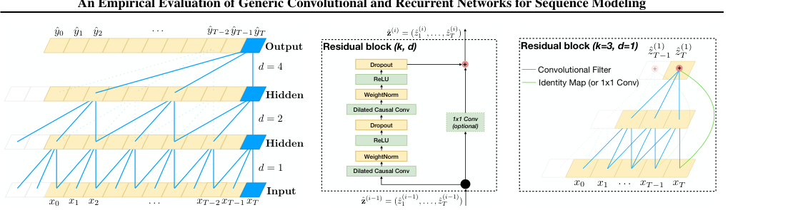
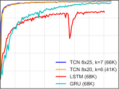
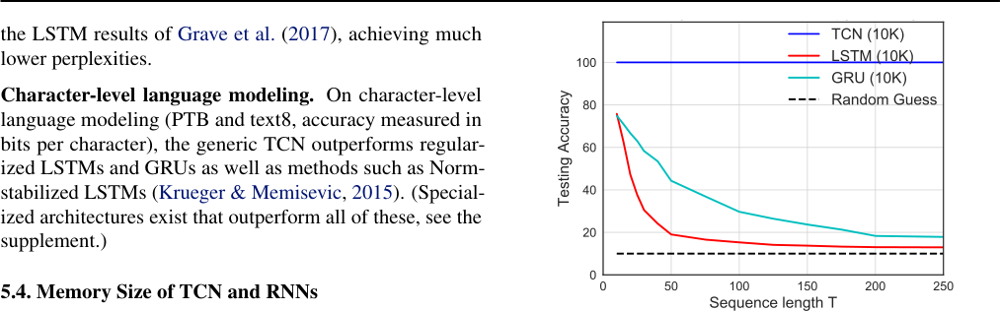

## **An Empirical Evaluation of Generic Convolutional and Recurrent Networks** **for Sequence Modeling**

**Shaojie Bai** [1] **J. Zico Kolter** [2] **Vladlen Koltun** [3]

**Abstract**

For most deep learning practitioners, sequence
modeling is synonymous with recurrent networks.
Yet recent results indicate that convolutional ar
chitectures can outperform recurrent networks on
tasks such as audio synthesis and machine translation. Given a new sequence modeling task or
dataset, which architecture should one use? We
conduct a systematic evaluation of generic convolutional and recurrent architectures for sequence
modeling. The models are evaluated across a
broad range of standard tasks that are commonly
used to benchmark recurrent networks. Our re
sults indicate that a simple convolutional architecture outperforms canonical recurrent networks
such as LSTMs across a diverse range of tasks
and datasets, while demonstrating longer effective
memory. We conclude that the common association between sequence modeling and recurrent
networks should be reconsidered, and convolutional networks should be regarded as a natural
starting point for sequence modeling tasks. To
assist related work, we have made code available
[at http://github.com/locuslab/TCN.](http://github.com/locuslab/TCN)

**1. Introduction**

Deep learning practitioners commonly regard recurrent architectures as the default starting point for sequence modeling tasks. The sequence modeling chapter in the canonical
textbook on deep learning is titled “Sequence Modeling:
Recurrent and Recursive Nets” (Goodfellow et al., 2016),
capturing the common association of sequence modeling
and recurrent architectures. A well-regarded recent online
course on “Sequence Models” focuses exclusively on recurrent architectures (Ng, 2018).

1 Machine Learning Department, Carnegie Mellon University, Pittsburgh, PA, USA 2 Computer Science Department,
Carnegie Mellon University, Pittsburgh, PA, USA [3] Intel Labs,
Santa Clara, CA, USA. Correspondence to: Shaojie Bai
_<_ shaojieb@cs.cmu.edu _>_, J. Zico Kolter _<_ zkolter@cs.cmu.edu _>_,
Vladlen Koltun _<_ vkoltun@gmail.edu _>_ .

On the other hand, recent research indicates that certain convolutional architectures can reach state-of-the-art accuracy
in audio synthesis, word-level language modeling, and machine translation (van den Oord et al., 2016; Kalchbrenner
et al., 2016; Dauphin et al., 2017; Gehring et al., 2017a;b).
This raises the question of whether these successes of convolutional sequence modeling are confined to specific application domains or whether a broader reconsideration of
the association between sequence processing and recurrent
networks is in order.

We address this question by conducting a systematic empirical evaluation of convolutional and recurrent architectures

on a broad range of sequence modeling tasks. We specifically target a comprehensive set of tasks that have been
repeatedly used to compare the effectiveness of different
recurrent network architectures. These tasks include polyphonic music modeling, word- and character-level language
modeling, as well as synthetic stress tests that had been deliberately designed and frequently used to benchmark RNNs.
Our evaluation is thus set up to compare convolutional and
recurrent approaches to sequence modeling on the recurrent
networks’ “home turf”.

To represent convolutional networks, we describe a generic
temporal convolutional network (TCN) architecture that is
applied across all tasks. This architecture is informed by
recent research, but is deliberately kept simple, combining
some of the best practices of modern convolutional architectures. It is compared to canonical recurrent architectures
such as LSTMs and GRUs.

The results suggest that TCNs convincingly outperform
baseline recurrent architectures across a broad range of sequence modeling tasks. This is particularly notable because
the tasks include diverse benchmarks that have commonly
been used to evaluate recurrent network designs (Chung
et al., 2014; Pascanu et al., 2014; Jozefowicz et al., 2015;
Zhang et al., 2016). This indicates that the recent successes
of convolutional architectures in applications such as audio
processing are not confined to these domains.

To further understand these results, we analyze more deeply
the memory retention characteristics of recurrent networks.
We show that despite the theoretical ability of recurrent
architectures to capture infinitely long history, TCNs exhibit

**An Empirical Evaluation of Generic Convolutional and Recurrent Networks for Sequence Modeling**

substantially longer memory, and are thus more suitable for
domains where a long history is required.

To our knowledge, the presented study is the most extensive
systematic comparison of convolutional and recurrent architectures on sequence modeling tasks. The results suggest
that the common association between sequence modeling
and recurrent networks should be reconsidered. The TCN

architecture appears not only more accurate than canonical recurrent networks such as LSTMs and GRUs, but also
simpler and clearer. It may therefore be a more appropriate starting point in the application of deep networks to

sequences.

**2. Background**

Convolutional networks (LeCun et al., 1989) have been
applied to sequences for decades (Sejnowski & Rosenberg, 1987; Hinton, 1989). They were used prominently
for speech recognition in the 80s and 90s (Waibel et al.,
1989; Bottou et al., 1990). ConvNets were subsequently
applied to NLP tasks such as part-of-speech tagging and
semantic role labelling (Collobert & Weston, 2008; Collobert et al., 2011; dos Santos & Zadrozny, 2014). More
recently, convolutional networks were applied to sentence
classification (Kalchbrenner et al., 2014; Kim, 2014) and
document classification (Zhang et al., 2015; Conneau et al.,
2017; Johnson & Zhang, 2015; 2017). Particularly inspiring
for our work are the recent applications of convolutional
architectures to machine translation (Kalchbrenner et al.,
2016; Gehring et al., 2017a;b), audio synthesis (van den
Oord et al., 2016), and language modeling (Dauphin et al.,
2017).

Recurrent networks are dedicated sequence models that
maintain a vector of hidden activations that are propagated
through time (Elman, 1990; Werbos, 1990; Graves, 2012).
This family of architectures has gained tremendous popularity due to prominent applications to language modeling (Sutskever et al., 2011; Graves, 2013; Hermans &
Schrauwen, 2013) and machine translation (Sutskever et al.,
2014; Bahdanau et al., 2015). The intuitive appeal of recurrent modeling is that the hidden state can act as a representation of everything that has been seen so far in the
sequence. Basic RNN architectures are notoriously difficult
to train (Bengio et al., 1994; Pascanu et al., 2013) and more
elaborate architectures are commonly used instead, such
as the LSTM (Hochreiter & Schmidhuber, 1997) and the
GRU (Cho et al., 2014). Many other architectural innovations and training techniques for recurrent networks have
been introduced and continue to be actively explored (El
Hihi & Bengio, 1995; Schuster & Paliwal, 1997; Gers et al.,
2002; Koutnik et al., 2014; Le et al., 2015; Ba et al., 2016;
Wu et al., 2016; Krueger et al., 2017; Merity et al., 2017;
Campos et al., 2018).

Multiple empirical studies have been conducted to evaluate
the effectiveness of different recurrent architectures. These

studies have been motivated in part by the many degrees of
freedom in the design of such architectures. Chung et al.
(2014) compared different types of recurrent units (LSTM
vs. GRU) on the task of polyphonic music modeling. Pascanu et al. (2014) explored different ways to construct deep
RNNs and evaluated the performance of different architectures on polyphonic music modeling, character-level language modeling, and word-level language modeling. Jozefowicz et al. (2015) searched through more than ten thousand different RNN architectures and evaluated their performance on various tasks. They concluded that if there were
“architectures much better than the LSTM”, then they were
“not trivial to find”. Greff et al. (2017) benchmarked the
performance of eight LSTM variants on speech recognition,
handwriting recognition, and polyphonic music modeling.
They also found that “none of the variants can improve upon
the standard LSTM architecture significantly”. Zhang et al.
(2016) systematically analyzed the connecting architectures
of RNNs and evaluated different architectures on character
level language modeling and on synthetic stress tests. Melis
et al. (2018) benchmarked LSTM-based architectures on
word-level and character-level language modeling, and concluded that “LSTMs outperform the more recent models”.

Other recent works have aimed to combine aspects of RNN
and CNN architectures. This includes the Convolutional

LSTM (Shi et al., 2015), which replaces the fully-connected
layers in an LSTM with convolutional layers to allow for
additional structure in the recurrent layers; the Quasi-RNN
model (Bradbury et al., 2017) that interleaves convolutional
layers with simple recurrent layers; and the dilated RNN
(Chang et al., 2017), which adds dilations to recurrent architectures. While these combinations show promise in
combining the desirable aspects of both types of architectures, our study here focuses on a comparison of generic
convolutional and recurrent architectures.

While there have been multiple thorough evaluations of
RNN architectures on representative sequence modeling
tasks, we are not aware of a similarly thorough comparison of convolutional and recurrent approaches to sequence
modeling. (Yin et al. (2017) have reported a comparison
of convolutional and recurrent networks for sentence-level

and document-level classification tasks. In contrast, sequence modeling calls for architectures that can synthesize
whole sequences, element by element.) Such comparison
is particularly intriguing in light of the aforementioned recent success of convolutional architectures in this domain.

Our work aims to compare generic convolutional and recurrent architectures on typical sequence modeling tasks
that are commonly used to benchmark RNN variants themselves (Hermans & Schrauwen, 2013; Le et al., 2015; Jozefowicz et al., 2015; Zhang et al., 2016).

**An Empirical Evaluation of Generic Convolutional and Recurrent Networks for Sequence Modeling**

**3. Temporal Convolutional Networks**

We begin by describing a generic architecture for convolutional sequence prediction. Our aim is to distill the best
practices in convolutional network design into a simple
architecture that can serve as a convenient but powerful
starting point. We refer to the presented architecture as a
temporal convolutional network (TCN), emphasizing that
we adopt this term not as a label for a truly new architecture,
but as a simple descriptive term for a family of architectures. (Note that the term has been used before (Lea et al.,
2017).) The distinguishing characteristics of TCNs are: 1)
the convolutions in the architecture are causal, meaning that
there is no information “leakage” from future to past; 2) the
architecture can take a sequence of any length and map it to
an output sequence of the same length, just as with an RNN.
Beyond this, we emphasize how to build very long effective
history sizes (i.e., the ability for the networks to look very
far into the past to make a prediction) using a combination
of very deep networks (augmented with residual layers) and
dilated convolutions.

Our architecture is informed by recent convolutional architectures for sequential data (van den Oord et al., 2016;
Kalchbrenner et al., 2016; Dauphin et al., 2017; Gehring
et al., 2017a;b), but is distinct from all of them and was
designed from first principles to combine simplicity, autoregressive prediction, and very long memory. For example,
the TCN is much simpler than WaveNet (van den Oord et al.,
2016) (no skip connections across layers, conditioning, context stacking, or gated activations).

Compared to the language modeling architecture of Dauphin
et al. (2017), TCNs do not use gating mechanisms and have
much longer memory.

**3.1. Sequence Modeling**

Before defining the network structure, we highlight the nature of the sequence modeling task. Suppose that we are
given an input sequence _x_ 0 _, . . ., x_ _T_, and wish to predict
some corresponding outputs _y_ 0 _, . . ., y_ _T_ at each time. The
key constraint is that to predict the output _y_ _t_ for some time
_t_, we are constrained to only use those inputs that have
been previously observed: _x_ 0 _, . . ., x_ _t_ . Formally, a sequence
modeling network is any function _f_ : _X_ _[T]_ [ +1] _→Y_ _[T]_ [ +1] that
produces the mapping

_y_ ˆ 0 _, . . .,_ ˆ _y_ _T_ = _f_ ( _x_ 0 _, . . ., x_ _T_ ) (1)

if it satisfies the causal constraint that _y_ _t_ depends only on
_x_ 0 _, . . ., x_ _t_ and not on any “future” inputs _x_ _t_ +1 _, . . ., x_ _T_ .
The goal of learning in the sequence modeling setting
is to find a network _f_ that minimizes some expected
loss between the actual outputs and the predictions,
_L_ ( _y_ 0 _, . . ., y_ _T_ _, f_ ( _x_ 0 _, . . ., x_ _T_ )), where the sequences and
outputs are drawn according to some distribution.

This formalism encompasses many settings such as autoregressive prediction (where we try to predict some signal
given its past) by setting the target output to be simply the
input shifted by one time step. It does not, however, directly
capture domains such as machine translation, or sequenceto-sequence prediction in general, since in these cases the
entire input sequence (including “future” states) can be used
to predict each output (though the techniques can naturally
be extended to work in such settings).

**3.2. Causal Convolutions**

As mentioned above, the TCN is based upon two principles:
the fact that the network produces an output of the same
length as the input, and the fact that there can be no leakage
from the future into the past. To accomplish the first point,
the TCN uses a 1D fully-convolutional network (FCN) architecture (Long et al., 2015), where each hidden layer is the
same length as the input layer, and zero padding of length
(kernel size _−_ 1) is added to keep subsequent layers the
same length as previous ones. To achieve the second point,
the TCN uses _causal convolutions_, convolutions where an
output at time _t_ is convolved only with elements from time
_t_ and earlier in the previous layer.

To put it simply: TCN = 1D FCN + causal convolutions.

Note that this is essentially the same architecture as the
time delay neural network proposed nearly 30 years ago by
Waibel et al. (1989), with the sole tweak of zero padding to
ensure equal sizes of all layers.

A major disadvantage of this basic design is that in order to
achieve a long effective history size, we need an extremely
deep network or very large filters, neither of which were
particularly feasible when the methods were first introduced.
Thus, in the following sections, we describe how techniques
from modern convolutional architectures can be integrated
into a TCN to allow for both very deep networks and very
long effective history.

**3.3. Dilated Convolutions**

A simple causal convolution is only able to look back at a
history with size linear in the depth of the network. This
makes it challenging to apply the aforementioned causal convolution on sequence tasks, especially those requiring longer
history. Our solution here, following the work of van den
Oord et al. (2016), is to employ dilated convolutions that
enable an exponentially large receptive field (Yu & Koltun,
2016). More formally, for a 1-D sequence input **x** _∈_ R _[n]_

and a filter _f_ : _{_ 0 _, . . ., k −_ 1 _} →_ R, the dilated convolution
operation _F_ on element _s_ of the sequence is defined as

_F_ ( _s_ ) = ( **x** _∗_ _d_ _f_ )( _s_ ) =

_k−_ 1
� _f_ ( _i_ ) _·_ **x** _s−d·i_ (2)

_i_ =0

|d|Col2|Col3|Col4|Col5|Col6|Col7|Col8|Col9|Col10|Col11|Col12|Col13|Col14|Col15|Col16|
|---|---|---|---|---|---|---|---|---|---|---|---|---|---|---|---|
|_d_ |||||||||||||||_d_|
||||||||||||||||_d_|
|_d_  |_d_  |_d_  |_d_  |_d_  |_d_  |_d_  |_d_  |_d_  |_d_  |_d_  |_d_  |_d_  |_d_  |_d_  |_d_  |

|zˆ(i) = (zˆ1, . . ., zˆ ) T|Col2|
|---|---|
|**Residual block****_(k, d)_** _1x1 Conv_ _(optional)_ WeightNorm Dilated Causal Conv ReLU Dropout WeightNorm Dilated Causal Conv ReLU Dropout **+**  |**Residual block****_(k, d)_** _1x1 Conv_ _(optional)_ WeightNorm Dilated Causal Conv ReLU Dropout WeightNorm Dilated Causal Conv ReLU Dropout **+**  |
|ˆ**z**(_i−_1) = (ˆ_z_(_i−_1) 1 _, . . .,_ ˆ_z_(_i−_1) _T_ )||

(a) (b) (c)

_Figure 1._ Architectural elements in a TCN. (a) A dilated causal convolution with dilation factors _d_ = 1 _,_ 2 _,_ 4 and filter size _k_ = 3 . The
receptive field is able to cover all values from the input sequence. (b) TCN residual block. An 1x1 convolution is added when residual
input and output have different dimensions. (c) An example of residual connection in a TCN. The blue lines are filters in the residual
function, and the green lines are identity mappings.

where _d_ is the dilation factor, _k_ is the filter size, and _s −_ _d · i_
accounts for the direction of the past. Dilation is thus equivalent to introducing a fixed step between every two adjacent
filter taps. When _d_ = 1, a dilated convolution reduces to a
regular convolution. Using larger dilation enables an output
at the top level to represent a wider range of inputs, thus
effectively expanding the receptive field of a ConvNet.

This gives us two ways to increase the receptive field of the
TCN: choosing larger filter sizes _k_ and increasing the dilation factor _d_, where the effective history of one such layer is
( _k −_ 1) _d_ . As is common when using dilated convolutions,
we increase _d_ exponentially with the depth of the network
(i.e., _d_ = _O_ (2 _[i]_ ) at level _i_ of the network). This ensures that
there is some filter that hits each input within the effective
history, while also allowing for an extremely large effective
history using deep networks. We provide an illustration in
Figure 1(a).

**3.4. Residual Connections**

A residual block (He et al., 2016) contains a branch leading
out to a series of transformations _F_, whose outputs are
added to the input **x** of the block:

_o_ = Activation( **x** + _F_ ( **x** )) (3)

This effectively allows layers to learn modifications to
the identity mapping rather than the entire transformation,
which has repeatedly been shown to benefit very deep networks.

Since a TCN’s receptive field depends on the network depth
_n_ as well as filter size _k_ and dilation factor _d_, stabilization of
deeper and larger TCNs becomes important. For example, in
a case where the prediction could depend on a history of size
2 [12] and a high-dimensional input sequence, a network of up
to 12 layers could be needed. Each layer, more specifically,
consists of multiple filters for feature extraction. In our
design of the generic TCN model, we therefore employ a
generic residual module in place of a convolutional layer.

The residual block for our baseline TCN is shown in Figure 1(b). Within a residual block, the TCN has two layers
of dilated causal convolution and non-linearity, for which
we used the rectified linear unit (ReLU) (Nair & Hinton,
2010). For normalization, we applied weight normalization (Salimans & Kingma, 2016) to the convolutional filters.
In addition, a spatial dropout (Srivastava et al., 2014) was
added after each dilated convolution for regularization: at
each training step, a whole channel is zeroed out.

However, whereas in standard ResNet the input is added
directly to the output of the residual function, in TCN (and
ConvNets in general) the input and output could have different widths. To account for discrepant input-output widths,
we use an additional 1x1 convolution to ensure that element
wise addition _⊕_ receives tensors of the same shape (see
Figure 1(b,c)).

**3.5. Discussion**

We conclude this section by listing several advantages and
disadvantages of using TCNs for sequence modeling.

_•_ **Parallelism** . Unlike in RNNs where the predictions for
later timesteps must wait for their predecessors to complete, convolutions can be done in parallel since the same
filter is used in each layer. Therefore, in both training and
evaluation, a long input sequence can be processed as a
whole in TCN, instead of sequentially as in RNN.

_•_ **Flexible receptive field size** . A TCN can change its receptive field size in multiple ways. For instance, stacking
more dilated (causal) convolutional layers, using larger
dilation factors, or increasing the filter size are all viable
options (with possibly different interpretations). TCNs
thus afford better control of the model’s memory size,
and are easy to adapt to different domains.

_•_ **Stable gradients** . Unlike recurrent architectures, TCN
has a backpropagation path different from the temporal
direction of the sequence. TCN thus avoids the problem

**An Empirical Evaluation of Generic Convolutional and Recurrent Networks for Sequence Modeling**

of exploding/vanishing gradients, which is a major issue
for RNNs (and which led to the development of LSTM,
GRU, HF-RNN (Martens & Sutskever, 2011), etc.).

_•_ **Low memory requirement for training** . Especially in
the case of a long input sequence, LSTMs and GRUs can
easily use up a lot of memory to store the partial results
for their multiple cell gates. However, in a TCN the filters
are shared across a layer, with the backpropagation path
depending only on network depth. Therefore in practice,
we found gated RNNs likely to use up to a multiplicative
factor more memory than TCNs.

_•_ **Variable length inputs** . Just like RNNs, which model
inputs with variable lengths in a recurrent way, TCNs
can also take in inputs of arbitrary lengths by sliding the
1D convolutional kernels. This means that TCNs can be

adopted as drop-in replacements for RNNs for sequential
data of arbitrary length.

There are also two notable disadvantages to using TCNs.

_•_ **Data storage during evaluation** . In evaluation/testing,
RNNs only need to maintain a hidden state and take in a
current input _x_ _t_ in order to generate a prediction. In other
words, a “summary” of the entire history is provided by
the fixed-length set of vectors _h_ _t_, and the actual observed
sequence can be discarded. In contrast, TCNs need to
take in the raw sequence up to the effective history length,
thus possibly requiring more memory during evaluation.

_•_ **Potential parameter change for a transfer of domain** .
Different domains can have different requirements on the
amount of history the model needs in order to predict.
Therefore, when transferring a model from a domain
where only little memory is needed (i.e., small _k_ and _d_ )
to a domain where much longer memory is required (i.e.,
much larger _k_ and _d_ ), TCN may perform poorly for not
having a sufficiently large receptive field.

**4. Sequence Modeling Tasks**

We evaluate TCNs and RNNs on tasks that have been com
monly used to benchmark the performance of different RNN
sequence modeling architectures (Hermans & Schrauwen,
2013; Chung et al., 2014; Pascanu et al., 2014; Le et al.,
2015; Jozefowicz et al., 2015; Zhang et al., 2016). The
intention is to conduct the evaluation on the “home turf”

of RNN sequence models. We use a comprehensive set of
synthetic stress tests along with real-world datasets from
multiple domains.

**The adding problem.** In this task, each input consists of
a length- _n_ sequence of depth 2, with all values randomly
chosen in [0 _,_ 1], and the second dimension being all zeros
except for two elements that are marked by 1. The objective
is to sum the two random values whose second dimensions

are marked by 1. Simply predicting the sum to be 1 should
give an MSE of about 0.1767. First introduced by Hochreiter
& Schmidhuber (1997), the adding problem has been used
repeatedly as a stress test for sequence models (Martens
& Sutskever, 2011; Pascanu et al., 2013; Le et al., 2015;
Arjovsky et al., 2016; Zhang et al., 2016).

**Sequential MNIST and P-MNIST.** Sequential MNIST is
frequently used to test a recurrent network’s ability to retain
information from the distant past (Le et al., 2015; Zhang
et al., 2016; Wisdom et al., 2016; Cooijmans et al., 2016;
Krueger et al., 2017; Jing et al., 2017). In this task, MNIST
images (LeCun et al., 1998) are presented to the model
as a 784 _×_ 1 sequence for digit classification. In the more
challenging P-MNIST setting, the order of the sequence is
permuted at random (Le et al., 2015; Arjovsky et al., 2016;
Wisdom et al., 2016; Krueger et al., 2017).

**Copy memory.** In this task, each input sequence has length
_T_ + 20 . The first 10 values are chosen randomly among the
digits 1 _, . . .,_ 8, with the rest being all zeros, except for the
last 11 entries that are filled with the digit ‘9’ (the first ‘9’ is
a delimiter). The goal is to generate an output of the same
length that is zero everywhere except the last 10 values after
the delimiter, where the model is expected to repeat the 10
values it encountered at the start of the input. This task was
used in prior works such as Zhang et al. (2016); Arjovsky
et al. (2016); Wisdom et al. (2016); Jing et al. (2017).

**JSB Chorales and Nottingham.** JSB Chorales (Allan &
Williams, 2005) is a polyphonic music dataset consisting
of the entire corpus of 382 four-part harmonized chorales
by J. S. Bach. Each input is a sequence of elements. Each
element is an 88-bit binary code that corresponds to the 88
keys on a piano, with 1 indicating a key that is pressed at
a given time. Nottingham is a polyphonic music dataset
based on a collection of 1,200 British and American folk
tunes, and is much larger than JSB Chorales. JSB Chorales
and Nottingham have been used in numerous empirical
investigations of recurrent sequence modeling (Chung et al.,
2014; Pascanu et al., 2014; Jozefowicz et al., 2015; Greff
et al., 2017). The performance on both tasks is measured in
terms of negative log-likelihood (NLL).

**PennTreebank.** We used the PennTreebank (PTB) (Marcus et al., 1993) for both character-level and word-level
language modeling. When used as a character-level language corpus, PTB contains 5,059K characters for training,
396K for validation, and 446K for testing, with an alphabet
size of 50. When used as a word-level language corpus,
PTB contains 888K words for training, 70K for validation,
and 79K for testing, with a vocabulary size of 10K. This
is a highly studied but relatively small language modeling
dataset (Miyamoto & Cho, 2016; Krueger et al., 2017; Merity et al., 2017).

**Wikitext-103.** Wikitext-103 (Merity et al., 2016) is almost

**An Empirical Evaluation of Generic Convolutional and Recurrent Networks for Sequence Modeling**

_Table 1._ Evaluation of TCNs and recurrent architectures on synthetic stress tests, polyphonic music modeling, character-level language
modeling, and word-level language modeling. The generic TCN architecture outperforms canonical recurrent networks across a
comprehensive suite of tasks and datasets. Current state-of-the-art results are listed in the supplement. _h_ means that higher is better.
_ℓ_ means that lower is better.

Models
Sequence Modeling Task Model Size ( _≈_ )
LSTM GRU RNN **TCN**

Seq. MNIST (accuracy _[h]_ ) 70K 87.2 96.2 21.5 **99.0**

Permuted MNIST (accuracy) 70K 85.7 87.3 25.3 **97.2**
Adding problem _T_ =600 (loss _[ℓ]_ ) 70K 0.164 **5.3e-5** 0.177 **5.8e-5**

Copy memory _T_ =1000 (loss) 16K 0.0204 0.0197 0.0202 **3.5e-5**

Music JSB Chorales (loss) 300K 8.45 8.43 8.91 **8.10**

Music Nottingham (loss) 1M 3.29 3.46 4.05 **3.07**
Word-level PTB (perplexity _[ℓ]_ ) 13M **78.93** 92.48 114.50 88.68

Word-level Wiki-103 (perplexity)          - 48.4          -          - **45.19**

Word-level LAMBADA (perplexity)         - 4186         - 14725 **1279**
Char-level PTB (bpc _[ℓ]_ ) 3M 1.36 1.37 1.48 **1.31**

Char-level text8 (bpc) 5M 1.50 1.53 1.69 **1.45**

110 times as large as PTB, featuring a vocabulary size of
about 268K. The dataset contains 28K Wikipedia articles
(about 103 million words) for training, 60 articles (about
218K words) for validation, and 60 articles (246K words)
for testing. This is a more representative and realistic dataset
than PTB, with a much larger vocabulary that includes many
rare words, and has been used in Merity et al. (2016); Grave
et al. (2017); Dauphin et al. (2017).

**LAMBADA.** Introduced by Paperno et al. (2016), LAMBADA is a dataset comprising 10K passages extracted from
novels, with an average of 4.6 sentences as context, and 1 target sentence the last word of which is to be predicted. This
dataset was built so that a person can easily guess the missing word when given the context sentences, but not when
given only the target sentence without the context sentences.
Most of the existing models fail on LAMBADA (Paperno
et al., 2016; Grave et al., 2017). In general, better results
on LAMBADA indicate that a model is better at capturing
information from longer and broader context. The training
data for LAMBADA is the full text of 2,662 novels with
more than 200M words. The vocabulary size is about 93K.

**text8.** We also used the text8 dataset for character-level

language modeling (Mikolov et al., 2012). text8 is about
20 times larger than PTB, with about 100M characters from
Wikipedia (90M for training, 5M for validation, and 5M for
testing). The corpus contains 27 unique alphabets.

**5. Experiments**

We compare the generic TCN architecture described in Section 3 to canonical recurrent architectures, namely LSTM,
GRU, and vanilla RNN, with standard regularizations. All

experiments reported in this section used exactly the same
TCN architecture, just varying the depth of the network _n_
and occasionally the kernel size _k_ so that the receptive field
covers enough context for predictions. We use an exponential dilation _d_ = 2 _[i]_ for layer _i_ in the network, and the
Adam optimizer (Kingma & Ba, 2015) with learning rate
0 _._ 002 for TCN, unless otherwise noted. We also empirically find that gradient clipping helped convergence, and we
pick the maximum norm for clipping from [0 _._ 3 _,_ 1] . When
training recurrent models, we use grid search to find a good
set of hyperparameters (in particular, optimizer, recurrent
drop _p ∈_ [0 _._ 05 _,_ 0 _._ 5], learning rate, gradient clipping, and
initial forget-gate bias), while keeping the network around
the same size as TCN. No other architectural elaborations,
such as gating mechanisms or skip connections, were added
to either TCNs or RNNs. Additional details and controlled

experiments are provided in the supplementary material.

**5.1. Synopsis of Results**

A synopsis of the results is shown in Table 1. Note that
on several of these tasks, the generic, canonical recurrent
architectures we study (e.g., LSTM, GRU) are not the stateof-the-art. (See the supplement for more details.) With this
caveat, the results strongly suggest that the generic TCN
architecture _with minimal tuning_ outperforms canonical recurrent architectures across a broad variety of sequence
modeling tasks that are commonly used to benchmark the
performance of recurrent architectures themselves. We now
analyze these results in more detail.

**An Empirical Evaluation of Generic Convolutional and Recurrent Networks for Sequence Modeling**

|0.25 0.20 loss 0.15 Testing 0.10 0.05 0.000 1000 2000 3000|TCN 7x27, k=6 (70K) 0.25 LSTM, (70K) GRU (70K) 0.20 AWD-LSTM (70K) loss 0.15 Testing 0.10 0.05 4000 5000 6000 7000 0.000 1000 2000 3|TCN 8x24, k=8 (70K) 0.08 LSTM (70K) 0.07 GRU (70K) AWD-LSTM (70K) 0.06 0.05 Loss 0.04 Testing 0.03 0.02 0.01 000 4000 5000 6000 7000 0.00|TCN 9x10, k=6 (10K) 0.08 GRU (16K) 0.07 LSTM (16K) EURNN (16K) 0.06 Guess 0 for all 0.05 Loss 0.04 Testing 0.03 0.02 0.01 0.00|Col5|TCN 8x10, k=8 (13K) GRU (16K) LSTM (16K) EURNN (16K) Guess 0 for all|Col7|
|---|---|---|---|---|---|---|
|~~0~~ ~~1000~~ ~~2000~~ ~~3000~~ 0.00 0.05 0.10 0.15 0.20 0.25 Testing loss|~~4000~~ ~~5000~~ ~~6000~~ ~~700~~0 ~~TCN 7x27, k=6 (70K)~~ LSTM, (70K) GRU (70K) AWD-LSTM (70K) ~~0~~ ~~1000~~ ~~2000~~ ~~3~~ 0.00 0.05 0.10 0.15 0.20 0.25 Testing loss|~~000~~ ~~4000~~ ~~5000~~ ~~6000~~ ~~700~~0 ~~TCN 8x24, k=8 (70K)~~ LSTM (70K) GRU (70K) AWD-LSTM (70K)   0.00 0.01 0.02 0.03 0.04 0.05 0.06 0.07 0.08 Testing Loss|EUR ~~Gues~~|NN (16K) ~~s 0 for all~~|EUR ~~Gue~~|EUR ~~Gue~~|
|~~0~~ ~~1000~~ ~~2000~~ ~~3000~~ 0.00 0.05 0.10 0.15 0.20 0.25 Testing loss|~~4000~~ ~~5000~~ ~~6000~~ ~~700~~0 ~~TCN 7x27, k=6 (70K)~~ LSTM, (70K) GRU (70K) AWD-LSTM (70K) ~~0~~ ~~1000~~ ~~2000~~ ~~3~~ 0.00 0.05 0.10 0.15 0.20 0.25 Testing loss|~~000~~ ~~4000~~ ~~5000~~ ~~6000~~ ~~700~~0 ~~TCN 8x24, k=8 (70K)~~ LSTM (70K) GRU (70K) AWD-LSTM (70K)   0.00 0.01 0.02 0.03 0.04 0.05 0.06 0.07 0.08 Testing Loss|||||
|~~0~~ ~~1000~~ ~~2000~~ ~~3000~~ 0.00 0.05 0.10 0.15 0.20 0.25 Testing loss|~~4000~~ ~~5000~~ ~~6000~~ ~~700~~0 ~~TCN 7x27, k=6 (70K)~~ LSTM, (70K) GRU (70K) AWD-LSTM (70K) ~~0~~ ~~1000~~ ~~2000~~ ~~3~~ 0.00 0.05 0.10 0.15 0.20 0.25 Testing loss|~~000~~ ~~4000~~ ~~5000~~ ~~6000~~ ~~700~~0 ~~TCN 8x24, k=8 (70K)~~ LSTM (70K) GRU (70K) AWD-LSTM (70K)   0.00 0.01 0.02 0.03 0.04 0.05 0.06 0.07 0.08 Testing Loss|||||

(a) _T_ = 500

(b) _T_ = 1000

(a) _T_ = 200

(b) _T_ = 600

_Figure 2._ Results on the adding problem for different sequence
lengths _T_ . TCNs outperform recurrent architectures.

|1.0|Col2|Col3|
|---|---|---|
|~~0~~ ~~1000~~ ~~2000~~ ~~3000~~ 0.0 0.2 0.4 0.6 0.8 1.0 Testing accuracy|||
|~~0~~ ~~1000~~ ~~2000~~ ~~3000~~ 0.0 0.2 0.4 0.6 0.8 1.0 Testing accuracy|||
|~~0~~ ~~1000~~ ~~2000~~ ~~3000~~ 0.0 0.2 0.4 0.6 0.8 1.0 Testing accuracy|||
|~~0~~ ~~1000~~ ~~2000~~ ~~3000~~ 0.0 0.2 0.4 0.6 0.8 1.0 Testing accuracy|TCN 8x25, k=7 (6 |6K) |
|~~0~~ ~~1000~~ ~~2000~~ ~~3000~~ 0.0 0.2 0.4 0.6 0.8 1.0 Testing accuracy|~~TCN 8x20, k=6 (4~~ LSTM (68K) GRU (68K)|~~K)~~|

(a) Sequential MNIST

(b) P-MNIST

_Figure 3._ Results on Sequential MNIST and P-MNIST. TCNs outperform recurrent architectures.

**5.2. Synthetic Stress Tests**

**The adding problem.** Convergence results for the adding
problem, for problem sizes _T_ = 200 and 600, are shown
in Figure 2. All models were chosen to have roughly 70K
parameters. TCNs quickly converged to a virtually perfect
solution (i.e., MSE near 0). GRUs also performed quite
well, albeit slower to converge than TCNs. LSTMs and
vanilla RNNs performed significantly worse.

**Sequential MNIST and P-MNIST.** Convergence results
on sequential and permuted MNIST, run over 10 epochs,
are shown in Figure 3. All models were configured to have
roughly 70K parameters. For both problems, TCNs substantially outperform the recurrent architectures, both in
terms of convergence and in final accuracy on the task. For
P-MNIST, TCNs outperform state-of-the-art results (95.9%)
based on recurrent networks with Zoneout and Recurrent

BatchNorm (Cooijmans et al., 2016; Krueger et al., 2017).

**Copy memory.** Convergence results on the copy memory task are shown in Figure 4. TCNs quickly converge
to correct answers, while LSTMs and GRUs simply converge to the same loss as predicting all zeros. In this case
we also compare to the recently-proposed EURNN (Jing
et al., 2017), which was highlighted to perform well on
this task. While both TCN and EURNN perform well for
sequence length _T_ = 500, the TCN has a clear advantage
for _T_ = 1000 and longer (in terms of both loss and rate of
convergence).

_Figure 4._ Result on the copy memory task for different sequence
lengths _T_ . TCNs outperform recurrent architectures.

**5.3. Polyphonic Music and Language Modeling**

We now discuss the results on polyphonic music modeling,
character-level language modeling, and word-level language
modeling. These domains are dominated by recurrent architectures, with many specialized designs developed for these
tasks (Zhang et al., 2016; Ha et al., 2017; Krueger et al.,
2017; Grave et al., 2017; Greff et al., 2017; Merity et al.,
2017). We mention some of these specialized architectures
when useful, but our primary goal is to compare the generic
TCN model to similarly generic recurrent architectures, before domain-specific tuning. The results are summarized in
Table 1.

**Polyphonic music.** On Nottingham and JSB Chorales, the
TCN with virtually no tuning outperforms the recurrent
models by a considerable margin, and even outperforms
some enhanced recurrent architectures for this task such as

HF-RNN (Boulanger-Lewandowski et al., 2012) and Diagonal RNN (Subakan & Smaragdis, 2017). Note however that
other models such as the Deep Belief Net LSTM perform
better still (Vohra et al., 2015); we believe this is likely due
to the fact that the datasets are relatively small, and thus the
right regularization method or generative modeling procedure can improve performance significantly. This is largely
orthogonal to the RNN/TCN distinction, as a similar variant
of TCN may well be possible.

**Word-level language modeling.** Language modeling remains one of the primary applications of recurrent networks
and many recent works have focused on optimizing LSTMs
for this task (Krueger et al., 2017; Merity et al., 2017).
Our implementation follows standard practice that ties the
weights of encoder and decoder layers for both TCN and
RNNs (Press & Wolf, 2016), which significantly reduces
the number of parameters in the model. For training, we use
SGD and anneal the learning rate by a factor of 0.5 for both
TCN and RNNs when validation accuracy plateaus.

On the smaller PTB corpus, an optimized LSTM architecture (with recurrent and embedding dropout, etc.) outperforms the TCN, while the TCN outperforms both GRU and
vanilla RNN. However, on the much larger Wikitext-103
corpus and the LAMBADA dataset (Paperno et al., 2016),
without any hyperparameter search, the TCN outperforms

**An Empirical Evaluation of Generic Convolutional and Recurrent Networks for Sequence Modeling**

One of the theoretical advantages of recurrent architectures
is their unlimited memory: the theoretical ability to retain
information through sequences of unlimited length. We now
examine specifically how long the different architectures
can retain information in practice. We focus on 1) the copy
memory task, which is a stress test designed to evaluate longterm, distant information propagation in recurrent networks,
and 2) the LAMBADA task, which tests both local and
non-local textual understanding.

The copy memory task is perfectly set up to examine a
model’s ability to retain information for different lengths
of time. The requisite retention time can be controlled by
varying the sequence length _T_ . In contrast to Section 5.2,
we now focus on the accuracy on the last 10 elements of
the output sequence (which are the nontrivial elements that
must be recalled). We used models of size 10K for both
TCN and RNNs.

The results of this focused study are shown in Figure 5.
TCNs consistently converge to 100% accuracy for all sequence lengths, whereas LSTMs and GRUs of the same
size quickly degenerate to random guessing as the sequence
length _T_ grows. The accuracy of the LSTM falls below 20%
for _T <_ 50, while the GRU falls below 20% for _T <_ 200 .

These results indicate that TCNs are able to maintain a much

longer effective history than their recurrent counterparts.

This observation is backed up on real data by experiments
on the large-scale LAMBADA dataset, which is specifically
designed to test a model’s ability to utilize broad context (Paperno et al., 2016). As shown in Table 1, TCN outperforms
LSTMs and vanilla RNNs by a significant margin in perplexity on LAMBADA, with a substantially smaller network and
virtually no tuning. (State-of-the-art results on this dataset
are even better, but only with the help of additional memory
mechanisms (Grave et al., 2017).)

**6. Conclusion**

We have presented an empirical evaluation of generic convolutional and recurrent architectures across a comprehensive
suite of sequence modeling tasks. To this end, we have
described a simple temporal convolutional network (TCN)

_Figure 5._ Accuracy on the copy memory task for sequences of
different lengths _T_ . While TCN exhibits 100% accuracy for all
sequence lengths, the LSTM and GRU degenerate to random guessing as _T_ grows.

that combines best practices such as dilations and residual
connections with the causal convolutions needed for autore
gressive prediction. The experimental results indicate that
TCN models substantially outperform generic recurrent architectures such as LSTMs and GRUs. We further studied

long-range information propagation in convolutional and
recurrent networks, and showed that the “infinite memory”
advantage of RNNs is largely absent in practice. TCNs
exhibit longer memory than recurrent architectures with the
same capacity.

Numerous advanced schemes for regularizing and optimizing LSTMs have been proposed (Press & Wolf, 2016;
Krueger et al., 2017; Merity et al., 2017; Campos et al.,
2018). These schemes have significantly advanced the accuracy achieved by LSTM-based architectures on some
datasets. The TCN has not yet benefitted from this concerted community-wide investment into architectural and
algorithmic elaborations. We see such investment as desirable and expect it to yield advances in TCN performance
that are commensurate with the advances seen in recent

years in LSTM performance. We will release the code for
our project to encourage this exploration.

The preeminence enjoyed by recurrent networks in sequence
modeling may be largely a vestige of history. Until recently,
before the introduction of architectural elements such as

dilated convolutions and residual connections, convolutional

architectures were indeed weaker. Our results indicate that

with these elements, a simple convolutional architecture
is more effective across diverse sequence modeling tasks
than recurrent architectures such as LSTMs. Due to the

comparable clarity and simplicity of TCNs, we conclude
that convolutional networks should be regarded as a natural
starting point and a powerful toolkit for sequence modeling.

**An Empirical Evaluation of Generic Convolutional and Recurrent Networks for Sequence Modeling**

**References**

Allan, Moray and Williams, Christopher. Harmonising chorales
by probabilistic inference. In _NIPS_, 2005.

Arjovsky, Martin, Shah, Amar, and Bengio, Yoshua. Unitary
evolution recurrent neural networks. In _ICML_, 2016.

Ba, Lei Jimmy, Kiros, Ryan, and Hinton, Geoffrey E. Layer
normalization. _arXiv:1607.06450_, 2016.

Bahdanau, Dzmitry, Cho, Kyunghyun, and Bengio, Yoshua. Neural
machine translation by jointly learning to align and translate. In
_ICLR_, 2015.

Bengio, Yoshua, Simard, Patrice, and Frasconi, Paolo. Learning
long-term dependencies with gradient descent is difficult. _IEEE_
_Transactions on Neural Networks_, 5(2), 1994.

Bottou, Leon, Soulie, F Fogelman, Blanchet, Pascal, and Li ´ enard, ´
Jean-Sylvain. Speaker-independent isolated digit recognition:
Multilayer perceptrons vs. dynamic time warping. _Neural Net-_
_works_, 3(4), 1990.

Boulanger-Lewandowski, Nicolas, Bengio, Yoshua, and Vincent,
Pascal. Modeling temporal dependencies in high-dimensional
sequences: Application to polyphonic music generation and
transcription. _arXiv:1206.6392_, 2012.

Bradbury, James, Merity, Stephen, Xiong, Caiming, and Socher,
Richard. Quasi-recurrent neural networks. In _ICLR_, 2017.

Campos, Victor, Jou, Brendan, Giro i Nieto, Xavier, Torres, Jordi, ´
and Chang, Shih-Fu. Skip RNN: Learning to skip state updates
in recurrent neural networks. In _ICLR_, 2018.

Chang, Shiyu, Zhang, Yang, Han, Wei, Yu, Mo, Guo, Xiaoxiao,
Tan, Wei, Cui, Xiaodong, Witbrock, Michael J., HasegawaJohnson, Mark A., and Huang, Thomas S. Dilated recurrent
neural networks. In _NIPS_, 2017.

Cho, Kyunghyun, Van Merrienboer, Bart, Bahdanau, Dzmitry, and ¨
Bengio, Yoshua. On the properties of neural machine translation:
Encoder-decoder approaches. _arXiv:1409.1259_, 2014.

Chung, Junyoung, Gulcehre, Caglar, Cho, KyungHyun, and Bengio, Yoshua. Empirical evaluation of gated recurrent neural
networks on sequence modeling. _arXiv:1412.3555_, 2014.

Chung, Junyoung, Ahn, Sungjin, and Bengio, Yoshua. Hierarchical
multiscale recurrent neural networks. _arXiv:1609.01704_, 2016.

Collobert, Ronan and Weston, Jason. A unified architecture for natural language processing: Deep neural networks with multitask
learning. In _ICML_, 2008.

Collobert, Ronan, Weston, Jason, Bottou, Leon, Karlen, Michael, ´
Kavukcuoglu, Koray, and Kuksa, Pavel P. Natural language
processing (almost) from scratch. _JMLR_, 12, 2011.

Conneau, Alexis, Schwenk, Holger, LeCun, Yann, and Barrault,
Lo ¨ ıc. Very deep convolutional networks for text classification.
In _European Chapter of the Association for Computational_
_Linguistics (EACL)_, 2017.

Cooijmans, Tim, Ballas, Nicolas, Laurent, Cesar, G ´ ul ¨ c¸ ehre, C¸ aglar, ˘
and Courville, Aaron. Recurrent batch normalization. In _ICLR_,
2016.

Dauphin, Yann N., Fan, Angela, Auli, Michael, and Grangier,
David. Language modeling with gated convolutional networks.
In _ICML_, 2017.

dos Santos, C ´ ıcero Nogueira and Zadrozny, Bianca. Learning
character-level representations for part-of-speech tagging. In
_ICML_, 2014.

El Hihi, Salah and Bengio, Yoshua. Hierarchical recurrent neural

networks for long-term dependencies. In _NIPS_, 1995.

Elman, Jeffrey L. Finding structure in time. _Cognitive Science_, 14
(2), 1990.

Gehring, Jonas, Auli, Michael, Grangier, David, and Dauphin,
Yann. A convolutional encoder model for neural machine translation. In _ACL_, 2017a.

Gehring, Jonas, Auli, Michael, Grangier, David, Yarats, Denis, and
Dauphin, Yann N. Convolutional sequence to sequence learning.
In _ICML_, 2017b.

Gers, Felix A, Schraudolph, Nicol N, and Schmidhuber, Jurgen. ¨
Learning precise timing with lstm recurrent networks. _JMLR_, 3,
2002.

Goodfellow, Ian, Bengio, Yoshua, and Courville, Aaron. _Deep_
_Learning_ . MIT Press, 2016.

Grave, Edouard, Joulin, Armand, and Usunier, Nicolas. Improving
neural language models with a continuous cache. In _ICLR_,
2017.

Graves, Alex. _Supervised Sequence Labelling with Recurrent_
_Neural Networks_ . Springer, 2012.

Graves, Alex. Generating sequences with recurrent neural networks. _arXiv:1308.0850_, 2013.

Greff, Klaus, Srivastava, Rupesh Kumar, Koutn ´ ık, Jan, Steunebrink, Bas R., and Schmidhuber, Jurgen. LSTM: A search space ¨
odyssey. _IEEE Transactions on Neural Networks and Learning_
_Systems_, 28(10), 2017.

Ha, David, Dai, Andrew, and Le, Quoc V. HyperNetworks. In
_ICLR_, 2017.

He, Kaiming, Zhang, Xiangyu, Ren, Shaoqing, and Sun, Jian.
Deep residual learning for image recognition. In _CVPR_, 2016.

Hermans, Michiel and Schrauwen, Benjamin. Training and
analysing deep recurrent neural networks. In _NIPS_, 2013.

Hinton, Geoffrey E. Connectionist learning procedures. _Artificial_
_Intelligence_, 40(1-3), 1989.

Hochreiter, Sepp and Schmidhuber, Jurgen. Long short-term mem- ¨
ory. _Neural Computation_, 9(8), 1997.

Jing, Li, Shen, Yichen, Dubcek, Tena, Peurifoy, John, Skirlo, Scott,
LeCun, Yann, Tegmark, Max, and Soljaci ˇ c, Marin. Tunable ´
efficient unitary neural networks (EUNN) and their application
to RNNs. In _ICML_, 2017.

Johnson, Rie and Zhang, Tong. Effective use of word order for
text categorization with convolutional neural networks. In _HLT-_
_NAACL_, 2015.

Johnson, Rie and Zhang, Tong. Deep pyramid convolutional neural
networks for text categorization. In _ACL_, 2017.

Jozefowicz, Rafal, Zaremba, Wojciech, and Sutskever, Ilya. An
empirical exploration of recurrent network architectures. In
_ICML_, 2015.

Kalchbrenner, Nal, Grefenstette, Edward, and Blunsom, Phil. A
convolutional neural network for modelling sentences. In _ACL_,
2014.

Kalchbrenner, Nal, Espeholt, Lasse, Simonyan, Karen, van den
Oord, Aaron, Graves, Alex, and Kavukcuoglu, Koray. Neural ¨
machine translation in linear time. _arXiv:1610.10099_, 2016.

Kim, Yoon. Convolutional neural networks for sentence classification. In _EMNLP_, 2014.

Kingma, Diederik and Ba, Jimmy. Adam: A method for stochastic
optimization. In _ICLR_, 2015.

**An Empirical Evaluation of Generic Convolutional and Recurrent Networks for Sequence Modeling**

Koutnik, Jan, Greff, Klaus, Gomez, Faustino, and Schmidhuber,
Juergen. A clockwork RNN. In _ICML_, 2014.

Krueger, David and Memisevic, Roland. Regularizing RNNs by
stabilizing activations. _arXiv:1511.08400_, 2015.

Krueger, David, Maharaj, Tegan, Kramar, J ´ anos, Pezeshki, Mo- ´
hammad, Ballas, Nicolas, Ke, Nan Rosemary, Goyal, Anirudh,
Bengio, Yoshua, Larochelle, Hugo, Courville, Aaron C., and
Pal, Chris. Zoneout: Regularizing RNNs by randomly preserving hidden activations. In _ICLR_, 2017.

Le, Quoc V, Jaitly, Navdeep, and Hinton, Geoffrey E. A simple
way to initialize recurrent networks of rectified linear units.
_arXiv:1504.00941_, 2015.

Lea, Colin, Flynn, Michael D., Vidal, Rene, Reiter, Austin, and ´
Hager, Gregory D. Temporal convolutional networks for action
segmentation and detection. In _CVPR_, 2017.

LeCun, Yann, Boser, Bernhard, Denker, John S., Henderson,
Donnie, Howard, Richard E., Hubbard, Wayne, and Jackel,
Lawrence D. Backpropagation applied to handwritten zip code
recognition. _Neural Computation_, 1(4), 1989.

LeCun, Yann, Bottou, Leon, Bengio, Yoshua, and Haffner, Patrick. ´
Gradient-based learning applied to document recognition. _Pro-_
_ceedings of the IEEE_, 86(11), 1998.

Long, Jonathan, Shelhamer, Evan, and Darrell, Trevor. Fully
convolutional networks for semantic segmentation. In _CVPR_,
2015.

Marcus, Mitchell P, Marcinkiewicz, Mary Ann, and Santorini,
Beatrice. Building a large annotated corpus of English: The
Penn treebank. _Computational Linguistics_, 19(2), 1993.

Martens, James and Sutskever, Ilya. Learning recurrent neural
networks with Hessian-free optimization. In _ICML_, 2011.

Melis, Gabor, Dyer, Chris, and Blunsom, Phil. On the state of the ´
art of evaluation in neural language models. In _ICLR_, 2018.

Merity, Stephen, Xiong, Caiming, Bradbury, James, and Socher,
Richard. Pointer sentinel mixture models. _arXiv:1609.07843_,
2016.

Merity, Stephen, Keskar, Nitish Shirish, and Socher, Richard.
Regularizing and optimizing LSTM language models.
_arXiv:1708.02182_, 2017.

Mikolov, Toma ´ s, Sutskever, Ilya, Deoras, Anoop, Le, Hai-Son, ˇ
Kombrink, Stefan, and Cernocky, Jan. Subword language modeling with neural networks. _Preprint_, 2012.

Miyamoto, Yasumasa and Cho, Kyunghyun. Gated word-character
recurrent language model. _arXiv:1606.01700_, 2016.

Nair, Vinod and Hinton, Geoffrey E. Rectified linear units improve
restricted Boltzmann machines. In _ICML_, 2010.

Ng, Andrew. Sequence Models (Course 5 of Deep Learning Specialization). _Coursera_, 2018.

Paperno, Denis, Kruszewski, German, Lazaridou, Angeliki, Pham, ´
Quan Ngoc, Bernardi, Raffaella, Pezzelle, Sandro, Baroni,
Marco, Boleda, Gemma, and Fernandez, Raquel. The LAM- ´
BADA dataset: Word prediction requiring a broad discourse
context. _arXiv:1606.06031_, 2016.

Pascanu, Razvan, Mikolov, Tomas, and Bengio, Yoshua. On the
difficulty of training recurrent neural networks. In _ICML_, 2013.

Pascanu, Razvan, Gul ¨ c¸ ehre, C¸ aglar, Cho, Kyunghyun, and Bengio,
Yoshua. How to construct deep recurrent neural networks. In
_ICLR_, 2014.

Press, Ofir and Wolf, Lior. Using the output embedding to improve

language models. _arXiv:1608.05859_, 2016.

Salimans, Tim and Kingma, Diederik P. Weight normalization: A
simple reparameterization to accelerate training of deep neural
networks. In _NIPS_, 2016.

Schuster, Mike and Paliwal, Kuldip K. Bidirectional recurrent
neural networks. _IEEE Transactions on Signal Processing_, 45
(11), 1997.

Sejnowski, Terrence J. and Rosenberg, Charles R. Parallel networks that learn to pronounce English text. _Complex Systems_,
1, 1987.

Shi, Xingjian, Chen, Zhourong, Wang, Hao, Yeung, Dit-Yan,
Wong, Wai-Kin, and Woo, Wang-chun. Convolutional LSTM
network: A machine learning approach for precipitation nowcasting. In _NIPS_, 2015.

Srivastava, Nitish, Hinton, Geoffrey E, Krizhevsky, Alex,
Sutskever, Ilya, and Salakhutdinov, Ruslan. Dropout: A simple
way to prevent neural networks from overfitting. _JMLR_, 15(1),
2014.

Subakan, Y Cem and Smaragdis, Paris. Diagonal RNNs in symbolic music modeling. _arXiv:1704.05420_, 2017.

Sutskever, Ilya, Martens, James, and Hinton, Geoffrey E. Generating text with recurrent neural networks. In _ICML_, 2011.

Sutskever, Ilya, Vinyals, Oriol, and Le, Quoc V. Sequence to
sequence learning with neural networks. In _NIPS_, 2014.

van den Oord, Aaron, Dieleman, Sander, Zen, Heiga, Simonyan, ¨
Karen, Vinyals, Oriol, Graves, Alex, Kalchbrenner, Nal, Senior,
Andrew W., and Kavukcuoglu, Koray. WaveNet: A generative
model for raw audio. _arXiv:1609.03499_, 2016.

Vohra, Raunaq, Goel, Kratarth, and Sahoo, JK. Modeling temporal
dependencies in data using a DBN-LSTM. In _Data Science and_
_Advanced Analytics (DSAA)_, 2015.

Waibel, Alex, Hanazawa, Toshiyuki, Hinton, Geoffrey, Shikano,
Kiyohiro, and Lang, Kevin J. Phoneme recognition using timedelay neural networks. _IEEE Transactions on Acoustics, Speech,_
_and Signal Processing_, 37(3), 1989.

Werbos, Paul J. Backpropagation through time: What it does and
how to do it. _Proceedings of the IEEE_, 78(10), 1990.

Wisdom, Scott, Powers, Thomas, Hershey, John, Le Roux,
Jonathan, and Atlas, Les. Full-capacity unitary recurrent neural
networks. In _NIPS_, 2016.

Wu, Yuhuai, Zhang, Saizheng, Zhang, Ying, Bengio, Yoshua, and
Salakhutdinov, Ruslan R. On multiplicative integration with
recurrent neural networks. In _NIPS_, 2016.

Yang, Zhilin, Dai, Zihang, Salakhutdinov, Ruslan, and Cohen,
William W. Breaking the softmax bottleneck: A high-rank
RNN language model. _ICLR_, 2018.

Yin, Wenpeng, Kann, Katharina, Yu, Mo, and Schutze, Hinrich. ¨
Comparative study of CNN and RNN for natural language processing. _arXiv:1702.01923_, 2017.

Yu, Fisher and Koltun, Vladlen. Multi-scale context aggregation
by dilated convolutions. In _ICLR_, 2016.

Zhang, Saizheng, Wu, Yuhuai, Che, Tong, Lin, Zhouhan, Memisevic, Roland, Salakhutdinov, Ruslan R, and Bengio, Yoshua.
Architectural complexity measures of recurrent neural networks.
In _NIPS_, 2016.

Zhang, Xiang, Zhao, Junbo Jake, and LeCun, Yann. Characterlevel convolutional networks for text classification. In _NIPS_,
2015.

## **An Empirical Evaluation of Generic Convolutional and Recurrent Networks** **for Sequence Modeling** **_Supplementary Material_**

**A. Hyperparameters Settings**

**A.1. Hyperparameters for TCN**

Table 2 lists the hyperparameters we used when applying the
generic TCN model on various tasks and datasets. The most
important factor for picking parameters is to make sure that
the TCN has a sufficiently large receptive field by choosing
_k_ and _d_ that can cover the amount of context needed for the

task.

As discussed in Section 5, the number of hidden units was
chosen so that the model size is approximately at the same
level as the recurrent models with which we are comparing.
In Table 2, a gradient clip of N/A means no gradient clipping was applied. In larger tasks (e.g., language modeling),
we empirically found that gradient clipping (we randomly
picked a threshold from [0 _._ 3 _,_ 1] ) helps with regularizing
TCN and accelerating convergence.

All weights were initialized from a Gaussian disitribution
_N_ (0 _,_ 0 _._ 01) . In general, we found TCN to be relatively insensitive to hyperparameter changes, as long as the effective
history (i.e., receptive field) size is sufficient.

**A.2. Hyperparameters for LSTM/GRU**

Table 3 reports hyperparameter settings that were used for
the LSTM. These values are picked from hyperparameter
search for LSTMs that have up to 3 layers, and the optimizers are chosen from _{_ SGD, Adam, RMSprop, Adagrad _}_ .
For certain larger datasets, we adopted the settings used
in prior work (e.g., Grave et al. (2017) on Wikitext-103).
GRU hyperparameters were chosen in a similar fashion, but
typically with more hidden units than in LSTM to keep the
total network size approximately the same (since a GRU
cell is more compact).

**B. State-of-the-Art Results**

As previously noted, the generic TCN and LSTM/GRU
models we used can be outperformed by more specialized
architectures on some tasks. State-of-the-art results are

summarized in Table 4. The same TCN architecture is used

across all tasks. Note that the size of the state-of-the-art

model may be different from the size of the TCN.

**C. Effect of Filter Size and Residual Block**

In this section we briefly study the effects of different components of a TCN layer. Overall, we believe dilation is
required for modeling long-term dependencies, and so we
mainly focus on two other factors here: the filter size _k_ used
by each layer, and the effect of residual blocks.

We perform a series of controlled experiments, with the
results of the ablative analysis shown in Figure 6. As before, we kept the model size and depth exactly the same for
different models, so that the dilation factor is strictly controlled. The experiments were conducted on three different
tasks: copy memory, permuted MNIST (P-MNIST), and
Penn Treebank word-level language modeling. These experiments confirm that both factors (filter size and residual
connections) contribute to sequence modeling performance.

**Filter size** _k_ **.** In both the copy memory and the P-MNIST
tasks, we observed faster convergence and better accuracy
for larger filter sizes. In particular, looking at Figure 6a, a
TCN with filter size _≤_ 3 only converges to the same level as
random guessing. In contrast, on word-level language modeling, a smaller kernel with filter size of _k_ = 3 works best.
We believe this is because a smaller kernel (along with fixed
dilation) tends to focus more on the local context, which is
especially important for PTB language modeling (in fact,
the very success of _n_ -gram models suggests that only a
relatively short memory is needed for modeling language).

**Residual block.** In all three scenarios that we compared
here, we observed that the residual function stabilized training and brought faster convergence with better final results.
Especially in language modeling, we found that residual
connections contribute substantially to performance (See
Figure 6f).

**D. Gating Mechanisms**

One component that had been used in prior work on convolutional architectures for language modeling is the gated
activation (van den Oord et al., 2016; Dauphin et al., 2017).
We have chosen not to use gating in the generic TCN model.
We now examine this choice more closely.

**An Empirical Evaluation of Generic Convolutional and Recurrent Networks for Sequence Modeling**

|Table 2. TCN parameter settings for experiments in Section 5.|Col2|Col3|Col4|Col5|Col6|Col7|Col8|
|---|---|---|---|---|---|---|---|
|TCN SETTINGS|TCN SETTINGS|TCN SETTINGS|TCN SETTINGS|TCN SETTINGS|TCN SETTINGS|TCN SETTINGS|TCN SETTINGS|
|**Dataset/Task**|**Subtask**|_k_|_n_|**Hidden**|**Dropout**|**Grad Clip**|**Note**|
|The Adding Problem|_T_ = 200 _T_ = 400 _T_ = 600|6 7 8|7 7 8|27 27 24|0.0|N/A||
|Seq. MNIST|-|7 6|8 8|25 20|0.0|N/A||
|Permuted MNIST|-|7 6|8 8|25 20|0.0|N/A||
|Copy Memory Task|_T_ = 500 _T_ = 1000 _T_ = 2000|6 8 8|9 8 9|10 10 10|0.05|1.0|RMSprop 5e-4|
|Music JSB Chorales|-|3|2|150|0.5|0.4||
|Music Nottingham|-|6|4|150|0.2|0.4||
|Word-level LM|PTB Wiki-103 LAMBADA|3 3 4|4 5 5|600 1000 500|0.5 0.4|0.4|Embed. size 600 Embed. size 400 Embed. size 500|
|Char-level LM|PTB text8|3 2|3 5|450 520|0.1|0.15|Embed. size 100|

Dauphin et al. (2017) compared the effects of gated linear
units (GLU) and gated tanh units (GTU), and adopted GLU
in their non-dilated gated ConvNet. Following the same
choice, we now compare TCNs using ReLU and TCNs
with gating (GLU), represented by an elementwise product between two convolutional layers, with one of them
also passing through a sigmoid function _σ_ ( _x_ ) . Note that
the gates architecture uses approximately twice as many
convolutional layers as the ReLU-TCN.

The results are shown in Table 5, where we kept the number
of model parameters at about the same size. The GLU
does further improve TCN accuracy on certain language
modeling datasets like PTB, which agrees with prior work.
However, we do not observe comparable benefits on other
tasks, such as polyphonic music modeling or synthetic stress
tests that require longer information retention. On the copy
memory task with _T_ = 1000, we found that TCN with
gating converged to a worse result than TCN with ReLU
(though still better than recurrent models).

**An Empirical Evaluation of Generic Convolutional and Recurrent Networks for Sequence Modeling**

|Table 3. LSTM parameter settings for experiments in Section 5.|Col2|Col3|Col4|Col5|Col6|Col7|Col8|
|---|---|---|---|---|---|---|---|
|LSTM SETTINGS (KEY PARAMETERS)|LSTM SETTINGS (KEY PARAMETERS)|LSTM SETTINGS (KEY PARAMETERS)|LSTM SETTINGS (KEY PARAMETERS)|LSTM SETTINGS (KEY PARAMETERS)|LSTM SETTINGS (KEY PARAMETERS)|LSTM SETTINGS (KEY PARAMETERS)|LSTM SETTINGS (KEY PARAMETERS)|
|**Dataset/Task**|**Subtask**|_n_|**Hidden**|**Dropout**|**Grad Clip**|**Bias**|**Note**|
|The Adding Problem|_T_ = 200 _T_ = 400 _T_ = 600|2 2 1|77 77 130|0.0|50 50 5|5.0 10.0 1.0|SGD 1e-3 Adam 2e-3 -|
|Seq. MNIST|-|1|130|0.0|1|1.0|RMSprop 1e-3|
|Permuted MNIST|-|1|130|0.0|1|10.0|RMSprop 1e-3|
|Copy Memory Task|_T_ = 500 _T_ = 1000 _T_ = 2000|1 1 3|50 50 28|0.05|0.25 1 1|-|RMSprop/Adam|
|Music JSB Chorales|-|2|200|0.2|1|10.0|SGD/Adam|
|Music Nottingham|-|3 1|280 500|0.1|0.5 1|- -|Adam 4e-3|
|Word-level LM|PTB Wiki-103 LAMBADA|3 - -|700 - -|0.4 - -|0.3 - -|1.0 - -|SGD 30, Emb. 700, etc. Grave et al. (2017) Grave et al. (2017)|
|Char-level LM|PTB text8|2 1|600 1024|0.1 0.15|0.5 0.5|- -|Emb. size 120 Adam 1e-2|

|Table 4. State-of-the-art (SoTA) results for tasks in Section 5.|Col2|Col3|Col4|Col5|Col6|
|---|---|---|---|---|---|
|TCN VS. SOTA RESULTS|TCN VS. SOTA RESULTS|TCN VS. SOTA RESULTS|TCN VS. SOTA RESULTS|TCN VS. SOTA RESULTS|TCN VS. SOTA RESULTS|
|**Task**|**TCN Result**|**Size**|**SoTA**|**Size**|**Model**|
|Seq. MNIST (acc.)|99.0|21K|99.0|21K|Dilated GRU (Chang et al., 2017)|
|P-MNIST (acc.)|97.2|42K|95.9|42K|Zoneout (Krueger et al., 2017)|
|Adding Prob. 600 (loss)|5.8e-5|70K|5.3e-5|70K|Regularized GRU|
|Copy Memory 1000 (loss)|3.5e-5|70K|0.011|70K|EURNN (Jing et al., 2017)|
|JSB Chorales (loss)|8.10|300K|3.47|-|DBN+LSTM (Vohra et al., 2015)|
|Nottingham (loss)|3.07|1M|1.32|-|DBN+LSTM (Vohra et al., 2015)|
|Word PTB (ppl)|88.68|13M|47.7|22M|AWD-LSTM-MoS + Dynamic Eval. (Yang et al., 2018)|
|Word Wiki-103 (ppl)|45.19|148M|40.4|_>_300M|Neural Cache Model (Large) (Grave et al., 2017)|
|Word LAMBADA (ppl)|1279|56M|138|_>_100M|Neural Cache Model (Large) (Grave et al., 2017)|
|Char PTB (bpc)|1.31|3M|1.22|14M|2-LayerNorm HyperLSTM (Ha et al., 2017)|
|Char text8 (bpc)|1.45|4.6M|1.29|_>_12M|HM-LSTM (Chung et al., 2016)|

**An Empirical Evaluation of Generic Convolutional and Recurrent Networks for Sequence Modeling**

|0.06 TCN with k=2 1.00 140 TCN k=2 (13M) TCN with k=3 TCN k=3 (13M) 0.05 TCN with k=4 0.95 130 TCN k=4 (13M) TCN with k=6 0.04 TCN with k=8 0.90 120 accuracy perplexity Guess 0 for all 0.03 0.85 110 Testing Testing TCN k=2 (67K) 0.02 0.80 TCN k=3 (67K) 100 TCN k=4 (67K) 0.01 0.75 TCN k=6 (67K) TCN k=8 (67K) 90 0.00 0.70 0 500 1000 1500 2000 2500 3000 0 1000 2000 3000 4000 5000 6000 20 30 40 50 60 70 80 90 Iteration Iteration Iteration|TCN k=2 (13M) TCN k=3 (13M) TCN k=4 (13M)|Col3|
|---|---|---|
|0 500 1000 1500 2000 2500 3000 Iteration 0.00 0.01 0.02 0.03 0.04 0.05 0.06  TCN with k=2 TCN with k=3 ~~TCN with k=4~~ TCN with k=6 ~~TCN with k=8~~ Guess 0 for all 0 1000 2000 3000 4000 5000 6000 Iteration 0.70 0.75 0.80 0.85 0.90 0.95 1.00 Testing accuracy TCN k=2 (67K) ~~TCN k=3 (67K)~~ TCN k=4 (67K) ~~TCN k=6 (67K)~~ TCN k=8 (67K) ~~20~~ ~~30~~ ~~40~~ ~~50~~ ~~60~~ ~~70~~ ~~80~~ ~~90~~ Iteration 90 100 110 120 130 140 Testing perplexity TCN k=2 (13M) TCN k=3 (13M) ~~TCN k=4 (13M)~~|TCN k=2  TCN k=3 ( |13M) 13M) |
|0 500 1000 1500 2000 2500 3000 Iteration 0.00 0.01 0.02 0.03 0.04 0.05 0.06  TCN with k=2 TCN with k=3 ~~TCN with k=4~~ TCN with k=6 ~~TCN with k=8~~ Guess 0 for all 0 1000 2000 3000 4000 5000 6000 Iteration 0.70 0.75 0.80 0.85 0.90 0.95 1.00 Testing accuracy TCN k=2 (67K) ~~TCN k=3 (67K)~~ TCN k=4 (67K) ~~TCN k=6 (67K)~~ TCN k=8 (67K) ~~20~~ ~~30~~ ~~40~~ ~~50~~ ~~60~~ ~~70~~ ~~80~~ ~~90~~ Iteration 90 100 110 120 130 140 Testing perplexity TCN k=2 (13M) TCN k=3 (13M) ~~TCN k=4 (13M)~~|~~TCN k=4 (~~|~~13M)~~|

|0 500 1000 1500 2000 2500 3000 Iteration 0.00 0.01 0 1000 2000 3000 4000 5000 6000 Iteration 0.70 0.75 TCN k=4 (67K) TCN k=6 (67K) TCN k=8 (67K) 20 30 40 50 60 70 80 90 Iteration 90|50 60 70 80 90 Iteration|Col3|Col4|
|---|---|---|---|
|(a) Different_ k_ on Copy Memory Task (b) Different_ k_ on P-MNIST (c) Different_ k_ on PTB (word) 0 500 1000 1500 2000 2500 3000 Iteration 0.000 0.005 0.010 0.015 0.020 0.025 0.030  TCN w/ residual (13K) TCN w/o residual (13K) Guess 0 for all 0 1000 2000 3000 4000 5000 6000 Iteration 0.70 0.75 0.80 0.85 0.90 0.95 1.00 Testing accuracy ~~TCN w/ residual (67K)~~ TCN w/o residual (67K) ~~TCN w/ residual (10K)~~ TCN w/o residual (10K) ~~20~~ ~~30~~ ~~40~~ ~~50~~ ~~60~~ ~~70~~ ~~80~~ ~~90~~ Iteration 90 100 110 120 130 140 Testing perplexity TCN w/ residual k=2 (13M) TCN w/o residual k=2 (13M) ~~TCN w/ residual k=3 (13M)~~ TCN w/o residual k=3 (13M)|_k_ on PTB (word) TCN w/ residual k=2 (13M) TCN w/o residual k=2 (13M) ~~TCN w/ residual k=3 (13M)~~ TCN w/o residual k=3 (13M)|_k_ on PTB (word) TCN w/ residual k=2 (13M) TCN w/o residual k=2 (13M) ~~TCN w/ residual k=3 (13M)~~ TCN w/o residual k=3 (13M)|_k_ on PTB (word) TCN w/ residual k=2 (13M) TCN w/o residual k=2 (13M) ~~TCN w/ residual k=3 (13M)~~ TCN w/o residual k=3 (13M)|
|(a) Different_ k_ on Copy Memory Task (b) Different_ k_ on P-MNIST (c) Different_ k_ on PTB (word) 0 500 1000 1500 2000 2500 3000 Iteration 0.000 0.005 0.010 0.015 0.020 0.025 0.030  TCN w/ residual (13K) TCN w/o residual (13K) Guess 0 for all 0 1000 2000 3000 4000 5000 6000 Iteration 0.70 0.75 0.80 0.85 0.90 0.95 1.00 Testing accuracy ~~TCN w/ residual (67K)~~ TCN w/o residual (67K) ~~TCN w/ residual (10K)~~ TCN w/o residual (10K) ~~20~~ ~~30~~ ~~40~~ ~~50~~ ~~60~~ ~~70~~ ~~80~~ ~~90~~ Iteration 90 100 110 120 130 140 Testing perplexity TCN w/ residual k=2 (13M) TCN w/o residual k=2 (13M) ~~TCN w/ residual k=3 (13M)~~ TCN w/o residual k=3 (13M)|TCN w/ residual k=2 (1 TCN w/o residual k=2 (|3M) 13M)|3M) 13M)|
|(a) Different_ k_ on Copy Memory Task (b) Different_ k_ on P-MNIST (c) Different_ k_ on PTB (word) 0 500 1000 1500 2000 2500 3000 Iteration 0.000 0.005 0.010 0.015 0.020 0.025 0.030  TCN w/ residual (13K) TCN w/o residual (13K) Guess 0 for all 0 1000 2000 3000 4000 5000 6000 Iteration 0.70 0.75 0.80 0.85 0.90 0.95 1.00 Testing accuracy ~~TCN w/ residual (67K)~~ TCN w/o residual (67K) ~~TCN w/ residual (10K)~~ TCN w/o residual (10K) ~~20~~ ~~30~~ ~~40~~ ~~50~~ ~~60~~ ~~70~~ ~~80~~ ~~90~~ Iteration 90 100 110 120 130 140 Testing perplexity TCN w/ residual k=2 (13M) TCN w/o residual k=2 (13M) ~~TCN w/ residual k=3 (13M)~~ TCN w/o residual k=3 (13M)|~~TCN w/ residual k=3 (1~~ TCN w/o residual k=3 (|~~3M)~~ 13M)|~~3M)~~ 13M)|
|(a) Different_ k_ on Copy Memory Task (b) Different_ k_ on P-MNIST (c) Different_ k_ on PTB (word) 0 500 1000 1500 2000 2500 3000 Iteration 0.000 0.005 0.010 0.015 0.020 0.025 0.030  TCN w/ residual (13K) TCN w/o residual (13K) Guess 0 for all 0 1000 2000 3000 4000 5000 6000 Iteration 0.70 0.75 0.80 0.85 0.90 0.95 1.00 Testing accuracy ~~TCN w/ residual (67K)~~ TCN w/o residual (67K) ~~TCN w/ residual (10K)~~ TCN w/o residual (10K) ~~20~~ ~~30~~ ~~40~~ ~~50~~ ~~60~~ ~~70~~ ~~80~~ ~~90~~ Iteration 90 100 110 120 130 140 Testing perplexity TCN w/ residual k=2 (13M) TCN w/o residual k=2 (13M) ~~TCN w/ residual k=3 (13M)~~ TCN w/o residual k=3 (13M)||||

(f) Residual on PTB (word)

(d) Residual on Copy Memory Task

(e) Residual on P-MNIST

_Figure 6._ Controlled experiments that study the effect of different components of the TCN model.

_Table 5._ An evaluation of gating in TCN. A plain TCN is compared to a TCN that uses gated activations.

**Task** **TCN** **TCN + Gating**

Sequential MNIST (acc.) **99.0** **99.0**

Permuted MNIST (acc.) **97.2** 96.9

Adding Problem _T_ = 600 (loss) **5.8e-5** **5.6e-5**

Copy Memory _T_ = 1000 (loss) **3.5e-5** 0.00508

JSB Chorales (loss) **8.10** 8.13

Nottingham (loss) **3.07** 3.12

Word-level PTB (ppl) 88.68 **87.94**

Char-level PTB (bpc) 1.31 **1.306**

Char text8 (bpc) **1.45** 1.485

