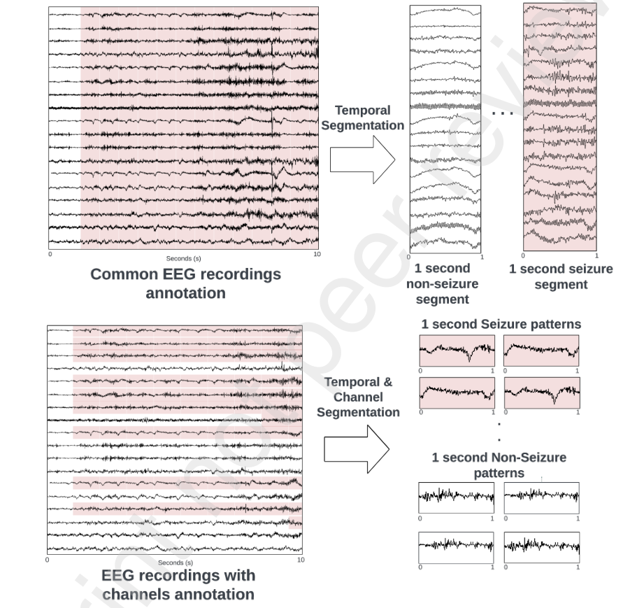
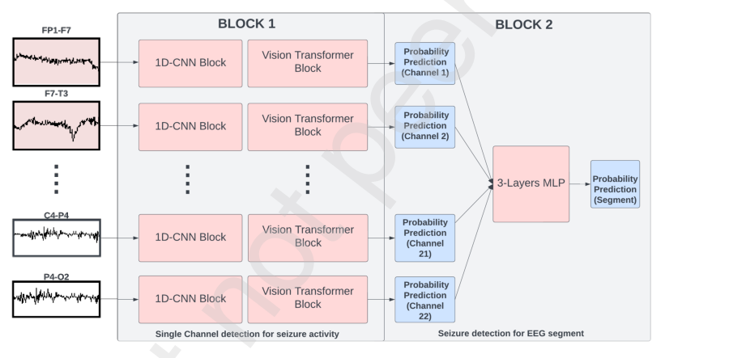
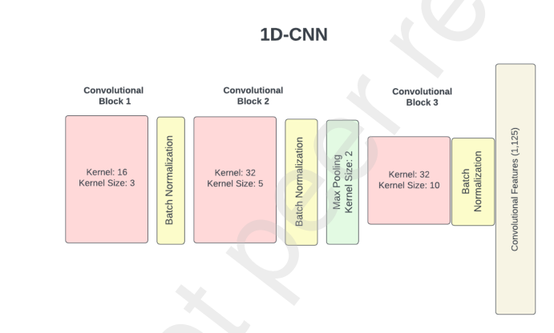
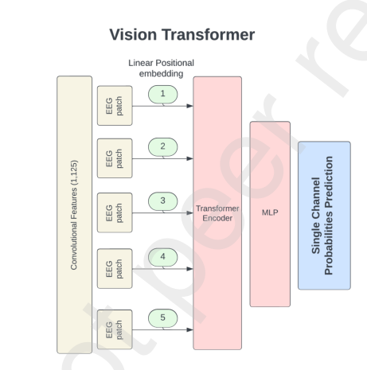
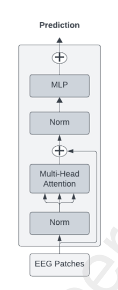
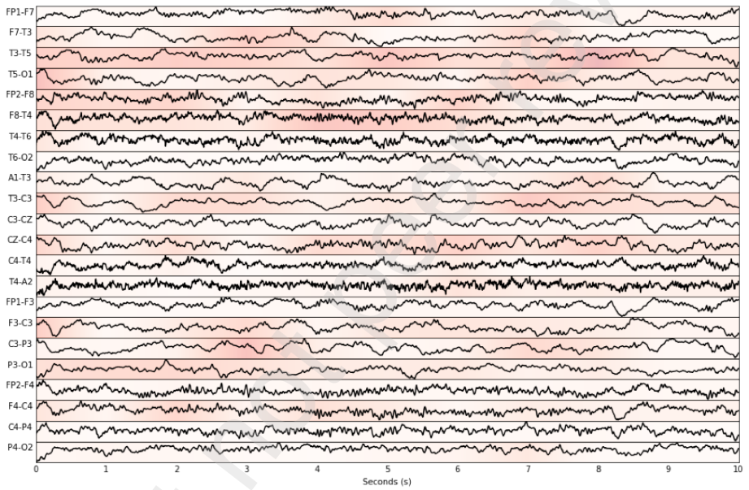
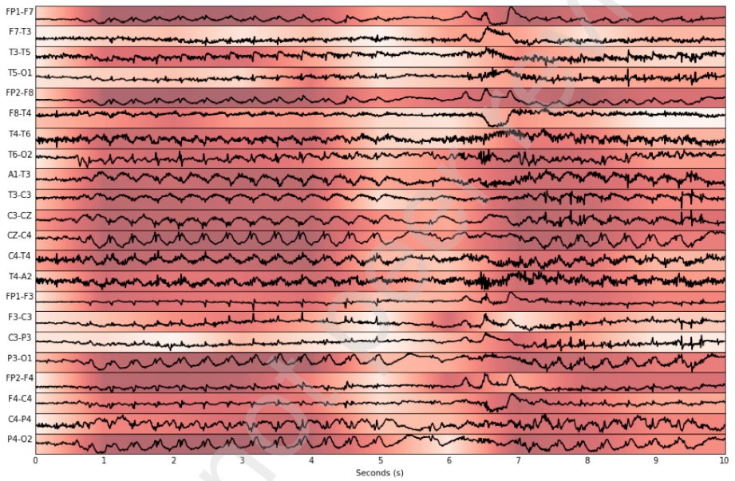
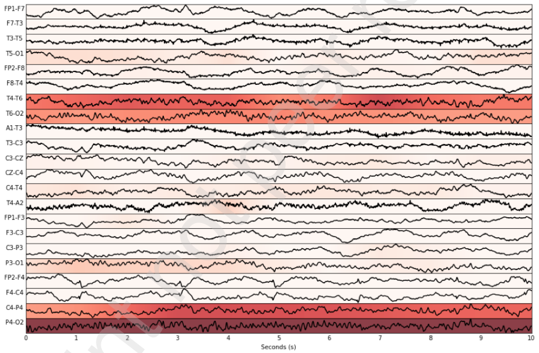
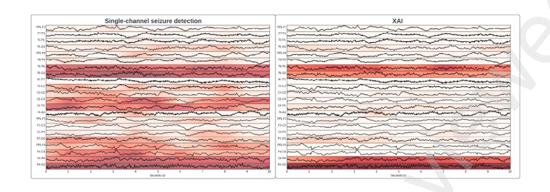

## Channel-Annotated Deep Learning for Enhanced Interpretability in EEG-based Seizure Detection

Sheng Wong [1], Anj Simmons [1], Jessica Rivera-Villicana [2], Scott Barnett [1], Shobi Sivathamboo [3,4,5,6],

Piero Perucca [4,5,6,7,8], Zongyuan Ge [9], Patrick Kwan [3,4,5,6], Levin Kuhlmann [9,10], Terence J. O’Brien [3,4,5,6]

1 _Applied Artificial Intelligence Institute, Deakin University, Burwood, Victoria, Australia_

2 _School of Computing Technologies, RMIT University, Australia_

3 _Department of Neuroscience, Central Clinical School, Monash University, Melbourne, Victoria, Australia_

4 _Department of Neurology, Alfred Health, Melbourne, Victoria, Australia_

5 _Department of Medicine, The Royal Melbourne Hospital, The University of Melbourne, Parkville, Victoria,_

_Australia_

6 _Department of Neurology, The Royal Melbourne Hospital, Parkville, Victoria, Australia_

7 _Epilepsy Research Centre, Department of Medicine (Austin Health), The University of Melbourne, Heidelberg,_

_Victoria, Australia_

8 _Bladin-Berkovic Comprehensive Epilepsy Program, Austin Health, Heidelberg, Victoria, Australia_

9 _Department of Data Science and AI, Faculty of IT, Monash University, Clayton, Victoria, Australia_

10 _Department of Data Science and AI, Faculty of IT, Monash University, Clayton, Victoria, Australia_

**Corresponding author** : Sheng Wong

**Address** : Applied Artificial Intelligence Institute, Deakin University, Burwood, Vic, Australia

**Telephone number** : +61452637725

**Email address** : wongsh@deakin.edu.au

**ORCID** : 0000-0001-7444-1405

1

This preprint research paper has not been peer reviewed. Electronic copy available at: https://ssrn.com/abstract=4713086

### **Highlights**

       - A novel seizure detection algorithm that utilizes channel annotations, employing 1D-CNN and

Vision Transformer (ViT).

       - The proposed algorithm is interpretable and maintains performance comparable to other state

of-the-art seizure detection algorithms.

       - Performance validation was further conducted on another continuous EEG dataset to assess for

generalisability of the proposed algorithm.

2

This preprint research paper has not been peer reviewed. Electronic copy available at: https://ssrn.com/abstract=4713086

**Abstract**

Currently, electroencephalogram (EEG) provides critical data to support a diagnosis of epilepsy

through the identification of seizure events. The review process is undertaken by clinicians or EEG

specialists and is labour-intensive, especially for longterm EEG recordings. Deep learning (DL)

has been proposed to automate and expedite the seizure review and annotation process, providing

superior performance when compared to traditional machine learning (ML) methods. However, DL

algorithms lack interpretability which is a crucial factor for clinical adoption. Consequently, the

“black-box” nature of these DL algorithms limits the transparency of these algorithms, preventing

clinicians from having knowledge of how the predictions are derived. In this study, we propose

a novel two-block seizure detection algorithm that leverages the channel-annotation of the EEG

recordings in the TUH EEG Seizure Corpus (TUSZ) based on the likelihood of seizure activities on

each channel. This method allows direct interpretation of the EEG segment without requiring any

further interpretability or Explainable Artificial Intelligence (XAI) methods during the prediction

phase. Further, we adopted an interpretable method for explaining decisions made by the seizure

detection algorithms, identifying channels that influence the final predictions. This DL approach

utilizing CNN, transformer and MLP achieved an AUC of 0.92 for the seizure detection task,

comparable with other state-of-the-art algorithms. Our algorithm was further validated on a

separate continuous EEG dataset achieving an AUC of 0.82. Additionally, we also evaluated the

reliability and efficacy of our XAI method on predicted seizure events, achieving a sensitivity of

0.59 in accurately localizing channels with seizure activities.

### **Keywords**

Seizure detection; EEG; Deep learning; Interpretable method; XAI ; TUSZ dataset

3

This preprint research paper has not been peer reviewed. Electronic copy available at: https://ssrn.com/abstract=4713086

### **1 Introduction**

Epilepsy is a chronic neurological disorder that affects approximately 1% of people worldwide [1]. This

condition is characterized by recurrent and unpredictable paroxysmal electroclinical brain activities,

known as epileptic seizures [2]. Patients suffering from epileptic seizures face a higher risk for all-cause

mortality, including sudden unexpected death in epilepsy, as well as psychological effects caused by

the uncertainty around the seizure occurrence of the seizures [3–5]. EEG plays an important role

in identifying and localizing seizures, which is used to record the electrical activities of the brain of

a patient. The process of reviewing EEG to diagnose and monitor epilepsy is time-consuming and

laborious [6, 7]. This process involves medical professionals carefully reviewing and annotating EEG

recordings occupying several minutes to an hour. Given the complex nature of EEGs, this review

process might be repeated to minimize the risk of misdiagnosis, further consuming valuable clinical

resources.

The advancement of DL algorithms has opened up the possibility of automated seizure detection to

assist medical professionals in reviewing and annotating EEG recordings efficiently [8–12]. These au

tomated DL algorithms and tools might prove particularly beneficial in the intensive care units, where

clinicians require a rapid initial assessment of the patient’s condition, and in the epilepsy monitoring

units, where EEG data are continuously being recorded and require constant monitoring. These, in

turn, would not only reduce the time needed for review and annotation but would also help in efficient

diagnosis and care of the patients [11, 13, 14].

Studies with DL algorithms have demonstrated performance often exceeding as high as 90% ac

curacy when tested with retrospective EEG data. One study applied a 1D-CNN (one-dimensional

Convolutional Neural Network) model on an EEG spectrogram for seizure detection, achieving an

accuracy of 77.87% [15]. Another study proposed and evaluated a 2D 3-layer CNN model using EEG

data from the time and frequency domain [16]. They concluded that the frequency domain as in

put produced 95.6% accuracy for seizure detection. The use of Long Short-Term Memory (LSTM)

networks, a variant of Recurrent Neural Network (RNN) has also been utilized by multiple studies.

Notably, a study proposed using LSTM in conjunction with features such as Hurst exponent and

auto-regressive Moving Average (ARMA) from discrete cosine transform (DCT), evaluating 2 different

LSTM architectures for seizure detection [17]. The LSTM architectures performed better by 2% when

compared to the traditional ML model on the Bonn dataset. Combining CNN and LSTM, another

study achieved AUCs of 92% and 84% using the TUSZ and RPAH datasets, respectively [18]. Further

more, the application of transfer learning models in seizure detection has produced results comparable

to other DL models, achieving over 80% accuracy on various public datasets [19–21]. The use of Vision

Transformer (VIT) based DL models for seizure detection has also gained traction in recent years. A

4

This preprint research paper has not been peer reviewed. Electronic copy available at: https://ssrn.com/abstract=4713086

study applied this model to EEG data converted into time-frequency representation via Short Time

Fourier Transform (STFT) and achieved state-of-the-art results with an AUC of 92.1% on the TUSZ

dataset [22]. Another group applied self-supervised learning with a Transformer for seizure detection

[23]. Notably, they managed to achieve 88.59% and 89.58% in accuracy and sensitivity respectively,

when retaining only 10% of the data. Another study evaluated a novel Convolutional Transformer on

the CHB-MIT datasets, integrating channel shuffling and applying convolutional layers individually to

time and frequency EEG signals. The approach resulted in a sensitivity of 96.71% and a specificity

of 97.23% [24]. Collectively, the work mentioned above shows the ability of DL in achieving strong

statistical performance for the task of seizure detection.

Despite impressive statistical performance, these studies lack interpretability which is crucial for

clinical adoption in the field of seizure detection. One study investigating barriers to adoption among

medical professionals found that black-box-like seizure detection algorithms and tools were a major

challenge, with 63% of those surveyed identifying them as significant obstacles [25]. This is because

clinicians require reasoning that aligns with the established evidence-based medical practice to validate

the decision made by the model. In seizure detection, clinical patterns and features present in EEG are

used to justify the presence of seizure activities [26–29]. Yet, there are limited studies in the field that

provide explanations or interpretations for the decisions made by their DL models. Hence, without

the ability to explain or interpret decisions made by the DL algorithms, the potential for adopting

these tools in clinical settings remains limited. Although interpretability and XAI methods have been

applied in the field of healthcare, especially in the field of medical imaging [30–33], there are only a

few attempts in the field of seizure detection.

One study utilized SHAP DeepExplainer and GradientExplainer to explain the frequency bands

and channels that contribute to final predictions [34]. However, the study’s user group, tasked with

assessing whether the XAI method expedited prediction validation, lacked expertise in ML, EEG, or

neonatal seizures. Another study utilized SHAP by identifying important hand-crafted features that

contribute to the predictions made by the proposed model, Light GBM [35]. In another study, the

authors visualized the channel-wise attention weights stemming from the self-attention mechanism of

their transformer model [36]. Similarly, another study generated a heat-map based on the attention

of the transformer model and Grad-CAM with RESNET [37]. However, the heat-map generated from

DL models does not provide any meaningful explanation for clinicians as the visualizations are often

too granular. The occlusion approach, involving zero-filling of EEG channels to observe changes in

predictions, has also been employed to localize seizures [18, 38, 39]. The occlusion approach unfor

tunately overlooks the spatial and temporal relationship of seizure events. Furthermore, there are

limited evaluations of the explanations that XAI methods proposed, making it difficult to assess their

usefulness and reliability in providing interpretation or "reasons" for the predictions made by their

5

This preprint research paper has not been peer reviewed. Electronic copy available at: https://ssrn.com/abstract=4713086

model.

In this study, we propose a novel two-block shallow 1D CNN transformer model with ensemble

Multi-Layer Perceptron (MLP) for seizure detection and is designed to be interpretable, while main

taining state-of-the-art performance. Unlike conventional DL seizure detection algorithms which pro

cess multi-channel EEG recordings as an image to distinguish between seizure and non-seizure events,

we have restructured the input to focus on single-channel EEG recordings of either seizure patterns

or non-seizure patterns. The predictions from single-channel data are then assembled and processed

through an MLP for segment-level predictions. This adaptation also reduces noise and enables better

channel invariance. Our method, trained on the largest publicly available EEG datasets encompassing

a diverse range of seizure types, was also validated on out-of-sample EEG seizure data. Addition

ally, the focus on single-channel data facilitates the identification and visualization of specific areas

associated with positive seizure detection, enhancing interpretability. We further propose a seizure

localization technique using the XAI method, specifically employing DeepSHAP to visualize the chan

nels that contribute to the final predictions. An evaluation of this method was also conducted to assess

its effectiveness and applicability in real-world scenarios. In summary, the main contributions of this

work are:

        - A novel algorithm for seizure detection grounded on ensemble seizure likelihood across individual

EEG channels, employing channel annotations for enhanced interpretability, using a 1D-CNN

Transformer combined with ensemble MLP. The algorithm achieved a state-of-the-art perfor

mance of AUC 0.92.

       - We validated our performance on an external, out-of-sample continuous EEG dataset from 62 pa

tients, achieving an AUC of 0.82 without further training or tuning. This step is often overlooked

in seizure detection studies.

        - Proposed and conducted an evaluation of the reliability and efficacy of the interpretability meth

ods used in this study for seizure activities and localisation. The evaluation of interpretability

or XAI methods in seizure detection studies is often not evaluated.

### **2 Materials and Methods**

**2.1** **Dataset**

In this section, we describe the datasets that are used to develop and evaluate our proposed DL

algorithms. The study utilized two scalp EEG datasets for the task of seizure detection.

The TUSZ is a publicly available EEG dataset that was made publicly available online in 2018 and

6

This preprint research paper has not been peer reviewed. Electronic copy available at: https://ssrn.com/abstract=4713086

consists of the largest number of EEG recordings from patients with epilepsy [40]. The dataset stands

out as the most comprehensive dataset featuring EEG recordings from various clinical settings including

outpatient treatments, ICU, and EMU among other locations. This dataset (version 2.0.1) is divided

into training, development and evaluation sets. The training set consists of 1175 EEG recordings

from 579 patients with a total of 2474 seizure events (significantly larger than other publicly available

datasets such as CHB-MIT), while the evaluation set contains 126 EEG recordings of 43 patients,

containing 469 seizure events. The dataset follows a montage of 10-20 EEG International systems of

electrode placements and consists of between 19 to 21 electrodes. A distinctive feature of TUSZ is that

it contains channel annotation for seizure events. Each channel is annotated with precise information

on the onset and termination of seizure events, a unique feature that distinguishes TUSZ from other

EEG datasets where annotations are typically time-based. Furthermore, this dataset also contains

annotated labels of seizure type, consisting of 8 distinct seizure classifications. These characteristics of

the dataset make it a good candidate for the development of generalizable seizure detection algorithms.

In our study, the training and development set was used to train and validate our DL seizure detection

algorithms. The evaluation set was used to evaluate the in-patient performance of our algorithm and

allowed us to compare the performance with other studies.

Our study also incorporated a second EEG dataset consisting of 62 patients with a total of 168

seizures who underwent inpatient video-EEG monitoring at the Comprehensive Epilepsy Program at

the Royal Melbourne Hospital (RMH) [41]. During the monitoring period, antiseizure medications were

withdrawn and patients underwent sleep restrictions. The epilepsy diagnosis for these patients was

established in a meeting with epileptologists, neuropsychiatrists, radiologists, and neurosurgeons at

the end of a 5-day admission period, where all available clinical and diagnostic information, including

EEG recordings, was reviewed. The EEG recordings were independently reviewed by board-certified

epileptologists. The EEG recordings followed the 10-20 International system of electrode placements

and consisted of between 21 to 30 EEG electrodes and varied according to patients. The time of

seizure onset was determined by either clinical onset or electrographic onset. Complete information

on the EEG datasets can be found here [41]. This RMH dataset was exclusively used to evaluate the

generalisability of our proposed seizure detection algorithm and was not used for further training. By

evaluating our algorithm on this continuous, diverse and unseen dataset, characterized by a distinct

patient group, recording apparatus, and location, we were able to validate the performance of our

seizure detection model robustly.

7

This preprint research paper has not been peer reviewed. Electronic copy available at: https://ssrn.com/abstract=4713086

**2.2** **Preprocessing**

Both datasets, from the TUSZ and RMH, underwent similar preprocessing steps to ensure consistent

input for the seizure detection algorithms. Given that the RMH dataset included additional EEG

signals, we extracted only the 19 EEG electrode signals that are consistent with the TUSZ dataset

to maintain uniformity in the model’s input. For the TUSZ dataset, any instances lacking specific

electrodes were zero-filled to ensure a consistent number of input channels. All EEG recordings were

then converted to a bipolar montage (of differences between pairs of EEG electrode signals), aligning

with the annotation format of the TUSZ dataset. The 22 channels included in the bipolar montage are:

’FP1-F7’, ’F7-T3’, ’T3-T5’, ’T5-O1’, ’FP2-F8’, ’F8-T4’, ’T4-T6’, ’T6-O2’, ’A1-T3’, ’T3-C3’, ’C3-CZ’,

’CZ-C4’, ’C4-T4’, ’T4-A2’, ’FP1-F3’, ’F3-C3’, ’C3-P3’, ’P3-O1’, ’FP2-F4’, ’F4-C4’, ’C4-P4’, ’P4-O2’.

We also resampled any EEG signals in both datasets to 250 Hz to ensure consistency in the temporal

resolution.

EEG signals are often contaminated with artefacts and noise arising from diverse sources, including

patient movement and environmental factors [42, 43]. This interference can adversely affect the data

quality. We applied a bandpass filter of between 0.1Hz and 60Hz to reduce noise. The Delta ( _≥_ 1 to

< 4 Hz), Theta ( _≥_ 4 to < 8 Hz ), Alpha ( _≥_ 8 to < 13 Hz), Beta ( _≥_ 13 to <30 Hz), and Gamma

( _≥_ 30 Hz) frequency bands are crucial for seizure detection, and by eliminating higher frequencies,

which typically contain muscle artefacts and noise, the signal quality is improved [44]. In addition

to the bandpass filter, we applied a notch filter of 50Hz (for RMH) and 60Hz (for TUSZ) to remove

electrical and radio frequency interference. Both of these processes enhance the signal-to-noise ratio

(SNR), ensuring our DL for more efficient seizure detection.

We applied EEG segmentation across both time and channel dimensions. Typically, DL algorithms

process image-based inputs, segmenting EEG recordings into equal-length segments (ranging from 1s

to 30s). We define this as temporal segmentation. This traditional method maintains the channel

size while breaking down the EEG recordings into smaller segments. However, challenges arise when

channels with no seizure activity are included in these segments, introducing noise to the DL models,

and potentially preventing the DL models from efficiently discriminating between seizure and non

seizure patterns. Given that TUSZ contains channel-based annotation where the seizure onset and

termination time are annotated on each channel, this level of annotation is beneficial for various

reasons. For instance, in the case of focal onset seizures, the onset originates in a specific brain region

and can then spread to other areas, leading to varied onset times across different EEG channels.

Additionally, certain types of seizures may be confined to specific channels, reflecting the localized

nature of the seizure’s activity within the brain. These distinctive characteristics of the TUSZ dataset

enable a more refined segmentation of the multichannel EEG recordings, as opposed to other datasets

8

This preprint research paper has not been peer reviewed. Electronic copy available at: https://ssrn.com/abstract=4713086

Figure 1: Two annotation methods in EEG datasets for seizure detection. The common annotation
marks seizure onset and termination times across all channels (Top). channel-specific annotation
individually marks each channel (Bottom).

9

This preprint research paper has not been peer reviewed. Electronic copy available at: https://ssrn.com/abstract=4713086

where multichannel segments contain non-seizure and seizure. We broke these recordings down into

individual channel segments, each distinctly characterized by seizure or non-seizure activities. Both of

the segmentation methods are shown in Figure 1.

Thus, every 1-second increment of temporal segmentation was expanded to yield 22 unique temporal

and channel segments. In practical terms, this means that a single multichannel segment containing

a seizure is equivalent to 22 individual channel segments, each offering specific insights into the EEG

characteristics.

**2.3** **Overview of the Architecture**

Our proposed DL algorithm consists of two principal blocks, as shown in Figure 2. The first block

employs a 1D CNN shallow Transformer, designed to effectively distinguish between seizure and non

seizure patterns from individual EEG channels.

Figure 2: Shows the architecture of our proposed two-block seizure detection algorithm. The first block
consists of a 1D CNN-Transformer model used to detect seizure activity on channel levels, while the
second block is made up of 3 layers MLP for seizure detection on segment levels. (Red EEG segments
contain seizure activity while white EEG segments do not contain seizure activity.)

The 1D-CNN Transformer is tailored to analysing single-channel EEG data, spared from the com

plexity of navigating through inter-channel features and relationships inherent in multichannel EEG

segments. This streamlined approach enhances both the model’s computational efficiency and its per

formance. Unlike traditional approaches of using multi-channel segments, where DL models sometimes

struggle with the intricate task of differentiating seizure activities amidst the noise and non-seizure

patterns scattered across multiple channels, our model’s focus on individual channels simplifies this

10

This preprint research paper has not been peer reviewed. Electronic copy available at: https://ssrn.com/abstract=4713086

process. This is particularly beneficial in cases like focal seizures, where non-seizure channels can

introduce noise. The single-channel approach with short segment length (1s), is geared towards a

more precise identification of seizure patterns, untainted by the noise common in multichannel data.

This not only enhances the model’s efficiency but also negates the need for intricate multi-layer Trans

formers. Hence, every segment of multichannel recordings yields 22 numbers of predictions, with each

prediction indicating the likelihood of a seizure activity occurring in that specific channel in a 1-second

segment.

This focused approach fosters efficient learning and accurate seizure detection since the 1D-CNN

Transformer does not have to deal with the complex task of separating activities from non-seizure

patterns spread across different channels, especially those seen in focal seizures, where there are non

seizure channels. This approach emphasises identifying seizure patterns without the noise inherent in

multi-channel EEG recordings based on seizure type. Since it is a single EEG segment, the model

is not required to learn complex inter-channel features and relationships. Unlike typical Input using

multichannel EEG segments, a single-channel input reduces the need for the model to learn and

separate seizure activity amidst the noise and non-seizure activity that are prevalent in other channels,

which are often seen in focal seizure types. This approach reduces the need for a deep multi-layer

Transformer and translates to a more efficient and effective model distinguishing seizure and non

seizure activities on the channel levels. In contrast, typical DL models that accept EEG multi-channel

segments are required to learn from more complex and noisy features and to differentiate seizure

activities from the noise and activities of non-seizure channels. We believe that this streamlined

approach to the detection of seizure activities based on single-channel EEG data allows the model to

learn more efficiently. Hence for each single segment of multichannel recordings, there are “n” number

of predictions. These probability predictions indicate the likelihood of a seizure happening in that

channel of a segment and effectively act as a seizure detection on the channel level.

The second block of our architecture integrates a (MLP), enhancing the model’s decision-making

process. This block is tasked with synthesizing the ensemble of probability predictions generated from

individual EEG channels, as analyzed in the first block of particular segments. Each EEG channel, after

being processed through the 1D-CNN Transformer, yields a probability prediction. These predictions,

though insightful, might not be definitive of seizure activities in the segment. The ensemble approach

aids in amalgamating these diverse predictions to harness a collective insight, but there’s a recognition

that simply averaging or selecting max values could lead to potential biases or be skewed by extreme

values and noise. This is where the MLP proves invaluable, offering improved analysis that goes

beyond simple aggregation of probabilities. It evaluates the ensemble of probabilities, navigating

through the complexities and potential false positive events associated with individual predictions.

The MLP is proposed to sift through the noise and extreme values, extracting a more accurate and

11

This preprint research paper has not been peer reviewed. Electronic copy available at: https://ssrn.com/abstract=4713086

reliable indication of seizure activities from the synthesized data, and providing an overall prediction

of a segment that is holistic. The full architecture of our algorithms can be found in Appendix Figure

A1.

**2.3.1** **1D CNN**

Since CNN has proven to have the ability to extract discriminatory features from complex input data,

many studies have used it as an automated features extraction model to extract relevant features[16,

24, 45, 46]. In the field of seizure detection, it is an ideal candidate to extract discriminatory EEG

features.

Figure 3: Shows the architecture of our 1D-CNN in the first block.

In our specific case, since our input is a single-channel EEG segment, we used a 1D CNN to extract

relevant features. As seen in Figure 3, Our 1D-CNN consists of 3 layers with kernels of varying sizes to

capture a diverse range of EEG features. The process involves the kernels (filters) sliding temporally

across the EEG segments, performing convolution to extract both local and global patterns. In the

initial two layers, the kernel size is set at 3 and 5 to capture short and localized features. This includes

EEG features like spikes and sharp waves, essential for capturing sudden and brief changes in patterns

indicative of seizure activities. The last convolutional layer consists of a kernel size of 10 which is

intended to capture global patterns and temporal correlations in the EEG segment. Such features,

including periodic patterns and complex waves, are useful in identifying seizure activities in a channel.

We have also included the max pooling layers between convolutional blocks to help in reducing the

temporal dimension. This approach not only helps in improving computational efficiency but with

capturing invariant features.

12

This preprint research paper has not been peer reviewed. Electronic copy available at: https://ssrn.com/abstract=4713086

**2.3.2** **Vision Transformer**

ViT inspired by the Transformer architecture, has been proposed and used extensively in the field

of image recognition in recent years [47–49]. However, few studies have applied ViT for the task of

seizure detection, especially in large publically available EEG datasets. The ability of VIT to capture

short and long-term dependencies across time and assess the importance of different parts of the input

through the self-attention mechanism makes it an ideal candidate for the use of seizure detection,

given that EEG data exhibit both temporal and spatial characteristics. In this section, we will briefly

describe each aspect of the ViT for our seizure detection algorithm.

Figure 4: Shows the architecture of our ViT in the first block[47].

In our model, the 1D-CNN processed EEG signals with a temporal length of 125 were divided into

five non-overlapping patches of size 25 with dimensions of (1, 25), as seen in Figure 4. Each patch

was linearly embedded into a vector using a matrix transformation forming a sequence of embedded

patches. To retain the sequential order and spatial information of each patch (which is important in

EEG signals for temporal dynamics and feature interactions), positional encodings were added. Along

with the class token, the embeddings served as an input for the ViT.

The transformer encoder mainly consists of the normalization layer, multi-head attention Layers

and a block of feedforward neural networks, MLP. Figure 5 shows the general architecture of the

Transformer encoder. Notably, the multi-head attention layer involves multiple attention mechanisms,

processing in parallel, each extracting different and diverse features, offering a richer representation

of the features obtained from 1D-CNN. Like the CNN model, multiple layers of multi-head attention

13

This preprint research paper has not been peer reviewed. Electronic copy available at: https://ssrn.com/abstract=4713086

Figure 5: General architecture of the Transformer encoder.

allow for more complex and diverse EEG features captured. In practice, the model evaluates the full

signals, attending to specific parts of the segments based on their importance. The outputs produced

from each self-attention layer are concatenated and linearly transformed to form the output of multi

head attention. This approach ensures that the model can simultaneously focus on different portions

of the EEG segments to derive useful insights. The MLP processes the concatenated flattened vector

output from the attention layers and transforms it into predicted probabilities for each EEG channel,

indicating the likelihood of seizure activities or patterns in the specific channels. Here, we propose an

efficient and shallow ViT with a depth of 2 and 12 heads of attention in each layer, which is significantly

lower than the original ViT.

**2.3.3** **MLP for Seizure Detection**

Using the probability predictions made by the ViT for each channel, we concatenated each of the

predictions into a one-dimensional vector. This vector, containing 22 probability predictions corre

sponding to a single segment of each of the 22 channels, represents the likelihood of seizure patterns

occurring within each respective channel. These probability values are treated as features and fed into

a 3-layer MLP designed for final seizure detection, which also captures the spatial information for a

particular seizure type.

14

This preprint research paper has not been peer reviewed. Electronic copy available at: https://ssrn.com/abstract=4713086

The MLP is engineered to analyze the entire set of 22 channels, thereby capturing spatial infor

mation crucial for localizing seizure events. Each final prediction rendered by the MLP reflects the

probability of a seizure event occurring at the segment level. This simple mechanism helps in incorpo

rating knowledge about the typical spread and patterns of various seizure types across EEG channels.

This nuanced understanding embedded in the MLP 1) reduces the false positives, 2) ensures predictions

are not only based on isolated channel activities, and 3) broader neurophysiological nature of seizures.

This methodological approach mitigates the limitations associated with simpler strategies, where noise

or isolated incorrect predictions in a single channel can compromise the efficacy of straightforward

aggregation methods during post-processing for seizure detection.

**2.4** **Interpretable and XAI for Seizure Detection**

The first block of our DL algorithm is adept at detecting seizure activities by interpreting each EEG

channel individually. The probabilities produced indicate the likelihood of seizure activity in the

specific channels and segments. The probabilities were then turned into a heatmap superimposed on

top of the EEG signals. This granular 1 second, yet simple approach to prediction, unlike traditional

methods that evaluate multi-channel EEG segments as a whole, enables users to pinpoint the regions of

seizure activities efficiently for a seizure event, especially for focal seizure type. Users gain insights into

the distinct behavioural patterns of each channel during seizure events, eliminating the need for post

processing or additional interpretive techniques. The model’s design inherently supports individual

channel interpretation, making it intuitive. Figure 6 depicts an EEG segment where no significant

seizure activities are observed, demonstrating normal brain activity. Our seizure detection algorithm

accurately identified this EEG segment. In contrast, Figure 7 provides an example of our algorithm’s

capability, showcasing detected seizure activities during an event. Additional examples are available

in Appendix in Figure A2, A3 and A4.

While the first block of our seizure detection architecture provides interpretability for the users,

it does not explain how the overall prediction for the seizure detection algorithm (based on both the

first and second blocks) is derived. Since the second block might utilize only partial information for

the final prediction, we employed DeepSHAP to understand which channels are critical for the final

prediction. This adds a layer of explanability to our DL algorithm.

DeepSHAP is an XAI method designed to explain the predictions made by neural networks [50].

Its primary goal is to determine the importance of each feature, which, in our case, channels, to

the model’s final predictions. DeepSHAP leverages the strength of the 2 XAI method for efficient

explainability in neural networks ensuring efficient and consistent explanations of neural networks’

predictions [50]. DeepLIFT measures features’ contribution by comparing the feature’s activation of

15

This preprint research paper has not been peer reviewed. Electronic copy available at: https://ssrn.com/abstract=4713086

Figure 6: Shows a predicted EEG segment characterized by normal brain activity, with a noticeable
absence of seizure indications in any channels based on the first block of the seizure detection archi
tecture.

16

This preprint research paper has not been peer reviewed. Electronic copy available at: https://ssrn.com/abstract=4713086

Figure 7: The first block of seizure detection at the channel level for an absence seizure event is depicted.
The algorithm adeptly identifies the seizure patterns, marked in dark red (smoothing applied), which
are typical indicators of an absence of seizure. These patterns are characterized by 3Hz spike-andwave discharges which can be seen between the 1-5 second marks. Channels such as ’A1-T3,’ ’CZ-C4,’
’P3-O1,’ and ’P4-O2’ prominently exhibit these seizure patterns. Conversely, channels ’F7-T3’ and
’T5-O1’ display a minimal likelihood of seizure activity, as reflected in their relatively light colouration.

17

This preprint research paper has not been peer reviewed. Electronic copy available at: https://ssrn.com/abstract=4713086

an input to the baseline activation with backpropagation, which is specifically designed for neural

networks [50, 51]. This is particularly useful in neural networks where the architectures are often

non-linear. On the other hand, SHAP assesses the average contribution of each channel, considering

all possible combinations of channels [52]. It bases these calculations on a subset of background

training EEG data, ensuring consistency in the evaluations of each channel’s contribution. However,

this process can be computationally intensive when applied to neural networks. DeepSHAP bridges

the gap by integrating the computational efficiency of DeepLIFT’s backpropagation approach with the

consistency of SHAP’s feature importance score. This XAI method provides enhanced and efficient

explanations of predictions made by neural networks. This approach is important in understanding

the intricate interactions among various EEG channels that influence the model’s decisions.

Figure 8: Shows our XAI approach attempt to identify channels that contribute to the final predictions
in 10-second EEG segments. Based on clinical annotations, seizure activity was identified in the
channels “T4-T6”, “T6-O2”, “CZ-C4”, “C4-T4”, “F4-C4”, “C4-P4”, and “P4-O2”. Our XAI approach
utilized 4 out of these 7 channels for positive seizure detection.

We applied DeepSHAP to a detected seizure event, which is composed of multiple seizure segments.

By aggregating the DeepSHAP values, we localised channels that contribute the most to the overall

detection of the seizure event. This aggregation not only provide an approximation of the seizure

location influential to the final prediction, but it also helps in reducing any extreme values or noise

18

This preprint research paper has not been peer reviewed. Electronic copy available at: https://ssrn.com/abstract=4713086

from individual segments. By referring to the collective contribution across multiple seizure segments,

users get a more reliable picture of the channel’s importance, minimising the impact of anomalies found

in individual segments.

Figure 8 illustrates a practical application, highlighting specific channels identified by DeepSHAP

as pivotal in predicting a seizure event. These influential channels are highlighted, offering insights

into the patterns that are most contributing to the final prediction. As such, it improves transparency

and enables greater confidence in its predictions. It’s essential to emphasize that the primary objective

here is to understand the decision-making process of the model, offering a comprehensive insight into

how various features are weighed and interpreted to arrive at a final prediction.

### **3 Evaluation**

**3.1** **Channel-based Seizure Detection**

We evaluated how well our algorithm detects seizure activities at the channel level. The goal here is

to evaluate the performance of our algorithm in discriminating between the single channel of seizure

segment activities and non-seizure ones. This process only requires the first block of our algorithm.

AUC (Area under the curve) is a good candidate for evaluating the performance as it takes into

account the imbalanced nature of our EEG data. Along with that, we will use sensitivity, specificity

and accuracy. The evaluation was only done on TUSZ since it contains per-channel annotation.

**3.2** **Segment-based Seizure Detection**

We evaluated the performance of segment-based seizure detection. This requires both blocks of the

algorithms during evaluation. The algorithm was evaluated on the TUSZ test set and The RMH EEG

dataset to determine the generalisability of our model on another patient population. This is the most

common evaluation method used to evaluate a seizure detection algorithm. Further to that, we also

compared our algorithm with other studies that utilized the TUSZ dataset for seizure detection.

**3.3** **XAI**

For the first block of algorithms, no evaluation was needed as the results are interpretable from the

single-channel predictions. Essentially, the predictions made by the algorithms directly reflect whether

there is seizure activity in a channel. Hence, the evaluation is identical to channel-based seizure

detection.

For the second block’s algorithm, our evaluation centred on XAI assessment, taking into account

the focused channels—these are the channels that significantly contribute to the predictions, based on

19

This preprint research paper has not been peer reviewed. Electronic copy available at: https://ssrn.com/abstract=4713086

the likelihood of seizure patterns for each channel (predictions from the first block). We compared

these focused channels with the expert-annotated channels associated with actual seizure events. This

direct comparison allowed us to evaluate the usefulness of the model’s decision-making in the context

of expert annotations. It provided a quantitative measure of the explainability of its algorithm. The

evaluation was done on the event level (single seizure event) as opposed to the segment level as the

segment (1 second of seizure event) assessment for XAI does not provide a meaningful value. The

formula is expressed as:

_TP_
Sensitivity =
_TP_ + _FN_

where _TP_ is the count of focused channels that match expert annotations and _FN_ is the count of

expert-annotated channels that the model missed.

### **4 Result**

**4.1** **Channel-based Seizure Detection**

For seizure detection at the channel level on the TUSZ dataset, which involves only the first block of

our algorithm, our model achieved an overall AUC of 0.90, accuracy of 0.88, specificity of 0.91 and

sensitivity of 0.73. When we evaluated the performance by cohorts of seizure type, our algorithm

achieved the highest AUC and sensitivity in ABSZ at 0.97 and 0.87 respectively, making it a good

candidate for the detection of this seizure type. As for specificity, CPSZ achieved the highest at 0.95.

The performance of the algorithm based on seizure type can be seen in Table 1. (Note that the

evaluation at the channel level was not analyzed on the RMH dataset as it did not contain channel

annotations).

Seizure type AUC Accuracy Specificity Sensitivity

Focal Non-Specific Seizure (FNSZ) 0.92 0.88 0.89 0.77

Generalized Non-Specific Seizure
0.86 0.79 0.80 0.73
(GNSZ)

Complex Partial Seizure (CPSZ) 0.96 0.94 0.95 0.79

Absence Seizure (ABSZ) 0.97 0.92 0.92 0.87

Tonic Seizure (TNSZ) 0.84 0.84 0.84 0.70

Tonic-Clonic (TCSZ) 0.87 0.78 0.78 0.79

ALL 0.90 0.88 0.91 0.73

Table 1: Performance by cohorts seizure type for channel-based seizure detection on TUSZ.

20

This preprint research paper has not been peer reviewed. Electronic copy available at: https://ssrn.com/abstract=4713086

**4.2** **Segment-based seizure detection**

For seizure detection at 1-second segment levels on the TUSZ dataset, our model achieved an overall

AUC of 0.92, accuracy of 0.85, specificity of 0.85 and sensitivity of 0.82. When we evaluated the

performance by cohorts of seizure type, our algorithm achieved the highest AUC and specificity in

CPSZ at 0.93 and 0.96 respectively. Our approach achieved the highest sensitivity in FNSZ, GNSZ

and ABSZ, all with a value of 0.80. Our approach had the lowest performance on TNSZ in terms of

AUC and sensitivity at 0.82 and 0.58 respectively. This diminished performance can potentially be

attributed to the inherent complexities associated with TNSZ, including the muscle artefacts and the

elusive electrodecremental pattern, which often cloaks polyspikes, preventing accurate seizure detection

by our algorithm. The performance of the algorithm on the segment level can be seen in Table 2

Seizure type AUC Accuracy Specificity Sensitivity

FNSZ 0.91 0.84 0.85 0.80

GNSZ 0.90 0.84 0.84 0.80

CPSZ 0.93 0.93 0.96 0.75

ABSZ 0.91 0.91 0.90 0.80

TNSZ 0.82 0.90 0.91 0.58

TCSZ 0.83 0.71 0.70 0.79

ALL 0.92 0.85 0.85 0.82

Table 2: Performance by cohorts seizure type for segment-based seizure detection on TUSZ.

In comparison with other algorithms trained and tested on the TUSZ dataset, our approach achieved

an AUC of 0.92, second only to Baghdadi et al. [53] at 0.92. However, their training and evaluation

process involved stratified cross-validation, where recordings from the same patient may appear in

both training and evaluation sets. This approach could lead to data leakage, potentially inflating

performance metrics by exposing their model to test patients during training. Moreover, the fact that

we utilized a shorter EEG segment of 1 second, as compared to most of them at more than 3 seconds,

can translate into an advantage in terms of faster onset detection and shorter latency. Although other

studies using TUSZ have reported superior performance, they often utilized only a portion of the

dataset for training and evaluation, which might not accurately reflect their models’ true performance.

[54–56]. For example, Khan et al. [54] achieved an accuracy of 0.94 but used a total of 2 hours of EEG

data, compared to other studies utilizing over 1400 hours of EEG data. Table 3 shows the performance

metrics of studies utilizing TUSZ for training and evaluation.

We further validated the performance of our segment-based seizure detection algorithm (incorpo

rating both Block 1 and 2) by evaluating it on the RMH dataset without additional training or tuning.

The algorithm demonstrated robust performance, achieving an AUC of 0.82, an accuracy of 0.72, and

a sensitivity of 0.82. Notably, perfect AUC scores of 1 were attained for two patients (Patients 55

21

This preprint research paper has not been peer reviewed. Electronic copy available at: https://ssrn.com/abstract=4713086

Window
Data
Authors Model (seconds, AUC Accuracy Sensitivity Specificity Precision
Usage
s)

Saab et al. [57] Dense-CNN 12s 0.78 - - - - Complete

Tang et al. [38] GNN 12s 0.83 - - - - Complete

Yang et al. [18] CNN-LSTM 12s 0.84 - - - - Complete

Das et al. [58] DCRNN 12s 0.88 - - - - Complete

Khan et al. [54] CNN 1s - 0.94 0.97 0.97 - Partial

Lina et al.[55]

Random
Forest/
Gradient

Boosting

20s 0.96 0.91 - - - Partial

Ma et al. [22] Transformer 12s 0.92 - - - - Complete

CNNPeh et al. [59] 3s - 0.82 0.89 0.62 - Complete
Transformer

Einizade et al.

[60]

Attention
based Neural 3s - 0.86 0.83 - - Partial

Network

Baghdadi et al. Attention- 5s 0.97 0.97 0.97        - 0.97 Complete

[53] based LSTM

Knowledge
Zheng et al. [61] Distillation 5s 0.83        -        -        - Complete
GNN

Rahmani et al.
Meta GNN 10s 0.83             -             -             -             - Partial

[62]

Adversarial
Yang et al. [56] Neural 1s        - 0.86 0.83 0.87        - Partial
Network

**1DCNN-**
**This Work** **1s** **0.92** **0.85** **0.82** **0.85** **0.54** **Complete**
**ViT-MLP**

Table 3: Performance of seizure detection algorithms from various studies on TUSZ.

22

This preprint research paper has not been peer reviewed. Electronic copy available at: https://ssrn.com/abstract=4713086

and 59) and 40% of the patients achieved AUC of over 0.9 AUC. The detailed performance metrics

for each patient’s session are provided in Table S1 of the supplementary materials. Furthermore, our

algorithm’s performance was compared with a previous study that utilized the same RMH dataset for

in-sample training and testing. Our algorithm, evaluated without additional training, outperformed

the prior study, which achieved an AUC of 0.64 [41].

**4.3** **Explainability**

In the final prediction produced by our two-block seizure detection algorithm, we attempted to under

stand the reasoning (which channels are used) behind the predictions. The overall sensitivity of our

model in terms of accurately highlighting channels’ contribution to seizure events when compared to

the ground truth annotation is 0.59. Our approach has the highest sensitivity on FNSZ and ABSZ

at 0.63, while it has the lowest sensitivity on GNSZ at 0.57. Our XAI approach highlights the ability

of the proposed algorithms to help in identifying and understanding seizure regions, which is key to

epilepsy surgery and treatments.

Seizure type Sensitivity

FNSZ 0.63

GNSZ 0.57

CPSZ 0.56

ABSZ 0.58

TNSZ 0.63

TCSZ 0.59

**Overall** **0.59**

Table 4: The average sensitivity by seizure type of the proposed XAI when compared to the ground
truth annotation

### **5 Discussion**

In this study, we report a novel two-block DL algorithm for seizure detection using single-channel

segments with annotation as input. By using the predicted seizure likelihood of those channels, we

enhance segment-level seizure detection, minimizing the impact of noise, and unnecessary information

learned during training. Our channel-level detection mechanism stands out for its interpretability,

attributable to the utilization of short segments that are channel-specific. Further, to bolster the

transparency of our approach, we incorporated an XAI method, aiming to explain the model’s decision

making process.

23

This preprint research paper has not been peer reviewed. Electronic copy available at: https://ssrn.com/abstract=4713086

While some studies have investigated seizure detection using single-channel EEG segments, their

algorithms are not designed to handle multi-channel EEG segments [15]. To date, studies utilizing

channels with annotated information are limited. One such study employed a CNN-Transformer

based algorithm that requires aggregated feature extraction based on brain topology after channel

level prediction and includes a final layer where the data is fed into XGBoost for classification [59].

In contrast, our approach does not require such complex feature extraction in the second block to

achieve identical performance; instead, we rely on MLP to adaptively learn the seizure dynamics for

final classification. Furthermore, our overall architecture is shallower, thus requiring less computation.

We achieved state-of-the-art performance similar to other studies using the TUSZ dataset with an

AUC of 0.92. This achievement was realized without complex DL model training, attributable to our

strategy of simplifying multichannel EEG data to single-channel inputs. This reduction eliminates the

need for the model to learn the complex spatial-temporal relationships in the EEG data, simplifying

the problem into manageable segments for individual channel detection and ensemble predictions for

multichannel seizure detection.

We would also like to highlight that the varying metrics used in these studies make direct compar

isons challenging. For example, while our precision is low, a comparison is challenging as none of the

studies listed in Table 2 reported this metric. Furthermore, the training and evaluation methodolo

gies, along with the amount of data used, vary significantly across studies, adding to the complexity

of comparison. Despite these challenges, we attempted to compare using the most commonly reported

metric, AUC. We would also like to acknowledge the existence of other studies that utilize the TUSZ

dataset but are not included in Table 2. These studies were omitted because they focus on different

classification tasks, such as patient-specific seizure detection and seizure type classification.

On the independent RMH EEG dataset, we have successfully shown that the combination of our

proposed algorithm and training on larger EEG datasets yields improved performance even when

compared to models trained within-sample EEG data. To further validate this, we benchmarked our

model’s generalisation capability against other studies that employed the TUSZ dataset and also tested

their models on out-of-sample populations. As indicated in Figure 5, our model achieved similar or

exceeded the performance of these studies, obtaining a score of 0.82 in both AUC and sensitivity when

evaluated on the RMH EEG dataset. While direct comparisons of performance are difficult due to

dataset variations, the primary objective was to show that our model is competitive, if not superior,

in performance.

However, it is worth noting that our model produced a lower accuracy (due to a high false positive

rate) of 0.72, even with a high AUC. This issue arises from the calibration process, where the threshold

for seizure detection was set using the TUSZ dataset’s validation set. Employing an in-sample RMH

dataset for calibration would have substantially improved overall accuracy. Nevertheless, we believe

24

This preprint research paper has not been peer reviewed. Electronic copy available at: https://ssrn.com/abstract=4713086

Study Test dataset AUC Accuracy Sensitivity Specificity

Saab et al.
Stanford Hospital 0.70                     -                     -                     
[57]

Yang et al. EPILEPSIAE 0.81             -             -             
[18]

Yang et al. RPAH 0.82             -             -             
[18]

CHB-MIT, HUH,
Peh et al. [59] SWEC-ETHZ,             - 0.42 - 0.83 0.62 - 0.99 0.01 - 0.89
IEEGP, EIM

This Work RMH 0.82 0.72 0.82 0.72

Table 5: Different studies utilizing other EEG data (without further training) to assess the generalisability of their algorithms, trained on the TUSZ dataset.

that a moderate number of false positives (moderate specificity) with high sensitivity should be allowed

in certain clinical settings where humans are involved in the final decision-making, especially in the field

of seizure detection. Supporting this, one study highlighted that a higher false positive rate did not

impede EEG reviewers’ efficiency in annotating seizures when aided by a seizure detection algorithm

[18]. Another study showed that a higher false positive rate is tolerable, especially when the models

are not deployed for real-time seizure annotation [22]. Another potential solution in solving this is the

use of longer window segments, similar to other studies, which may potentially reduce any isolated

false positives, at the expense of further latency and computation complexity. Additionally, further

tuning and training of a small subset of the RMH EEG datasets might also improve the performance.

Future studies will investigate the potential solutions addressed here.

In our analysis, we examined the differences in seizure localization between the interpretable single

channel seizure detection from the first block of our model and the final seizure detection informed

by the XAI approach. We observed that the single-channel detection was often more precise in local

izing the channels where seizures occurred. This observation prompted a closer examination of the

second block of our algorithm, which is structured around a 3-layer MLP. We noted a tendency for

this component to selectively weigh channels during predictions, rather than considering all channels

uniformly. In segments where seizure activity is present, it prioritized some channels over others, and

this resulted in different levels of importance being assigned to various channels. However, this did

not influence the overall outcome of a positive seizure detection.

For instance, in Figure 9, which depicts a 10-second focal seizure event, the XAI approach high

lighted only four channels that were instrumental in the final prediction. It overlooked other channels,

25

This preprint research paper has not been peer reviewed. Electronic copy available at: https://ssrn.com/abstract=4713086

Figure 9: Differences in visualisation based on different single-channel seizure detection and XAI of
the two-block seizure detection algorithms.

such as F4-C4, which were annotated with seizure activities and prominently visible in the segment

produced by our first block single-channel seizure detection. Nevertheless, our model demonstrated

the ability to visualize channels with seizure activities across all datasets, attaining a moderate XAI

sensitivity of 0.59. This highlights one of the few attempts in the realm of seizure detection to mea

sure the efficacy of an introduced XAI method, showcasing its practical application and utility in this

context.

### **6 Conclusion**

In conclusion, we have reported a novel two-block DL seizure detection algorithm capable of operating

both at the channel and segment levels, utilizing a substantial channel annotated EEG dataset. Our

DL algorithm not only achieved state-of-the-art performance on the TUSZ dataset but also demon

strated promising generalizability when applied to our independent RMH continuous EEG dataset.

The integration of interpretability and XAI methods marks a step forward in enhancing the trans

parency and safety of our seizure detection algorithm, providing insights that are crucial for clinical

users. In the future, we aim to expand the evaluation of our algorithm to include a more diverse patient

population from different sources to assess its generalizability and interpretability. As we edge closer

to developing models that possess performance, generalizability, and interpretability, we are optimistic

about the broader integration and acceptance of automated seizure detection tools in clinical settings.

26

This preprint research paper has not been peer reviewed. Electronic copy available at: https://ssrn.com/abstract=4713086

### **Declaration of competing interest**

The authors declare that they have no known competing financial interests or personal relationships

that could have appeared to influence the work reported in this paper.

### **Acknowledgements**

Dr. Piero Perucca is supported by an Emerging Leadership Investigator Grant from the Australian

National Health and Medical Research Council (APP2017651), The University of Melbourne, Monash

University, the Weary Dunlop Medical Research Foundation, Brain Australia, and the Norman Beischer

Medical Research Foundation. He has received speaker honoraria or consultancy fees to his institution

from Chiesi, Eisai, LivaNova, Novartis, Sun Pharma, Supernus, and UCB Pharma, outside the sub

mitted work. He is an Associate Editor for Epilepsia Open. Dr. Levin Kuhlmann is supported by an

Ideas Grant from the Australian National Health and Medical Research Council (APP1183119). Prof.

Terence O’Brien T.J. O’Brien has received research support from the National Health and Medical Re

search Council (APP1176426), UCB Pharma, Eisai Pharmaceuticals, ES Pharmaceuticals, Livanova,

Kinoxis Pharmaceuticals, Epidurex and Supernus. The work was supported by Deakin University

Postgraduate Research Scholarship (DUPR).

### **CRediT Authorship Contribution Statement**

**Sheng Wong** Software, Methodology, Formal analysis, Validation, Visualization, Writing – Original

Draft, **Anj Simmons** : Conceptualization, Supervision, Formal analysis, Writing – Review & Edit

ing **Jessica Rivera-Villicana** : Conceptualization, Supervision, Formal analysis, Writing - Review

& Editing, **Scott Barnett** : Conceptualization, Supervision, Formal analysis, Writing - Review &

Editing, **Shobi Sivathamboo** : Conceptualization, Resources, **Piero Perucca** : Conceptualization,

Resources, Writing - Review & Editing, **Zongyuan Ge** : Conceptualization, Methodology, **Patrick**

**Kwan** : Conceptualization, Resources, **Levin Kuhlmann** : Conceptualization, Resources, **Terence**

**J. O’Brien** : Conceptualization, Resources, Writing - Review & Editing.

### **Data Availability**

[The TUSZ dataset is available publicly online with registration at: link.](https://isip.piconepress.com/projects/tuh_eeg/html/downloads.shtml) The RMH multi-signal

dataset utilized in this study is private and not available for public access due to privacy and ethical

considerations.

27

This preprint research paper has not been peer reviewed. Electronic copy available at: https://ssrn.com/abstract=4713086

### **References**

[1] James O McNamara. Emerging insights into the genesis of epilepsy. _Nature_, 399(6738):A15–A22,

June 1999.

[2] Roland D Thijs, Rainer Surges, Terence J O’Brien, and Josemir W Sander. Epilepsy in adults. _The_

_Lancet_, 393(10172):689–701, 2019. ISSN 0140-6736. doi: https://doi.org/10.1016/S0140-6736(18)

32596-0. URL `[https://www.sciencedirect.com/science/article/pii/S0140673618325960](https://www.sciencedirect.com/science/article/pii/S0140673618325960)` .

[3] Lina Nashef, Neeti Hindocha, and Andrew Makoff. Risk factors in sudden death in epilepsy

(sudep): The quest for mechanisms. _Epilepsia_, 48(5):859–871, 2007. doi: https://doi.org/10.

1111/j.1528-1167.2007.01082.x. URL `[https://onlinelibrary.wiley.com/doi/abs/10.1111/](https://onlinelibrary.wiley.com/doi/abs/10.1111/j.1528-1167.2007.01082.x)`

`[j.1528-1167.2007.01082.x](https://onlinelibrary.wiley.com/doi/abs/10.1111/j.1528-1167.2007.01082.x)` .

[4] Fulvio A. Scorza, Ricardo M. Arida, Vera C. Terra, and Esper A. Cavalheiro. What can be done

to reduce the risk of sudep? _Epilepsy_ _Behavior_, 18(3):137–138, 2010. ISSN 1525-5050. doi:

https://doi.org/10.1016/j.yebeh.2010.04.046. URL `[https://www.sciencedirect.com/science/](https://www.sciencedirect.com/science/article/pii/S1525505010003409)`

`[article/pii/S1525505010003409](https://www.sciencedirect.com/science/article/pii/S1525505010003409)` .

[5] Marta Amengual-Gual, Adriana Ulate-Campos, and Tobias Loddenkemper. Status epilepticus

prevention, ambulatory monitoring, early seizure detection and prediction in at-risk patients.

_Seizure_, 68:31–37, 2019. ISSN 1059-1311. doi: https://doi.org/10.1016/j.seizure.2018.09.013.

URL `[https://www.sciencedirect.com/science/article/pii/S1059131118304059](https://www.sciencedirect.com/science/article/pii/S1059131118304059)` . Pediatric

Convulsive Status Epilepticus.

[6] Jan Brogger, Tom Eichele, Eivind Aanestad, Henning Olberg, Ina Hjelland, and Harald Aurlien.

Visual eeg reviewing times with score eeg. _Clinical Neurophysiology Practice_, 3:59–64, 2018. ISSN

2467-981X. doi: https://doi.org/10.1016/j.cnp.2018.03.002. URL `[https://www.sciencedirect.](https://www.sciencedirect.com/science/article/pii/S2467981X18300118)`

`[com/science/article/pii/S2467981X18300118](https://www.sciencedirect.com/science/article/pii/S2467981X18300118)` .

[7] Lidia M.V.R. Moura, Mouhsin M. Shafi, Marcus Ng, Sandipan Pati, Sydney S. Cash, An

drew J. Cole, Daniel Brian Hoch, Eric S. Rosenthal, and M. Brandon Westover. Spectro

gram screening of adult eegs is sensitive and efficient. _Neurology_, 83(1):56–64, 2014. doi:

10.1212/WNL.0000000000000537. URL `[https://www.neurology.org/doi/abs/10.1212/WNL.](https://www.neurology.org/doi/abs/10.1212/WNL.0000000000000537)`

`[0000000000000537](https://www.neurology.org/doi/abs/10.1212/WNL.0000000000000537)` .

[8] Jesper Tveit, Harald Aurlien, Sergey Plis, Vince D. Calhoun, William O. Tatum, Donald L.

Schomer, Vibeke Arntsen, Fieke Cox, Firas Fahoum, William B. Gallentine, Elena Gardella,

Cecil D. Hahn, Aatif M. Husain, Sudha Kessler, Mustafa Aykut Kural, Fábio A. Nascimento,

28

This preprint research paper has not been peer reviewed. Electronic copy available at: https://ssrn.com/abstract=4713086

Hatice Tankisi, Line B. Ulvin, Richard Wennberg, and Sándor Beniczky. Automated Interpretation

of Clinical Electroencephalograms Using Artificial Intelligence. _JAMA Neurology_, 80(8):805–812,

08 2023. ISSN 2168-6149. doi: 10.1001/jamaneurol.2023.1645. URL `[https://doi.org/10.1001/](https://doi.org/10.1001/jamaneurol.2023.1645)`

`[jamaneurol.2023.1645](https://doi.org/10.1001/jamaneurol.2023.1645)` .

[9] Mohammad Khubeb Siddiqui, Ruben Morales-Menendez, Xiaodi Huang, and Nasir Hussain. A

review of epileptic seizure detection using machine learning classifiers. _Brain informatics_, 7(1):

1–18, 2020.

[10] Ijaz Ahmad, Xin Wang, Mingxing Zhu, Cheng Wang, Yao Pi, Javed Ali Khan, Siyab Khan,

Oluwarotimi Williams Samuel, Shixiong Chen, and Guanglin Li. EEG-Based epileptic seizure de

tection via Machine/Deep learning approaches: A systematic review. _Computational Intelligence_

_and Neuroscience_, 2022:6486570, June 2022.

[11] Johannes Koren, Sebastian Hafner, Moritz Feigl, and Christoph Baumgartner. Systematic anal

ysis and comparison of commercial seizure-detection software. _Epilepsia_, 62(2):426–438, 2021.

doi: https://doi.org/10.1111/epi.16812. URL `[https://onlinelibrary.wiley.com/doi/abs/](https://onlinelibrary.wiley.com/doi/abs/10.1111/epi.16812)`

`[10.1111/epi.16812](https://onlinelibrary.wiley.com/doi/abs/10.1111/epi.16812)` .

[12] Poomipat Boonyakitanont, Apiwat Lek-uthai, Krisnachai Chomtho, and Jitkomut Songsiri.

A review of feature extraction and performance evaluation in epileptic seizure detection us

ing eeg. _Biomedical Signal Processing and Control_, 57:101702, 2020. ISSN 1746-8094. doi:

https://doi.org/10.1016/j.bspc.2019.101702. URL `[https://www.sciencedirect.com/science/](https://www.sciencedirect.com/science/article/pii/S1746809419302836)`

`[article/pii/S1746809419302836](https://www.sciencedirect.com/science/article/pii/S1746809419302836)` .

[13] Benjamin H. Brinkmann, Philippa J. Karoly, Ewan S. Nurse, Sonya B. Dumanis, Mona Nasseri,

Pedro F. Viana, Andreas Schulze-Bonhage, Dean R. Freestone, Greg Worrell, Mark P. Richardson,

and Mark J. Cook. Seizure diaries and forecasting with wearables: Epilepsy monitoring outside

the clinic. _Frontiers in Neurology_, 12, 2021. ISSN 1664-2295. doi: 10.3389/fneur.2021.690404.

URL `[https://www.frontiersin.org/articles/10.3389/fneur.2021.690404](https://www.frontiersin.org/articles/10.3389/fneur.2021.690404)` .

[14] Manfred M. Hartmann, Franz Fürbaß, Hannes Perko, Ana Skupch, Katharina Lackmayer,

Christoph Baumgartner, and Tilmann Kluge. Episcan: Online seizure detection for epilepsy

monitoring units. In _2011 Annual International Conference of the IEEE Engineering in Medicine_

_and Biology Society_, pages 6096–6099, 2011. doi: 10.1109/IEMBS.2011.6091506.

[15] Gopal Chandra Jana, Ratna Sharma, and Anupam Agrawal. A 1d-cnn-spectrogram based

approach for seizure detection from eeg signal. _Procedia Computer Science_, 167:403–412,

2020. ISSN 1877-0509. doi: https://doi.org/10.1016/j.procs.2020.03.248. URL `[https://www.](https://www.sciencedirect.com/science/article/pii/S1877050920307146)`

[29](https://www.sciencedirect.com/science/article/pii/S1877050920307146)

This preprint research paper has not been peer reviewed. Electronic copy available at: https://ssrn.com/abstract=4713086

`[sciencedirect.com/science/article/pii/S1877050920307146](https://www.sciencedirect.com/science/article/pii/S1877050920307146)` . International Conference on

Computational Intelligence and Data Science.

[16] Mengni Zhou, Cheng Tian, Rui Cao, Bin Wang, Yan Niu, Ting Hu, Hao Guo, and Jie Xiang.

Epileptic seizure detection based on eeg signals and cnn. _Frontiers in Neuroinformatics_, 12,

2018. ISSN 1662-5196. doi: 10.3389/fninf.2018.00095. URL `[https://www.frontiersin.org/](https://www.frontiersin.org/articles/10.3389/fninf.2018.00095)`

`[articles/10.3389/fninf.2018.00095](https://www.frontiersin.org/articles/10.3389/fninf.2018.00095)` .

[17] Muhammad U. Abbasi, Anum Rashad, Anas Basalamah, and Muhammad Tariq. Detection of

epilepsy seizures in neo-natal eeg using lstm architecture. _IEEE Access_, 7:179074–179085, 2019.

doi: 10.1109/ACCESS.2019.2959234.

[18] Yikai Yang, Nhan Duy Truong, Christina Maher, Armin Nikpour, and Omid Kavehei. Continental

generalization of a human-in-the-loop ai system for clinical seizure recognition. _Expert Systems_

_with Applications_, 207:118083, 2022. ISSN 0957-4174. doi: https://doi.org/10.1016/j.eswa.2022.

118083. URL `[https://www.sciencedirect.com/science/article/pii/S0957417422012817](https://www.sciencedirect.com/science/article/pii/S0957417422012817)` .

[19] Abdullah Caliskan and Suleyman Rencuzogullari. Transfer learning to detect neonatal seizure

from electroencephalography signals. _Neural Computing and Applications_, 33(18):12087–12101,

September 2021.

[20] Baocan Zhang, Wennan Wang, Yutian Xiao, Shixiao Xiao, Shuaichen Chen, Sirui Chen, Gaowei

Xu, and Wenliang Che. Cross-Subject seizure detection in EEGs using deep transfer learning.

_Computational and Mathematical Methods in Medicine_, 2020:7902072, May 2020.

[21] N Ilakiyaselvan, A Nayeemulla Khan, and A Shahina. Deep learning approach to detect seizure

using reconstructed phase space images. _J Biomed Res_, 34(3):240–250, January 2020.

[22] Yongpei Ma, Chunyu Liu, Maria Sabrina Ma, Yikai Yang, Nhan Duy Truong, Kavitha Kothur,

Armin Nikpour, and Omid Kavehei. Tsd: Transformers for seizure detection. _bioRxiv_, 2023.

doi: 10.1101/2023.01.24.525308. URL `[https://www.biorxiv.org/content/early/2023/01/25/](https://www.biorxiv.org/content/early/2023/01/25/2023.01.24.525308)`

`[2023.01.24.525308](https://www.biorxiv.org/content/early/2023/01/25/2023.01.24.525308)` .

[23] Tiantian Xiao, Ziwei Wang, Yongfeng Zhang, Hongbin lv, Shuai Wang, Hailing Feng, and

Yanna Zhao. Self-supervised learning with attention mechanism for eeg-based seizure detec

tion. _Biomedical Signal Processing and Control_, 87:105464, 2024. ISSN 1746-8094. doi:

https://doi.org/10.1016/j.bspc.2023.105464. URL `[https://www.sciencedirect.com/science/](https://www.sciencedirect.com/science/article/pii/S1746809423008972)`

`[article/pii/S1746809423008972](https://www.sciencedirect.com/science/article/pii/S1746809423008972)` .

30

This preprint research paper has not been peer reviewed. Electronic copy available at: https://ssrn.com/abstract=4713086

[24] Nan Ke, Tong Lin, Zhouchen Lin, Xiao-Hua Zhou, and Taoyun Ji. Convolutional transformer

networks for epileptic seizure detection. In _Proceedings of the 31st ACM International Conference_

_on Information & Knowledge Management_, CIKM ’22, page 4109–4113, New York, NY, USA,

2022. Association for Computing Machinery. ISBN 9781450392365. doi: 10.1145/3511808.3557568.

URL `[https://doi.org/10.1145/3511808.3557568](https://doi.org/10.1145/3511808.3557568)` .

[25] Sheng Wong, Anj Simmons, Jessica Rivera-Villicana, Scott Barnett, Shobi Sivathamboo, Piero

Perucca, Patrick Kwan, Levin Kuhlmann, Rajesh Vasa, and Terence J. O’Brien. Eeg based

automated seizure detection – a survey of medical professionals. _Epilepsy Behavior_, 149:109518,

2023. ISSN 1525-5050. doi: https://doi.org/10.1016/j.yebeh.2023.109518. URL `[https://www.](https://www.sciencedirect.com/science/article/pii/S1525505023004377)`

`[sciencedirect.com/science/article/pii/S1525505023004377](https://www.sciencedirect.com/science/article/pii/S1525505023004377)` .

[26] Leonard R. Geiger and Richard N. Harner. EEG Patterns at the Time of Focal Seizure Onset.

_Archives of Neurology_, 35(5):276–286, 05 1978. ISSN 0003-9942. doi: 10.1001/archneur.1978.

00500290022005. URL `[https://doi.org/10.1001/archneur.1978.00500290022005](https://doi.org/10.1001/archneur.1978.00500290022005)` .

[27] Yanping Sun, Udaya Seneviratne, Piero Perucca, Zhibin Chen, Meng Kee Tan, Terence J. O’Brien,

Wendyl D’Souza, and Patrick Kwan. Generalized polyspike train. _Neurology_, 91(19):e1822–e1830,

2018. doi: 10.1212/WNL.0000000000006472. URL `[https://www.neurology.org/doi/abs/10.](https://www.neurology.org/doi/abs/10.1212/WNL.0000000000006472)`

`[1212/WNL.0000000000006472](https://www.neurology.org/doi/abs/10.1212/WNL.0000000000006472)` .

[28] Marta Amengual-Gual, Iván Sánchez Fernández, and Tobias Loddenkemper. Patterns of epilep

tic seizure occurrence. _Brain Research_, 1703:3–12, 2019. ISSN 0006-8993. doi: https://doi.

org/10.1016/j.brainres.2018.02.032. URL `[https://www.sciencedirect.com/science/article/](https://www.sciencedirect.com/science/article/pii/S0006899318301021)`

`[pii/S0006899318301021](https://www.sciencedirect.com/science/article/pii/S0006899318301021)` . Challenging Spontaneity: Do Seizures Really Arise Out of Thin Air?

[29] Ji Yeoun Yoo, Nathalie Jetté, Churl-Su Kwon, James Young, Lara V. Marcuse, Madeline C.

Fields, Nicolas Gaspard, and Lawrence J. Hirsch. Brief potentially ictal rhythmic discharges

and paroxysmal fast activity as scalp electroencephalographic biomarkers of seizure activity and

seizure onset zone. _Epilepsia_, 62(3):742–751, 2021. doi: https://doi.org/10.1111/epi.16822. URL

`[https://onlinelibrary.wiley.com/doi/abs/10.1111/epi.16822](https://onlinelibrary.wiley.com/doi/abs/10.1111/epi.16822)` .

[30] Jordan D. Fuhrman, Naveena Gorre, Qiyuan Hu, Hui Li, Issam El Naqa, and Maryellen L. Giger. A

review of explainable and interpretable ai with applications in covid-19 imaging. _Medical Physics_,

49(1):1–14, 2022. doi: https://doi.org/10.1002/mp.15359. URL `[https://aapm.onlinelibrary.](https://aapm.onlinelibrary.wiley.com/doi/abs/10.1002/mp.15359)`

`[wiley.com/doi/abs/10.1002/mp.15359](https://aapm.onlinelibrary.wiley.com/doi/abs/10.1002/mp.15359)` .

[31] Yiming Zhang, Ying Weng, and Jonathan Lund. Applications of explainable artificial intel

31

This preprint research paper has not been peer reviewed. Electronic copy available at: https://ssrn.com/abstract=4713086

ligence in diagnosis and surgery. _Diagnostics_, 12(2), 2022. ISSN 2075-4418. doi: 10.3390/

diagnostics12020237. URL `[https://www.mdpi.com/2075-4418/12/2/237](https://www.mdpi.com/2075-4418/12/2/237)` .

[32] Zachary Papanastasopoulos, Ravi K. Samala, Heang-Ping Chan, Lubomir Hadjiiski, Chintana

Paramagul, Mark A. Helvie, and Colleen H. Neal. Explainable AI for medical imaging: deep

learning CNN ensemble for classification of estrogen receptor status from breast MRI. In Horst K.

Hahn and Maciej A. Mazurowski, editors, _Medical Imaging 2020: Computer-Aided Diagnosis_,

volume 11314, page 113140Z. International Society for Optics and Photonics, SPIE, 2020. doi:

10.1117/12.2549298. URL `[https://doi.org/10.1117/12.2549298](https://doi.org/10.1117/12.2549298)` .

[33] Tomas Folke, Scott Cheng-Hsin Yang, Sean Anderson, and Patrick Shafto. Explainable AI for

medical imaging: explaining pneumothorax diagnoses with Bayesian teaching. In Tien Pham

and Latasha Solomon, editors, _Artificial Intelligence and Machine Learning for Multi-Domain_

_Operations Applications III_, volume 11746, page 117462J. International Society for Optics and

Photonics, SPIE, 2021. doi: 10.1117/12.2585967. URL `[https://doi.org/10.1117/12.2585967](https://doi.org/10.1117/12.2585967)` .

[34] Dominik Raab, Andreas Theissler, and Myra Spiliopoulou. Xai4eeg: spectral and spatio-temporal

explanation of deep learning-based seizure detection in eeg time series. _Neural Computing and_

_Applications_, 35(14):10051–10068, 2023.

[35] Simone A. Ludwig. Explainability using shap for epileptic seizure recognition. In _2022 IEEE Inter-_

_national Conference on Big Data (Big Data)_, pages 5305–5311, 2022. doi: 10.1109/BigData55660.

2022.10021103.

[36] Yulin Sun, Weipeng Jin, Xiaopeng Si, Xingjian Zhang, Jiale Cao, Le Wang, Shaoya Yin, and Dong

Ming. Continuous seizure detection based on transformer and long-term ieeg. _IEEE Journal of_

_Biomedical and Health Informatics_, 26(11):5418–5427, 2022. doi: 10.1109/JBHI.2022.3199206.

[37] Xuyang Zhao, Noboru Yoshida, Tetsuya Ueda, Hidenori Sugano, and Toshihisa Tanaka. Epileptic

seizure detection by using interpretable machine learning models. _Journal of Neural Engineering_,

20(1):015002, 2023.

[38] Siyi Tang, Jared A. Dunnmon, Khaled Saab, Xuan Zhang, Qianying Huang, Florian Dubost,

Daniel L. Rubin, and Christopher Lee-Messer. Self-supervised graph neural networks for improved

electroencephalographic seizure analysis, 2022.

[39] Ian C. Covert, Balu Krishnan, Imad Najm, Jiening Zhan, Matthew Shore, John Hixson, and

Ming Jack Po. Temporal graph convolutional networks for automatic seizure detection. In Finale

Doshi-Velez, Jim Fackler, Ken Jung, David Kale, Rajesh Ranganath, Byron Wallace, and Jenna

32

This preprint research paper has not been peer reviewed. Electronic copy available at: https://ssrn.com/abstract=4713086

Wiens, editors, _Proceedings of the 4th Machine Learning for Healthcare Conference_, volume 106

of _Proceedings of Machine Learning Research_, pages 160–180. PMLR, 09–10 Aug 2019. URL

`[https://proceedings.mlr.press/v106/covert19a.html](https://proceedings.mlr.press/v106/covert19a.html)` .

[40] Vinit Shah, Eva von Weltin, Silvia Lopez, James Riley McHugh, Lillian Veloso, Meysam Gol

mohammadi, Iyad Obeid, and Joseph Picone. The temple university hospital seizure detection

corpus. _Frontiers in Neuroinformatics_, 12, 2018. ISSN 1662-5196. doi: 10.3389/fninf.2018.00083.

URL `[https://www.frontiersin.org/articles/10.3389/fninf.2018.00083](https://www.frontiersin.org/articles/10.3389/fninf.2018.00083)` .

[41] Yu Liu, Shobi Sivathamboo, Peter Goodin, Paul Bonnington, Patrick Kwan, Levin Kuhlmann,

Terence O’Brien, Piero Perucca, and Zongyuan Ge. Epileptic seizure detection using convo

lutional neural network: A multi-biosignal study. In _Proceedings of the Australasian Com-_

_puter Science Week Multiconference_, ACSW ’20, New York, NY, USA, 2020. Association for

Computing Machinery. ISBN 9781450376976. doi: 10.1145/3373017.3373055. URL `[https:](https://doi.org/10.1145/3373017.3373055)`

`[//doi.org/10.1145/3373017.3373055](https://doi.org/10.1145/3373017.3373055)` .

[42] I.I Goncharova, D.J McFarland, T.M Vaughan, and J.R Wolpaw. Emg contamination of

eeg: spectral and topographical characteristics. _Clinical Neurophysiology_, 114(9):1580–1593,

2003. ISSN 1388-2457. doi: https://doi.org/10.1016/S1388-2457(03)00093-2. URL `[https:](https://www.sciencedirect.com/science/article/pii/S1388245703000932)`

`[//www.sciencedirect.com/science/article/pii/S1388245703000932](https://www.sciencedirect.com/science/article/pii/S1388245703000932)` .

[43] William O Tatum, Barbara A Dworetzky, and Donald L Schomer. Artifact and recording concepts

in EEG. _Journal of Clinical Neurophysiology_, 28(3), 2011.

[44] Shorvon Simon, Guerrini Renzo, Cook Mark, and Lhatoo Samden. _Oxford Textbook of Epilepsy_

_and Epileptic Seizures._ Oxford Textbooks in Clinical Neurology. OUP Oxford, 2013. ISBN

9780199659043.

[45] Laith Alzubaidi, Jinglan Zhang, Amjad J Humaidi, Ayad Al-Dujaili, Ye Duan, Omran Al

Shamma, J Santamaría, Mohammed A Fadhel, Muthana Al-Amidie, and Laith Farhan. Review

of deep learning: concepts, CNN architectures, challenges, applications, future directions. _Journal_

_of Big Data_, 8(1):53, March 2021.

[46] Haidar Khan, Lara Marcuse, Madeline Fields, Kalina Swann, and Bülent Yener. Focal onset

seizure prediction using convolutional networks. _IEEE Transactions on Biomedical Engineering_,

65(9):2109–2118, 2018. doi: 10.1109/TBME.2017.2785401.

[47] Alexey Dosovitskiy, Lucas Beyer, Alexander Kolesnikov, Dirk Weissenborn, Xiaohua Zhai, Thomas

Unterthiner, Mostafa Dehghani, Matthias Minderer, Georg Heigold, Sylvain Gelly, Jakob Uszko

33

This preprint research paper has not been peer reviewed. Electronic copy available at: https://ssrn.com/abstract=4713086

reit, and Neil Houlsby. An image is worth 16x16 words: Transformers for image recognition at

scale. _CoRR_, abs/2010.11929, 2020. URL `[https://arxiv.org/abs/2010.11929](https://arxiv.org/abs/2010.11929)` .

[48] Kai Han, Yunhe Wang, Hanting Chen, Xinghao Chen, Jianyuan Guo, Zhenhua Liu, Yehui Tang,

An Xiao, Chunjing Xu, Yixing Xu, Zhaohui Yang, Yiman Zhang, and Dacheng Tao. A survey

on vision transformer. _IEEE Transactions on Pattern Analysis and Machine Intelligence_, 45(1):

87–110, 2023. doi: 10.1109/TPAMI.2022.3152247.

[49] Kelei He, Chen Gan, Zhuoyuan Li, Islem Rekik, Zihao Yin, Wen Ji, Yang Gao, Qian Wang,

Junfeng Zhang, and Dinggang Shen. Transformers in medical image analysis. _Intelligent Medicine_,

3(1):59–78, 2023. ISSN 2667-1026. doi: https://doi.org/10.1016/j.imed.2022.07.002. URL `[https:](https://www.sciencedirect.com/science/article/pii/S2667102622000717)`

`[//www.sciencedirect.com/science/article/pii/S2667102622000717](https://www.sciencedirect.com/science/article/pii/S2667102622000717)` .

[50] Scott M Lundberg and Su-In Lee. A unified approach to interpreting model predictions. In

I. Guyon, U. Von Luxburg, S. Bengio, H. Wallach, R. Fergus, S. Vishwanathan, and R. Gar

nett, editors, _Advances in Neural Information Processing Systems_, volume 30. Curran Asso

ciates, Inc., 2017. URL `[https://proceedings.neurips.cc/paper_files/paper/2017/file/](https://proceedings.neurips.cc/paper_files/paper/2017/file/8a20a8621978632d76c43dfd28b67767-Paper.pdf)`

`[8a20a8621978632d76c43dfd28b67767-Paper.pdf](https://proceedings.neurips.cc/paper_files/paper/2017/file/8a20a8621978632d76c43dfd28b67767-Paper.pdf)` .

[51] Avanti Shrikumar, Peyton Greenside, Anna Shcherbina, and Anshul Kundaje. Not just a

black box: Learning important features through propagating activation differences. _CoRR_,

abs/1605.01713, 2016. URL `[http://arxiv.org/abs/1605.01713](http://arxiv.org/abs/1605.01713)` .

[52] Erik Štrumbelj and Igor Kononenko. Explaining prediction models and individual predictions

with feature contributions. _Knowledge and Information Systems_, 41(3):647–665, December 2014.

[53] Asma Baghdadi, Rahma Fourati, Yassine Aribi, Sawsen Daoud, Mariem Dammak, Chokri Mhiri,

Habib Chabchoub, Patrick Siarry, and Adel Alimi. A channel-wise attention-based representa

tion learning method for epileptic seizure detection and type classification. _Journal of Ambient_

_Intelligence and Humanized Computing_, 14(7):9403–9418, July 2023.

[54] Izhar Dad Khan, Omar Farooq, and Yusuf Uzzaman Khan. Automatic seizure detection using

modified cnn architecture and activation layer. _Journal of Physics: Conference Series_, 2318(1):

012013, aug 2022. doi: 10.1088/1742-6596/2318/1/012013. URL `[https://dx.doi.org/10.1088/](https://dx.doi.org/10.1088/1742-6596/2318/1/012013)`

`[1742-6596/2318/1/012013](https://dx.doi.org/10.1088/1742-6596/2318/1/012013)` .

[55] Lina Abou-Abbas, Imene Jemal, Khadidja Henni, Youssef Ouakrim, Amar Mitiche, and Neila

Mezghani. Eeg oscillatory power and complexity for epileptic seizure detection. _Applied Sci-_

_ences_, 12(9), 2022. ISSN 2076-3417. doi: 10.3390/app12094181. URL `[https://www.mdpi.com/](https://www.mdpi.com/2076-3417/12/9/4181)`

`[2076-3417/12/9/4181](https://www.mdpi.com/2076-3417/12/9/4181)` .

34

This preprint research paper has not been peer reviewed. Electronic copy available at: https://ssrn.com/abstract=4713086

[56] Yong Yang, Feng Li, Xiaolin Qin, Han Wen, Xiaoguang Lin, and Dong Huang. Feature separation

and adversarial training for the patient-independent detection of epileptic seizures. _Frontiers in_

_Computational Neuroscience_, 17, 2023. ISSN 1662-5188. doi: 10.3389/fncom.2023.1195334. URL

`[https://www.frontiersin.org/articles/10.3389/fncom.2023.1195334](https://www.frontiersin.org/articles/10.3389/fncom.2023.1195334)` .

[57] Khaled Saab, Jared Dunnmon, Christopher Ré, Daniel Rubin, and Christopher Lee-Messer. Weak

supervision as an efficient approach for automated seizure detection in electroencephalography.

_NPJ Digit Med_, 3:59, April 2020.

[58] Sudip Das, Pankaj Pandey, and Krishna Prasad Miyapuram. Improving self-supervised pretraining

models for epileptic seizure detection from eeg data, 2022.

[59] Wei Yan Peh, Prasanth Thangavel, Yuanyuan Yao, John Thomas, Yee-Leng Tan, and Justin

Dauwels. Six-center assessment of cnn-transformer with belief matching loss for patient

independent seizure detection in eeg. _International Journal of Neural Systems_, 33(03):2350012,

2023. doi: 10.1142/S0129065723500120. URL `[https://doi.org/10.1142/S0129065723500120](https://doi.org/10.1142/S0129065723500120)` .

PMID: 36809996.

[60] Aref Einizade, Samaneh Nasiri, Mohsen Mozafari, Sepideh Hajipour Sardouie, and Gari D. Clif

ford. Explainable automated seizure detection using attentive deep multi-view networks. _Biomed-_

_ical Signal Processing and Control_, 79:104076, 2023. ISSN 1746-8094. doi: https://doi.org/

10.1016/j.bspc.2022.104076. URL `[https://www.sciencedirect.com/science/article/pii/](https://www.sciencedirect.com/science/article/pii/S1746809422005432)`

`[S1746809422005432](https://www.sciencedirect.com/science/article/pii/S1746809422005432)` .

[61] Qinyue Zheng, Arun Venkitaraman, Simona Petravic, and Pascal Frossard. Knowledge distillation

with graph neural networks for epileptic seizure detection. In Gianmarco De Francisci Morales,

Claudia Perlich, Natali Ruchansky, Nicolas Kourtellis, Elena Baralis, and Francesco Bonchi, edi

tors, _Machine Learning and Knowledge Discovery in Databases: Applied Data Science and Demo_

_Track_, pages 547–563, Cham, 2023. Springer Nature Switzerland. ISBN 978-3-031-43427-3.

[62] Abdellah Rahmani, Arun Venkitaraman, and Pascal Frossard. A meta-gnn approach to per

sonalized seizure detection and classification. In _ICASSP 2023 - 2023 IEEE International_

_Conference on Acoustics, Speech and Signal Processing (ICASSP)_, pages 1–5, 2023. doi:

10.1109/ICASSP49357.2023.10094957.

35

This preprint research paper has not been peer reviewed. Electronic copy available at: https://ssrn.com/abstract=4713086

