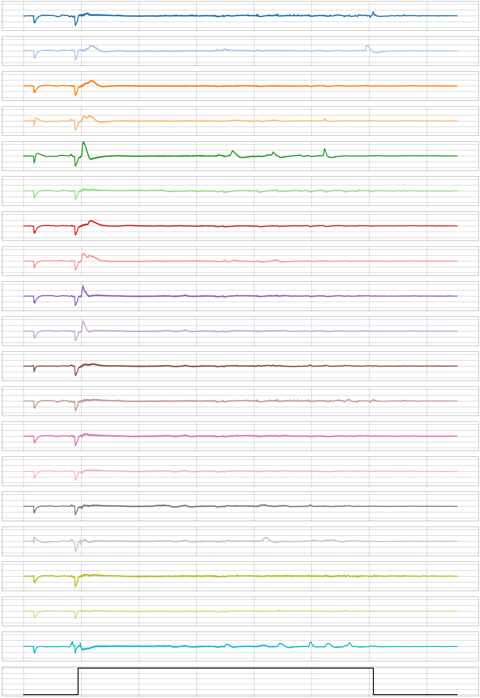
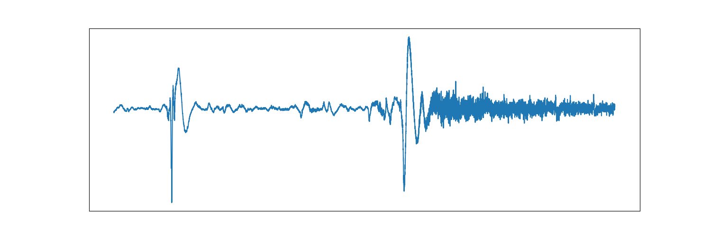
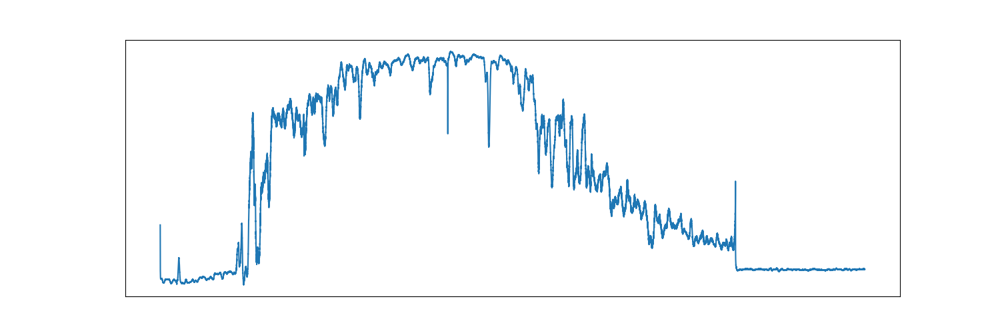
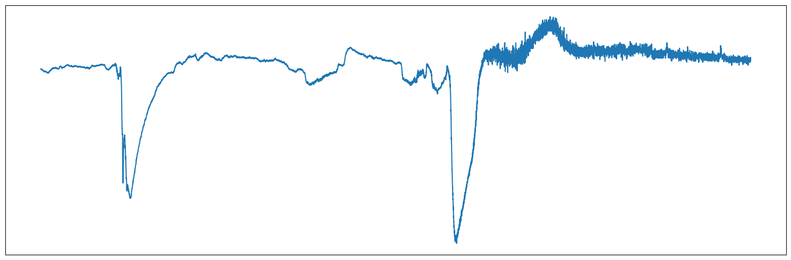

# SeizureTransformer: Scaling U-Net with Transformer for Simultaneous Time-Step Level Seizure Detection from Long EEG Recordings

**Authors:** Kerui Wu, Ziyue Zhao, Bülent Yener

**Source:** arXiv:2504.00336 (2025)

**Conference:** International Conference on Artificial Intelligence in Epilepsy and Other Neurological Disorders (2025)

---

## Abstract

Epilepsy is a common neurological disorder that affects around 65 million people worldwide. Detecting seizures quickly and accurately is vital, given the prevalence and severity of the associated complications. Recently, deep learning-based automated seizure detection methods have emerged as solutions; however, most existing methods require extensive post-processing and do not effectively handle the crucial long-range patterns in EEG data. In this work, we propose SeizureTransformer, a simple model comprised of (i) a deep encoder comprising 1D convolutions (ii) a residual CNN stack and a transformer encoder to embed previous output into high-level representation with contextual information, and (iii) streamlined decoder which converts these features into a sequence of probabilities, directly indicating the presence or absence of seizures at every time step. Extensive experiments on public and private EEG seizure detection datasets demonstrate that our model significantly outperforms existing approaches (ranked in the first place in the 2025 ”seizure detection challenge” organized in the International Conference on Artificial Intelligence in Epilepsy and Other Neurological Disorders), underscoring its potential for real-time, precise seizure detection.

### Page 2

becomes big. Beyond that, Scaling U-Net to large datasets or high-resolution sequences requires stacking deeper layers, which often leads to vanishing gradients, overfitting, and massive memory and computation usage. In this work, we propose a simple U-Net-based architecture, namely, SeizureTransformer, to solve the mentioned challenges. The model comprises of three components (i) a deep encoder comprising 1D convolutions (ii) a residual CNN stack and a transformer encoder to embed previous output into high-level representation with global contextual information, and (iii) streamlined decoder which converts these features into a sequence of probabilities, directly indicating the presence or absence of seizures at every time step. The scaling embedding components makes the model to be easily scalable to build up the model size and to handle long-sequence signals. Experimentally, our model achieves the consistent state-of-theart performance, efficiency, and generalization across diverse subjects and devices in public and private EEG datasets. Our model has ranked number one in an international competition organized by the International Conference on Artificial Intelligence in Epilepsy and Other Neurological Disorders. II. RESULTS A. Model Overview We design model architecture based on the U-Net to do end-to-end learning from raw waveforms for time-step-level classification to achieve simultaneous seizure detection. Our model consists of three primary modules: an encoder, a scaling embedding component, and a decoder, as shown in Fig. 1. Taking the continuous long-term EEG signals from the epilepsy monitoring unit, the encoder extracts features by recognizing patterns through one-dimensional convolution layers. The feature vectors are further embedded by a ResCNN stack and a Transformer encoder stack with a global attention mechanism to generate high-level representations that capture rich temporal dependencies. The streamlined decoder then converts these representations into a sequence of probability, indicating the presence or absence of seizures at every time step. Residual connections between each encoder layer and decoder layer are used to ease the gradient flow and to avoid degradation problems in the deep neural network. More details about network architecture selection are provided in the methodology section. B. Model Training Datasets. We use Temple University Hospital EEG Seizure Corpus v2.0.3(TUSZ) [18] and Siena Scalp EEG Database [19] to form our training dataset. TUSZ is the largest public dataset for seizure detection that has been manually annotated with data for seizure events. The predefined training set in TUSZ has 910 hours of recording sessions from 579 subjects with various sampling frequencies, from 250 Hz to 1000 Hz. The Siena Scalp EEG Database is a small dataset that contains 128 hours of recording sessions from 14 subjects with a unified sampling rate of 512 Hz. Both datasets contain at least 19 electrodes of the international 10-20 system. We unify the training data from two datasets by resampling signals into 256 Hz and fixing the channel sequence in order (Fig. 2a). We combine two datasets by concatenating segmented oneminute-long time series windows together, i.e., 60 × 256 = 15360 time steps per window. A 75% overlap ratio between two consecutive windows was set as a hyperparameter during the segmentation process to augment training examples. To improve the model’s ability to distinguish seizure signals from background noise, we statistically categorize training windows into three classes: no-seizure, full-seizure, and partial-seizure, and uniformly sample a certain number of windows from each class to create a balanced dataset. Specifically, our training dataset is constructed as follows: D = Dps ∪D∗ fs ∪D∗ ns where Dps contains all partial-seizure windows, D∗ fs and D∗ ns is a randomly selected subset of full-seizure and no-seizure window with |D∗ fs| = 0.3 × |Dps| and |D∗ ns| = 2.5 × |Dps|. Pre-processing. We followed [6]’s process for preprocessing EEG data before feeding into the model using a bandpass filter to keep frequencies in a range from 0.5 Hz to 120 Hz and two notch filters to eliminate signals at 1 Hz and 60 Hz, which are typically associated with heart rate and power line noise (Fig. 2b). Training Setting. We implemented our deep learning model using PyTorch and trained on 2 parallel NVIDIA L40S 46GB GPUs. Our training parameters include a batch size of 256, a learning rate of 1e-3, a weight decay of 2e-5, and a drop rate of 0.1 for all dropout layers both at training and test time. We use Binary Cross-Entropy loss as the objective function and RAdam as the optimizer. The training process was set to be 100 epochs with early stopping if no improvement in validation loss was observed over 12 epochs. Post-processing. After having a sequence of probabilities, outputted by the model, we implement a set of simple postprocessing steps to convert continuous probabilities to the final detection(Fig. 2c). Initially, we apply a straightforward threshold filter to obtain a discrete mask. Then, two morphological operations are employed to eliminate spurious spikes of seizure activity and to fill short 0 gaps. Lastly, we implement a simple duration-based rule to discard blocks of seizure labels lasting less than a minimal clinically relevant duration. C. Evaluation Results We used TUSZ’s predefined test set, consisting of 42.7 hours of waveforms from 43 subjects with 469 seizure activities, to evaluate the detection performance of SeizureTransformer with other traditional and deep-learning algorithms. The test set of TUSZ is a list of blind EEG signals that are completely separated from its training set and validation set, which ensures the generalization of model performance. We quantify the model’s performance using the area under the receiver operating characteristics(AUROC). For each continuous EEG recording, the ROC curve plots the true and false positive rates across all possible decision thresholds, and the AUC represents the area under the ROC curve,

### Page 3

(32, 15360) (64, 7680) (32, 7680) (64, 3840) (128, 3840) (128, 1920) (256, 1920) (256, 960)(512, 960)(512, 480) (19, 15360) (512, 960) (512, 480) (512, 1920) (512, 960) (256, 3840) (256, 1920) (128, 7680) (128, 3840) (64, 15360) (64, 7680) (32, 15360) (1, 15360) Encoder Decoder Input 4-head attention Positionwise FNN Add & norm x8 Transformer Encoder Stack Add & norm Output Scaling Embedding x7 Res CNN Stack Input Output BatchNorm Relu Convolution BatchNorm Convolution Relu Conv1D & ELU Activation Pooling Upsample Residual Connection Conv1D & Sigmoid Res CNN Stack Position Encoding Transformer Encoder Stack Fig. 1. SeizureTransformer Architecture. TABLE I MODEL PERFORMANCE IN THE SEIZURE DETECTION CHALLENGE 2025. Result Model Architecture Input Length(s) F1-score Sensitivity Precision FP (per day) SeizureTransformer U-Net & CNN & Transformer 60 0.43 0.37 0.45 1 Van Gogh Detector CNN & Transformer N × 10 0.36 0.39 0.42 3 S4Seizure S4 12 0.34 0.30 0.42 2 DeepSOZ-HEM LSTM & Transformer 600 0.31 0.58 0.27 14 HySEIZa Hyena-Hierarchy & CNN 12 0.26 0.6 0.22 13 Zhu-Transformer CNN & Transformer 25 0.20 0.46 0.16 24 SeizUnet U-Net & LSTM 30 0.19 0.16 0.20 4 Channel-adaptive CNN 15 0.14 0.06 0.20 1 EventNet U-Net 120 0.14 0.6 0.09 20 Gradient Boost Gradient Boosted Trees 10 0.07 0.15 0.09 6 DynSD LSTM 1 0.06 0.55 0.04 37 Random Forest Random Forest 2 0.06 0.05 0.07 1 which summarizes the model’s performance. We compare our model’s performance using the same evaluation metric under the TUSZ’s predefined test set with other seizure detection models, namely, Zhu-Transformer [6], EEGWaveNet [8], and DCRNN [7], to demonstrate the effectiveness of our proposed approach. Models used here for the comparison are pre-trained models based on different training sets. All of these pre-trained models are implemented by [20] and are publicly available. As shown in Figure 3, our model demonstrated the highest performance, with a mean AUROC of 0.876 and a distribution tightly concentrated toward higher values. D. Application in Seizure Detection Challenge The 2025 Seizure Detection Challenge 1, organized as part of the International Conference on Artificial Intelligence 1competition website and leaderboard is available in: https: //epilepsybenchmarks.com/challenge/ in Epilepsy and Other Neurological Disorders, provides a completely blind private dataset consisting of continuous EEG recordings for evaluation, which makes it an ideal place to test the performance and generalization of our model fairly. The test dataset was collected at the EMU of the Filadelfia Danish Epilepsy Center in Dianalund from January 2018 to December 2020 with the NicoleteOneT M v44 amplifier. The dataset contains 4360 hours of EEG recordings from 65 subjects with various ages, where for each subject, at least one seizure during the hospital stay with a visually identifiable electrographic correlate to the seizures recorded on the video. The ground truth labels were annotated by three boardcertified neurophysiologists with expertise in long-term videoEEG monitoring. The F1-score, sensitivity, precision, and false positive per day were used as the primary ranking criterion to align with real-world requirements. The event-based scoring evaluates annotations at the event level by assessing the degree

### Page 4

Cz T4 C4 C3 T3 Pz Fz T6 O2 T5 F7 F8 O1 Fp1 Fp2 F4 F3 P3 P4 F3-Avg FP1-Avg C3-Avg P3-Avg O1-Avg F7-Avg T3-Avg T5-Avg FZ-Avg CZ-Avg PZ-Avg FP2-Avg F4-Avg C4-Avg P4-Avg O2-Avg F8-Avg T4-Avg T6-Avg Seizure a b c Seizure Transformer Fig. 2. EEG Signal Processing Pipeline: (a) Brain activity is recorded using a 19-channel EEG system. (b) A 60-second EEG sample is pre-processed through normalization, Butterworth bandpass filtering, and 1 Hz & 60 Hz IIR notch filters to remove noise. (c) After neural network analysis, postprocessing steps—threshold filtering, morphological opening and closing, and removal of short-duration events—produce the final detection. SeizureTransformer 0.0 0.2 0.4 0.6 0.8 1.0 Density Mean: 0.876 DCRNN Mean: 0.642 EEGWaveNet Mean: 0.566 Zhu-Transformer Mean: 0.679 Fig. 3. Violin plots illustrating the distribution of AUROC values for SeizureTransformer, DCRNN, EEGWaveNet, and Zhu-Transformer models evaluated on the TUSZ v2.0.3 predefined testing set. Mean AUROC scores for each model are indicated above each plot, with the SeizureTransformer demonstrating the highest overall performance. of overlap between predicted and reference events. As shown in Table I, our model largely outperforms the other algorithms in terms of F1-score. It is noteworthy that we set the picking threshold to be 80% in the competition, which leads to a relative low sensitivity but comes with the best precision and False Positive rate. Van Gogh Detector and Zhu-Transformer are window-level classification models that also take advantage of both convolutional and transformer encoder units; however, their performance did not reach that of SeizureTransformer. This points to the beneficial effects of time-step-level end-to-end learning. Similarly, SeizUnet, like our model, is a time-step-level classification algorithm using TABLE II MODEL’S RUNTIME OVER TUSZ V2.0.3’S TESTING SET Model Total Runtime(s) Runtime(s) per 1-hour EEG SeizureTransformer 169.96 3.98 DCRNN 2571.75 60.24 EEGWaveNet 1690.19 39.59 Zhu-Transformer 3309.51 77.53 U-Net; but different to SeizureTransformer, it chooses to add LSTM layers, instead of transformer encoders, after the U-Net decoder, instead of embedding into the U-Net, and turns out to be not as good as our results. III. DISCUSSION A. Runtime Analysis Window-level classification models assign predictions individually to each segmented window. Mapping window labels to the final annotation output followed by the SCORE compliant [10] that contains the start time and duration time of a seizure requires the model to segment windows with a great overlap ratio to ensure the start and stop time’s precision. This led to tremendous redundant computing and complicated mapping procedures. On the other hand, the time-step-level classification models do not require such post-processing steps as their predictions can directly indicate the onset time and activity duration. This approach inherently mitigates the redundant computations associated with overlapping windows and significantly simplifies the annotation pipeline, which makes this method align more closely with the practical clinical requirement for efficient automated seizure detection. We further show our model’s efficiency by comparing the inference time with other models using TUSZ’s testing set in Table II. Our model demonstrate the lowest running time with the ability to handle a one-hour-long recording in 3.98 seconds. B. Ablation Study The better performance of the proposed method for seizure detection could be due to several factors. Here, we show each model component’s necessity by testing multiple partial models after removing certain components. As shown in Figure 4, vanilla U-Net has an underwhelming performance with a low AUROC mean. Solely adding a ResCNN stack or a transformer stack will marginally improve the model performance but also lead to a bigger variance with some extreme false cases. By contrast, integrating both the ResCNN and Transformer stacks produces not only higher mean AUROC but also reduced variance, indicating that these components complement each other effectively. These results underscore the importance of each proposed element in achieving robust and accurate seizure detection. C. Challenge Results The competition leaderboard shows a relatively low F1score across every algorithm compared to the results shown in previously published reviews [21], [22] and the self-reported

### Page 5

RPT 0.0 0.2 0.4 0.6 0.8 1.0 Density Mean: 0.876 RT Mean: 0.856 PT Mean: 0.864 T Mean: 0.839 R Mean: 0.803 N Mean: 0.767 Fig. 4. Ablation study for SeizureTransformer by drawing AUROC distributions of models that contains partial components. N represents a vanilla deep U-Net without ResCNN and Transformer encoder stack; R represents the UNet with ResCNN stack; T represents the U-Net with Transformer Stack; P means adding positional encoding before feeding into the transformer stack. TABLE III MODEL PERFORMANCE IN TUSZ’S PREDEFINED TESTING SET. Scale Model F-1 Sensitivity Precision Sample-based Gotman 0.0679 0.0558 0.0868 EEGWaveNet 0.1088 0.1051 0.1128 DCRNN 0.1917 0.4777 0.1199 Zhu-Transformer 0.4256 0.5406 0.3510 EventNet 0.4830 0.5514 0.4286 SeizureTransformer 0.5803 0.4710 0.7556 Event-based Gotman 0.2089 0.6199 0.1256 EEGWaveNet 0.2603 0.4427 0.1844 DCRNN 0.3262 0.5723 0.2281 Zhu-Transformer 0.5387 0.6116 0.5259 EventNet 0.5655 0.6116 0.5259 SeizureTransformer 0.6752 0.7110 0.6427 performance of computing algorithms. To comprehensively understand the model’s performance, we test our model with several published algorithms, namely, EventNet [23], ZhuTransformer [6], DCRNN [7], EEGWaveNet [8], and the Gotman algorithm [24], in the TUSZ’s predefined testing set using the same evaluation metrics(F1-score, sensitivity, and precision) implemented by the challenge organizers [20]. The testing tools provide both sample-level and event-level evaluation. As shown in Table III, while our model keeps the state-of-the-art performance, all model achieved better F1scores. Such result difference might be due to the distribution shift between datasets. As described by the organizer, the private evaluation dataset include recordings from various ages, and the data was collected by portable EEG amplifiers, allowing patients to move freely within the building, which will likely lead to unique attributes in the recording that depart from the training set. IV. METHODS A. Related Work U-Net [17] architecture was first proposed in the field of CV for image segmentation tasks. Considering the temporal continuity of time series data, such networks have been widely deployed in various scientific signal processing applications, such as seismic phase detection [15], sleep-staging classification [12], [25], denoising heart sound signals [26], and Seizure detection [27]. There are some works exploring combining U-Net with Transformer together for other fields. For example, in a medical image segmentation task, [28] used self and cross-attention with U-Net; [29] incorporated hierarchical Swin Transformer into U-Net to extract both coarse and fine-grained feature representations. In seismic analysis, [30] proposed a deep neural network that can be regarded as a U-Net with global and self-attention but without a residual connection. However, in the signal processing area, to the best of our knowledge, there is no existing work to scale U-Net using transformer blocks. The closest work to this paper [27], where multiple attention-gated U-Net are used and a following LSTM network is implemented to fusion results. B. Preliminary For a continuous EEG waveform, before segmenting it to uniform windows as training examples, we resample all data to a common, i.e., 256, sampling rate using the Fourier method [31], to fix the time resolution for the convolutions in the model to be meaningful across subjects, and implement a Gaussian normalization to each channel, calculated by x∗ i = (x∗ i -¯x)/sx, ¯x = 1 K K X i=1 xi, sx = 1 K -1 K X i=1 (xi -¯x)2. The generated dataset, after slicing, is denoted as D = (X, Y) = {(xi, yi) | i = 1, . . . , N}, where N represents the number of training samples. Each input window xi ∈RT ×d represents a multivariate time series with T = 256 × 60 = 15,360 time steps and d = 19 channels. The corresponding time-step-level label yi ∈{0, 1}T is a binary, box-shaped ground truth signal indicating the presence of seizure activity at each time step. C. Network Design Encoder. We use one-dimensional convolutions along the time axis to extract local temporal patterns, outputting a tokenized representation of the signal. Specifically, we use a convolution-pooling block with various kernel sizes from 11 to 3 to detect features at different temporal scales, capturing both slow and fast dynamics. This reduces the time step size from 15360 to Td = 512 while increases the channel size from 19 to kd = 480 to compensate the loss of resolution in the time domain. The ELU function is set as the activation function after each convolution layer. Scaling Embedding. Followed by [30], after getting the encoded output, we implement a ResCNN stack first to refine these tokenized features to yield a better generalization with better temporal invariance. We then implement a transformer encoder stack [32] to scale the model and to capture long-range dependencies across the

### Page 6

tokenized signal. Specifically, the sine and cosine functions of different frequuencies are used to be positional encodings, PE(pos,2i) = sin(pos/100002i/Td), PE(pos,2i+1) = cos(pos/100002i/Td), which can then be summed with the input embedding. The refined representation, denoted as Z, will then be projected into equally-shaped query, key, and value spaces, Q = ZW Q, K = ZW K, V = ZW V , and processed with the use of the global-attention mechanism, A = softmax(QKT √dk )V. The attention output is combined with tokens with a residual connection and layer normalization and a subsequent feedforward network to transform the output with another residual addition. Such hierarchical processing scales the model and integrates both local features and global context, enabling the model to learn complex temporal dependencies. Decoder. Similar to the encoder, we use a convolutional decoder to decrypt the compressed information from the center latent space into a sequence of probability distribution. However, instead of the convolution-pooling block, we upsample the input with a scale factor of 2 and then with a convolution to decrease the number of channels and to increase the number of time steps back to the original window size. Like U-Net, the residual connections are used between the encoder and decoder to facilitate efficient gradient flow. Training. The model is trained to produce predictions ˆyi that minimize the following objective: ˆyi = fθ(xi), θ ∈arg min L Here, we use the Binary Cross-Entropy loss as our training objective L, which measures the dissimilarity between the predicted and true labels: L(ˆyi,j, yi,j) = -yi,j log(ˆyi,j) -(1 -yi,j) log(1 -ˆyi,j) where yi,j and ˆyi,j are the ground truth and predicted labels, respectively, for sample i at time step j. V. LIMITATION While there has been a rich literature of research on epileptic seizure detection and prediction, there is more work to be done to generalize the algorithms to anatomically different types of epilepsy, different ambulatory settings for recordings. This is evident from the gaps between the training-validations v.s. testing F1-scores of the work presented in this paper. Our demonstrates a high F1-score over other data sets. However, its F1-score is lower on the withheld test data set while it still out performs the competing ones with a significant difference. Thus, future work will focus on understanding the differences in the data distributions between training and test data sets to improve our model. VI. DATA AVAILABILITY We used the following publicly available datasets in this work for training our model. The test set used in the competition was not made publicly available at the time of this write-up. • Siena Scalp EEG Database: The database consists of EEG recordings of 14 patients acquired at the Unit of Neurology and Neurophysiology of the University of Siena. Subjects include 9 males (ages 25-71) and 5 females (ages 20-58). Subjects were monitored with a Video-EEG with a sampling rate of 512 Hz, with electrodes arranged on the basis of the international 10-20 System. Most of the recordings also contain 1 or 2 EKG signals. The diagnosis of epilepsy and the classification of seizures according to the criteria of the International League Against Epilepsy were performed by an expert clinician after a careful review of the clinical and electrophysiological data of each patient. License: https:// physionet.org/content/siena-scalp-eeg/view-license/1.0.0/ • TUH EEG Seizure Corpus v2.0.3: This database is a subset of the TUH EEG Corpus that was collected from archival records of clinical EEGs at Temple University Hospital recorded between 2002 - 2017. From this large dataset, a subset of files with a high likelihood of containing seizures was retained based on clinical notes and on the output of seizure detection algorithms. V2.0.0 contains 7377 .edf files from 675 subjects for a total duration of 1476 hours of data. The files are mostly short (avg. 10 minutes). The dataset has a heterogeneous sampling frequency and number of channels. All files are acquired at a minimum of 250 Hz. A minimum of 17 EEG channels is available in all recordings. They are positioned according to the 10-20 system. The annotations are provided as .csv and contain the start time, stop, channel, and seizure type. License: https://isip.piconepress.com/ projects/nedc/forms/tuh eeg.pdf. VII. CODE AVAILABILITY Our source code and model are available at https://github. com/keruiwu/SeizureTransformer. REFERENCES [1] L. Hirsch, E. Donner, E. So, M. Jacobs, L. Nashef, J. Noebels, and J. Buchhalter, “Abbreviated report of the nih/ninds workshop on sudden unexpected death in epilepsy,” Neurology, vol. 76, no. 22, pp. 1932- 1938, 2011. [2] A. Van de Vel, K. Cuppens, B. Bonroy, M. Milosevic, K. Jansen, S. Van Huffel, B. Vanrumste, P. Cras, L. Lagae, and B. Ceulemans, “Non-eeg seizure detection systems and potential sudep prevention: state of the art: review and update,” Seizure, vol. 41, pp. 141-153, 2016. [3] H. Wu, T. Hu, Y. Liu, H. Zhou, J. Wang, and M. Long, “Timesnet: Temporal 2d-variation modeling for general time series analysis,” arXiv preprint arXiv:2210.02186, 2022. [4] Y. Liu, T. Hu, H. Zhang, H. Wu, S. Wang, L. Ma, and M. Long, “itransformer: Inverted transformers are effective for time series forecasting,” arXiv preprint arXiv:2310.06625, 2023. [5] T. Zhou, Z. Ma, Q. Wen, X. Wang, L. Sun, and R. Jin, “Fedformer: Frequency enhanced decomposed transformer for long-term series forecasting,” in International conference on machine learning. PMLR, 2022, pp. 27 268-27 286.

### Page 7

[6] Y. Zhu and M. D. Wang, “Automated seizure detection using transformer models on multi-channel eegs,” in 2023 IEEE EMBS International Conference on Biomedical and Health Informatics (BHI). IEEE, 2023, pp. 1-6. [7] S. Tang, J. A. Dunnmon, K. Saab, X. Zhang, Q. Huang, F. Dubost, D. L. Rubin, and C. Lee-Messer, “Self-supervised graph neural networks for improved electroencephalographic seizure analysis,” arXiv preprint arXiv:2104.08336, 2021. [8] P. Thuwajit, P. Rangpong, P. Sawangjai, P. Autthasan, R. Chaisaen, N. Banluesombatkul, P. Boonchit, N. Tatsaringkansakul, T. Sudhawiyangkul, and T. Wilaiprasitporn, “Eegwavenet: Multiscale cnnbased spatiotemporal feature extraction for eeg seizure detection,” IEEE Transactions on Industrial Informatics, vol. 18, no. 8, pp. 5547-5557, 2021. [9] A. Gu and T. Dao, “Mamba: Linear-time sequence modeling with selective state spaces,” arXiv preprint arXiv:2312.00752, 2023. [10] S. Beniczky, H. Aurlien, J. C. Brøgger, L. J. Hirsch, D. L. Schomer, E. Trinka, R. M. Pressler, R. Wennberg, G. H. Visser, M. Eisermann et al., “Standardized computer-based organized reporting of eeg: Score- second version,” Clinical Neurophysiology, vol. 128, no. 11, pp. 2334- 2346, 2017. [11] A. Bagnall, H. A. Dau, J. Lines, M. Flynn, J. Large, A. Bostrom, P. Southam, and E. Keogh, “The uea multivariate time series classification archive, 2018,” arXiv preprint arXiv:1811.00075, 2018. [12] H. Li and Y. Guan, “Deepsleep convolutional neural network allows accurate and fast detection of sleep arousal,” Communications biology, vol. 4, no. 1, p. 18, 2021. [13] C. Raffel, N. Shazeer, A. Roberts, K. Lee, S. Narang, M. Matena, Y. Zhou, W. Li, and P. J. Liu, “Exploring the limits of transfer learning with a unified text-to-text transformer,” Journal of machine learning research, vol. 21, no. 140, pp. 1-67, 2020. [14] M. Lewis, Y. Liu, N. Goyal, M. Ghazvininejad, A. Mohamed, O. Levy, V. Stoyanov, and L. Zettlemoyer, “Bart: Denoising sequence-to-sequence pre-training for natural language generation, translation, and comprehension,” arXiv preprint arXiv:1910.13461, 2019. [15] W. Zhu and G. C. Beroza, “Phasenet: a deep-neural-network-based seismic arrival-time picking method,” Geophysical Journal International, vol. 216, no. 1, pp. 261-273, 2019. [16] C. Chatzichristos, J. Dan, A. M. Narayanan, N. Seeuws, K. Vandecasteele, M. De Vos, A. Bertrand, and S. Van Huffel, “Epileptic seizure detection in eeg via fusion of multi-view attention-gated u-net deep neural networks,” in 2020 IEEE Signal Processing in Medicine and Biology Symposium (SPMB). IEEE, 2020, pp. 1-7. [17] O. Ronneberger, P. Fischer, and T. Brox, “U-net: Convolutional networks for biomedical image segmentation,” in Medical image computing and computer-assisted intervention-MICCAI 2015: 18th international conference, Munich, Germany, October 5-9, 2015, proceedings, part III 18. Springer, 2015, pp. 234-241. [18] V. Shah, E. Von Weltin, S. Lopez, J. R. McHugh, L. Veloso, M. Golmohammadi, I. Obeid, and J. Picone, “The temple university hospital seizure detection corpus,” Frontiers in neuroinformatics, vol. 12, p. 83, 2018. [19] P. Detti, “Siena scalp eeg database,” PhysioNet. doi, vol. 10, p. 493, 2020. [20] J. Dan, U. Pale, A. Amirshahi, W. Cappelletti, T. M. Ingolfsson, X. Wang, A. Cossettini, A. Bernini, L. Benini, S. Beniczky et al., “Szcore: Seizure community open-source research evaluation framework for the validation of electroencephalography-based automated seizure detection algorithms,” Epilepsia, 2024. [21] S. Supriya, S. Siuly, H. Wang, and Y. Zhang, “Epilepsy detection from eeg using complex network techniques: A review,” IEEE Reviews in Biomedical Engineering, vol. 16, pp. 292-306, 2021. [22] M. K. Siddiqui, R. Morales-Menendez, X. Huang, and N. Hussain, “A review of epileptic seizure detection using machine learning classifiers,” Brain informatics, vol. 7, no. 1, p. 5, 2020. [23] N. Seeuws, M. De Vos, and A. Bertrand, “Avoiding post-processing with event-based detection in biomedical signals,” IEEE Transactions on Biomedical Engineering, 2024. [24] J. Gotman, “Automatic recognition of epileptic seizures in the eeg,” Electroencephalography and clinical Neurophysiology, vol. 54, no. 5, pp. 530-540, 1982. [25] M. Perslev, M. Jensen, S. Darkner, P. J. Jennum, and C. Igel, “U-time: A fully convolutional network for time series segmentation applied to sleep staging,” Advances in neural information processing systems, vol. 32, 2019. [26] A. Mukherjee, R. Banerjee, and A. Ghose, “A novel u-net architecture for denoising of real-world noise corrupted phonocardiogram signal,” arXiv preprint arXiv:2310.00216, 2023. [27] M. R. Islam, X. Zhao, Y. Miao, H. Sugano, and T. Tanaka, “Epileptic seizure focus detection from interictal electroencephalogram: a survey,” Cognitive Neurodynamics, vol. 17, no. 1, pp. 1-23, Feb 2023. [28] O. Petit, N. Thome, C. Rambour, L. Themyr, T. Collins, and L. Soler, “U-net transformer: Self and cross attention for medical image segmentation,” in Machine Learning in Medical Imaging: 12th International Workshop, MLMI 2021, Held in Conjunction with MICCAI 2021, Strasbourg, France, September 27, 2021, Proceedings 12. Springer, 2021, pp. 267-276. [29] A. Lin, B. Chen, J. Xu, Z. Zhang, G. Lu, and D. Zhang, “Ds-transunet: Dual swin transformer u-net for medical image segmentation,” IEEE Transactions on Instrumentation and Measurement, vol. 71, pp. 1-15, 2022. [30] S. M. Mousavi, W. L. Ellsworth, W. Zhu, L. Y. Chuang, and G. C. Beroza, “Earthquake transformer—an attentive deep-learning model for simultaneous earthquake detection and phase picking,” Nature communications, vol. 11, no. 1, p. 3952, 2020. [31] P. Virtanen, R. Gommers, T. E. Oliphant, M. Haberland, T. Reddy, D. Cournapeau, E. Burovski, P. Peterson, W. Weckesser, J. Bright et al., “Scipy 1.0: fundamental algorithms for scientific computing in python,” Nature methods, vol. 17, no. 3, pp. 261-272, 2020. [32] A. Vaswani, N. Shazeer, N. Parmar, J. Uszkoreit, L. Jones, A. N. Gomez, Ł. Kaiser, and I. Polosukhin, “Attention is all you need,” Advances in neural information processing systems, vol. 30, 2017.

